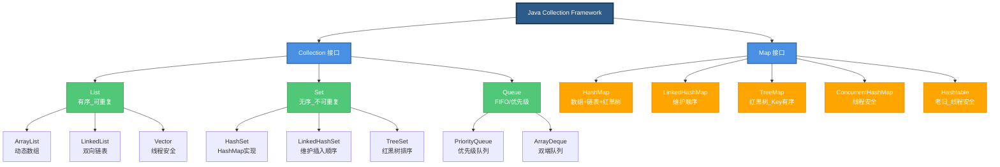

# Java 集合体系深度总结

# 1.体系结构总览

Java 集合框架主要由两大接口体系构成：`Collection` 和 `Map`。

* Collection 接口：存储一系列单个对象。
  * List：有序、可重复。
  * Set：无序（部分实现有序）、不可重复。
  * Queue：队列，先进先出（FIFO）或优先级。
* Map 接口：存储键值对 (Key-Value)。

辅助总结图：

## 1.1.List 接口实现类总结
| 实现类           | 底层数据结构               | 线程安全 | 核心特点                                                                    | 注意事项                                                                       | 适用场景                                                                             |
| :--------------- | :------------------------- | :------: | :-------------------------------------------------------------------------- | :----------------------------------------------------------------------------- | :----------------------------------------------------------------------------------- |
| **`ArrayList`**  | **动态数组** `Object[]` |  ❌ 否  | 1. 查询快 (O(1)) 2. 增删慢 (需移动元素) 3. 默认容量 10，扩容 1.5 倍   | 1. 初始容量设合理避免频繁扩容 2. 遍历时删除需用 `Iterator` 3. 线程不安全 | **读多写少** 随机访问频繁 一般业务列表存储                                     |
| **`LinkedList`** | **双向链表** `Node`     |  ❌ 否  | 1. 增删快 (O(1)，需先定位) 2. 查询慢 (O(n)) 3. 可作栈、队列、双端队列 | 1. 内存占用高 (每个节点存前后指针) 2. 不适合随机访问 `get(i)`               | **写多读少** 频繁头部/中间插入删除 需要实现栈或队列结构                        |
| **`Vector`**     | 动态数组                   |  ✅ 是  | 1. 古老类 2. 方法全加 `synchronized`                                     | 1. 性能差 2. 扩容为 2 倍                                                    | **不推荐使用** 可用 `Collections.synchronizedList` 或 `CopyOnWriteArrayList` 替代 |

## 1.2.Set常用接口实现类总结
| 实现类              | 底层数据结构                                | 线程安全 | 核心特点                                                        | 注意事项                                                       | 适用场景                                                     |
| :------------------ | :------------------------------------------ | :------: | :-------------------------------------------------------------- | :------------------------------------------------------------- | :----------------------------------------------------------- |
| **`HashSet`**       | **`HashMap`** (Key 存值，Value 存常量)   |  ❌ 否  | 1. 无序 2. 不可重复 3. 允许一个 `null`                    | 1. 元素类需重写`hashCode()` 和 `equals()` 2. 遍历顺序不固定 | **快速去重** 不关心元素顺序 判断元素是否存在           |
| **`LinkedHashSet`** | **`LinkedHashMap`** (HashMap + 双向链表) |  ❌ 否  | 1. 维护**插入顺序** 2. 不可重复                              | 1. 性能略低于 HashSet 2. 内存占用略高                       | **需要去重且保持顺序** 如缓存淘汰策略基础 记录操作历史 |
| **`TreeSet`**       | **红黑树** (基于 `TreeMap`)              |  ❌ 否  | 1.**自然排序**或**定制排序** 2. 不可重复 3. 不允许 `null` | 1. 元素需实现`Comparable` 接口 2. 性能低于 HashSet          | **需要排序** 范围查找 需要有序集合                     |

## 1.3.Map常用接口实现类总结
| 实现类                  | 底层数据结构                                 | 线程安全 | 核心特点                                          | 注意事项                                                             | 适用场景                                                |
| :---------------------- | :------------------------------------------- | :------: | :------------------------------------------------ | :------------------------------------------------------------------- | :------------------------------------------------------ |
| **`HashMap`**           | **数组 + 链表 + 红黑树** (JDK 1.8+)       |  ❌ 否  | 1. 最常用 2. 允许 null 键/值 3. 无序        | 1. 初始容量设为 2 的幂 2. 链表长度>8 转红黑树 3. 负载因子 0.75 | **通用键值对存储** 缓存 数据映射关系              |
| **`LinkedHashMap`**     | HashMap +**双向链表**                        |  ❌ 否  | 1. 维护**插入顺序**或**访问顺序** 2. 允许 null | 1. 可用于实现 LRU 缓存 2. 性能略低于 HashMap                      | **需要保持顺序的 Map** 实现 LRU 缓存 记录配置顺序 |
| **`TreeMap`**           | **红黑树**                                   |  ❌ 否  | 1. Key**有序** 2. 不允许 null 键               | 1. Key 需实现`Comparable` 2. 性能低于 HashMap                     | **需要 Key 排序** 范围查询 (subMap)                  |
| **`ConcurrentHashMap`** | 数组 + 链表 + 红黑树 (CAS + synchronized) | ✅**是** | 1. 高并发安全 2. JDK 1.8 锁粒度更细 (锁桶)     | 1.**不允许 null 键/值** 2. 分段锁已废弃 (JDK 1.8)                 | **多线程环境** 高并发读写 Map 共享计数器          |
| **`Hashtable`**         | 数组 + 链表                                  |  ✅ 是  | 1. 古老类 2. 全方法 `synchronized`             | 1. 性能差 2. 不允许 null                                          | **不推荐使用** 可用 `ConcurrentHashMap` 替代         |

## 1.4.Queue常用接口常用实现类
| 实现类                    | 底层数据结构 | 线程安全 | 核心特点                              | 注意事项                                             | 适用场景                                       |
| :------------------------ | :----------- | :------: | :------------------------------------ | :--------------------------------------------------- | :--------------------------------------------- |
| **`PriorityQueue`**       | **二叉堆**   |  ❌ 否  | 1. 优先级队列 2. 队头元素最小/最大 | 1. 不允许 null 2. 无序遍历 (仅队头有序)           | **任务调度** TOP K 问题 带优先级的处理   |
| **`ArrayDeque`**          | **循环数组** |  ❌ 否  | 1. 双端队列 2. 可作栈或队列        | 1. 容量不足自动扩容 2. 性能优于 `LinkedList`      | **栈/队列实现** BFS 算法 替代 `Stack` 类 |
| **`LinkedBlockingQueue`** | 链表         |  ✅ 是  | 1. 阻塞队列 2. 有界/无界           | 1. 生产消费者模型核心 2. 锁分离 (take/put 锁分开) | **线程池任务队列** 生产者 - 消费者模型      |

