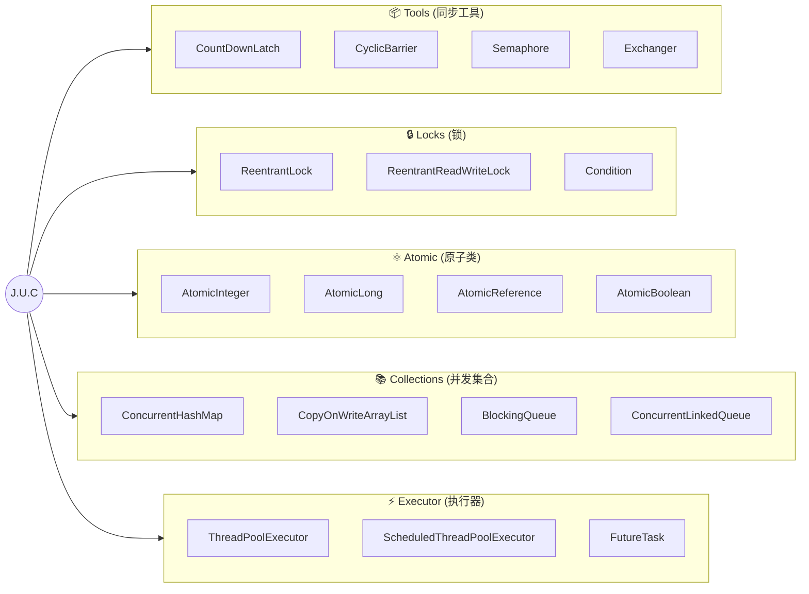

# Java JUC

# 1.什么是juc?

JUC是java java.util.concurrent包下的工具集合，是Java并发编程的核心基础设施，由`Doug Lea`主导设计，提供了一套高性能、可组合、线程安全的并发工具集。

java.util.concurrent（简称 JUC）自 JDK 5 引入，改变了 Java 并发编程范式。其设计哲学可概括为：

jUC的结构：


* **分离关注点**：将“任务提交”与“执行策略”解耦
* **组合优于继承**：通过 Callable/Runnable、Future、Executor 等接口灵活组装
* **性能与安全并重**：在避免锁竞争的同时保证内存可见性与操作原子性
* **可扩展基座**：以 `AQS` 为核心，衍生出丰富的同步器与集合

# 2.Java的底层核心机制

JUC 的高效建立在 JVM 底层机制之上，理解这些是掌握上层 API 的前提。

1. **Java 内存模型 (JMM) 与三大特性：**

| **特性**   | **含义**                       | **JUC 保障方式**                               |
| ---------- | ------------------------------ | ---------------------------------------------- |
| **原子性** | **操作不可分割**               | `AtomicXXX`、`synchronized`、`Lock`            |
| **可见性** | **线程修改后其他线程立即可见** | `volatile`、`Lock`、并发集合内部屏障           |
| **有序性** | **禁止指令重排**               | `volatile`、`final`、`Lock`隐含 happens-before |

2. **volatile 与内存屏障:**
   + 仅保证`可见性`与`有序性`，不保证原子性（如 i++ 仍会线程不安全）
   + 底层通过 LoadLoad、StoreStore、LoadStore、StoreLoad 内存屏障实现
   + 适用于：状态标志位、DCL 单例中的实例引用

3. **CAS:**

    CAS（Compare and Swap）是一种无锁的原子操作，用于在多线程环境中实现同步。它通过比较和交换来确保数据的一致性。CAS操作包含三个操作数：内存位置（V）、期望的原值（E）和新值（N）。当且仅当内存位置V的值等于预期原值E时，将该内存位置V的值设置为新值N。
    ```text
    CAS(V, Expected, NewValue) → 若 V == Expected 则更新为 New，否则自旋重试
    ```
   > 在Java中，CAS操作主要依赖于`Unsafe类`，该类提供了硬件级别的原子操作支持。
   > Unsafe类中的compareAndSwapInt方法通过底层的CPU指令cmpxchg实现原子操作。
   > 例如，AtomicInteger类的compareAndSet方法就是通过调用Unsafe类的compareAndSwapInt方法实现
   CAS的优缺点

   CAS优点：
   + **非阻塞**：CAS操作是一种无锁算法，不需要线程等待锁释放，从而减少了线程等待时间，提高了程序的吞吐量。
   + **原子性**：CAS操作本身是原子的，能够确保数据的一致性，避免数据竞争和脏读问题。
   + **灵活性**：CAS操作可以用于实现各种复杂的并发数据结构，如原子变量、无锁队列等。

   CAS缺点：
   + **ABA问题**：CAS操作在检查数据时只会检查值是否发生变化，而不管值是如何变化的。这可能导致ABA问题，即变量的值虽然回到了原始值A，但中间可能已经被其他线程修改过。
   + **自旋开销**：如果CAS操作失败，通常会通过自旋（忙等待）来重试。长时间的自旋会浪费CPU资源，尤其是在高并发场景下，可能导致性能下降。
   + **只能保证单个共享变量的原子操作**：CAS操作通常只适用于单个共享变量的原子操作。对于涉及多个共享变量的复合操作，CAS操作可能无法保证原子性。

   解决ABA问题:
   > 为了解决ABA问题，可以在变量上附加一个版本号，每次变量更新时版本号都加一(乐观锁)。这样即使值相同，版本号不同也能判断出数据已经被其他线程修改过。例如，AtomicStampedReference类提供了一个解决ABA问题的方法：
   ```java
   public boolean compareAndSet(V expectedReference, V newReference, int expectedStamp, int newStamp) {
   Pair<V> current = pair;
   return expectedReference == current.reference && expectedStamp == current.stamp &&
   ((newReference == current.reference && newStamp == current.stamp) ||
   casPair(current, Pair.of(newReference, newStamp)));
   }
   ```
4. Unsafe类
   

5. AQS（AbstractQueuedSynchronizer）
   AQS 是 JUC 同步组件的骨架，采用 模板方法模式 + CLH 变体队列(一个双向队列) 实现。
   ```mermaid
      graph TD
      A["同步状态 state (volatile int)"] --> B{acquire/tryAcquire}
      B -->|成功| C[执行业务逻辑]
      B -->|失败| D[封装 Node 加入同步队列]
      D --> E["park() 阻塞线程"]
      F[release/tryRelease] --> G[修改 state]
      G -->|成功| H[unparkSuccessor 唤醒后继]
      H --> D
      style A fill:#f9f,stroke:#333
      style E fill:#bbf,stroke:#333
      style H fill:#bfb,stroke:#333
   ```
   核心设计：
   + state：同步状态（独占锁=1，读写锁=高16位读/低16位写，Semaphore=许可数）
   + Node 队列：双向链表，维护等待线程，支持 exclusive / shared 模式
   + 子类只需实现 tryAcquire/tryRelease/tryAcquireShared/tryReleaseShared
# 3.JUC详解
## 3.1.Tools同步工具
1. **CountDownLatch：一次性屏障**
2. **CyclicBarrier：可重用栅栏**
3. **Semaphore：资源许可证**
4. **Exchanger：线程间数据交换**
## 3.2.Locks锁
## 3.3.Atomic原子类
## 3.4.Collections (并发集合)
## 3.5.Executor (执行器)
