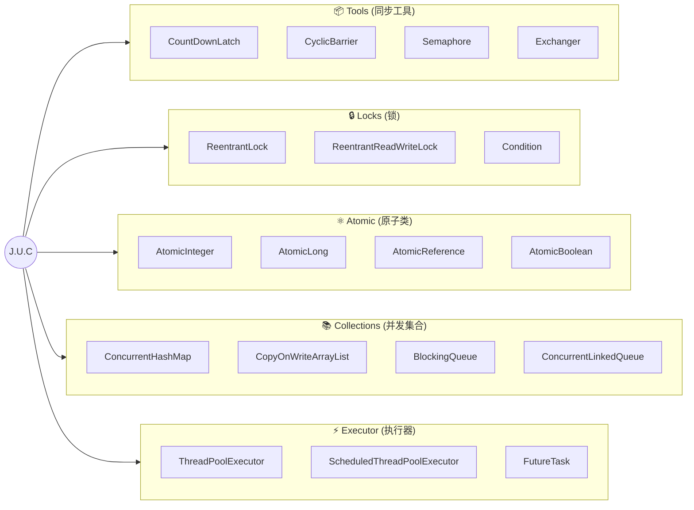
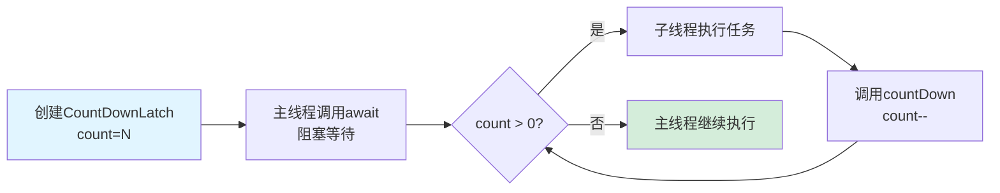
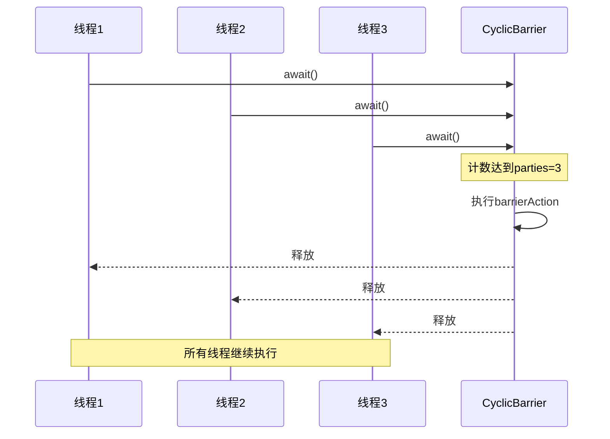
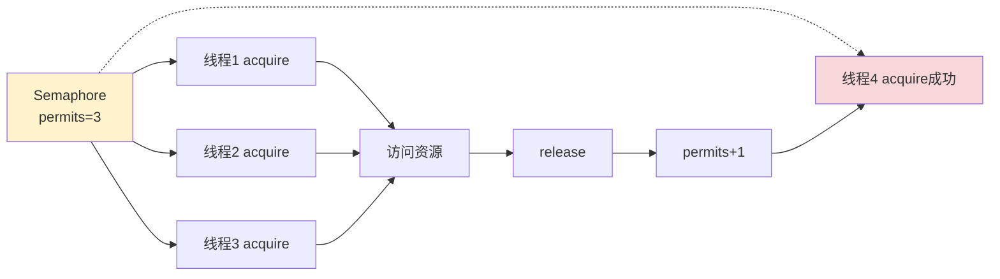
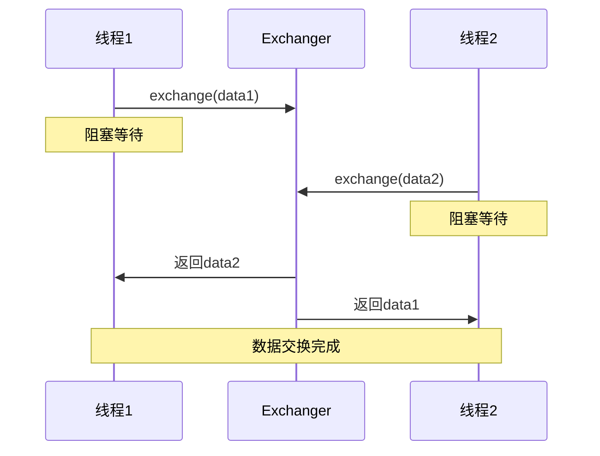
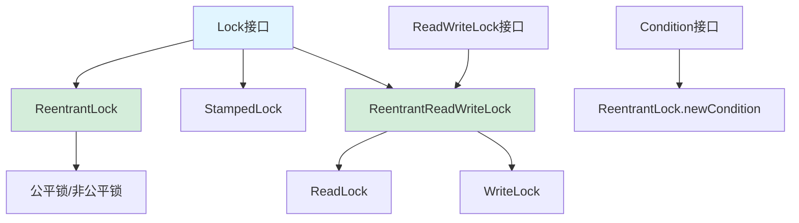
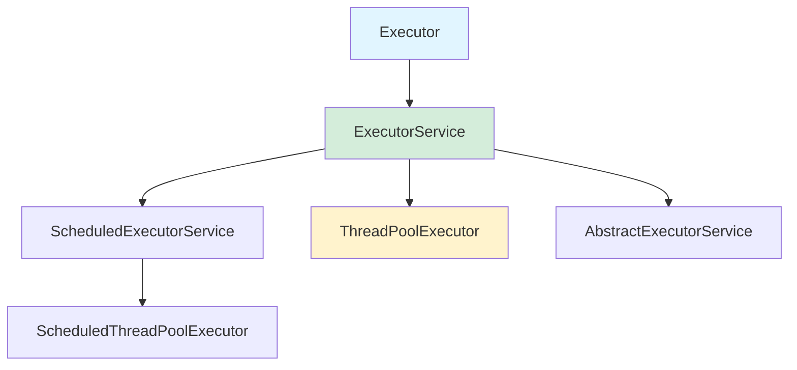
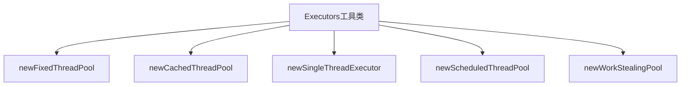
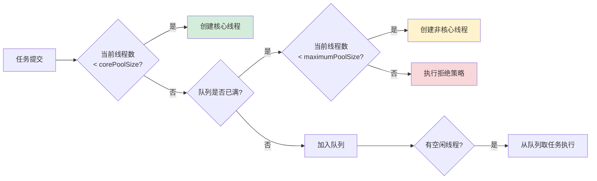
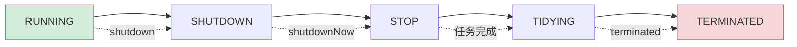

# Java JUC

# 1.什么是juc?

JUC是java java.util.concurrent包下的工具集合，是Java并发编程的核心基础设施，由`Doug Lea`主导设计，提供了一套高性能、可组合、线程安全的并发工具集。

java.util.concurrent（简称 JUC）自 JDK 5 引入，改变了 Java 并发编程范式。其设计哲学可概括为：

jUC的结构：

```mermaid
flowchart LR
   subgraph Tools["📦 Tools (同步工具)"]
      A1[CountDownLatch]
      A2[CyclicBarrier]
      A3[Semaphore]
      A4[Exchanger]
   end

   subgraph Locks["🔒 Locks (锁)"]
      B1[ReentrantLock]
      B2[ReentrantReadWriteLock]
      B3[Condition]
   end

   subgraph Atomic["⚛️ Atomic (原子类)"]
      C1[AtomicInteger]
      C2[AtomicLong]
      C3[AtomicReference]
      C4[AtomicBoolean]
   end

   subgraph Collections["📚 Collections (并发集合)"]
      D1[ConcurrentHashMap]
      D2[CopyOnWriteArrayList]
      D3[BlockingQueue]
      D4[ConcurrentLinkedQueue]
   end

   subgraph Executor["⚡ Executor (执行器)"]
      E1[ThreadPoolExecutor]
      E2[ScheduledThreadPoolExecutor]
      E3[FutureTask]
   end

   JUC((J.U.C)) --> Tools
   JUC --> Locks
   JUC --> Atomic
   JUC --> Collections
   JUC --> Executor
```

* **分离关注点**：将“任务提交”与“执行策略”解耦
* **组合优于继承**：通过 Callable/Runnable、Future、Executor 等接口灵活组装
* **性能与安全并重**：在避免锁竞争的同时保证内存可见性与操作原子性
* **可扩展基座**：以 `AQS` 为核心，衍生出丰富的同步器与集合

# 2.Java的底层核心机制

JUC 的高效建立在 JVM 底层机制之上，理解这些是掌握上层 API 的前提。

1. **Java 内存模型 (JMM) 与三大特性：**

| **特性**   | **含义**                       | **JUC 保障方式**                               |
| ---------- | ------------------------------ | ---------------------------------------------- |
| **原子性** | **操作不可分割**               | `AtomicXXX`、`synchronized`、`Lock`            |
| **可见性** | **线程修改后其他线程立即可见** | `volatile`、`Lock`、并发集合内部屏障           |
| **有序性** | **禁止指令重排**               | `volatile`、`final`、`Lock`隐含 happens-before |

2. **volatile 与内存屏障:**
   + 仅保证`可见性`与`有序性`，不保证原子性（如 i++ 仍会线程不安全）
   + 底层通过 LoadLoad、StoreStore、LoadStore、StoreLoad 内存屏障实现
   + 适用于：状态标志位、DCL 单例中的实例引用

3. **CAS:**

    CAS（Compare and Swap）是一种无锁的原子操作，用于在多线程环境中实现同步。它通过比较和交换来确保数据的一致性。CAS操作包含三个操作数：内存位置（V）、期望的原值（E）和新值（N）。当且仅当内存位置V的值等于预期原值E时，将该内存位置V的值设置为新值N。
    ```text
    CAS(V, Expected, NewValue) → 若 V == Expected 则更新为 New，否则自旋重试
    ```
   > 在Java中，CAS操作主要依赖于`Unsafe类`，该类提供了硬件级别的原子操作支持。
   > Unsafe类中的compareAndSwapInt方法通过底层的CPU指令cmpxchg实现原子操作。
   > 例如，AtomicInteger类的compareAndSet方法就是通过调用Unsafe类的compareAndSwapInt方法实现
   CAS的优缺点

   CAS优点：
   + **非阻塞**：CAS操作是一种无锁算法，不需要线程等待锁释放，从而减少了线程等待时间，提高了程序的吞吐量。
   + **原子性**：CAS操作本身是原子的，能够确保数据的一致性，避免数据竞争和脏读问题。
   + **灵活性**：CAS操作可以用于实现各种复杂的并发数据结构，如原子变量、无锁队列等。

   CAS缺点：
   + **ABA问题**：CAS操作在检查数据时只会检查值是否发生变化，而不管值是如何变化的。这可能导致ABA问题，即变量的值虽然回到了原始值A，但中间可能已经被其他线程修改过。
   + **自旋开销**：如果CAS操作失败，通常会通过自旋（忙等待）来重试。长时间的自旋会浪费CPU资源，尤其是在高并发场景下，可能导致性能下降。
   + **只能保证单个共享变量的原子操作**：CAS操作通常只适用于单个共享变量的原子操作。对于涉及多个共享变量的复合操作，CAS操作可能无法保证原子性。

   解决ABA问题:
   > 为了解决ABA问题，可以在变量上附加一个版本号，每次变量更新时版本号都加一(乐观锁)。这样即使值相同，版本号不同也能判断出数据已经被其他线程修改过。例如，AtomicStampedReference类提供了一个解决ABA问题的方法：
   ```java
   public boolean compareAndSet(V expectedReference, V newReference, int expectedStamp, int newStamp) {
   Pair<V> current = pair;
   return expectedReference == current.reference && expectedStamp == current.stamp &&
   ((newReference == current.reference && newStamp == current.stamp) ||
   casPair(current, Pair.of(newReference, newStamp)));
   }
   ```
4. Unsafe类
   
5. AQS（AbstractQueuedSynchronizer）
   AQS 是 JUC 同步组件的骨架，采用 模板方法模式 + CLH 变体队列(一个双向队列) 实现。
   ```mermaid
      graph TD
      A["同步状态 state (volatile int)"] --> B{acquire/tryAcquire}
      B -->|成功| C[执行业务逻辑]
      B -->|失败| D[封装 Node 加入同步队列]
      D --> E["park() 阻塞线程"]
      F[release/tryRelease] --> G[修改 state]
      G -->|成功| H[unparkSuccessor 唤醒后继]
      H --> D
      style A fill:#f9f,stroke:#333
      style E fill:#bbf,stroke:#333
      style H fill:#bfb,stroke:#333
   ```
   核心设计：
   + state：同步状态（独占锁=1，读写锁=高16位读/低16位写，Semaphore=许可数）
   + Node 队列：双向链表，维护等待线程，支持 exclusive / shared 模式
   + 子类只需实现 tryAcquire/tryRelease/tryAcquireShared/tryReleaseShared
# 3.JUC详解
## 3.1.Tools同步工具
### 3.1.1.CountDownLatch：一次性屏障

**CountDownLatch** 是一个同步辅助类，允许一个或多个线程等待，直到其他线程中执行的一组操作完成。

**工作原理**


```mermaid
graph LR
    A[创建CountDownLatch<br/>count=N] --> B[主线程调用await<br/>阻塞等待]
    B --> C{count > 0?}
    C -->|是| D[子线程执行任务]
    D --> E[调用countDown<br/>count--]
    E --> C
    C -->|否| F[主线程继续执行]
    
    style A fill:#e1f5ff
    style F fill:#d4edda
```

核心**API**:

```java
public CountDownLatch(int count)  // 构造器，设置计数
public void await()                // 等待，直到count=0
public boolean await(long timeout, TimeUnit unit)  // 带超时等待
public void countDown()            // 计数减1
public long getCount()             // 获取当前计数
```

**示例**：

```java
public class CountDownLatchDemo {
    public static void main(String[] args) throws InterruptedException {
        CountDownLatch latch = new CountDownLatch(3);
        
        for (int i = 0; i < 3; i++) {
            new Thread(() -> {
                try {
                    System.out.println(Thread.currentThread().getName() + " 开始执行");
                    Thread.sleep(1000);
                    System.out.println(Thread.currentThread().getName() + " 执行完成");
                } catch (InterruptedException e) {
                    e.printStackTrace();
                } finally {
                    latch.countDown();  // 计数减1
                }
            }).start();
        }
        
        latch.await();  // 主线程等待所有子线程完成
        System.out.println("所有任务执行完毕，主线程继续");
    }
}
```

**应用场景**

- **并行任务聚合**：等待多个并行任务完成后继续执行
- **服务启动检查**：等待所有服务组件初始化完成
- **性能测试**：模拟并发请求，统计响应时间

### 3.1.2.CyclicBarrier**：**可重用栅栏

**CyclicBarrier** 是一个同步辅助类，它允许一组线程互相等待，直到到达某个公共屏障点（common barrier point）。

**CountDownLatch** vs **CyclicBarrier**

| 特性         | CountDownLatch       | CyclicBarrier     |
| ------------ | -------------------- | ----------------- |
| **可重用性** | 不可重用，一次性     | 可循环使用        |
| **计数方式** | 递减（countDown）    | 递增（await）     |
| **等待关系** | 一个线程等待其他线程 | 所有线程互相等待  |
| **屏障动作** | 不支持               | 支持barrierAction |
| **典型场景** | 主从等待             | 线程间同步        |

**工作原理：**


```mermaid
sequenceDiagram
    participant T1 as 线程1
    participant T2 as 线程2
    participant T3 as 线程3
    participant B as CyclicBarrier
    
    T1->>B: await()
    T2->>B: await()
    T3->>B: await()
    Note over B: 计数达到parties=3
    B->>B: 执行barrierAction
    B-->>T1: 释放
    B-->>T2: 释放
    B-->>T3: 释放
    Note over T1,T3: 所有线程继续执行
```

**核心API：**

```java
public CyclicBarrier(int parties)  // 构造器
public CyclicBarrier(int parties, Runnable barrierAction)  // 带屏障动作
public int await()  // 等待到达屏障
public int await(long timeout, TimeUnit unit)  // 带超时等待
public int getNumberWaiting()  // 获取等待的线程数
public boolean isBroken()  // 判断屏障是否损坏
public void reset()  // 重置屏障
```

**示例：**

```java
public class CyclicBarrierDemo {
    public static void main(String[] args) {
        CyclicBarrier barrier = new CyclicBarrier(3, () -> {
            System.out.println("所有线程到达屏障，执行汇总任务");
        });
        
        for (int i = 0; i < 3; i++) {
            final int threadId = i;
            new Thread(() -> {
                try {
                    System.out.println("线程" + threadId + " 开始计算");
                    Thread.sleep(1000);
                    System.out.println("线程" + threadId + " 到达屏障");
                    
                    barrier.await();  // 等待其他线程
                    
                    System.out.println("线程" + threadId + " 继续执行");
                } catch (Exception e) {
                    e.printStackTrace();
                }
            }).start();
        }
    }
}
```

**应用场景**

- **并行计算**：多线程计算后汇总结果
- **游戏同步**：等待所有玩家准备就绪
- **数据分片处理**：等待所有分片处理完成后合并

### 3.1.3.Semaphore：资源许可证

**Semaphore**（信号量）用于控制同时访问特定资源的线程数量，通过维护一组许可证来实现。

**工作原理**


```mermaid
graph LR
    A[Semaphore<br/>permits=3] --> B[线程1 acquire]
    A --> C[线程2 acquire]
    A --> D[线程3 acquire]
    A -.-> E[线程4 阻塞等待]
    
    B --> F[访问资源]
    C --> F
    D --> F
    
    F --> G[release]
    G --> H[permits+1]
    H --> E[线程4 acquire成功]
    
    style A fill:#fff3cd
    style E fill:#f8d7da
```

**核心API:**

```java
public Semaphore(int permits)  // 构造器，指定许可证数量
public Semaphore(int permits, boolean fair)  // 指定是否公平
public void acquire()  // 获取一个许可证
public void acquire(int permits)  // 获取多个许可证
public void release()  // 释放一个许可证
public void release(int permits)  // 释放多个许可证
public int availablePermits()  // 获取可用许可证数
public int getQueueLength()  // 获取等待线程数
```

**示例**：

```java
public class SemaphoreDemo {
    public static void main(String[] args) {
        Semaphore semaphore = new Semaphore(3);  // 允许3个并发
        for (int i = 0; i < 10; i++) {
            new Thread(() -> {
                try {
                    semaphore.acquire();  // 获取许可证
                    System.out.println(Thread.currentThread().getName() + 
                                     " 获得许可证，剩余：" + semaphore.availablePermits());
                    Thread.sleep(2000);
                } catch (InterruptedException e) {
                    e.printStackTrace();
                } finally {
                    semaphore.release();  // 释放许可证
                    System.out.println(Thread.currentThread().getName() + 
                                     " 释放许可证");
                }
            }).start();
        }
    }
}
```

**应用场景**

- **限流**：控制并发访问数量
- **资源池管理**：数据库连接池、线程池
- **流量控制**：API接口限流

### 3.1.4.Exchanger：线程间数据交换

**Exchanger** 是一个用于线程间协作的工具类，它提供一个同步点，在这个同步点上，两个线程可以交换彼此的数据。

**工作原理**


```mermaid
sequenceDiagram
    participant T1 as 线程1
    participant E as Exchanger
    participant T2 as 线程2
    
    T1->>E: exchange(data1)
    Note over T1: 阻塞等待
    T2->>E: exchange(data2)
    Note over T2: 阻塞等待
    E->>T1: 返回data2
    E->>T2: 返回data1
    Note over T1,T2: 数据交换完成
```

**核心API:**

```java
public V exchange(V x)  // 交换数据
public V exchange(V x, long timeout, TimeUnit unit)  // 带超时交换
```

**示例:**

```java
public class ExchangerDemo {
    public static void main(String[] args) {
        Exchanger<String> exchanger = new Exchanger<>();
        
        new Thread(() -> {
            try {
                String data1 = "线程1的数据";
                System.out.println("线程1发送: " + data1);
                String received = exchanger.exchange(data1);
                System.out.println("线程1接收: " + received);
            } catch (InterruptedException e) {
                e.printStackTrace();
            }
        }).start();
        
        new Thread(() -> {
            try {
                Thread.sleep(1000);
                String data2 = "线程2的数据";
                System.out.println("线程2发送: " + data2);
                String received = exchanger.exchange(data2);
                System.out.println("线程2接收: " + received);
            } catch (InterruptedException e) {
                e.printStackTrace();
            }
        }).start();
    }
}
```

**应用场景**

- **管道处理**：两个线程交替处理数据
- **双向通信**：两个线程需要交换信息的场景

## 3.2.Locks锁

**锁体系架构:**


```mermaid
graph 
    A[Lock接口] --> B[ReentrantLock]
    A --> F[StampedLock]
    A --> C[ReentrantReadWriteLock]
    C --> D[ReadLock]
    C --> E[WriteLock]

    B --> G[公平锁/非公平锁]
    
    H[ReadWriteLock接口] --> C
    I[Condition接口] --> J[ReentrantLock.newCondition]
   
    style A fill:#e1f5ff
    style B fill:#d4edda
    style C fill:#d4edda
```


## 3.3.Atomic原子类
## 3.4.Collections (并发集合)
## 3.5.Executor (执行器)

**执行器体系:**


```mermaid
graph TD
    A[Executor] --> B[ExecutorService]
    B --> C[ScheduledExecutorService]
    B --> D[ThreadPoolExecutor]
    B --> E[AbstractExecutorService]
    C --> F[ScheduledThreadPoolExecutor]
    
    style A fill:#e1f5ff
    style B fill:#d4edda
    style D fill:#fff3cd
```


```mermaid
graph TD
   
    
    G[Executors工具类] --> H[newFixedThreadPool]
    G --> I[newCachedThreadPool]
    G --> J[newSingleThreadExecutor]
    G --> K[newScheduledThreadPool]
    G --> L[newWorkStealingPool]
   
```

ThreadPoolExecutor 核心参数:

```java
public ThreadPoolExecutor(
    int corePoolSize,              		// 核心线程数
    int maximumPoolSize,           		// 最大线程数
    long keepAliveTime,            		// 线程空闲时间
    TimeUnit unit,                 		// 时间单位
    BlockingQueue<Runnable> workQueue,  // 工作队列
    ThreadFactory threadFactory,   		// 线程工厂
    RejectedExecutionHandler handler    // 拒绝策略
)
```

参数说明(ThreadPoolExecutor 核心参数变化):


```mermaid
graph LR
    A[任务提交] --> B{当前线程数<br/> < corePoolSize?}
    B -->|是| C[创建核心线程]
    B -->|否| D{队列是否已满?}
    D -->|否| E[加入队列]
    D -->|是| F{当前线程数<br/> < maximumPoolSize?}
    F -->|是| G[创建非核心线程]
    F -->|否| H[执行拒绝策略]
    
    E --> I{有空闲线程?}
    I -->|是| J[从队列取任务执行]
    
    style C fill:#d4edda
    style G fill:#fff3cd
    style H fill:#f8d7da
```

**工作流程**

1. **核心线程未满**：创建核心线程执行任务
2. **核心线程已满**：任务加入工作队列
3. **队列已满**：创建非核心线程执行任务
4. **线程数达上限**：执行拒绝策略

**拒绝策略：**

| 策略                    | 说明                           | 适用场景                 |
| ----------------------- | ------------------------------ | ------------------------ |
| **AbortPolicy**         | 抛出RejectedExecutionException | 默认策略，不允许丢失任务 |
| **CallerRunsPolicy**    | 调用者线程执行任务             | 允许降低提交速度         |
| **DiscardPolicy**       | 直接丢弃任务                   | 允许丢失任务             |
| **DiscardOldestPolicy** | 丢弃最老任务，重试             | 允许丢弃旧任务           |

线程池的状态：


```mermaid
graph LR
    A[RUNNING] --> B[SHUTDOWN]
    B --> C[STOP]
    C --> D[TIDYING]
    D --> E[TERMINATED]
    
    A -.->|shutdown| B
    B -.->|shutdownNow| C
    C -.->|任务完成| D
    D -.->|terminated| E
    
    style A fill:#d4edda
    style E fill:#f8d7da
```

| 状态           | 接收新任务 | 处理队列任务 | 说明                                         |
| -------------- | ---------- | ------------ | -------------------------------------------- |
| **RUNNING**    | ✅          | ✅            | 正常运行                                     |
| **SHUTDOWN**   | ❌          | ✅            | 不接受新任务，处理已有任务                   |
| **STOP**       | ❌          | ❌            | 不接受新任务，不处理已有任务，中断进行中任务 |
| **TIDYING**    | ❌          | ❌            | 所有任务已终止                               |
| **TERMINATED** | ❌          | ❌            | 线程池终止                                   |

Executors工具类常见线程池（不推荐使用）:

```java
// 固定大小线程池
ExecutorService fixedPool = Executors.newFixedThreadPool(5);

// 缓存线程池（不推荐，可能导致OOM）
ExecutorService cachedPool = Executors.newCachedThreadPool();

// 单线程池
ExecutorService singlePool = Executors.newSingleThreadExecutor();

// 定时线程池
ScheduledExecutorService scheduledPool = Executors.newScheduledThreadPool(3);

// ForkJoin池（JDK8）
ExecutorService workStealingPool = Executors.newWorkStealingPool();
```

为什么不推荐使用Executors？

| 方法                        | 问题             | 风险 |
| --------------------------- | ---------------- | ---- |
| **newFixedThreadPool**      | 使用无界队列     | OOM  |
| **newCachedThreadPool**     | 允许创建无限线程 | OOM  |
| **newSingleThreadExecutor** | 使用无界队列     | OOM  |

线程池最佳实践——配置建议

| 场景          | 核心线程数           | 最大线程数 | 队列类型 |
| ------------- | -------------------- | ---------- | -------- |
| **CPU密集型** | CPU核数              | CPU核数+1  | 小队列   |
| **IO密集型**  | 2*CPU核数            | 2*CPU核数  | 大队列   |
| **混合型**    | CPU核数/(1-阻塞系数) | 根据情况   | 适中队列 |
