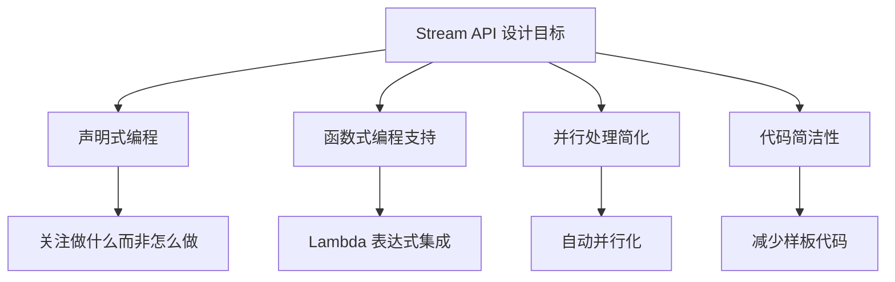
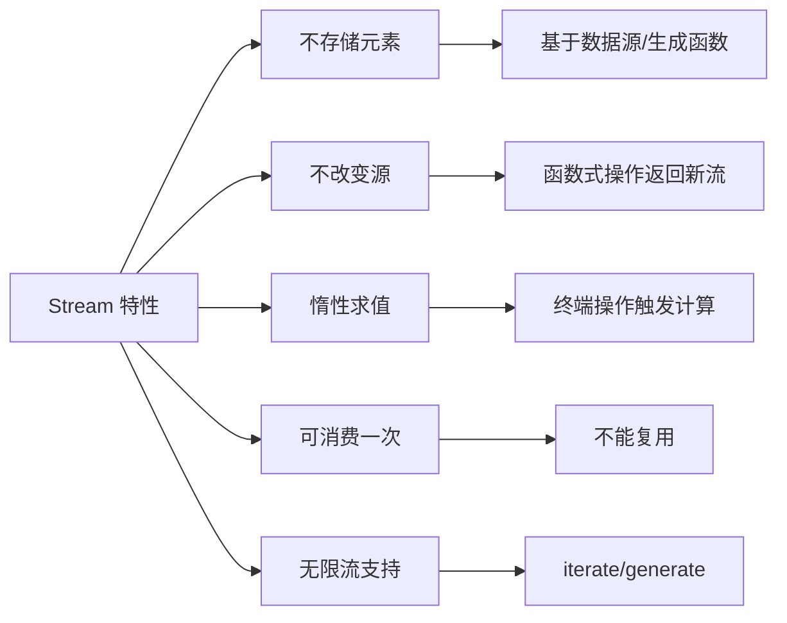
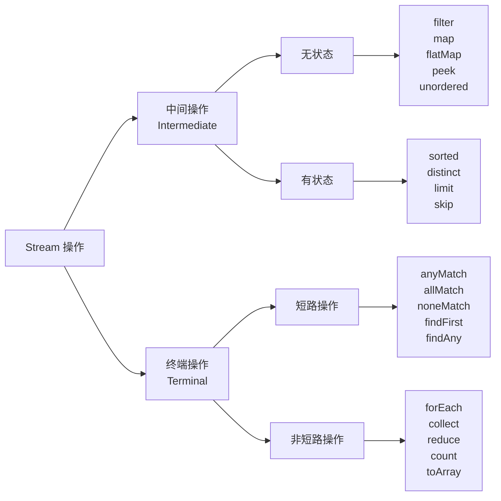
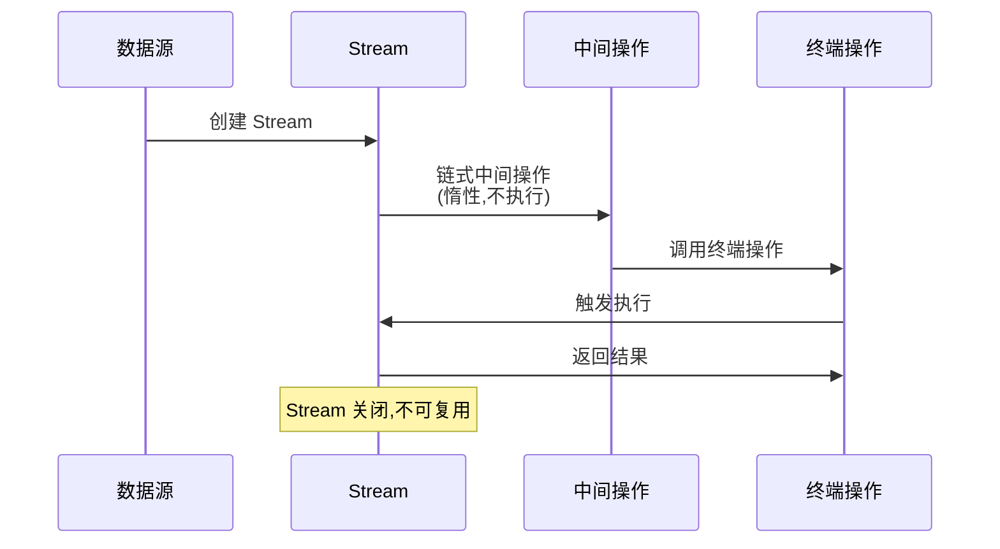
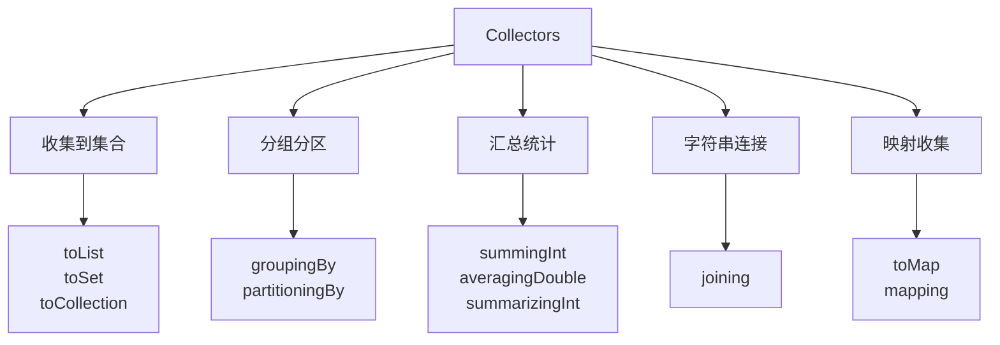
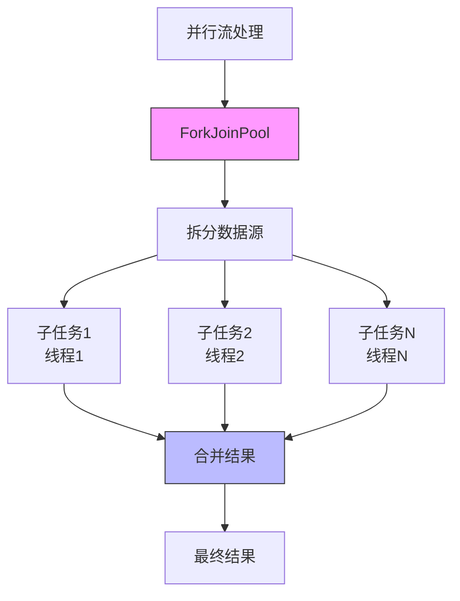

# Stream API
## 1. Stream API 概述

### 1.1 什么是 Stream API

Stream API 是 Java 8 引入的用于处理集合数据的强大工具，它允许以声明式方式处理数据集合。Stream 不是数据结构，不存储数据，而是对数据源（Collection、数组等）的视图。

### 1.2 设计目标



### 1.3 传统 vs Stream 方式对比

| 特性 | 传统方式 | Stream API |
|------|---------|------------|
| **编程范式** | 命令式 | 声明式 |
| **代码量** | 较多 | 简洁 |
| **可读性** | 依赖实现细节 | 意图清晰 |
| **并行处理** | 手动实现 | 自动支持 |
| **惰性求值** | 不支持 | 支持 |
| **可组合性** | 较差 | 优秀 |

**示例对比：**

```java
// 传统方式
List<String> result = new ArrayList<>();
for (String name : names) {
    if (name.startsWith("A")) {
        result.add(name.toUpperCase());
    }
}
Collections.sort(result);

// Stream 方式
List<String> result = names.stream()
    .filter(name -> name.startsWith("A"))
    .map(String::toUpperCase)
    .sorted()
    .collect(Collectors.toList());
```


## 2. Stream 核心概念

### 2.1 Stream 特性



### 2.2 Stream 操作分类



### 2.3 Stream 生命周期



## 3. Stream 的创建

### 3.1 从集合创建

```java
// 从 Collection 创建
List<String> list = Arrays.asList("a", "b", "c");
Stream<String> stream = list.stream(); // 顺序流
Stream<String> parallelStream = list.parallelStream(); // 并行流

// 从数组创建
String[] array = {"a", "b", "c"};
Stream<String> arrayStream = Arrays.stream(array);
Stream<String> rangeStream = Arrays.stream(array, 0, 2); // 子范围

// 从 Map 创建
Map<String, Integer> map = new HashMap<>();
Stream<String> keyStream = map.keySet().stream();
Stream<Integer> valueStream = map.values().stream();
Stream<Map.Entry<String, Integer>> entryStream = map.entrySet().stream();
```

### 3.2 使用 Stream.of()

```java
// 直接创建
Stream<String> stream1 = Stream.of("a", "b", "c");
Stream<Integer> stream2 = Stream.of(1, 2, 3);
Stream<String> stream3 = Stream.of(new String[]{"a", "b"});

// 使用 null 值（会抛出 NullPointerException）
// Stream.of(null); // ❌
```

### 3.3 使用 Arrays.stream()

```java
int[] numbers = {1, 2, 3, 4, 5};
IntStream intStream = Arrays.stream(numbers);
IntStream subStream = Arrays.stream(numbers, 1, 4); // [2,3,4]
```

### 3.4 生成无限流

```java
// Stream.iterate() - 迭代生成
Stream<Integer> evenNumbers = Stream.iterate(0, n -> n + 2);
evenNumbers.limit(5).forEach(System.out::println); // 0,2,4,6,8

// Java 9+ 带谓词的 iterate
Stream.iterate(1, n -> n < 100, n -> n * 2)
    .forEach(System.out::println); // 1,2,4,8,16,32,64

// Stream.generate() -  Supplier 生成
Stream<Double> randoms = Stream.generate(Math::random);
randoms.limit(3).forEach(System.out::println);

// 生成常量流
Stream<String> echos = Stream.generate(() -> "echo");
echos.limit(3).forEach(System.out::println); // echo,echo,echo
```

### 3.5 创建数值流

```java
// 基本类型专用流（避免装箱拆箱）
IntStream intStream = IntStream.range(1, 10);      // 1-9
IntStream closedRange = IntStream.rangeClosed(1, 10); // 1-10
DoubleStream doubleStream = DoubleStream.of(1.0, 2.0, 3.0);
LongStream longStream = LongStream.range(0, 100);

// 从 Stream 转换
Stream<String> words = Stream.of("one", "two", "three");
IntStream lengths = words.mapToInt(String::length);
```

### 3.6 其他创建方式

```java
// 从文件创建
try (Stream<String> lines = Files.lines(Paths.get("file.txt"))) {
    lines.forEach(System.out::println);
}

// 从 Pattern 分割字符串
Pattern pattern = Pattern.compile(",");
Stream<String> stream = pattern.splitAsStream("a,b,c,d");

// Stream.builder()
Stream<String> builderStream = Stream.<String>builder()
    .add("a")
    .add("b")
    .add("c")
    .build();

// Stream.concat()
Stream<String> stream1 = Stream.of("a", "b");
Stream<String> stream2 = Stream.of("c", "d");
Stream<String> concatenated = Stream.concat(stream1, stream2); // a,b,c,d
```

## 4. 中间操作

中间操作返回新的 Stream，可以链式调用，采用惰性求值。

### 4.1 筛选与切片

| 方法 | 描述 | 示例 |
|------|------|------|
| `filter(Predicate)` | 过滤元素 | `stream.filter(n -> n > 10)` |
| `distinct()` | 去重 | `stream.distinct()` |
| `limit(long)` | 截断流 | `stream.limit(10)` |
| `skip(long)` | 跳过元素 | `stream.skip(5)` |

```java
List<Integer> numbers = Arrays.asList(1, 2, 2, 3, 4, 5, 5, 6);

// filter - 过滤
numbers.stream()
    .filter(n -> n % 2 == 0)
    .collect(Collectors.toList()); // [2, 2, 4, 6]

// distinct - 去重
numbers.stream()
    .distinct()
    .collect(Collectors.toList()); // [1, 2, 3, 4, 5, 6]

// limit - 取前N个
numbers.stream()
    .limit(3)
    .collect(Collectors.toList()); // [1, 2, 2]

// skip - 跳过前N个
numbers.stream()
    .skip(2)
    .collect(Collectors.toList()); // [2, 3, 4, 5, 5, 6]

// 组合使用
numbers.stream()
    .distinct()
    .filter(n -> n > 2)
    .skip(1)
    .limit(2)
    .collect(Collectors.toList()); // [4, 5]
```

### 4.2 映射操作

| 方法 | 描述 | 返回类型 |
|------|------|----------|
| `map(Function)` | 一对一映射 | `Stream<R>` |
| `flatMap(Function)` | 一对多映射（扁平化） | `Stream<R>` |
| `mapToInt/ToLong/ToDouble` | 映射为数值流 | `IntStream/LongStream/DoubleStream` |

```java
List<String> words = Arrays.asList("hello", "world");

// map - 转换
words.stream()
    .map(String::toUpperCase)
    .collect(Collectors.toList()); // ["HELLO", "WORLD"]

words.stream()
    .map(String::length)
    .collect(Collectors.toList()); // [5, 5]

// mapToXxx - 转换为数值流
words.stream()
    .mapToInt(String::length)
    .sum(); // 10

// flatMap - 扁平化
List<List<String>> nested = Arrays.asList(
    Arrays.asList("a", "b"),
    Arrays.asList("c", "d")
);

nested.stream()
    .flatMap(List::stream)
    .collect(Collectors.toList()); // ["a", "b", "c", "d"]

// 实际应用：提取句子中的所有单词
List<String> sentences = Arrays.asList("Hello world", "Java stream");
sentences.stream()
    .flatMap(sentence -> Arrays.stream(sentence.split(" ")))
    .collect(Collectors.toList()); // ["Hello", "world", "Java", "stream"]
```

### 4.3 排序操作

```java
List<String> names = Arrays.asList("Alice", "Bob", "Charlie", "David");

// natural order - 自然排序
names.stream()
    .sorted()
    .collect(Collectors.toList()); // [Alice, Bob, Charlie, David]

// reverse order - 逆序
names.stream()
    .sorted(Comparator.reverseOrder())
    .collect(Collectors.toList()); // [David, Charlie, Bob, Alice]

// custom comparator - 自定义排序
names.stream()
    .sorted(Comparator.comparingInt(String::length))
    .collect(Collectors.toList()); // [Bob, Alice, David, Charlie]

// 多字段排序
List<Person> people = getPeople();
people.stream()
    .sorted(Comparator.comparing(Person::getLastName)
        .thenComparing(Person::getFirstName))
    .collect(Collectors.toList());

// 降序
people.stream()
    .sorted(Comparator.comparingInt(Person::getAge).reversed())
    .collect(Collectors.toList());
```

### 4.4 peek 操作

```java
// peek 主要用于调试，查看流中的元素
List<String> result = Stream.of("a", "b", "c")
    .peek(s -> System.out.println("Before: " + s))
    .map(String::toUpperCase)
    .peek(s -> System.out.println("After: " + s))
    .collect(Collectors.toList());

// 输出:
// Before: a
// After: A
// Before: b
// After: B
// Before: c
// After: C
```

### 4.5 中间操作对比表

| 操作 | 有状态 | 短路 | 说明 |
|------|--------|------|------|
| `filter` | 否 | 否 | 无状态筛选 |
| `map` | 否 | 否 | 一对一转换 |
| `flatMap` | 否 | 否 | 扁平化映射 |
| `distinct` | 是 | 否 | 需要记住已见元素 |
| `sorted` | 是 | 否 | 需要看到所有元素 |
| `limit` | 是 | 是 | 计数操作 |
| `skip` | 是 | 否 | 计数操作 |
| `peek` | 否 | 否 | 调试用 |


## 5. 终端操作

终端操作触发 Stream 的执行，返回结果或副作用，Stream 使用后关闭。

### 5.1 查找与匹配

| 方法 | 返回类型 | 描述 | 短路 |
|------|----------|------|------|
| `anyMatch(Predicate)` | `boolean` | 是否至少有一个匹配 | ✓ |
| `allMatch(Predicate)` | `boolean` | 是否所有都匹配 | ✓ |
| `noneMatch(Predicate)` | `boolean` | 是否都不匹配 | ✓ |
| `findFirst()` | `Optional<T>` | 找到第一个元素 | ✓ |
| `findAny()` | `Optional<T>` | 找到任意元素 | ✓ |

```java
List<Integer> numbers = Arrays.asList(1, 2, 3, 4, 5);

// anyMatch - 是否存在偶数
boolean hasEven = numbers.stream()
    .anyMatch(n -> n % 2 == 0); // true

// allMatch - 是否都小于10
boolean allLessThan10 = numbers.stream()
    .allMatch(n -> n < 10); // true

// noneMatch - 是否没有大于100
boolean noneGreaterThan100 = numbers.stream()
    .noneMatch(n -> n > 100); // true

// findFirst - 找到第一个偶数
Optional<Integer> firstEven = numbers.stream()
    .filter(n -> n % 2 == 0)
    .findFirst(); // Optional[2]

// findAny - 并行流中更高效
Optional<Integer> anyEven = numbers.parallelStream()
    .filter(n -> n % 2 == 0)
    .findAny(); // Optional[2] 或其他偶数

// Optional 处理
firstEven.ifPresent(System.out::println); // 2
int value = firstEven.orElse(0); // 2
int value2 = firstEven.orElseGet(() -> 0);
// firstEven.orElseThrow(() -> new RuntimeException("Not found"));
```

### 5.2 归约操作 (Reduce)

```java
List<Integer> numbers = Arrays.asList(1, 2, 3, 4, 5);

// 无初始值 - 返回 Optional
Optional<Integer> sum = numbers.stream()
    .reduce((a, b) -> a + b); // Optional[15]

// 有初始值
Integer sum2 = numbers.stream()
    .reduce(0, (a, b) -> a + b); // 15

// 使用方法引用
Integer sum3 = numbers.stream()
    .reduce(0, Integer::sum); // 15

// 求最大值
Optional<Integer> max = numbers.stream()
    .reduce(Integer::max); // Optional[5]

// 求最小值
Optional<Integer> min = numbers.stream()
    .reduce(Integer::min); // Optional[1]

// 求乘积
Integer product = numbers.stream()
    .reduce(1, (a, b) -> a * b); // 120

// 连接字符串
List<String> words = Arrays.asList("Hello", "World");
String joined = words.stream()
    .reduce("", (a, b) -> a + " " + b)
    .trim(); // "Hello World"

// 三元 reduce (适用于并行流)
Integer sumParallel = numbers.parallelStream()
    .reduce(0, 
            Integer::sum,           // 累加器
            Integer::sum);          // 合并器
```

### 5.3 收集操作 (Collect)

```java
List<String> names = Arrays.asList("Alice", "Bob", "Charlie");

// 收集到 List
List<String> list = names.stream()
    .collect(Collectors.toList());

// 收集到 Set
Set<String> set = names.stream()
    .collect(Collectors.toSet());

// 收集到特定集合
List<String> arrayList = names.stream()
    .collect(Collectors.toCollection(ArrayList::new));

// 转换为数组
String[] array = names.stream()
    .toArray(String[]::new);

// 计数
long count = names.stream().count(); // 3

// 分组
List<Person> people = getPeople();
Map<String, List<Person>> byCity = people.stream()
    .collect(Collectors.groupingBy(Person::getCity));

// 多级分组
Map<String, Map<Integer, List<Person>>> byCityAndAge = people.stream()
    .collect(Collectors.groupingBy(Person::getCity,
            Collectors.groupingBy(Person::getAge)));

// 分区（true/false）
Map<Boolean, List<Person>> adultsAndChildren = people.stream()
    .collect(Collectors.partitioningBy(p -> p.getAge() >= 18));

// 映射后收集
Map<String, Integer> nameToAge = people.stream()
    .collect(Collectors.toMap(Person::getName, Person::getAge));

// 处理 key 冲突
Map<String, Person> nameToPerson = people.stream()
    .collect(Collectors.toMap(
        Person::getName,
        p -> p,
        (existing, replacement) -> existing // 保留第一个
    ));
```

### 5.4 数值流终端操作

```java
IntStream numbers = IntStream.rangeClosed(1, 10);

// 基本统计
int sum = numbers.sum(); // 55
OptionalInt max = numbers.max(); // OptionalInt[10]
OptionalInt min = numbers.min(); // OptionalInt[1]
OptionalDouble avg = numbers.average(); // OptionalDouble[5.5]
long count = numbers.count(); // 10

// 统计摘要
IntSummaryStatistics stats = IntStream.rangeClosed(1, 10)
    .summaryStatistics();
System.out.println(stats.getCount());     // 10
System.out.println(stats.getSum());       // 55
System.out.println(stats.getMin());       // 1
System.out.println(stats.getMax());       // 10
System.out.println(stats.getAverage());   // 5.5
```

### 5.5 forEach 操作

```java
List<String> names = Arrays.asList("Alice", "Bob", "Charlie");

// forEach - 消费每个元素
names.stream().forEach(System.out::println);

// forEachOrdered - 保证顺序（并行流时有用）
names.parallelStream().forEachOrdered(System.out::println);

// 注意：forEach 是终端操作，不能用于修改集合
// names.stream().forEach(name -> name.toUpperCase()); // ❌ 不会改变原集合
```

### 5.6 终端操作对比

| 操作 | 返回类型 | 短路 | 适用场景 |
|------|----------|------|----------|
| `forEach` | `void` | 否 | 消费元素 |
| `toArray` | `Object[]` | 否 | 转为数组 |
| `reduce` | `T/Optional<T>` | 否 | 归约计算 |
| `collect` | `R` | 否 | 收集结果 |
| `min/max` | `Optional<T>` | 否 | 找最值 |
| `count` | `long` | 否 | 计数 |
| `anyMatch` | `boolean` | ✓ | 存在性检查 |
| `allMatch` | `boolean` | ✓ | 全匹配检查 |
| `noneMatch` | `boolean` | ✓ | 无匹配检查 |
| `findFirst` | `Optional<T>` | ✓ | 找第一个 |
| `findAny` | `Optional<T>` | ✓ | 找任意（并行） |


## 6. Collectors 收集器

### 6.1 Collectors 核心方法体系



### 6.2 常用 Collectors 详解

#### 6.2.1 收集到集合

```java
List<Person> people = getPeople();

// toList - 不可变列表（Java 10+ 可用 toUnmodifiableList）
List<String> names = people.stream()
    .map(Person::getName)
    .collect(Collectors.toList());

// toSet
Set<String> uniqueNames = people.stream()
    .map(Person::getName)
    .collect(Collectors.toSet());

// toCollection - 指定集合类型
LinkedList<String> linkedList = people.stream()
    .map(Person::getName)
    .collect(Collectors.toCollection(LinkedList::new));

// 去重后收集
List<String> distinctNames = people.stream()
    .map(Person::getName)
    .distinct()
    .collect(Collectors.toList());
```

#### 6.2.2 分组 (groupingBy)

```java
List<Person> people = getPeople();

// 单级分组
Map<String, List<Person>> byCity = people.stream()
    .collect(Collectors.groupingBy(Person::getCity));

// 分组后提取特定字段
Map<String, List<String>> cityToNames = people.stream()
    .collect(Collectors.groupingBy(
        Person::getCity,
        Collectors.mapping(Person::getName, Collectors.toList())
    ));

// 分组后计数
Map<String, Long> cityCount = people.stream()
    .collect(Collectors.groupingBy(
        Person::getCity,
        Collectors.counting()
    ));

// 分组后求和
Map<String, Integer> cityTotalAge = people.stream()
    .collect(Collectors.groupingBy(
        Person::getCity,
        Collectors.summingInt(Person::getAge)
    ));

// 分组后求平均
Map<String, Double> cityAvgAge = people.stream()
    .collect(Collectors.groupingBy(
        Person::getCity,
        Collectors.averagingInt(Person::getAge)
    ));

// 多级分组
Map<String, Map<Integer, List<Person>>> byCityAndAge = people.stream()
    .collect(Collectors.groupingBy(
        Person::getCity,
        Collectors.groupingBy(Person::getAge)
    ));

// 分组后取最大值
Map<String, Optional<Person>> oldestByCity = people.stream()
    .collect(Collectors.groupingBy(
        Person::getCity,
        Collectors.maxBy(Comparator.comparingInt(Person::getAge))
    ));
```

#### 6.2.3 分区 (partitioningBy)

```java
List<Person> people = getPeople();

// 分区：成年人和未成年人
Map<Boolean, List<Person>> adultsAndChildren = people.stream()
    .collect(Collectors.partitioningBy(p -> p.getAge() >= 18));

List<Person> adults = adultsAndChildren.get(true);
List<Person> children = adultsAndChildren.get(false);

// 分区后计数
Map<Boolean, Long> adultCount = people.stream()
    .collect(Collectors.partitioningBy(
        p -> p.getAge() >= 18,
        Collectors.counting()
    ));

// 分区与分组结合
Map<Boolean, Map<String, List<Person>>> adultsByCity = people.stream()
    .collect(Collectors.partitioningBy(
        p -> p.getAge() >= 18,
        Collectors.groupingBy(Person::getCity)
    ));
```

#### 6.2.4 汇总统计

```java
List<Person> people = getPeople();

// 求和
int totalAge = people.stream()
    .collect(Collectors.summingInt(Person::getAge));

// 平均值
double avgAge = people.stream()
    .collect(Collectors.averagingInt(Person::getAge));

// 统计摘要
IntSummaryStatistics ageStats = people.stream()
    .collect(Collectors.summarizingInt(Person::getAge));

System.out.println("Count: " + ageStats.getCount());
System.out.println("Sum: " + ageStats.getSum());
System.out.println("Min: " + ageStats.getMin());
System.out.println("Max: " + ageStats.getMax());
System.out.println("Avg: " + ageStats.getAverage());

// 连接字符串
List<String> names = Arrays.asList("Alice", "Bob", "Charlie");
String joined = names.stream()
    .collect(Collectors.joining(", ")); // "Alice, Bob, Charlie"

String joinedWithPrefix = names.stream()
    .collect(Collectors.joining(", ", "[", "]")); // "[Alice, Bob, Charlie]"
```

#### 6.2.5 转换为 Map (toMap)

```java
List<Person> people = getPeople();

// 基本 toMap
Map<String, Integer> nameToAge = people.stream()
    .collect(Collectors.toMap(Person::getName, Person::getAge));

// 处理 key 冲突（保留旧值）
Map<String, Person> nameToPerson = people.stream()
    .collect(Collectors.toMap(
        Person::getName,
        p -> p,
        (existing, replacement) -> existing
    ));

// 处理 key 冲突（保留新值）
Map<String, Person> latestPerson = people.stream()
    .collect(Collectors.toMap(
        Person::getName,
        p -> p,
        (existing, replacement) -> replacement
    ));

// 指定 Map 类型
Map<String, Integer> linkedMap = people.stream()
    .collect(Collectors.toMap(
        Person::getName,
        Person::getAge,
        (e, r) -> e,
        LinkedHashMap::new
    ));
```

#### 6.2.6 自定义收集器

```java
// 使用 collector 方法创建自定义收集器
List<String> names = Arrays.asList("Alice", "Bob", "Charlie");

// 收集到逗号分隔的字符串（不使用 joining）
String result = names.stream()
    .collect(Collector.of(
        StringBuilder::new,
        (sb, s) -> sb.append(s).append(","),
        (sb1, sb2) -> sb1.append(sb2),
        sb -> sb.length() > 0 ? sb.substring(0, sb.length() - 1) : ""
    )); // "Alice,Bob,Charlie"
```

### 6.3 Collectors 方法对比表

| 方法 | 返回类型 | 用途 |
|------|----------|------|
| `toList()` | `List<T>` | 收集到列表 |
| `toSet()` | `Set<T>` | 收集到集合 |
| `toCollection()` | `Collection<T>` | 收集到指定集合 |
| `toMap()` | `Map<K,V>` | 收集到 Map |
| `groupingBy()` | `Map<K,List<T>>` | 分组 |
| `partitioningBy()` | `Map<Boolean,List<T>>` | 分区 |
| `joining()` | `String` | 字符串连接 |
| `counting()` | `Long` | 计数 |
| `summingInt/Long/Double()` | `Integer/Long/Double` | 求和 |
| `averagingInt/Long/Double()` | `Double` | 求平均 |
| `summarizingInt/Long/Double()` | `SummaryStatistics` | 统计摘要 |
| `mapping()` | `Collector` | 映射后收集 |
| `reducing()` | `Collector` | 归约收集 |


## 7. 并行流

### 7.1 并行流原理



### 7.2 创建并行流

```java
List<Integer> numbers = IntStream.rangeClosed(1, 1000)
    .boxed()
    .collect(Collectors.toList());

// 方式1：从集合创建并行流
Stream<Integer> parallelStream1 = numbers.parallelStream();

// 方式2：顺序流转并行流
Stream<Integer> parallelStream2 = numbers.stream().parallel();

// 方式3：并行流转顺序流
Stream<Integer> sequentialStream = numbers.parallelStream().sequential();

// 方式4：使用 ForkJoinPool 自定义并行度
ForkJoinPool customPool = new ForkJoinPool(4);
Integer result = customPool.submit(() -> 
    numbers.parallelStream()
        .reduce(0, Integer::sum)
).get();
```

### 7.3 并行流性能考虑

```java
// 性能测试对比
public class ParallelStreamPerformance {
    
    private static final List<Integer> numbers = 
        IntStream.rangeClosed(1, 1_000_000)
            .boxed()
            .collect(Collectors.toList());
    
    // 顺序流
    public static long sequentialSum() {
        return numbers.stream()
            .mapToLong(Integer::longValue)
            .sum();
    }
    
    // 并行流
    public static long parallelSum() {
        return numbers.parallelStream()
            .mapToLong(Integer::longValue)
            .sum();
    }
    
    // 基准测试
    public static void main(String[] args) {
        // 预热
        for (int i = 0; i < 5; i++) {
            sequentialSum();
            parallelSum();
        }
        
        // 测试
        long seqStart = System.nanoTime();
        sequentialSum();
        long seqTime = System.nanoTime() - seqStart;
        
        long parStart = System.nanoTime();
        parallelSum();
        long parTime = System.nanoTime() - parStart;
        
        System.out.println("Sequential: " + seqTime / 1_000_000 + " ms");
        System.out.println("Parallel: " + parTime / 1_000_000 + " ms");
    }
}
```

### 7.4 何时使用并行流

| 场景 | 推荐 | 原因 |
|------|------|------|
| **大数据量** (>10,000) | ✓ | 分摊并行开销 |
| **CPU 密集型操作** | ✓ | 充分利用多核 |
| **小数据量** | ✗ | 并行开销大于收益 |
| **I/O 操作** | ✗ | 阻塞线程，效果差 |
| **有序流操作** | ✗ | 需要额外同步 |
| **状态性操作** | ✗ | 线程安全问题 |

### 7.5 并行流注意事项

```java
// ❌ 错误：使用共享可变状态
List<Integer> numbers = Arrays.asList(1, 2, 3, 4, 5);
List<Integer> result = new ArrayList<>();
numbers.parallelStream()
    .forEach(n -> result.add(n)); // 线程不安全！

// ✓ 正确：使用 collect
List<Integer> safeResult = numbers.parallelStream()
    .collect(Collectors.toList());

// ❌ 错误：依赖顺序
List<Integer> ordered = numbers.parallelStream()
    .peek(n -> System.out.println(n)) // 顺序不确定
    .collect(Collectors.toList());

// ✓ 正确：需要顺序时使用 forEachOrdered
numbers.parallelStream()
    .forEachOrdered(System.out::println);

// 并行流中的 limit 性能问题
// 并行流中 limit 可能不会提升性能，因为需要协调
numbers.parallelStream()
    .limit(10) // 可能比顺序流慢
    .collect(Collectors.toList());
```

### 7.6 并行流适用性检查

```java
public class ParallelStreamChecker {
    
    public static <T> boolean shouldUseParallel(Stream<T> stream, 
                                                 long size, 
                                                 boolean isCPUIntensive) {
        // 数据量足够大
        if (size < 10_000) return false;
        
        // CPU 密集型操作
        if (!isCPUIntensive) return false;
        
        // 操作可以并行化（无状态、无顺序依赖）
        // 需要业务逻辑判断
        
        return true;
    }
}
```


## 8. 最佳实践与性能优化

### 8.1 代码规范最佳实践

```java
// ✓ 使用方法引用代替 Lambda
list.stream()
    .filter(s -> s != null && !s.isEmpty())
    .map(s -> s.toUpperCase())
    .forEach(System.out::println);

// ✓ 链式调用保持可读性
List<String> result = transactions.stream()
    .filter(t -> t.getAmount() > 100)
    .map(Transaction::getCurrency)
    .distinct()
    .sorted()
    .collect(Collectors.toList());

// ✓ 提取复杂逻辑为方法
List<String> validNames = people.stream()
    .filter(this::isValidPerson)
    .map(Person::getName)
    .collect(Collectors.toList());

private boolean isValidPerson(Person p) {
    return p.getAge() >= 18 && p.getName() != null;
}

// ✓ 使用 Optional 处理可能为空的情况
Optional<String> firstName = people.stream()
    .filter(p -> p.getAge() > 30)
    .map(Person::getName)
    .findFirst();

firstName.ifPresent(System.out::println);

// ✗ 避免：在 Stream 中修改外部变量
int[] sum = {0};
numbers.stream().forEach(n -> sum[0] += n); // 不推荐

// ✓ 推荐：使用 reduce
int total = numbers.stream()
    .reduce(0, Integer::sum);
```

### 8.2 性能优化技巧

```java
// 1. 优先使用原始类型流
List<Integer> integers = Arrays.asList(1, 2, 3, 4, 5);

// ✗ 慢：装箱拆箱开销
int sum1 = integers.stream()
    .mapToInt(Integer::intValue)
    .sum();

// ✓ 快：直接使用 IntStream
int sum2 = IntStream.of(1, 2, 3, 4, 5).sum();

// 2. 短路操作提前终止
boolean hasEven = numbers.stream()
    .anyMatch(n -> n % 2 == 0); // 找到第一个就停止

// 3. 避免不必要的中间操作
// ✗ 低效
list.stream()
    .map(s -> s.toUpperCase())
    .filter(s -> s.startsWith("A"))
    .collect(Collectors.toList());

// ✓ 高效：先过滤再映射
list.stream()
    .filter(s -> s.startsWith("A"))
    .map(String::toUpperCase)
    .collect(Collectors.toList());

// 4. 使用适当的集合大小
// 预先知道大小时，使用 toCollection 指定初始容量
List<String> result = largeList.stream()
    .filter(...)
    .collect(Collectors.toCollection(() -> new ArrayList<>(expectedSize)));

// 5. 并行流的正确使用
// 大数据量 + CPU 密集型 + 无状态操作
largeList.parallelStream()
    .mapToInt(this::expensiveComputation)
    .sum();
```

### 8.3 常见陷阱与解决方案

| 陷阱 | 问题 | 解决方案 |
|------|------|----------|
| **Stream 复用** | Stream 只能消费一次 | 每次使用重新创建 |
| **副作用** | forEach 中修改外部状态 | 使用 collect 或 reduce |
| **自动装箱** | 性能损耗 | 使用原始类型流 |
| **调试困难** | 链式调用难调试 | 使用 peek 或提取方法 |
| **空指针** | null 值导致异常 | 使用 filter 过滤 null |
| **内存泄漏** | 无限流未限制 | 始终使用 limit |

```java
// 陷阱1：Stream 复用
Stream<String> stream = list.stream();
stream.count();
stream.forEach(System.out::println); // ❌ IllegalStateException

// 解决：重新创建
stream = list.stream();
stream.forEach(System.out::println); // ✓

// 陷阱2：副作用
List<String> result = new ArrayList<>();
list.stream().forEach(s -> result.add(s.toUpperCase())); // ✗

// 解决：使用 collect
List<String> result = list.stream()
    .map(String::toUpperCase)
    .collect(Collectors.toList()); // ✓

// 陷阱3：null 值
list.stream()
    .map(String::length) // ❌ NullPointerException
    .collect(Collectors.toList());

// 解决：过滤 null
list.stream()
    .filter(Objects::nonNull)
    .map(String::length)
    .collect(Collectors.toList()); // ✓
```

### 8.4 性能对比测试

```java
@BenchmarkMode(Mode.AverageTime)
@OutputTimeUnit(TimeUnit.MILLISECONDS)
@State(Scope.Thread)
public class StreamPerformanceBenchmark {
    
    private List<Integer> data;
    
    @Setup
    public void setup() {
        data = IntStream.rangeClosed(1, 1_000_000)
            .boxed()
            .collect(Collectors.toList());
    }
    
    @Benchmark
    public long testForLoop() {
        long sum = 0;
        for (int n : data) {
            sum += n;
        }
        return sum;
    }
    
    @Benchmark
    public long testSequentialStream() {
        return data.stream()
            .mapToLong(Integer::longValue)
            .sum();
    }
    
    @Benchmark
    public long testParallelStream() {
        return data.parallelStream()
            .mapToLong(Integer::longValue)
            .sum();
    }
    
    public static void main(String[] args) throws RunnerException {
        Options opt = new OptionsBuilder()
            .include(StreamPerformanceBenchmark.class.getSimpleName())
            .warmupIterations(3)
            .measurementIterations(5)
            .forks(1)
            .build();
        
        new Runner(opt).run();
    }
}
```

## 9. 常见应用场景

### 9.1 数据转换与处理

```java
// 场景1：对象属性提取
List<Person> people = getPeople();
List<String> names = people.stream()
    .map(Person::getName)
    .collect(Collectors.toList());

// 场景2：数据过滤与转换
List<Order> orders = getOrders();
List<Double> highValueOrderAmounts = orders.stream()
    .filter(o -> o.getAmount() > 1000)
    .map(Order::getAmount)
    .collect(Collectors.toList());

// 场景3：去重
List<String> uniqueTags = orders.stream()
    .flatMap(o -> o.getTags().stream())
    .distinct()
    .collect(Collectors.toList());
```

### 9.2 分组统计

```java
// 场景4：按类别分组统计
List<Product> products = getProducts();

// 按类别分组
Map<String, List<Product>> byCategory = products.stream()
    .collect(Collectors.groupingBy(Product::getCategory));

// 按类别统计数量
Map<String, Long> countByCategory = products.stream()
    .collect(Collectors.groupingBy(
        Product::getCategory,
        Collectors.counting()
    ));

// 按类别求和
Map<String, Double> totalSalesByCategory = products.stream()
    .collect(Collectors.groupingBy(
        Product::getCategory,
        Collectors.summingDouble(Product::getPrice)
    ));

// 复杂统计
Map<String, ProductStatistics> statsByCategory = products.stream()
    .collect(Collectors.groupingBy(
        Product::getCategory,
        Collectors.collectingAndThen(
            Collectors.toList(),
            list -> new ProductStatistics(
                list.size(),
                list.stream().mapToDouble(Product::getPrice).sum(),
                list.stream().mapToDouble(Product::getPrice).average().orElse(0)
            )
        )
    ));
```

### 9.3 数据关联与连接

```java
// 场景5：List 转 Map
List<Employee> employees = getEmployees();
Map<Integer, Employee> employeeMap = employees.stream()
    .collect(Collectors.toMap(Employee::getId, e -> e));

// 场景6：合并两个集合
List<String> list1 = Arrays.asList("a", "b", "c");
List<String> list2 = Arrays.asList("c", "d", "e");

// 并集
List<String> union = Stream.concat(list1.stream(), list2.stream())
    .distinct()
    .collect(Collectors.toList());

// 交集
List<String> intersection = list1.stream()
    .filter(list2::contains)
    .collect(Collectors.toList());

// 差集
List<String> difference = list1.stream()
    .filter(s -> !list2.contains(s))
    .collect(Collectors.toList());
```

### 9.4 复杂业务逻辑

```java
// 场景7：多级排序
List<Employee> employees = getEmployees();
List<Employee> sorted = employees.stream()
    .sorted(Comparator.comparing(Employee::getDepartment)
        .thenComparing(Employee::getSalary, Comparator.reverseOrder())
        .thenComparing(Employee::getName))
    .collect(Collectors.toList());

// 场景8：分页处理
public <T> List<T> getPage(List<T> data, int pageNum, int pageSize) {
    return data.stream()
        .skip((pageNum - 1) * pageSize)
        .limit(pageSize)
        .collect(Collectors.toList());
}

// 场景9：条件聚合
List<Transaction> transactions = getTransactions();

// 计算不同状态的总金额
Map<TransactionStatus, Double> amountByStatus = transactions.stream()
    .collect(Collectors.groupingBy(
        Transaction::getStatus,
        Collectors.summingDouble(Transaction::getAmount)
    ));

// 场景10：数据验证
List<String> errors = users.stream()
    .filter(user -> user.getEmail() == null || user.getEmail().isEmpty())
    .map(user -> "User " + user.getId() + " has invalid email")
    .collect(Collectors.toList());

if (!errors.isEmpty()) {
    throw new ValidationException(errors);
}
```

### 9.5 实际案例：电商订单处理

```java
public class OrderService {
    
    // 获取高价值客户
    public List<Customer> getVIPCustomers(List<Order> orders) {
        return orders.stream()
            .collect(Collectors.groupingBy(
                Order::getCustomerId,
                Collectors.summingDouble(Order::getAmount)
            ))
            .entrySet().stream()
            .filter(e -> e.getValue() > 10000)
            .map(Map.Entry::getKey)
            .map(customerRepository::findById)
            .filter(Optional::isPresent)
            .map(Optional::get)
            .collect(Collectors.toList());
    }
    
    // 生成销售报表
    public SalesReport generateReport(List<Order> orders) {
        Map<String, OrderStats> statsByCategory = orders.stream()
            .collect(Collectors.groupingBy(
                Order::getCategory,
                Collectors.collectingAndThen(
                    Collectors.toList(),
                    this::calculateStats
                )
            ));
        
        return new SalesReport(
            statsByCategory,
            orders.stream().mapToDouble(Order::getAmount).sum(),
            orders.size()
        );
    }
    
    private OrderStats calculateStats(List<Order> orders) {
        return new OrderStats(
            orders.size(),
            orders.stream().mapToDouble(Order::getAmount).sum(),
            orders.stream().mapToDouble(Order::getAmount).average().orElse(0),
            orders.stream()
                .max(Comparator.comparing(Order::getAmount))
                .orElse(null)
        );
    }
}
```

## 总结
### Stream API 核心要点
```
Stream API
│
├── 📦 创建方式
│   ├── Collection.stream()      → 从集合创建
│   ├── Arrays.stream()          → 从数组创建
│   ├── Stream.of()              → 直接创建
│   ├── Stream.generate()        → 无限流(Supplier)
│   └── Stream.iterate()         → 迭代流
│
├── ⚙️ 中间操作 (返回 Stream)
│   ├── 筛选
│   │   ├── filter()    → 条件过滤
│   │   ├── distinct()  → 去重
│   │   └── limit/skip  → 切片
│   ├── 映射
│   │   ├── map()       → 一对一转换
│   │   └── flatMap()   → 一对多扁平化
│   └── 排序
│       └── sorted()    → 自然/自定义排序
│
├── 🎯 终端操作 (触发执行)
│   ├── 查找
│   │   ├── findFirst() → 第一个元素
│   │   └── findAny()   → 任意元素
│   ├── 匹配
│   │   ├── anyMatch()  → 是否存在
│   │   ├── allMatch()  → 是否全部
│   │   └── noneMatch() → 是否都不
│   ├── 归约
│   │   ├── reduce()    → 聚合计算
│   │   └── collect()   → 收集结果
│   └── 统计
│       ├── count()     → 计数
│       └── min/max()   → 最值
│
├── 📊 收集器 (Collectors)
│   ├── 集合收集
│   │   ├── toList()    → 列表
│   │   └── toSet()     → 集合
│   ├── 分组操作
│   │   └── groupingBy  → 按条件分组
│   ├── 分区操作
│   │   └── partitioningBy → 布尔分区
│   └── 统计汇总
│       ├── summing()   → 求和
│       └── averaging() → 求平均
│
└── ✅ 最佳实践
├── 使用方法引用      → 代码更简洁
├── 避免副作用        → 保持函数式
├── 选择合适流类型    → 性能优化
└── 注意性能开销      → 合理使用并行
```

### 关键记忆点
1. **Stream 特点**：不存储、不修改源、惰性求值、只能消费一次
2. **操作分类**：中间操作（返回 Stream）+ 终端操作（触发执行）
3. **性能考虑**：大数据量用并行流，小数据量用顺序流
4. **避免陷阱**：不要复用 Stream，避免副作用，注意 null 值
5. **优先使用**：Collectors 代替手动收集，方法引用代替 Lambda

