# Java 8 接口默认方法（Default Methods）完全指南

## 1. 概述与背景
### 1.1 什么是接口默认方法？
**接口默认方法**（Default Methods）是 Java 8 引入的一项革命性特性，它允许在接口中定义带有具体实现的方法。这一特性打破了传统接口只能包含抽象方法的限制，为 Java 的演进式开发提供了强大支持。
### 1.2 历史背景
在 Java 8 之前，接口存在以下限制：
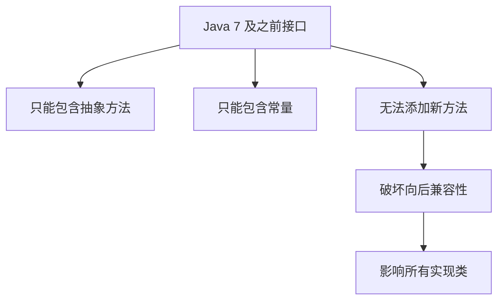

**问题场景**：
- 当需要在接口中添加新方法时，所有实现类都必须实现该方法
- 这导致 API 演进困难，破坏了向后兼容性
- 特别是对于 JDK 自身的集合框架，几乎无法扩展

### 1.3 Java 8 的变革
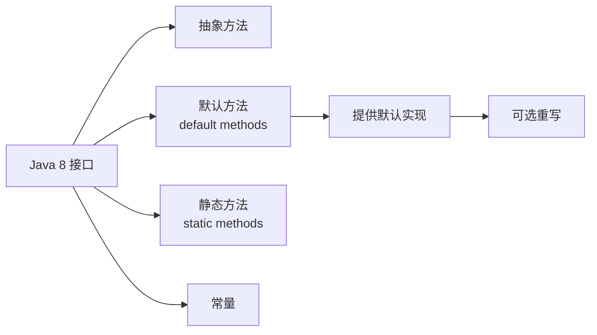
## 2. 语法与定义
### 2.1 基本语法
```java
public interface InterfaceName {
    // 传统抽象方法
    void abstractMethod();
    
    // 默认方法
    default void defaultMethod() {
        // 具体实现
        System.out.println("默认实现");
    }
    
    // 带参数的默认方法
    default String defaultMethodWithParams(String param1, int param2) {
        return param1 + ": " + param2;
    }
    
    // 可以调用其他接口方法
    default void compositeMethod() {
        abstractMethod();  // 调用抽象方法
        defaultMethod();   // 调用其他默认方法
    }
}
```
### 2.2 完整示例
```java
public interface Vehicle {
    // 抽象方法 - 必须由实现类提供
    String getBrand();
    int getMaxSpeed();
    
    // 默认方法 - 提供通用实现
    default void start() {
        System.out.println(getBrand() + " 车辆启动");
    }
    
    default void stop() {
        System.out.println(getBrand() + " 车辆停止");
    }
    
    // 使用抽象方法的默认方法
    default void displayInfo() {
        System.out.println("品牌: " + getBrand());
        System.out.println("最高时速: " + getMaxSpeed() + " km/h");
    }
    
    // 带逻辑的默认方法
    default boolean isFastVehicle() {
        return getMaxSpeed() > 200;
    }
}

// 实现类
public class Car implements Vehicle {
    private String brand;
    private int maxSpeed;
    
    public Car(String brand, int maxSpeed) {
        this.brand = brand;
        this.maxSpeed = maxSpeed;
    }
    
    @Override
    public String getBrand() {
        return brand;
    }
    
    @Override
    public int getMaxSpeed() {
        return maxSpeed;
    }
    
    // 可以选择性重写默认方法
    @Override
    public void start() {
        System.out.println(brand + " 轿车点火启动");
    }
}
```
### 2.3 语法要点表格
| 特性 | 说明 | 示例 |
|------|------|------|
| **关键字** | 使用 `default` 修饰符 | `default void method()` |
| **方法体** | 必须提供完整实现 | `{ // 实现代码 }` |
| **访问修饰符** | 默认 public，不能是 private（Java 8） | `public default void m()` |
| **调用方式** | 通过接口实例调用 | `interfaceRef.defaultMethod()` |
| **重写** | 实现类可选择性重写 | `@Override public void m()` |

## 3. 设计动机与目标
### 3.1 核心设计目标
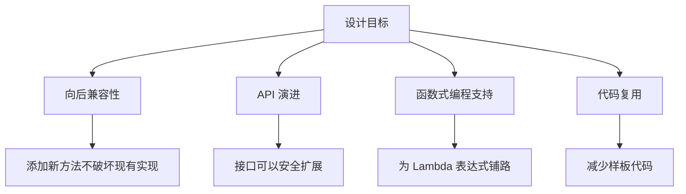

### 3.2 实际动机分析
#### 动机 1：集合框架的 Lambda 支持
Java 8 需要为集合 API 添加 Lambda 和 Stream 支持，但无法修改现有接口结构：
```java
// 如果没有默认方法，需要这样（破坏性）：
public interface Iterable<T> {
    Iterator<T> iterator();
    // 新问题：这个方法会让所有实现类编译失败！
    void forEach(Consumer<? super T> action);
}

// 使用默认方法（兼容性）：
public interface Iterable<T> {
    Iterator<T> iterator();
    
    default void forEach(Consumer<? super T> action) {
        Objects.requireNonNull(action);
        for (T t : this) {
            action.accept(t);
        }
    }
}
```

#### 动机 2：接口演进
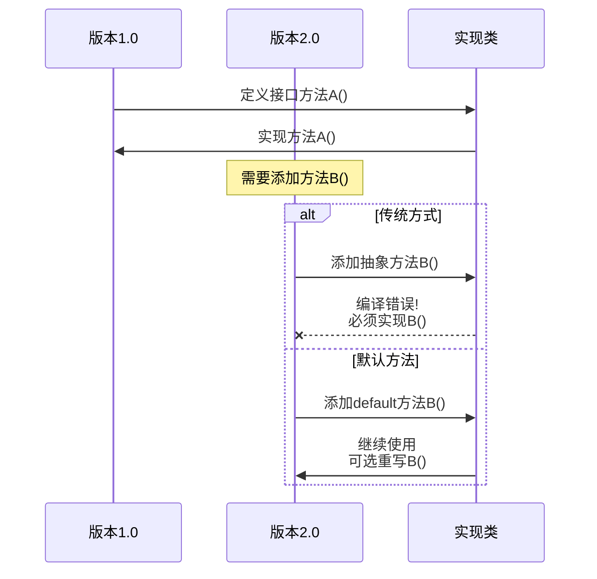


## 4. 核心特性
### 4.1 特性总览
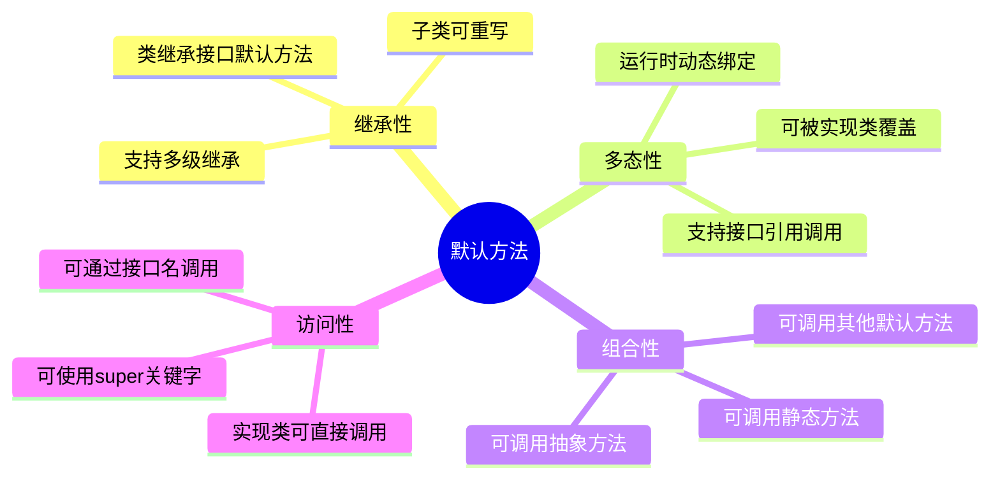

### 4.2 继承与重写规则
```java
// 层级1：基础接口
public interface Animal {
    default void breathe() {
        System.out.println("呼吸空气");
    }
}

// 层级2：扩展接口
public interface Mammal extends Animal {
    // 重写父接口的默认方法
    @Override
    default void breathe() {
        System.out.println("哺乳动物用肺呼吸");
    }
    
    // 新增默认方法
    default void feedMilk() {
        System.out.println("哺乳幼崽");
    }
}

// 层级3：实现类
public class Dog implements Mammal {
    // 继承所有默认方法
    // 可以选择性重写
    @Override
    public void breathe() {
        System.out.println("狗狗呼吸");
    }
    
    // feedMilk() 自动继承
}

// 测试
public class Test {
    public static void main(String[] args) {
        Dog dog = new Dog();
        dog.breathe();   // 输出: 狗狗呼吸
        dog.feedMilk();  // 输出: 哺乳幼崽
        
        Mammal mammal = new Dog();
        mammal.breathe();  // 多态: 狗狗呼吸
    }
}
```

### 4.3 调用默认方法的方式
```java
public interface InterfaceA {
    default void method() {
        System.out.println("InterfaceA");
    }
}

public class MyClass implements InterfaceA {
    
    @Override
    public void method() {
        // 方式1: 直接调用（实际调用的是当前类的实现）
        method();
        
        // 方式2: 使用 super 调用接口的默认方法
        InterfaceA.super.method();  // 输出: InterfaceA
        
        // 方式3: 在构造器或实例方法中通过 this
        this.method();
    }
}
```

### 4.4 默认方法访问权限
```java
public interface MyInterface {
    
    // 默认是 public
    default void method1() { }
    
    // 显式声明 public
    public default void method2() { }
    
    // 错误！default 方法不能是 protected 或 private（Java 8）
    // protected default void method3() { }  // 编译错误
    // private default void method4() { }    // 编译错误
    
    // 注意：Java 9 开始支持 private 默认方法
    // private void helper() { }  // Java 9+
}
```

## 5. 多重继承冲突解决
### 5.1 冲突场景
这是默认方法最复杂也最重要的部分。
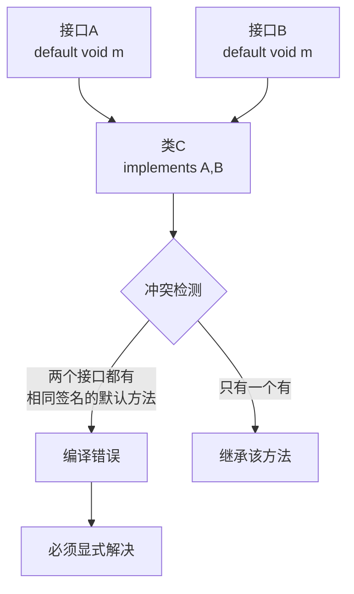

### 5.2 冲突类型与解决方案
#### 类型 1：两个接口提供相同的默认方法
```java
interface InterfaceA {
    default void print() {
        System.out.println("A");
    }
}

interface InterfaceB {
    default void print() {
        System.out.println("B");
    }
}

// 错误示例 - 编译失败
// public class ConflictClass implements InterfaceA, InterfaceB {
//     // 编译错误: 类ConflictClass继承了多个接口的print()方法
// }

// 正确解决方案
public class ResolvedClass implements InterfaceA, InterfaceB {
    
    // 方案1: 重写方法，提供自己的实现
    @Override
    public void print() {
        System.out.println("ResolvedClass");
    }
    
    // 方案2: 选择调用特定接口的默认方法
    @Override
    public void print() {
        InterfaceA.super.print();  // 调用 InterfaceA 的实现
        // 或者
        // InterfaceB.super.print();
    }
    
    // 方案3: 组合两个接口的实现
    @Override
    public void print() {
        InterfaceA.super.print();
        InterfaceB.super.print();
    }
}
```

#### 类型 2：类与接口冲突（类优先原则）
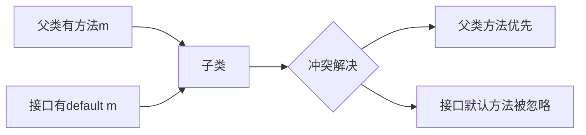

```java
class Parent {
    public void print() {
        System.out.println("Parent");
    }
}

interface MyInterface {
    default void print() {
        System.out.println("Interface");
    }
}

// 类继承的方法优先于接口默认方法
public class Child extends Parent implements MyInterface {
    // 自动继承 Parent 的 print()
    // MyInterface 的默认 print() 被忽略
    
    public static void main(String[] args) {
        new Child().print();  // 输出: Parent
    }
}
```

**类优先原则**（Class Priority Rule）：
- 当类（或父类）提供了具体方法与接口默认方法冲突时
- 类的方法总是优先
- 这是为了保证向后兼容性

#### 类型 3：多重继承链的冲突
```java
interface Base {
    default void method() {
        System.out.println("Base");
    }
}

interface Left extends Base {
    // 继承 Base 的默认方法
    default void leftMethod() {
        System.out.println("Left");
    }
}

interface Right extends Base {
    // 重写 Base 的默认方法
    @Override
    default void method() {
        System.out.println("Right");
    }
}

// 实现类继承 Left 和 Right
public class Impl implements Left, Right {
    // 必须解决冲突，因为 Left 和 Right 都提供了 method()
    // Left 继承自 Base，Right 重写了 Base
    
    @Override
    public void method() {
        // 必须显式选择
        Right.super.method();  // 调用 Right 的实现
    }
}
```

### 5.3 冲突解决规则总结表
| 场景 | 规则 | 结果 | 需要手动解决 |
|------|------|------|-------------|
| 单个接口默认方法 | 直接继承 | 使用接口实现 | 否 |
| 多个接口相同默认方法 | 冲突 | 编译错误 | **是** |
| 类方法与接口默认方法冲突 | 类优先 | 使用类方法 | 否 |
| 父类方法与接口默认方法冲突 | 类优先 | 使用父类方法 | 否 |
| 接口继承链中的重写 | 最具体优先 | 使用子接口实现 | 视情况 |

### 5.4 冲突解决流程图
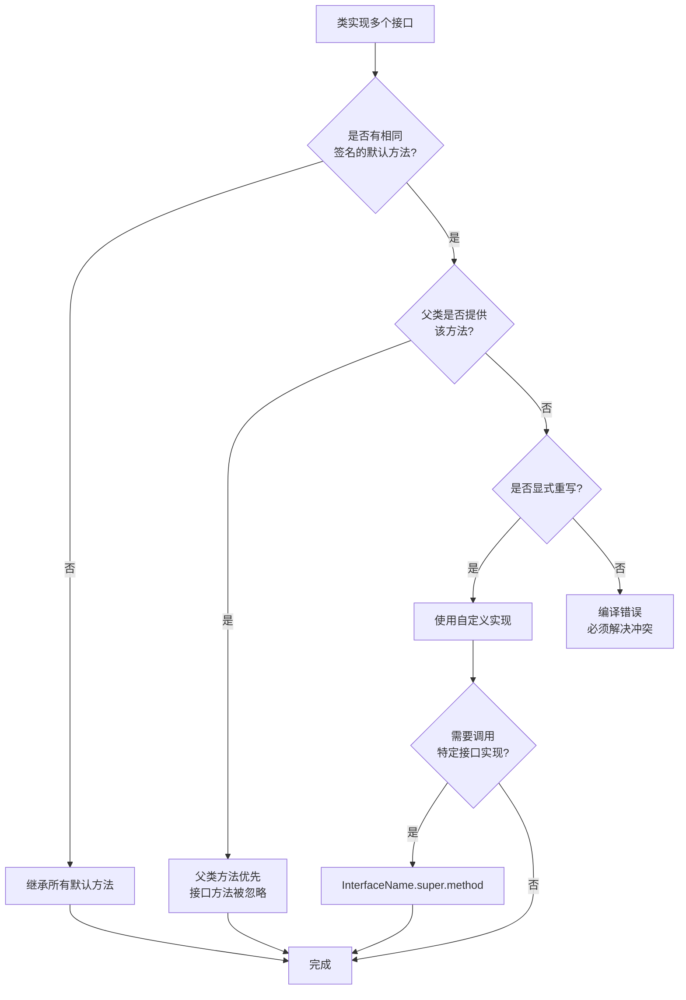


## 6. 默认方法 vs 抽象类
### 6.1 对比表格
| 特性 | 接口默认方法 | 抽象类 |
|------|------------|--------|
| **继承方式** | `implements`（可实现多个） | `extends`（只能继承一个） |
| **状态（字段）** | 只能有 `public static final` 常量 | 可以有实例变量、各种修饰符的字段 |
| **构造器** | 不能有构造器 | 可以有构造器 |
| **访问修饰符** | 默认方法只能是 public（Java 8） | 方法可以有各种访问级别 |
| **方法类型** | 抽象方法、默认方法、静态方法 | 抽象方法、具体方法、final 方法 |
| **多重继承** | 支持实现多个接口 | 不支持多继承 |
| **向后兼容** | 可以添加方法不破坏实现 | 添加抽象方法破坏子类 |
| **设计目的** | 定义能力/行为契约 | 代码复用+部分实现 |
| **性能** | 轻微开销（接口调用） | 直接调用 |

### 6.2 选择指南
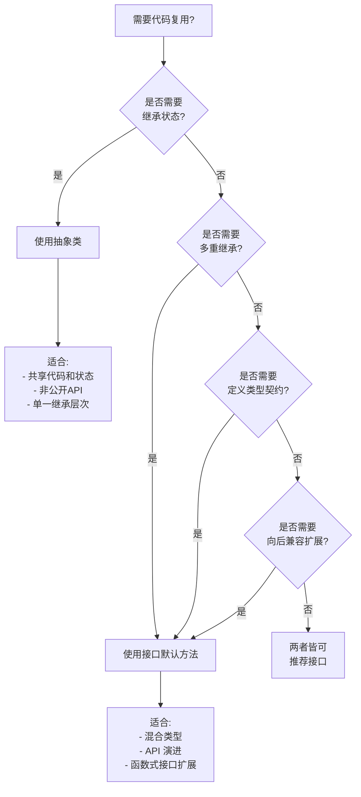

### 6.3 代码对比示例
```java
// 抽象类方式
public abstract class AbstractVehicle {
    // 可以有状态
    protected String brand;
    protected int maxSpeed;
    
    // 构造器
    public AbstractVehicle(String brand, int maxSpeed) {
        this.brand = brand;
        this.maxSpeed = maxSpeed;
    }
    
    // 抽象方法
    public abstract void start();
    
    // 具体方法
    public void displayInfo() {
        System.out.println(brand + " - " + maxSpeed);
    }
    
    // final 方法，不可重写
    public final void refuel() {
        System.out.println("加油");
    }
}

// 接口默认方法方式
public interface Vehicle {
    // 只能有常量
    int MAX_WHEELS = 4;
    
    // 抽象方法
    String getBrand();
    int getMaxSpeed();
    void start();
    
    // 默认方法
    default void displayInfo() {
        System.out.println(getBrand() + " - " + getMaxSpeed());
    }
    
    default void stop() {
        System.out.println(getBrand() + " 停止");
    }
    
    // 静态方法（Java 8）
    static boolean isElectric(String type) {
        return "electric".equals(type);
    }
}

// 实现对比
public class Car extends AbstractVehicle {  // 只能继承一个类
    public Car() {
        super("Toyota", 200);
    }
    
    @Override
    public void start() {
        System.out.println("汽车启动");
    }
}

public class ElectricCar implements Vehicle, Drivable, Chargeable {  // 可以实现多个接口
    private String brand = "Tesla";
    private int maxSpeed = 250;
    
    @Override
    public String getBrand() { return brand; }
    
    @Override
    public int getMaxSpeed() { return maxSpeed; }
    
    @Override
    public void start() {
        System.out.println("电动车静音启动");
    }
}
```


## 7. 使用场景与最佳实践

### 7.1 适用场景

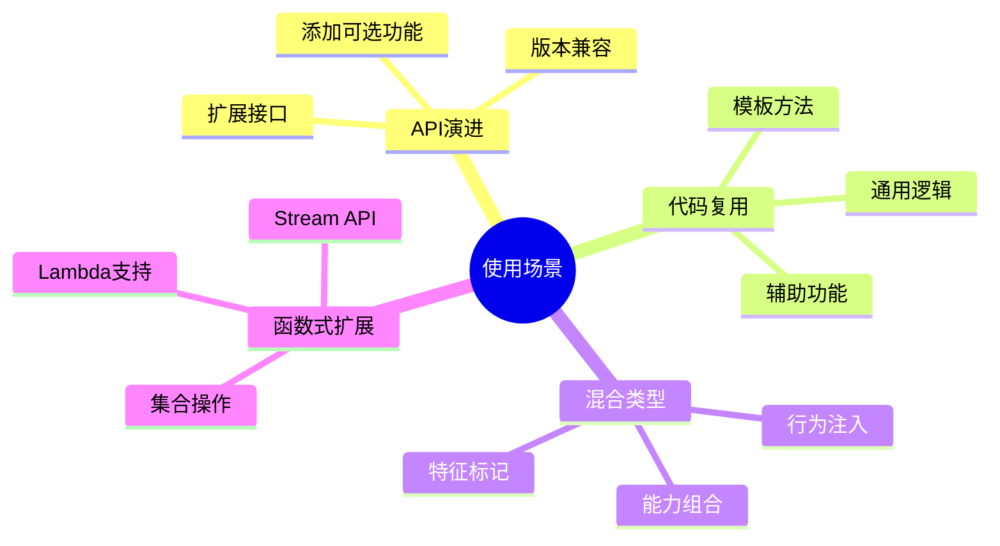

### 7.2 最佳实践

#### ✅ 推荐做法

```java
// 1. 为接口方法提供合理的默认实现
public interface Repository<T, ID> {
    T save(T entity);
    Optional<T> findById(ID id);
    
    // 默认实现：基于 findById 和 save
    default T update(T entity) {
        return save(entity);
    }
    
    // 默认实现：提供通用逻辑
    default boolean existsById(ID id) {
        return findById(id).isPresent();
    }
}

// 2. 使用默认方法实现模板方法模式
public interface Processor {
    // 抽象方法 - 子类必须实现
    String processInternal(String input);
    
    // 默认方法 - 模板方法
    default String process(String input) {
        if (input == null) {
            throw new IllegalArgumentException("输入不能为空");
        }
        String result = processInternal(input);
        log(input, result);
        return result;
    }
    
    // 默认方法 - 日志
    default void log(String input, String output) {
        System.out.println("Processed: " + input + " -> " + output);
    }
}

// 3. 使用默认方法提供便利方法
public interface Collection<E> extends Iterable<E> {
    // ... 其他方法
    
    default boolean removeIf(Predicate<? super E> filter) {
        Objects.requireNonNull(filter);
        boolean removed = false;
        Iterator<E> each = iterator();
        while (each.hasNext()) {
            if (filter.test(each.next())) {
                each.remove();
                removed = true;
            }
        }
        return removed;
    }
}

// 4. 组合多个接口
public interface Flyable {
    default void fly() {
        System.out.println("Flying");
    }
}

public interface Swimmable {
    default void swim() {
        System.out.println("Swimming");
    }
}

public class Duck implements Flyable, Swimmable {
    // 自动拥有 fly() 和 swim() 方法
}
```

#### ❌ 避免的做法

```java
// 1. 避免在默认方法中维护状态
public interface BadExample {
    // 不推荐：接口不应该有可变状态
    // default void increment() { count++; }  // 错误思路
}

// 2. 避免过度复杂的默认方法
public interface ComplexDefault {
    // 不推荐：默认方法过于复杂
    default void complexMethod() {
        // 100行代码...
        // 应该提取到工具类或抽象类
    }
}

// 3. 避免依赖实现细节
public interface LeakyAbstract {
    default void method() {
        // 不推荐：假设实现类有特定字段
        // if (this instanceof SomeClass) { ... }
    }
}

// 4. 避免破坏 Liskov 替换原则
public interface BadContract {
    default List<String> getItems() {
        // 返回可变列表，破坏封装
        return new ArrayList<>();
    }
}
```

### 7.3 设计原则

| 原则 | 说明 | 示例 |
|------|------|------|
| **单一职责** | 默认方法应该专注于一个功能 | 不要在默认方法中做太多事 |
| **向后兼容** | 默认实现不应破坏现有行为 | 提供保守的默认行为 |
| **文档完整** | 明确说明默认行为 | 使用 Javadoc 详细说明 |
| **可测试性** | 默认方法应该易于测试 | 避免副作用和外部依赖 |
| **性能考虑** | 注意默认方法的性能影响 | 避免在循环中调用昂贵操作 |


## 8. 实际案例分析
### 8.1 案例 1：排序增强
```java
// Java 8 之前
public class Person {
    private String name;
    private int age;
    
    // 需要实现 Comparable 或提供 Comparator
}

// 使用场景：按多个字段排序
List<Person> people = getPeople();

// Java 8 之前：繁琐
Collections.sort(people, new Comparator<Person>() {
    @Override
    public int compare(Person p1, Person p2) {
        int cmp = p1.getName().compareTo(p2.getName());
        if (cmp != 0) return cmp;
        return Integer.compare(p1.getAge(), p2.getAge());
    }
});

// Java 8 之后：利用 Comparator 的默认方法
Collections.sort(people, 
    Comparator.comparing(Person::getName)
              .thenComparingInt(Person::getAge)
);

// Comparator 接口中的默认方法示例
public interface Comparator<T> {
    int compare(T o1, T o2);
    
    default Comparator<T> thenComparing(Comparator<? super T> other) {
        Objects.requireNonNull(other);
        return (Comparator<T> & Serializable) (c1, c2) -> {
            int res = compare(c1, c2);
            return (res != 0) ? res : other.compare(c1, c2);
        };
    }
    
    default Comparator<T> reversed() {
        return Collections.reverseOrder(this);
    }
}
```

### 8.2 案例 2：Builder 模式增强
```java
public interface Builder<T> {
    T build();
    
    // 默认方法：验证并构建
    default T buildValidated() {
        validate();
        return build();
    }
    
    // 默认方法：验证逻辑
    default void validate() {
        // 通用验证逻辑
    }
    
    // 默认方法：构建多个
    default List<T> buildAll(Collection<Builder<T>> builders) {
        return builders.stream()
                      .map(Builder::build)
                      .collect(Collectors.toList());
    }
}

// 使用
public class UserBuilder implements Builder<User> {
    private String name;
    private String email;
    
    public UserBuilder name(String name) {
        this.name = name;
        return this;
    }
    
    public UserBuilder email(String email) {
        this.email = email;
        return this;
    }
    
    @Override
    public User build() {
        return new User(name, email);
    }
    
    @Override
    public void validate() {
        if (name == null || name.isEmpty()) {
            throw new IllegalStateException("Name is required");
        }
        if (email == null || !email.contains("@")) {
            throw new IllegalStateException("Valid email required");
        }
    }
}

// 使用默认方法
User user = new UserBuilder()
    .name("Alice")
    .email("alice@example.com")
    .buildValidated();  // 自动验证
```

### 8.3 案例 3：插件架构
```java
public interface Plugin {
    String getName();
    void initialize();
    void execute();
    void shutdown();
    
    // 默认方法：生命周期管理
    default void start() {
        initialize();
        System.out.println(getName() + " started");
    }
    
    default void stop() {
        System.out.println(getName() + " stopping");
        shutdown();
    }
    
    // 默认方法：健康检查
    default boolean isHealthy() {
        return true;
    }
    
    // 默认方法：获取版本
    default String getVersion() {
        return "1.0.0";
    }
    
    // 默认方法：配置
    default void configure(Map<String, String> config) {
        // 默认空实现，可选重写
    }
}

// 插件实现只需要关注核心逻辑
public class LoggingPlugin implements Plugin {
    @Override
    public String getName() {
        return "LoggingPlugin";
    }
    
    @Override
    public void initialize() {
        // 初始化日志系统
    }
    
    @Override
    public void execute() {
        // 执行日志记录
    }
    
    @Override
    public void shutdown() {
        // 清理资源
    }
    
    // 选择性重写默认方法
    @Override
    public String getVersion() {
        return "2.0.0";
    }
}
```


## 9. JDK 8 中的经典应用
### 9.1 Iterable.forEach
```java
// java.lang.Iterable
public interface Iterable<T> {
    Iterator<T> iterator();
    
    // 默认方法：支持 Lambda 遍历
    default void forEach(Consumer<? super T> action) {
        Objects.requireNonNull(action);
        for (T t : this) {
            action.accept(t);
        }
    }
    
    // 默认方法：创建 Spliterator
    default Spliterator<T> spliterator() {
        return Spliterators.spliteratorUnknownSize(iterator(), 0);
    }
}

// 使用
List<String> list = Arrays.asList("a", "b", "c");
list.forEach(System.out::println);  // 利用默认方法
```

### 9.2 Collection.removeIf

```java
public interface Collection<E> extends Iterable<E> {
    // ... 其他方法
    
    // 默认方法：根据条件删除
    default boolean removeIf(Predicate<? super E> filter) {
        Objects.requireNonNull(filter);
        boolean removed = false;
        Iterator<E> each = iterator();
        while (each.hasNext()) {
            if (filter.test(each.next())) {
                each.remove();
                removed = true;
            }
        }
        return removed;
    }
}

// 使用
List<Integer> numbers = new ArrayList<>(Arrays.asList(1, 2, 3, 4, 5));
numbers.removeIf(n -> n % 2 == 0);  // 删除偶数
System.out.println(numbers);  // [1, 3, 5]
```

### 9.3 Map 的默认方法
```java
public interface Map<K,V> {
    // ... 传统方法
    
    // 默认方法：获取或默认
    default V getOrDefault(Object key, V defaultValue) {
        V v;
        return (((v = get(key)) != null) || containsKey(key))
            ? v
            : defaultValue;
    }
    
    // 默认方法：forEach
    default void forEach(BiConsumer<? super K, ? super V> action) {
        Objects.requireNonNull(action);
        for (Map.Entry<K, V> entry : entrySet()) {
            K k;
            V v;
            try {
                k = entry.getKey();
                v = entry.getValue();
            } catch(IllegalStateException ise) {
                throw new ConcurrentModificationException(ise);
            }
            action.accept(k, v);
        }
    }
    
    // 默认方法：替换值
    default boolean replace(K key, V oldValue, V newValue) {
        Objects.requireNonNull(oldValue);
        Objects.requireNonNull(newValue);
        V v = get(key);
        if (Objects.equals(v, oldValue)) {
            put(key, newValue);
            return true;
        }
        return false;
    }
    
    // 默认方法：computeIfAbsent
    default V computeIfAbsent(K key, Function<? super K, ? extends V> mappingFunction) {
        Objects.requireNonNull(mappingFunction);
        V v;
        if ((v = get(key)) == null) {
            V newValue;
            if ((newValue = mappingFunction.apply(key)) != null) {
                put(key, newValue);
                return newValue;
            }
        }
        return v;
    }
}

// 使用示例
Map<String, List<String>> map = new HashMap<>();

// 传统方式
if (!map.containsKey("key")) {
    map.put("key", new ArrayList<>());
}
map.get("key").add("value");

// 使用默认方法
map.computeIfAbsent("key", k -> new ArrayList<>()).add("value");
```

### 9.4 Comparator 的完整示例
```java
public interface Comparator<T> {
    int compare(T o1, T o2);
    
    // 静态方法：自然顺序
    static <T extends Comparable<? super T>> Comparator<T> naturalOrder() {
        return (Comparator<T>) Comparable::compareTo;
    }
    
    // 静态方法：反转顺序
    static <T extends Comparable<? super T>> Comparator<T> reverseOrder() {
        return Collections.reverseOrder();
    }
    
    // 默认方法：链式比较
    default Comparator<T> thenComparing(Comparator<? super T> other) {
        Objects.requireNonNull(other);
        return (Comparator<T> & Serializable) (c1, c2) -> {
            int res = compare(c1, c2);
            return (res != 0) ? res : other.compare(c1, c2);
        };
    }
    
    default <U> Comparator<T> thenComparing(
            Function<? super T, ? extends U> keyExtractor,
            Comparator<? super U> keyComparator) {
        Objects.requireNonNull(keyExtractor);
        Objects.requireNonNull(keyComparator);
        return thenComparing(comparing(keyExtractor, keyComparator));
    }
    
    // 默认方法：反转
    default Comparator<T> reversed() {
        return Collections.reverseOrder(this);
    }
}

// 实际应用
class Person {
    String name;
    int age;
    String city;
}

List<Person> people = getPeople();

// 多字段排序
people.sort(Comparator.comparing((Person p) -> p.city)
                      .thenComparingInt(p -> p.age)
                      .thenComparing(p -> p.name)
                      .reversed());
```


## 10. 注意事项与限制
### 10.1 技术限制
```java
public interface MyInterface {
    
    // ❌ 不能重写 Object 类的方法
    // default String toString() {  // 编译错误
    //     return "test";
    // }
    
    // ❌ 不能声明为 final
    // default final void method() { }  // 编译错误
    
    // ❌ 不能是 synchronized
    // default synchronized void method() { }  // 编译错误
    
    // ✅ Java 9 开始支持 private 默认方法
    // private void helper() { }  // Java 9+
    
    // ✅ 可以是 static
    static void staticMethod() {
        // 静态方法
    }
}
```

### 10.2 序列化注意事项

```java
public interface SerializableInterface extends Serializable {
    
    // 默认方法会被继承
    default void method() {
        // 实现
    }
}

// 注意：实现类序列化时，默认方法的行为依赖于接口定义
// 如果接口改变，反序列化可能有问题
```

### 10.3 性能考虑

```java
// 默认方法有轻微的性能开销（接口调用 vs 类调用）
// 但在现代 JVM 上，这种差异通常可以忽略

public interface PerformanceTest {
    // 默认方法调用
    default void defaultMethod() {
        // 实现
    }
}

// 性能测试表明：
// - 首次调用：接口默认方法稍慢（~5-10%）
// - JIT 优化后：差异几乎消失
// - 不应成为选择默认方法的主要考虑因素
```

### 10.4 版本兼容性

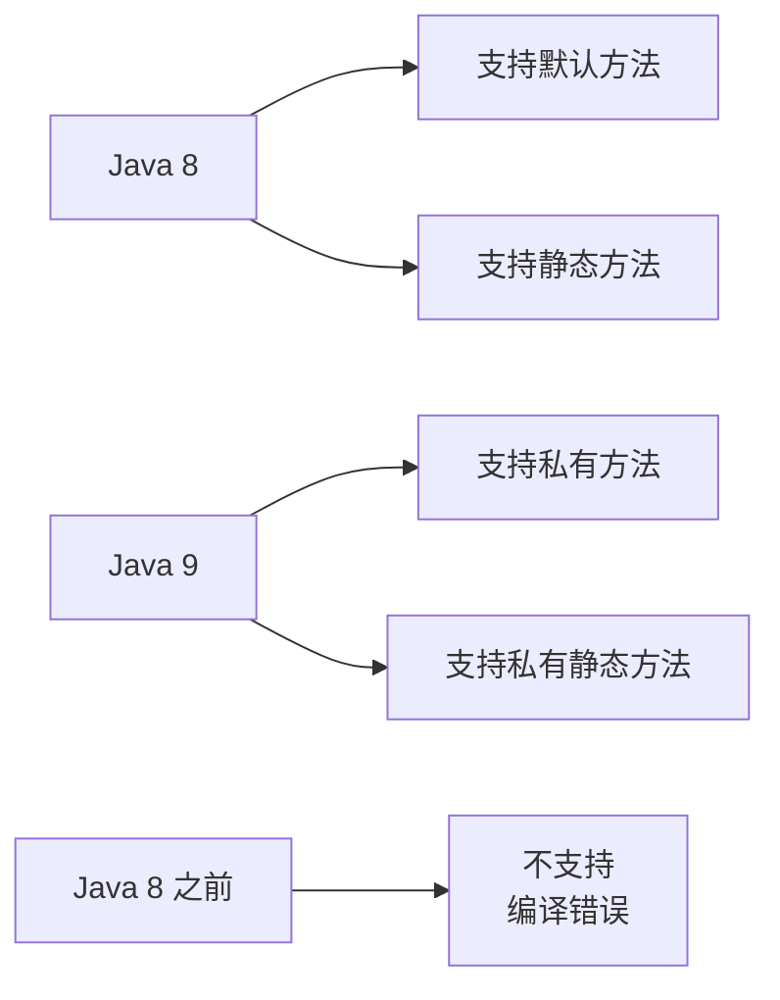

**兼容性矩阵**：

| Java 版本 | 默认方法 | 接口静态方法 | 接口私有方法 |
|-----------|---------|------------|------------|
| Java 7 及以下 | ❌ | ❌ | ❌ |
| Java 8 | ✅ | ✅ | ❌ |
| Java 9+ | ✅ | ✅ | ✅ |

### 10.5 常见陷阱

```java
// 陷阱 1：默认方法中的 null 检查
public interface SafeInterface {
    default String process(String input) {
        // 应该检查 null
        Objects.requireNonNull(input, "输入不能为空");
        return input.toUpperCase();
    }
}

// 陷阱 2：循环依赖
public interface A {
    default void method1() {
        method2();  // 调用 B 的方法
    }
}

public interface B extends A {
    default void method2() {
        method1();  // 调用 A 的方法 - 可能导致 StackOverflowError
    }
}

// 陷阱 3：可变状态
public interface Stateful {
    // 不推荐：在默认方法中修改外部状态
    // default void increment(AtomicInteger counter) {
    //     counter.incrementAndGet();
    // }
}

// 陷阱 4：异常处理
public interface ExceptionHandling {
    default void riskyOperation() {
        try {
            // 可能抛出异常的代码
        } catch (Exception e) {
            // 应该记录或重新抛出
            throw new RuntimeException(e);
        }
    }
}
```


## 11. 常见问题 FAQ
### Q1: 默认方法可以被实现类设为 final 吗？
**A**: 可以。实现类可以将继承的默认方法声明为 final，防止进一步重写。
```java
interface MyInterface {
    default void method() { }
}

class MyClass implements MyInterface {
    @Override
    public final void method() {
        // final，子类不能重写
    }
}
```

### Q2: 默认方法可以访问实现类的私有字段吗？

**A**: 不能直接访问，但可以通过抽象方法间接访问。

```java
interface MyInterface {
    default void print() {
        // 不能直接访问 value
        // System.out.println(value);  // 编译错误
        
        // 但可以通过抽象方法
        System.out.println(getValue());
    }
    
    String getValue();  // 抽象方法
}
```

### Q3: 抽象类可以实现接口的默认方法吗？
**A**: 可以，抽象类可以选择实现或不实现默认方法。
```java
interface MyInterface {
    default void method() { }
}

abstract class MyAbstractClass implements MyInterface {
    // 可以继承默认方法
    // 也可以重写
    @Override
    public void method() {
        // 自定义实现
    }
}
```

### Q4: 默认方法会影响接口的函数式特性吗？

**A**: 不会。只要接口只有一个抽象方法，仍然是函数式接口。

```java
@FunctionalInterface
interface MyFunctionalInterface {
    void abstractMethod();  // 唯一的抽象方法
    
    default void defaultMethod() { }  // 不影响
    static void staticMethod() { }    // 不影响
}

// 可以使用 Lambda
MyFunctionalInterface f = () -> System.out.println("Lambda");
```

### Q5: 如何在默认方法中调用实现类的特定方法？

**A**: 通过抽象方法或类型转换（不推荐）。

```java
interface MyInterface {
    default void method() {
        // 方式1：通过抽象方法（推荐）
        specificMethod();
        
        // 方式2：类型转换（不推荐）
        if (this instanceof MyClass) {
            ((MyClass) this).specificMethod();
        }
    }
    
    void specificMethod();  // 抽象方法
}
```

### Q6: 默认方法可以被重载吗？
**A**: 可以，像普通方法一样支持重载。
```java
interface MyInterface {
    default void method() { }
    default void method(String param) { }  // 重载
    default void method(int param) { }     // 重载
}
```

### Q7: 接口可以继承另一个接口的默认方法并修改其行为吗？
**A**: 可以，子接口可以重写父接口的默认方法。
```java
interface Parent {
    default void method() {
        System.out.println("Parent");
    }
}

interface Child extends Parent {
    @Override
    default void method() {
        System.out.println("Child");
        Parent.super.method();  // 可选：调用父接口实现
    }
}
```

## 总结
### 核心要点回顾
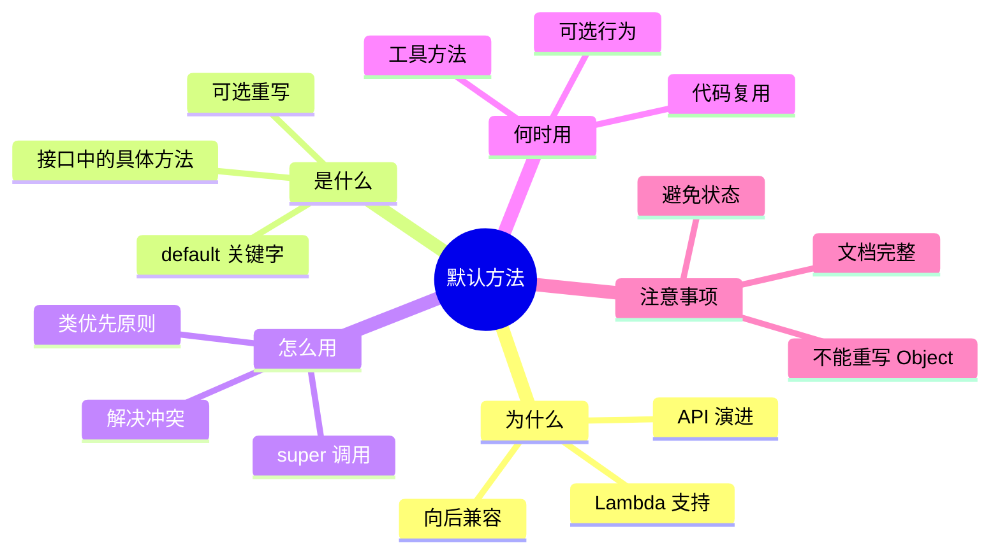