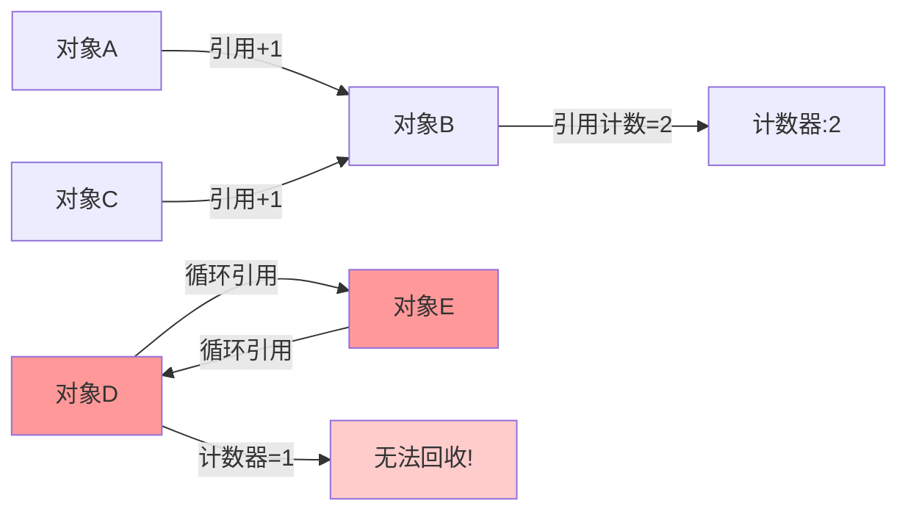
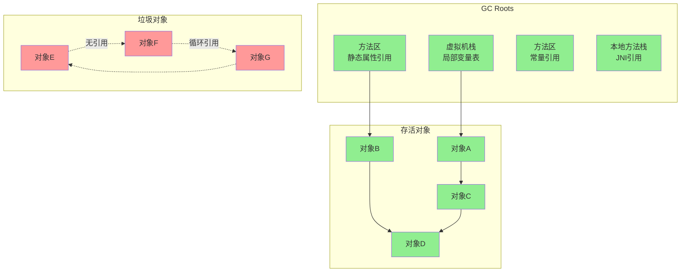
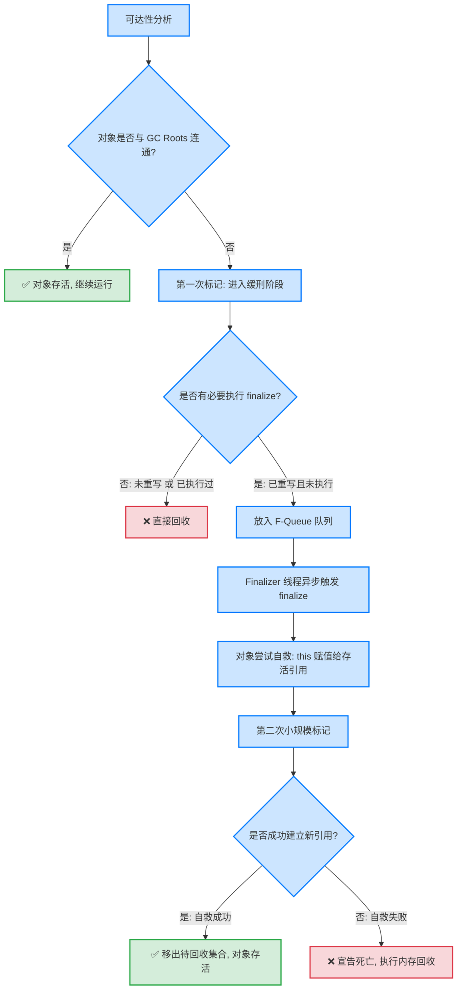
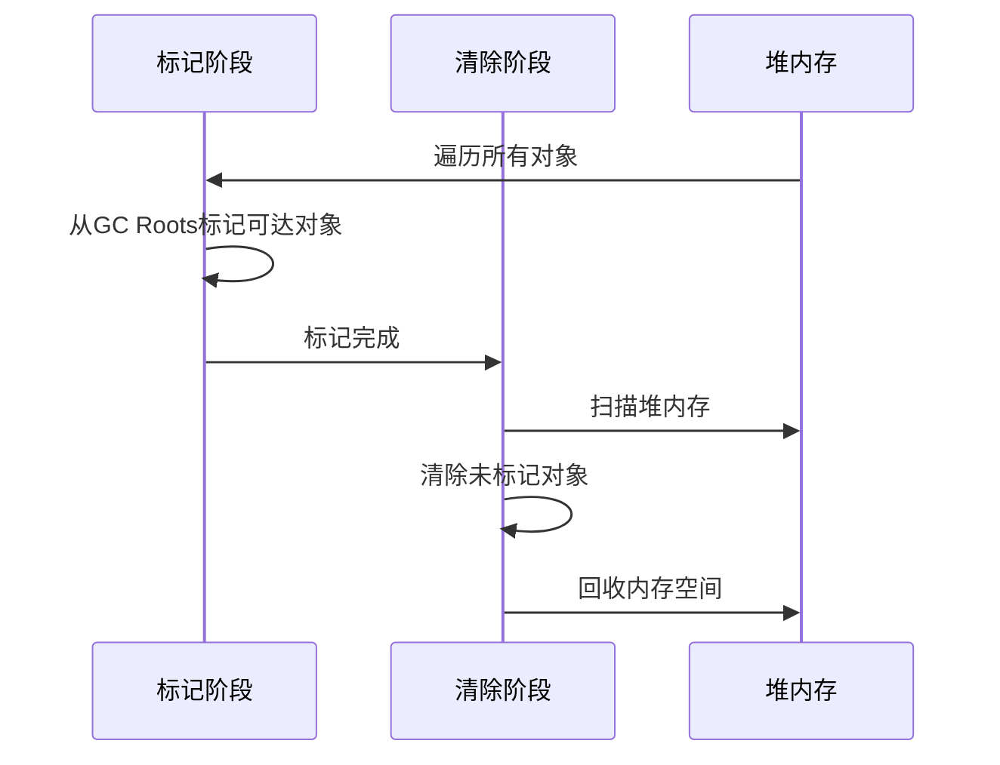
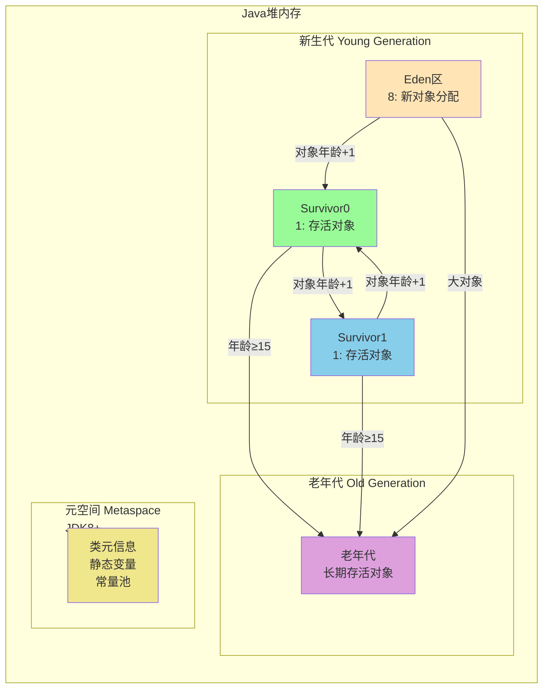
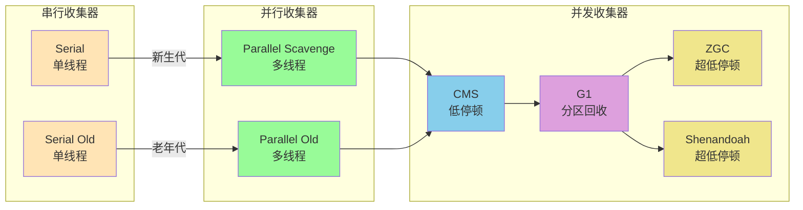

# 垃圾收集器与内存分配策略

[toc]

垃圾收集器所关注的是`Java堆`和`方法区`内存该如何管理，线程独有的(`程序计数器`，`虚拟机栈`，`本地方法栈`)当方法结束或者线程结束时，内存自然就跟随着回收了

# 1.如何判断对象已死？判断对象是否存活的算法
## 1.1.引用计数算法：
> 在对象中添加一个引用计数器，每当有一个地方引用它时，计数器值就加一；
> 当引用失效时，计数器值就减一；
> 任何时刻计数器为零的对象就是不可能再被使用的。

+ **优点**：原理简单，判定效率也很高
+ **缺点**：很多例外情况要考虑，必须要配合大量额外处理才能保证正确地工作，譬如很难解决对象之间相互循环引用的问题

> **结论**：主流 Java 虚拟机**不采用**此算法

## 1.2.可达性分析算法
> 基本思路就是通过一系列称为“GC Roots”的根对象作为起始节点集，
> 从这些节点开始，根据引用关系向下搜索，搜索过程所走过的路径称为“引用链”（Reference Chain），
> 如果某个对象到GC Roots间没有任何引用链相连，或者用图论的话来说就是从GC Roots到这个对象不可达时，则证明此对象是不可能再被使用的

在Java技术体系里面，固定可作为GC Roots的对象包括以下几种：
1. 在`虚拟机栈（栈帧中的本地变量表）中引用的对象`，譬如各个线程被调用的方法堆栈中使用到的 参数、局部变量、临时变量等。
2. 在`方法区中类静态属性引用的对象`，譬如Java类的引用类型静态变量。
3. 在`方法区中常量引用的对象`，譬如字符串常量池（String Table）里的引用。
4. 在`本地方法栈中JNI（即通常所说的Native方法）引用的对象`。
5. `Java虚拟机内部的引用`，如基本数据类型对应的Class对象，一些常驻的异常对象（比如NullPointExcepiton、OutOfMemoryError）等，还有系统类加载器。
6. 所有被`同步锁（synchronized关键字）持有的对象`。
7. 反映`Java虚拟机内部情况的JMXBean、JVMTI中注册的回调、本地代码缓存`等。

### 1.2.1.生存还是死亡?
在可达性分析算法中，要真正宣告一个对象死亡，至少要经历`两`次标记过程:

> **现代 Java 提示**：`finalize()` 机制因性能不可控、易引发内存泄漏等问题，已在 Java 9 标记为 `@Deprecated`，Java 14 起正式废弃，推荐使用 `java.lang.ref.Cleaner` 或 `PhantomReference` 替代。

## 1.3.关于引用
在JDK 1.2版之后，Java对引用的概念进行了扩充(这4种引用强度依次逐渐减弱):
1. 引用分为强引用（Strongly Re-ference）
   
   > 是指在程序代码之中普遍存在的引用赋值，即类似“Object obj = new Object()”这种引用关系
2. 软引用（Soft Reference）
   
   > 用来描述一些还有用，但非必须的对象，在JDK 1.2版之后提供了`SoftReference`类来实现软引用
3. 弱引用（Weak Reference）
   
   > 用来描述那些非必须对象，在JDK 1.2版之后提供了`WeakReference`类来实现弱引用
4. 虚引用（Phantom Reference）
   > 也称为“幽灵引用”或者“幻影引用”，它是最弱的一种引用关系
   > 唯一目的只是为了能在这个对象被收集器回收时收到一个系统通知
   > 在JDK 1.2版之后提供了PhantomReference类来实现虚引用

# 2.垃圾收集算法  

主要有4类算法，如下：

1. 标记-清除算法（Mark-Sweep）
2. 标记-复制算法（Mark-Copy）
3. 标记-整理算法（Mark-Compact）
4. 分代收集算法（Generational Collection）

## 2.1.标记-清除算法（Mark-Sweep）

算法分为“标记”和“清除”两个阶段

---

---

| 优点                   | 缺点                 |
| ---------------------- | -------------------- |
| 实现简单               | **内存碎片**问题严重 |
| 适合对象存活率高的场景 | 效率较低,不稳定      |
| 不需要移动对象         | 需要遍历整个堆       |

## 2.2.标记-复制算法（Mark-Copy）

将可用内存按容量划分为大小相等的两块，每次只使用其中的一块。当这一块的内存用完了，就将还存活着的对象复制到另外一块上面，然后再把已使用过的内存空间一次清理掉。

---

---

| 优点                       | 缺点                    |
| -------------------------- | ----------------------- |
| **无内存碎片**             | 内存利用率低（只有50%） |
| 实现简单，效率高           | 对象存活率高时效率低    |
| 适合对象**死亡率高的场景** | 需要额外的内存空间      |

> **实际优化**：HotSpot虚拟机将内存分为更大的Eden区和两个较小的Survivor区（8:1:1），这样内存利用率提高到90%。

## 2.3.标记-整理算法（Mark-Compact）

标记过程仍然与"标记-清除"算法一样，但后续步骤不是直接对可回收对象进行清理，而是让所有存活的对象都向一端移动，然后直接清理掉端边界以外的内存。

| 优点                       | 缺点                 |
| -------------------------- | -------------------- |
| **无内存碎片**             | 需要移动对象，成本高 |
| 内存利用率高               | 需要维护引用关系     |
| 适合对象**存活率高的场景** | 暂停时间较长         |

## 2.4.分代收集算法（Generational Collection）

**理论基础**

+ 弱分代假说：绝大多数对象都是朝生夕灭的
+ 强分代假说：熬过越多次垃圾收集过程的对象就越难以消亡
+ 跨代引用假说：跨代引用相对于同代引用来说仅占极少数

**对象晋升老年代的条件**

1. **年龄阈值**：对象年龄达到设定值（默认15，可通过`-XX:MaxTenuringThreshold`调整）
2. **大对象直接进入**：大对象（如长字符串、大数组）直接进入老年代
3. **动态年龄判定**：Survivor空间中相同年龄所有对象大小的总和大于Survivor空间的一半
4. **空间分配担保**：老年代空间不足时，新生代对象提前晋升

---

**总结对比**

| 算法      | 执行阶段                                   | 优点                                | 缺点                                       | 适用代          |
| :-------- | ------------------------------------------ | :---------------------------------- | :----------------------------------------- | :-------------- |
| 标记-清除 | 标记存活  → 清除死亡                   | 实现简单， 无需移动对象         | 内存碎片化， 分配效率低                | Old Gen（历史） |
| 标记-复制 | 标记存活  → 复制到空闲区               | 无碎片， 分配极快（指针碰撞）   | 内存利用率 ≤ 50%                           | Young Gen       |
| 标记-整理 | 标记存活  → 向一端移动  → 清理边界 | 无碎片， 内存利用率高           | 移动对象成本高， STW 长                | Old Gen         |
| 分代收集  | Young 用复制， Old 用整理/并发         | 综合性能最优， 贴合对象生命周期 | 需维护代间引用 （卡表/Remembered Set） | 全堆            |

# 3.垃圾收集器详解

并行（Parallel）：

> 是多条垃圾收集器线程之间的关系，说明同一时间有多条这样的线程在协同工作，通常默认此时用户线程是处于等待状态。 

并发（Concurrent）：

> 是垃圾收集器线程与用户线程之间的关系，说明同一时间垃圾收集器线程与用户线程都在运行。由于用户线程并未被冻结，所以程序仍然能响应服务请求，但由于垃圾收集器线程占用了一部分系统资源，此时应用程序的处理的吞吐量将受到一定影响。

## 3.1. 经典组合（JDK 8 及之前主流）

| 收集器                         | 适用区域 | 线程模型           | 算法      | 特点                                                        |
| ------------------------------ | -------- | ------------------ | --------- | ----------------------------------------------------------- |
| `Serial`                       | 新生代   | 单线程 STW         | 复制      | 简单高效，客户端/单核首选                                   |
| `ParNew`                       | 新生代   | 多线程 STW         | 复制      | Serial 的多线程版，常与 CMS 搭配                            |
| `Parallel Scavenge`            | 新生代   | 多线程 STW         | 复制      | **吞吐量优先**，适合后台批处理                              |
| `Serial Old`                   | 老年代   | 单线程 STW         | 标记-整理 | 单核环境/Minor GC 失败时的 fallback                         |
| `Parallel Old`                 | 老年代   | 多线程 STW         | 标记-整理 | 与 Parallel Scavenge 搭配，追求吞吐                         |
| `CMS`（Concurrent Mark Sweep） | 老年代   | 多线程并发+部分STW | 标记-清除 | **低停顿优先**，但碎片多、CPU敏感、JDK 9 废弃 / JDK 14 移除 |

## 3.2. 现代收集器（JDK 9 至今）

| 收集器                | 首次生产                    | 核心设计                                             | 停顿表现                             | 适用场景                             |
| --------------------- | --------------------------- | ---------------------------------------------------- | ------------------------------------ | ------------------------------------ |
| `G1`（Garbage-First） | JDK 9 默认                  | Region 划分、可预测停顿、Mixed GC                    | 停顿可控（默认 200ms 内）            | 大堆（>4G）、服务端通用首选          |
| `ZGC`                 | JDK 15 生产 / JDK 21 分代版 | 染色指针→读屏障+对象头元数据、全并发标记/整理/重定位 | **< 1ms**，支持 TB 级堆              | 超低延迟、内存密集型、云原生         |
| `Shenandoah`          | JDK 12 实验 / JDK 15+ 成熟  | Brooks 转发指针、并发整理、SATB 屏障                 | **< 1ms**，与 ZGC 理念相似但实现不同 | Red Hat 生态、替代 ZGC 的选项        |
| `Epsilon`             | JDK 11                      | 仅分配不回收                                         | 无 GC                                | 性能压测、短生命周期任务、容器化探针 |

> 📌 **关键演进脉络**：
> `STW单线程` → `STW多线程` → `并发标记` → `全并发整理` → `分代回归（ZGC/Shenandoah）`
> 收集器设计目标从“能跑”转向“**停顿可预测、吞吐量不衰减、内存可弹性**”。