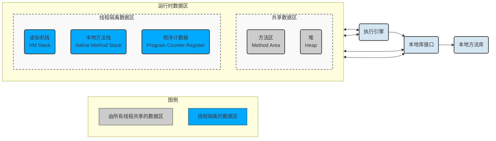
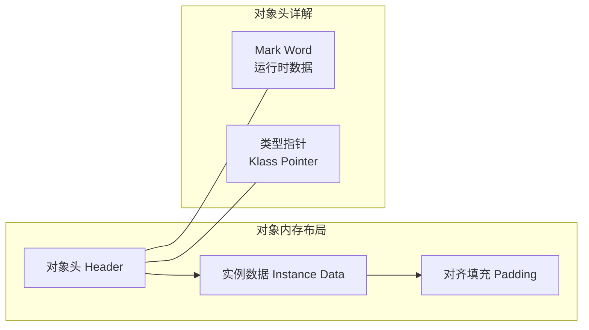

# Java内存区域

# 1.五大运行时数据区域

Java虚拟机所管理的内存将会包括以下5个运行时数据区域:



## 1.1.程序计数器(非线程共享)

程序计数器（Program Counter Register）工作原理：JVM 的多线程通过线程切换实现。切换后，JVM 需要知道从哪里继续执行，程序计数器就是每条线程的“执行进度条”。它是程序控制流的指示器，分支、循环、跳转、异常处
理、线程恢复等基础功能。


| 属性     | 说明                                                                   |
| -------- | ---------------------------------------------------------------------- |
| 作用     | 记录当前线程正在执行的字节码指令地址（行号/偏移量）                    |
| 生命周期 | 线程创建时分配，线程结束时释放                                         |
| 线程安全 | ✅ 绝对线程安全（Java 虚拟机规范唯一没有规定`OutOfMemoryError`的区域） |
| 特殊状态 | 若当前执行 Native 方法，计数器值为`undefined`                          |
| JVM 参数 | 无（大小由虚拟机内部决定，通常仅几十字节）                             |

## 1.2.Java虚拟机栈(非线程共享)

Java虚拟机栈（Java Virtual Machine Stack）是 Java 方法执行的内存模型。每个方法在执行时都会创建一个栈帧（Stack Frame）


| 属性     | 说明                                                                                                                           |
| -------- | ------------------------------------------------------------------------------------------------------------------------------ |
| 作用     | 存储局部变量表、操作数栈、动态连接、方法出口等信息                                                                             |
| 异常类型 | `StackOverflowError`（递归过深/栈帧过大）<br/>`OutOfMemoryError`（栈动态扩展失败，如申请不到连续内存）                         |
| JVM 参数 | `-Xss<size>`（默认：Linux 64位通常 1MB）                                                                                       |
| 调优建议 | 降低`-Xss`可容纳更多线程，但易触发`StackOverflowError`；增大`-Xss`适用于深度递归或框架（如 MyBatis 深度嵌套、Groovy 动态编译） |

> `HotSpot虚拟机`的栈容量是不可以动态扩展的，以前的Classic虚拟机倒是可以
> 在HotSpot虚拟机上是不会由于虚拟机栈无法扩展而导致OutOfMemoryError异常
> 只要线程申请栈空间成功了就不会有OOM，但是如果申请时就失败，仍然是会出现OOM异常的

## 1.3.本地方法栈(非线程共享)

本地方法栈（Native Method Stacks）是为 JVM 调用的 Native 方法（C/C++ 编写，通过 JNI 调用）提供内存服务

+ **特点**：与 Java 虚拟机栈行为高度相似，仅服务对象不同。
+ **异常**：同虚拟机栈，抛出 StackOverflowError 或 OutOfMemoryError。
+ **现状**：现代 HotSpot 将两者合并实现，无需单独配置。

## 1.4.Java堆(线程共享)

Java堆（Java Heap）是虚拟机所管理的内存中最大的一块，在虚拟机启动时创建，`唯一目的就是存放对象实例`，堆也无法再
扩展时，Java虚拟机将会抛出OutOfMemoryError异常。

🔹 分配内存的角度看，核心机制：

+ TLAB（Thread Local Allocation Buffer）：为每个线程在 Eden 中预分配私有缓冲区，避免多线程分配时的锁竞争，提升并发性能。
+ 对象晋升路径：Eden → Survivor(年龄+) → Survivor(年龄+) → ... → 老年代

*JVM 参数***

```text
-Xms<size>       # 堆初始大小
-Xmx<size>       # 堆最大大小（生产建议 Xms=Xmx 避免抖动）
-Xmn<size>       # 年轻代大小
-XX:NewRatio=<n> # 老年代:年轻代 = n:1
-XX:SurvivorRatio=<n> # Eden:Survivor = n:1
```

## 1.5.方法区(线程共享)

方法区（Method Area）用于存储已被虚拟机加载的类型信息、常量、静态变量、即时编译器编译后的代码缓存等数据。


| **版本**          | **实现方式**            | **内存位置**                  | **大小限制**                 | **典型异常**                                |
| ----------------- | ----------------------- | ----------------------------- | ---------------------------- | ------------------------------------------- |
| **Java 7 及以前** | **永久代（PermGen）**   | **Java 堆内**                 | **固定，需手动调优**         | `java.lang.OutOfMemoryError: PermGen space` |
| **Java 8 及以后** | **元空间（Metaspace）** | **本地内存（Native Memory）** | **动态扩展，受系统内存限制** | `java.lang.OutOfMemoryError: Metaspace`     |

📌 Metaspace 核心改进：

+ 消除 PermGen 的固定大小瓶颈，支持类卸载与动态回收。
+ 类元数据以 Class 为单位存储在 Class 的 Metaspace 中，由 ClassLoader 关联。
+ JVM 参数：

```text
-XX:MetaspaceSize=<size>      # 初始高水位线（触发首次GC的阈值）
-XX:MaxMetaspaceSize=<size>   # 元空间最大值（强烈建议设置，防内存泄漏）
-XX:MinMetaspaceFreeRatio     # GC后最小空闲比例
-XX:MaxMetaspaceFreeRatio     # GC后最大空闲比例
```

### 1.5.1.运行时常量池

运行时常量池（Runtime Constant Pool）是方法区（Method Area）的一部分.

Class文件中除了有类的版本、字段、方法、接口等描述信息外，还有一项信息是常量池表（Constant Pool Table），用于存放编译期生成的各种字面量与符号引用，这部分内容将在类加载后存放到方法区的运行时常量池中。

当常量池无法再申请到内时会抛出OutOfMemoryError异常。

代码例子：

```java
String s1 = new String("abc");
String s2 = "abc";
System.out.println(s1 == s2);        // false (堆中不同对象)
System.out.println(s1.intern() == s2); // true (intern后指向常量池/堆中已有实例)
```

## 1.6.直接内存

直接内存（Direct Memory）并不是虚拟机运行时数据区的一部分，也不是《Java虚拟机规范》中定义的内存区域，但属于实际运行时不可或缺的内存区域。


| **特性**     | **说明**                                                                                    |
| ------------ | ------------------------------------------------------------------------------------------- |
| **来源**     | **NIO**`ByteBuffer.allocateDirect()`、JNI、`sun.misc.Unsafe`、Netty DirectBuffer            |
| **管理**     | **不受 JVM GC 直接管辖，分配在****操作系统本地堆**                                          |
| **释放机制** | **依赖**`Cleaner`（虚引用）在 GC 时触发清理，或手动调用`DirectByteBuffer.cleaner().clean()` |
| **优势**     | **零拷贝、避免 JVM 堆与内核缓冲区之间数据拷贝，I/O 性能极高**                               |
| **风险**     | **若频繁分配且未及时释放，会触发**`OutOfMemoryError: Direct buffer memory`                  |

JVM参数：

```text
-XX:MaxDirectMemorySize=<size>  # 限制直接内存最大值（默认等于 -Xmx）
```

# 2.HotSpot虚拟机对象探秘

## 2.1.对象的创建

JVM对象创建核心流程（5步）


| 步骤         | 核心动作             | 关键说明                                                                                                |
| ------------ | -------------------- | ------------------------------------------------------------------------------------------------------- |
| 类加载检查   | 验证`new`指令参数    | 检查常量池中的类符号引用，确认是否已`加载`、`解析`、`初始化`。若未加载，则触发类加载过程。              |
| 内存分配     | 从Java堆划分内存块   | 根据堆内存是否规整选择分配策略，并解决多线程并发分配的安全问题（见下方机制解析）。                      |
| 零值初始化   | 内存空间置零         | 将分配到的内存（不含对象头）全部初始化为`0`。保证Java字段不赋初值时也能安全使用默认零值。               |
| 设置对象头   | 写入元数据与状态信息 | 在`Object Header`中记录：类元数据指针、GC分代年龄、锁状态、哈希码（延迟计算）等。结构随VM状态动态变化。 |
| 执行构造函数 | 调用`<init>()`方法   | JVM视角对象已存在，但Java视角需执行构造函数完成字段赋值与资源初始化。至此对象才真正可用。               |

**对象创建五步流程（对应表格）**

1. **类加载检查**
   遇到 `new` 指令时，JVM首先检查常量池中的类符号引用。若该类**未被加载、解析或初始化**，则必须先执行类加载过程。
2. **内存分配**
   类加载完成后，对象大小已确定。JVM根据**堆内存是否规整**选择分配策略，并需解决**多线程并发安全**问题：
   * **分配算法**：
     * **指针碰撞**：堆内存规整时，直接移动指针分配。高效，常用于带压缩整理能力的GC（如 `Serial`、`ParNew`）。
     * **空闲列表**：堆内存碎片化时，维护可用块列表进行分配。较复杂，常用于基于清除算法的GC（如 `CMS`）。
   * **并发安全**：
     * **CAS + 重试**：通过比较并交换保证原子性。
     * 🧵 **TLAB**：线程本地分配缓冲。每个线程预分一块内存，优先在本地分配，仅缓冲区耗尽时才加锁。**默认开启**，大幅提升分配性能。
3. **零值初始化**
   将分配到的内存（**不含对象头**）全部置零。这保证了Java字段即使不显式赋初值，也能安全访问到对应数据类型的默认零值。TLAB分配时可顺便完成此步。
4. **设置对象头**
   在 `Object Header` 中写入关键信息：类元数据指针、GC分代年龄、锁状态、哈希码（延迟计算）等。具体结构会随VM运行状态（如是否启用偏向锁）动态调整。
5. **执行构造函数 `<init>`**
   * **JVM视角**：此时对象已产生（内存已分配+头部已设置）。
   * **Java视角**：创建才刚开始。必须执行 `<init>` 方法，完成字段赋值与资源初始化，对象才真正“可用”。

## 2.2.对象的内存布局

在HotSpot虚拟机里，对象在堆内存中的存储布局可以划分为三个部分：

+ 对象头（Header）
+ 实例数据（Instance Data）
+ 对齐填充（Padding）



### 2.2.1.对象头（Header）

HotSpot虚拟机对象的对象头部分包括两类信息: `运行时数据（Mark Word）`和`类型指针（Klass Pointer）`

**运行时数据（Mark Word）：**

+ 作用：存储对象自身的运行时数据，如哈希码（HashCode）、GC分代年龄、锁状态标志、线程持有的锁、偏向线程ID、偏向时间戳等。
+ 位宽：

  + 32位虚拟机：32位。
  + 64位虚拟机：64位（开启指针压缩后为32位）。
+ 核心特性（非固定数据结构）：为了在极小的空间内存储尽量多的数据，Mark Word 的设计是动态的。它会根据对象的状态（如是否被锁定）复用存储空间。
+ 状态示例：

  + 未锁定：存储 对象哈希码 + 分代年龄。
  + 轻量级锁定：存储 指向锁记录栈的指针。
  + 重量级锁定：存储 指向监视器（Monitor）的指针。
  + GC标记：存储 标记位。

**类型指针（Klass Pointer）：**

* 作用：指向方法区的类元数据。JVM通过这个指针来确定这个对象是哪个类的实例。
* 特殊情况：如果是数组对象，对象头中还必须有一块用于记录数组长度的数据。

### 2.2.2.实例数据（Instance Data）

* **定义**：这是对象真正存储的有效信息，也就是你在 Java 代码里定义的各种类型的字段内容。
* **包含内容**：无论是父类继承下来的，还是在子类中定义的，都需要记录。
* **分配策略（HotSpot 默认策略）**：
  * **分配顺序通常按照字段宽度排序**：`longs/doubles` → `ints` → `shorts/chars` → `bytes/booleans` → `oops` (对象指针)。
  * **优化**：相同宽度的字段总是被分配到了一起。
  * **CompactFields**：默认开启（`+XX:+CompactFields`）。这个优化允许将父类中较窄的变量插入到子类变量的空隙中，从而节省空间。

### 2.2.3.对齐填充（Padding）
* **作用**：起占位符作用，没有特别含义，也不是必然存在的。
* **原因（8字节对齐）**：HotSpot 虚拟机的自动内存管理系统要求**对象的起始地址必须是 8 字节的整数倍**。
  * 对象头已经是 8 字节的整数倍（1倍或2倍）。
  * 如果实例数据部分没有凑齐 8 字节的倍数，就需要通过对齐填充来补齐。
