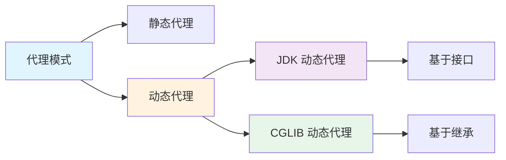
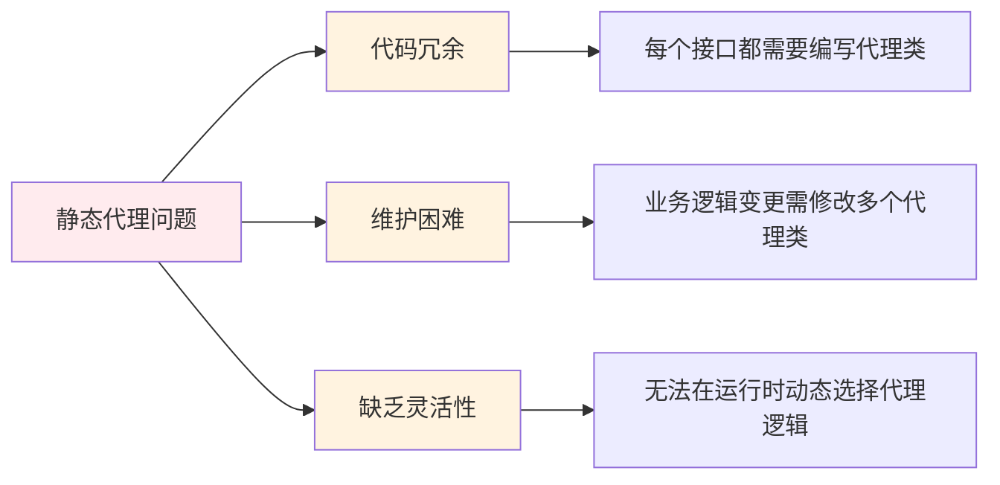
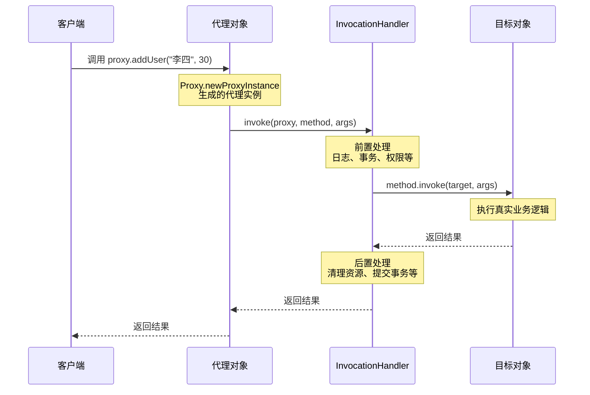
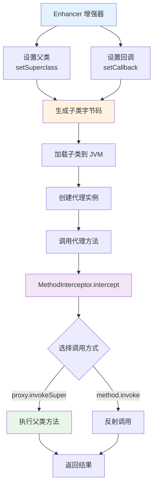
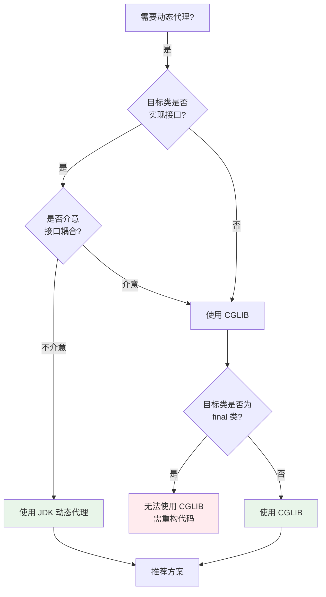
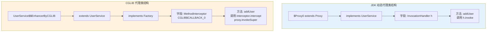
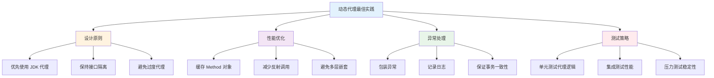

# Java 动态代理完全指南

## 1. 概述
### 1.1 什么是动态代理
**动态代理（Dynamic Proxy）** 是指在运行时动态创建代理类和代理对象，并在调用目标对象方法时进行增强处理的技术。与静态代理在编译时就确定代理关系不同，动态代理在程序运行时才确定。
### 1.2 核心概念


### 1.3 设计模式背景

动态代理是**代理模式（Proxy Pattern）** 的一种实现方式，属于结构型设计模式。

**代理模式的核心要素：**
- **Subject（抽象主题）**：定义真实主题和代理的共同接口
- **RealSubject（真实主题）**：被代理的真实对象
- **Proxy（代理）**：持有真实主题的引用，并提供与真实主题相同的接口


## 2. 静态代理 vs 动态代理
### 2.1 静态代理示例
```java
// 1. 定义接口
public interface UserService {
    void addUser(String name);
    void deleteUser(String id);
}

// 2. 真实主题
public class UserServiceImpl implements UserService {
    @Override
    public void addUser(String name) {
        System.out.println("添加用户: " + name);
    }
    
    @Override
    public void deleteUser(String id) {
        System.out.println("删除用户: " + id);
    }
}

// 3. 代理类（编译时确定）
public class UserServiceProxy implements UserService {
    private UserService target;
    
    public UserServiceProxy(UserService target) {
        this.target = target;
    }
    
    @Override
    public void addUser(String name) {
        System.out.println("【前置处理】准备添加用户");
        target.addUser(name);
        System.out.println("【后置处理】用户添加完成");
    }
    
    @Override
    public void deleteUser(String id) {
        System.out.println("【前置处理】准备删除用户");
        target.deleteUser(id);
        System.out.println("【后置处理】用户删除完成");
    }
}

// 4. 客户端调用
public class Client {
    public static void main(String[] args) {
        UserService target = new UserServiceImpl();
        UserService proxy = new UserServiceProxy(target);
        proxy.addUser("张三");
    }
}
```

### 2.2 对比分析

| 特性 | 静态代理 | 动态代理 |
|------|---------|---------|
| **代理类生成时间** | 编译时 | 运行时 |
| **代理类数量** | 每个目标类需要一个代理类 | 一个代理类可代理多个目标类 |
| **代码维护性** | 差（重复代码多） | 好（代码复用性高） |
| **灵活性** | 低 | 高 |
| **性能** | 略高（无反射开销） | 略低（有反射开销） |
| **适用场景** | 接口少且固定 | 接口多或需要动态增强 |

### 2.3 静态代理的局限性




## 3. JDK 动态代理

### 3.1 核心 API

JDK 动态代理主要涉及两个核心类：

1. **`java.lang.reflect.Proxy`** - 代理类生成器
2. **`java.lang.reflect.InvocationHandler`** - 调用处理器接口

### 3.2 完整实现示例

```java
import java.lang.reflect.InvocationHandler;
import java.lang.reflect.Method;
import java.lang.reflect.Proxy;

// 1. 定义业务接口
public interface UserService {
    void addUser(String name, int age);
    User getUserById(String id);
    void updateUser(User user);
    void deleteUser(String id);
}

// 2. 定义实体类
public class User {
    private String id;
    private String name;
    private int age;
    
    // 构造方法、getter、setter 省略
}

// 3. 真实主题实现
public class UserServiceImpl implements UserService {
    @Override
    public void addUser(String name, int age) {
        System.out.println("实际业务：添加用户 " + name);
        // 模拟业务处理
        try { Thread.sleep(100); } catch (InterruptedException e) {}
    }
    
    @Override
    public User getUserById(String id) {
        System.out.println("实际业务：查询用户 " + id);
        return new User(id, "张三", 25);
    }
    
    @Override
    public void updateUser(User user) {
        System.out.println("实际业务：更新用户 " + user.getName());
    }
    
    @Override
    public void deleteUser(String id) {
        System.out.println("实际业务：删除用户 " + id);
    }
}

// 4. 自定义 InvocationHandler 实现
public class UserServiceInvocationHandler implements InvocationHandler {
    
    // 目标对象
    private final Object target;
    
    public UserServiceInvocationHandler(Object target) {
        this.target = target;
    }
    
    /**
     * 代理方法执行的核心逻辑
     * @param proxy 代理对象本身
     * @param method 被调用的方法
     * @param args 方法参数
     * @return 方法返回值
     */
    @Override
    public Object invoke(Object proxy, Method method, Object[] args) throws Throwable {
        Object result = null;
        
        // 前置增强
        System.out.println("====== 前置处理 ======");
        System.out.println("调用方法: " + method.getName());
        System.out.println("方法参数: " + java.util.Arrays.toString(args));
        long startTime = System.currentTimeMillis();
        
        try {
            // 执行目标方法
            result = method.invoke(target, args);
            
            // 正常返回的后置增强
            System.out.println("方法执行成功");
        } catch (Exception e) {
            // 异常处理增强
            System.out.println("方法执行异常: " + e.getCause().getMessage());
            throw e.getCause();
        } finally {
            // 最终处理
            long endTime = System.currentTimeMillis();
            System.out.println("执行耗时: " + (endTime - startTime) + "ms");
            System.out.println("====== 后置处理 ======\n");
        }
        
        return result;
    }
}

// 5. 代理工厂类
public class ProxyFactory {
    
    /**
     * 创建代理对象
     * @param target 目标对象
     * @return 代理对象
     */
    @SuppressWarnings("unchecked")
    public static <T> T createProxy(T target) {
        return (T) Proxy.newProxyInstance(
            target.getClass().getClassLoader(),           // 类加载器
            target.getClass().getInterfaces(),            // 实现的接口数组
            new UserServiceInvocationHandler(target)      // 调用处理器
        );
    }
}

// 6. 客户端测试
public class JDKProxyTest {
    public static void main(String[] args) {
        // 创建目标对象
        UserService target = new UserServiceImpl();
        
        // 创建代理对象
        UserService proxy = ProxyFactory.createProxy(target);
        
        // 通过代理对象调用方法
        System.out.println(">>> 测试添加用户");
        proxy.addUser("李四", 30);
        
        System.out.println(">>> 测试查询用户");
        User user = proxy.getUserById("001");
        System.out.println("查询结果: " + user.getName());
        
        System.out.println(">>> 测试更新用户");
        proxy.updateUser(new User("001", "王五", 28));
        
        System.out.println(">>> 测试删除用户");
        proxy.deleteUser("001");
    }
}
```

### 3.3 工作流程图解



### 3.4 代理类生成机制

```java
// 保存生成的代理类到文件（用于分析）
public class ProxyClassGenerator {
    public static void generateProxyClass() {
        // 生成代理类的字节码
        byte[] proxyClassFile = ProxyGenerator.generateProxyClass(
            "$Proxy0",  // 代理类名称
            new Class<?>[]{UserService.class},  // 接口数组
            0  // 访问标志
        );
        
        // 保存到文件
        try (FileOutputStream fos = new FileOutputStream("$Proxy0.class")) {
            fos.write(proxyClassFile);
            System.out.println("代理类已保存到 $Proxy0.class");
        } catch (IOException e) {
            e.printStackTrace();
        }
    }
}
```

**生成的代理类结构（反编译后）：**

```java
// 这是 JDK 动态代理生成的代理类的大致结构
public final class $Proxy0 extends Proxy implements UserService {
    
    private static Method m0;  // hashCode
    private static Method m1;  // equals
    private static Method m2;  // toString
    private static Method m3;  // addUser
    private static Method m4;  // getUserById
    private static Method m5;  // updateUser
    private static Method m6;  // deleteUser
    
    static {
        try {
            m0 = Class.forName("java.lang.Object").getMethod("hashCode");
            m1 = Class.forName("java.lang.Object").getMethod("equals", Class.class);
            m2 = Class.forName("java.lang.Object").getMethod("toString");
            m3 = Class.forName("UserService").getMethod("addUser", String.class, int.class);
            m4 = Class.forName("UserService").getMethod("getUserById", String.class);
            m5 = Class.forName("UserService").getMethod("updateUser", User.class);
            m6 = Class.forName("UserService").getMethod("deleteUser", String.class);
        } catch (NoSuchMethodException e) {
            throw new NoSuchMethodError(e.getMessage());
        } catch (ClassNotFoundException e) {
            throw new NoClassDefFoundError(e.getMessage());
        }
    }
    
    public $Proxy0(InvocationHandler h) {
        super(h);
    }
    
    @Override
    public void addUser(String name, int age) {
        try {
            super.h.invoke(this, m3, new Object[]{name, age});
            return;
        } catch (RuntimeException | Error e) {
            throw e;
        } catch (Throwable e) {
            throw new UndeclaredThrowableException(e);
        }
    }
    
    @Override
    public User getUserById(String id) {
        try {
            return (User) super.h.invoke(this, m4, new Object[]{id});
        } catch (RuntimeException | Error e) {
            throw e;
        } catch (Throwable e) {
            throw new UndeclaredThrowableException(e);
        }
    }
    
    // 其他方法类似...
}
```

### 3.5 高级特性

#### 3.5.1 多接口代理

```java
public interface Loggable {
    void log(String message);
}

public class UserServiceImpl2 implements UserService, Loggable {
    @Override
    public void addUser(String name, int age) {
        System.out.println("添加用户: " + name);
    }
    
    @Override
    public User getUserById(String id) {
        return null;
    }
    
    @Override
    public void updateUser(User user) {}
    
    @Override
    public void deleteUser(String id) {}
    
    @Override
    public void log(String message) {
        System.out.println("日志: " + message);
    }
}

// 代理多个接口
public class MultiInterfaceProxy {
    @SuppressWarnings("unchecked")
    public static <T> T createProxy(Object target, Class<?>... interfaces) {
        return (T) Proxy.newProxyInstance(
            target.getClass().getClassLoader(),
            interfaces,
            (proxy, method, args) -> method.invoke(target, args)
        );
    }
    
    public static void main(String[] args) {
        UserServiceImpl2 target = new UserServiceImpl2();
        
        // 同时代理 UserService 和 Loggable 接口
        Object proxy = createProxy(target, UserService.class, Loggable.class);
        
        ((UserService) proxy).addUser("张三", 25);
        ((Loggable) proxy).log("操作完成");
    }
}
```

#### 3.5.2 通用代理处理器

```java
/**
 * 通用的方法拦截器
 */
public interface MethodInterceptor {
    Object intercept(Object target, Method method, Object[] args) throws Throwable;
}

/**
 * 通用的 InvocationHandler 实现
 */
public class GenericInvocationHandler implements InvocationHandler {
    
    private final Object target;
    private final List<MethodInterceptor> interceptors;
    
    public GenericInvocationHandler(Object target, List<MethodInterceptor> interceptors) {
        this.target = target;
        this.interceptors = interceptors;
    }
    
    @Override
    public Object invoke(Object proxy, Method method, Object[] args) throws Throwable {
        // 构建拦截器链
        InterceptorChain chain = new InterceptorChain(
            target, method, args, interceptors, 0
        );
        return chain.proceed();
    }
    
    private static class InterceptorChain {
        private final Object target;
        private final Method method;
        private final Object[] args;
        private final List<MethodInterceptor> interceptors;
        private final int index;
        
        InterceptorChain(Object target, Method method, Object[] args,
                        List<MethodInterceptor> interceptors, int index) {
            this.target = target;
            this.method = method;
            this.args = args;
            this.interceptors = interceptors;
            this.index = index;
        }
        
        Object proceed() throws Throwable {
            if (index < interceptors.size()) {
                MethodInterceptor interceptor = interceptors.get(index);
                InterceptorChain nextChain = new InterceptorChain(
                    target, method, args, interceptors, index + 1
                );
                return interceptor.intercept(target, method, args);
            } else {
                return method.invoke(target, args);
            }
        }
    }
}

// 使用示例
public class InterceptorDemo {
    public static void main(String[] args) {
        UserService target = new UserServiceImpl();
        
        List<MethodInterceptor> interceptors = Arrays.asList(
            // 日志拦截器
            (t, m, a) -> {
                System.out.println("[LOG] 调用方法: " + m.getName());
                return m.invoke(t, a);
            },
            // 性能监控拦截器
            (t, m, a) -> {
                long start = System.currentTimeMillis();
                try {
                    return m.invoke(t, a);
                } finally {
                    long cost = System.currentTimeMillis() - start;
                    System.out.println("[PERF] " + m.getName() + " 耗时: " + cost + "ms");
                }
            },
            // 事务拦截器
            (t, m, a) -> {
                System.out.println("[TX] 开启事务");
                try {
                    Object result = m.invoke(t, a);
                    System.out.println("[TX] 提交事务");
                    return result;
                } catch (Exception e) {
                    System.out.println("[TX] 回滚事务");
                    throw e;
                }
            }
        );
        
        UserService proxy = (UserService) Proxy.newProxyInstance(
            target.getClass().getClassLoader(),
            target.getClass().getInterfaces(),
            new GenericInvocationHandler(target, interceptors)
        );
        
        proxy.addUser("张三", 25);
    }
}
```


## 4. CGLIB 动态代理

### 4.1 概述

**CGLIB（Code Generator Library）** 是一个强大的代码生成库，通过在运行时动态生成子类来实现代理。与 JDK 动态代理不同，CGLIB 不需要目标类实现接口。

### 4.2 核心依赖

```xml
<!-- Maven 依赖 -->
<dependency>
    <groupId>cglib</groupId>
    <artifactId>cglib</artifactId>
    <version>3.3.0</version>
</dependency>

<!-- Spring 核心已包含 CGLIB -->
<dependency>
    <groupId>org.springframework</groupId>
    <artifactId>spring-core</artifactId>
    <version>5.3.20</version>
</dependency>
```

### 4.3 完整实现示例

```java
import net.sf.cglib.proxy.Enhancer;
import net.sf.cglib.proxy.MethodInterceptor;
import net.sf.cglib.proxy.MethodProxy;
import java.lang.reflect.Method;

// 1. 目标类（无需实现接口）
public class UserServiceNoInterface {
    
    public void addUser(String name, int age) {
        System.out.println("实际业务：添加用户 " + name);
        try { Thread.sleep(100); } catch (InterruptedException e) {}
    }
    
    public User getUserById(String id) {
        System.out.println("实际业务：查询用户 " + id);
        return new User(id, "张三", 25);
    }
    
    public void updateUser(User user) {
        System.out.println("实际业务：更新用户 " + user.getName());
    }
    
    public void deleteUser(String id) {
        System.out.println("实际业务：删除用户 " + id);
    }
    
    // final 方法无法被 CGLIB 代理
    public final void finalMethod() {
        System.out.println("这是一个 final 方法");
    }
}

// 2. CGLIB 方法拦截器
public class CglibMethodInterceptor implements MethodInterceptor {
    
    /**
     * intercept 方法参数说明：
     * @param obj 被代理的对象（CGLIB 生成的子类实例）
     * @param method 被拦截的方法
     * @param args 方法参数
     * @param proxy 代理对象，用于调用原始方法
     */
    @Override
    public Object intercept(Object obj, Method method, Object[] args, 
                           MethodProxy proxy) throws Throwable {
        
        Object result = null;
        
        // 前置处理
        System.out.println("====== CGLIB 前置处理 ======");
        System.out.println("目标类: " + obj.getClass().getName());
        System.out.println("方法名: " + method.getName());
        System.out.println("参数: " + java.util.Arrays.toString(args));
        
        long startTime = System.currentTimeMillis();
        
        try {
            // 方式1：使用 MethodProxy（性能更好，推荐）
            result = proxy.invokeSuper(obj, args);
            
            // 方式2：使用反射（性能较差）
            // result = method.invoke(obj, args);
            
            System.out.println("方法执行成功");
        } catch (Exception e) {
            System.out.println("方法执行异常: " + e.getMessage());
            throw e;
        } finally {
            long endTime = System.currentTimeMillis();
            System.out.println("执行耗时: " + (endTime - startTime) + "ms");
            System.out.println("====== CGLIB 后置处理 ======\n");
        }
        
        return result;
    }
}

// 3. CGLIB 代理工厂
public class CglibProxyFactory {
    
    /**
     * 创建 CGLIB 代理对象
     * @param targetClass 目标类
     * @param interceptor 方法拦截器
     * @return 代理对象
     */
    @SuppressWarnings("unchecked")
    public static <T> T createProxy(Class<T> targetClass, MethodInterceptor interceptor) {
        // 1. 创建 Enhancer（增强器）
        Enhancer enhancer = new Enhancer();
        
        // 2. 设置父类（目标类）
        enhancer.setSuperclass(targetClass);
        
        // 3. 设置回调（拦截器）
        enhancer.setCallback(interceptor);
        
        // 4. 创建代理对象
        return (T) enhancer.create();
    }
    
    /**
     * 简化版本：使用 Lambda 表达式
     */
    @SuppressWarnings("unchecked")
    public static <T> T createProxy(Class<T> targetClass, 
                                   java.util.function.Function<Method, Boolean> methodFilter,
                                   java.util.function.BiFunction<Object, Object[], Object> beforeHandler,
                                   java.util.function.BiFunction<Object, Object[], Object> afterHandler) {
        
        Enhancer enhancer = new Enhancer();
        enhancer.setSuperclass(targetClass);
        
        enhancer.setCallback((MethodInterceptor) (obj, method, args, proxy) -> {
            // 方法过滤
            if (!methodFilter.apply(method)) {
                return proxy.invokeSuper(obj, args);
            }
            
            // 前置处理
            if (beforeHandler != null) {
                beforeHandler.apply(method, args);
            }
            
            // 执行目标方法
            Object result = proxy.invokeSuper(obj, args);
            
            // 后置处理
            if (afterHandler != null) {
                afterHandler.apply(method, result);
            }
            
            return result;
        });
        
        return (T) enhancer.create();
    }
}

// 4. 客户端测试
public class CglibProxyTest {
    public static void main(String[] args) {
        // 创建代理对象（注意：这里不需要先创建目标对象）
        UserServiceNoInterface proxy = CglibProxyFactory.createProxy(
            UserServiceNoInterface.class,
            new CglibMethodInterceptor()
        );
        
        // 通过代理对象调用方法
        System.out.println(">>> 测试添加用户");
        proxy.addUser("李四", 30);
        
        System.out.println(">>> 测试查询用户");
        User user = proxy.getUserById("001");
        System.out.println("查询结果: " + user.getName());
        
        System.out.println(">>> 测试 final 方法（不会被代理）");
        proxy.finalMethod();
    }
}
```

### 4.4 工作流程图解



### 4.5 CGLIB 代理类分析

```java
// 使用 DebuggingClassWriter 保存生成的代理类
public class CglibClassGenerator {
    public static void main(String[] args) {
        // 设置生成类的保存路径
        System.setProperty(DebuggingClassWriter.DEBUG_LOCATION_PROPERTY, 
                          "target/cglib-proxy-classes");
        
        UserServiceNoInterface proxy = CglibProxyFactory.createProxy(
            UserServiceNoInterface.class,
            new CglibMethodInterceptor()
        );
        
        System.out.println("代理类名称: " + proxy.getClass().getName());
        System.out.println("父类名称: " + proxy.getClass().getSuperclass().getName());
        System.out.println("实现的接口: " + java.util.Arrays.toString(
            proxy.getClass().getInterfaces()
        ));
        
        // 查看生成的类文件
        // target/cglib-classes/.../UserServiceNoInterface$$EnhancerByCGLIB$<hash>.class
    }
}
```

**CGLIB 生成的代理类特点：**

1. 类名格式：`目标类名$$EnhancerByCGLIB$<hash>`
2. 继承目标类
3. 实现 `net.sf.cglib.proxy.Factory` 接口
4. 重写所有非 final 方法
5. 每个重写方法内部调用 `MethodInterceptor.intercept()`

### 4.6 高级特性

#### 4.6.1 多回调支持

```java
import net.sf.cglib.proxy.NoOp;
import net.sf.cglib.proxy.FixedValue;

public class MultipleCallbacksDemo {
    
    // 不同的回调实现
    static class LogCallback implements MethodInterceptor {
        @Override
        public Object intercept(Object obj, Method method, Object[] args, 
                               MethodProxy proxy) throws Throwable {
            System.out.println("[LOG] 调用: " + method.getName());
            return proxy.invokeSuper(obj, args);
        }
    }
    
    static class NoOpCallback implements NoOp {
        // 直接调用父类方法，无增强
    }
    
    static class FixedValueCallback implements FixedValue {
        @Override
        public Object loadObject() throws Exception {
            return "固定返回值";
        }
    }
    
    public static void main(String[] args) {
        Enhancer enhancer = new Enhancer();
        enhancer.setSuperclass(UserServiceNoInterface.class);
        
        // 设置多个回调
        Callback[] callbacks = new Callback[] {
            new LogCallback(),      // 索引 0
            NoOp.INSTANCE,          // 索引 1
            new FixedValueCallback() // 索引 2
        };
        
        enhancer.setCallbacks(callbacks);
        
        // 设置回调过滤器
        enhancer.setCallbackFilter(method -> {
            if (method.getName().startsWith("add")) {
                return 0; // 使用 LogCallback
            } else if (method.getName().startsWith("get")) {
                return 1; // 使用 NoOp
            } else {
                return 2; // 使用 FixedValueCallback
            }
        });
        
        UserServiceNoInterface proxy = (UserServiceNoInterface) enhancer.create();
        proxy.addUser("张三", 25);  // 会打印日志
        // proxy.getUserById("001"); // 直接调用，无日志
    }
}
```

#### 4.6.2 懒加载代理

```java
import net.sf.cglib.proxy.LazyLoader;

public class LazyLoaderDemo {
    
    static class ExpensiveObject {
        public ExpensiveObject() {
            System.out.println("创建昂贵对象...");
            try { Thread.sleep(2000); } catch (InterruptedException e) {}
            System.out.println("昂贵对象创建完成");
        }
        
        public void doSomething() {
            System.out.println("执行操作");
        }
    }
    
    static class ExpensiveObjectLoader implements LazyLoader {
        @Override
        public Object loadObject() throws Exception {
            System.out.println("开始加载对象...");
            return new ExpensiveObject();
        }
    }
    
    public static void main(String[] args) throws Exception {
        Enhancer enhancer = new Enhancer();
        enhancer.setSuperclass(ExpensiveObject.class);
        enhancer.setCallback(new ExpensiveObjectLoader());
        
        ExpensiveObject proxy = (ExpensiveObject) enhancer.create();
        System.out.println("代理对象已创建，但真实对象尚未加载");
        
        Thread.sleep(1000);
        System.out.println("\n准备调用方法...");
        proxy.doSomething(); // 此时才会真正加载对象
    }
}
```


## 5. 两种代理方式对比

### 5.1 详细对比表

| 对比维度 | JDK 动态代理 | CGLIB 动态代理 |
|---------|------------|--------------|
| **实现机制** | 基于反射，实现接口 | 基于 ASM，继承目标类 |
| **目标类要求** | 必须实现接口 | 无需实现接口，但不能是 final 类 |
| **方法要求** | 接口中的方法 | 非 final 方法 |
| **代理对象创建** | 需要目标对象实例 | 不需要目标对象实例 |
| **性能** | JDK 8+ 性能较好 | 方法调用性能略高 |
| **内存占用** | 较少 | 较多（生成子类） |
| **依赖库** | JDK 内置，无额外依赖 | 需要 CGLIB 或 Spring-core |
| **Spring 默认选择** | 有接口时使用 | 无接口时使用 |
| **构造方法** | 不影响 | 会被调用（创建子类实例时） |
| **字段访问** | 无法访问目标类字段 | 可以访问目标类字段 |

### 5.2 性能对比测试

```java
public class ProxyPerformanceTest {
    
    private static final int WARMUP_ITERATIONS = 10000;
    private static final int TEST_ITERATIONS = 1000000;
    
    interface Service {
        void method();
    }
    
    static class ServiceImpl implements Service {
        @Override
        public void method() {
            // 空方法
        }
    }
    
    static class ServiceNoInterface {
        public void method() {
            // 空方法
        }
    }
    
    public static void main(String[] args) {
        System.out.println("=== 性能测试开始 ===\n");
        
        // 1. 直接调用
        testDirectCall();
        
        // 2. JDK 动态代理
        testJDKProxy();
        
        // 3. CGLIB 代理
        testCglibProxy();
        
        System.out.println("\n=== 性能测试结束 ===");
    }
    
    private static void testDirectCall() {
        ServiceImpl target = new ServiceImpl();
        
        // 预热
        for (int i = 0; i < WARMUP_ITERATIONS; i++) {
            target.method();
        }
        
        // 测试
        long start = System.nanoTime();
        for (int i = 0; i < TEST_ITERATIONS; i++) {
            target.method();
        }
        long end = System.nanoTime();
        
        double avgNs = (end - start) * 1.0 / TEST_ITERATIONS;
        System.out.printf("直接调用: %.2f ns/次%n", avgNs);
    }
    
    private static void testJDKProxy() {
        ServiceImpl target = new ServiceImpl();
        Service proxy = (Service) Proxy.newProxyInstance(
            ServiceImpl.class.getClassLoader(),
            new Class<?>[]{Service.class},
            (p, m, args) -> m.invoke(target, args)
        );
        
        // 预热
        for (int i = 0; i < WARMUP_ITERATIONS; i++) {
            proxy.method();
        }
        
        // 测试
        long start = System.nanoTime();
        for (int i = 0; i < TEST_ITERATIONS; i++) {
            proxy.method();
        }
        long end = System.nanoTime();
        
        double avgNs = (end - start) * 1.0 / TEST_ITERATIONS;
        System.out.printf("JDK 动态代理: %.2f ns/次%n", avgNs);
    }
    
    private static void testCglibProxy() {
        ServiceNoInterface proxy = CglibProxyFactory.createProxy(
            ServiceNoInterface.class,
            (obj, method, args, proxyMethod) -> proxyMethod.invokeSuper(obj, args)
        );
        
        // 预热
        for (int i = 0; i < WARMUP_ITERATIONS; i++) {
            proxy.method();
        }
        
        // 测试
        long start = System.nanoTime();
        for (int i = 0; i < TEST_ITERATIONS; i++) {
            proxy.method();
        }
        long end = System.nanoTime();
        
        double avgNs = (end - start) * 1.0 / TEST_ITERATIONS;
        System.out.printf("CGLIB 代理: %.2f ns/次%n", avgNs);
    }
}
```

**典型性能测试结果：**

```
=== 性能测试开始 ===

直接调用: 2.15 ns/次
JDK 动态代理: 15.32 ns/次
CGLIB 代理: 12.48 ns/次

=== 性能测试结束 ===
```

### 5.3 选择决策树



### 5.4 Spring 中的代理选择策略

```java
/**
 * Spring AOP 代理创建器的选择逻辑简化版
 */
public class ProxyCreatorSelector {
    
    public static Object createProxy(Object target, Class<?>[] interfaces, 
                                     Advice advice) {
        
        // 1. 检查是否指定了代理类型
        if (proxyTargetClass) {
            // 强制使用 CGLIB
            return createCglibProxy(target, advice);
        }
        
        // 2. 检查目标类是否实现接口
        if (interfaces != null && interfaces.length > 0) {
            // 有接口，使用 JDK 动态代理
            return createJdkProxy(target, interfaces, advice);
        }
        
        // 3. 没有接口，使用 CGLIB
        if (canUseCglib(target.getClass())) {
            return createCglibProxy(target, advice);
        }
        
        throw new AopConfigException(
            "目标类不是接口且是 final 类，无法创建代理"
        );
    }
    
    private static boolean canUseCglib(Class<?> targetClass) {
        // CGLIB 限制：不能代理 final 类
        return !Modifier.isFinal(targetClass.getModifiers());
    }
}
```


## 6. 底层原理深度解析

### 6.1 JDK 动态代理原理

#### 6.1.1 Proxy.newProxyInstance 源码分析

```java
// java.lang.reflect.Proxy 关键源码

public static Object newProxyInstance(ClassLoader loader,
                                      Class<?>[] interfaces,
                                      InvocationHandler h)
    throws IllegalArgumentException
{
    Objects.requireNonNull(h);
    
    final Class<?>[] intfs = interfaces.clone();
    final SecurityManager sm = System.getSecurityManager();
    if (sm != null) {
        checkProxyAccess(Reflection.getCallerClass(), loader, intfs);
    }
    
    /*
     * 核心步骤：生成代理类的 Class 对象
     */
    Class<?> cl = getProxyClass0(loader, intfs);
    
    /*
     * 获取代理类的构造方法
     * 代理类的构造方法签名：public $Proxy0(InvocationHandler h)
     */
    try {
        if (sm != null) {
            checkNewProxyPermission(Reflection.getCallerClass(), cl);
        }
        
        final Constructor<?> cons = cl.getConstructor(constructorParams);
        final InvocationHandler ih = h;
        
        // 如果是非 public 接口，设置可访问
        if (!Modifier.isPublic(cl.getModifiers()) ||
            !Modifier.isPublic(cons.getModifiers())) {
            AccessController.doPrivileged(new PrivilegedAction<Void>() {
                public Void run() {
                    cons.setAccessible(true);
                    return null;
                }
            });
        }
        
        // 通过构造方法创建代理实例
        return cons.newInstance(new Object[]{h});
        
    } catch (NoSuchMethodException e) {
        throw new NoSuchMethodError(
            cl.getName() + ".<init>" + constructorParamTypes);
    } catch (IllegalAccessException | InstantiationException e) {
        throw new InternalError(e.toString(), e);
    } catch (InvocationTargetException e) {
        Throwable t = e.getCause();
        if (t instanceof RuntimeException) {
            throw (RuntimeException) t;
        } else {
            throw new InternalError(t.toString(), t);
        }
    }
}

/**
 * 获取或创建代理类
 */
private static Class<?> getProxyClass0(ClassLoader loader,
                                       Class<?>... interfaces) {
    // 接口数量限制
    if (interfaces.length > 65535) {
        throw new IllegalArgumentException("interface limit exceeded");
    }
    
    // 从缓存中获取代理类
    return proxyClassCache.get(loader, interfaces);
}

// 代理类缓存
private static final WeakCache<ClassLoader, Class<?>[], Class<?>>
    proxyClassCache = new WeakCache<>(
        new KeyFactory(), 
        new ProxyClassFactory()
    );
```

#### 6.1.2 ProxyClassFactory 生成代理类

```java
private static final class ProxyClassFactory
    implements BiFunction<ClassLoader, Class<?>[], Class<?>>
{
    // 代理类前缀
    private static final String proxyClassNamePrefix = "$Proxy";
    
    // 序列号生成器
    private static final AtomicLong nextUniqueNumber = new AtomicLong();
    
    @Override
    public Class<?> apply(ClassLoader loader, Class<?>[] interfaces) {
        
        Map<Class<?>, Boolean> interfaceSet = new IdentityHashMap<>(interfaces.length);
        for (Class<?> intf : interfaces) {
            // 验证接口
            Class<?> interfaceClass = null;
            try {
                interfaceClass = Class.forName(intf.getName(), false, loader);
            } catch (ClassNotFoundException e) { }
            if (interfaceClass != intf) {
                throw new IllegalArgumentException(
                    intf + " is not visible from class loader");
            }
            if (!interfaceClass.isInterface()) {
                throw new IllegalArgumentException(
                    interfaceClass.getName() + " is not an interface");
            }
            if (interfaceSet.put(interfaceClass, Boolean.TRUE) != null) {
                throw new IllegalArgumentException(
                    "repeated interface: " + interfaceClass.getName());
            }
        }
        
        String proxyPkg = null;     // 代理类包名
        int accessFlags = Modifier.PUBLIC | Modifier.FINAL;
        
        // 确定代理类的包名（与非 public 接口保持一致）
        for (Class<?> intf : interfaces) {
            int flags = intf.getModifiers();
            if (!Modifier.isPublic(flags)) {
                accessFlags = Modifier.FINAL;
                String name = intf.getName();
                int n = name.lastIndexOf('.');
                String pkg = ((n == -1) ? "" : name.substring(0, n + 1));
                if (proxyPkg == null || !pkg.startsWith(proxyPkg)) {
                    proxyPkg = pkg;
                }
            }
        }
        
        if (proxyPkg == null) {
            // 默认包名
            proxyPkg = ReflectUtil.PROXY_PACKAGE + ".";
        }
        
        // 生成唯一的类名
        long num = nextUniqueNumber.getAndIncrement();
        String proxyName = proxyPkg + proxyClassNamePrefix + num;
        
        /*
         * 生成代理类的字节码
         * 这是核心步骤
         */
        byte[] proxyClassFile = ProxyGenerator.generateProxyClass(
            proxyName, interfaces, accessFlags);
        
        // 定义类
        return defineProxyClass0(loader, proxyName, proxyClassFile);
    }
}
```

#### 6.1.3 字节码生成过程

```java
// ProxyGenerator.generateProxyClass 简化逻辑

public static byte[] generateProxyClass(final String var0, Class<?>[] var1, int var2) {
    ProxyGenerator var3 = new ProxyGenerator(var0, var1);
    final byte[] var4 = var3.generateClassFile();
    
    // 如果开启了保存代理类的选项
    if (saveGeneratedFiles) {
        AccessController.doPrivileged(new PrivilegedAction<Void>() {
            public Void run() {
                try {
                    FileOutputStream var2x = new FileOutputStream(
                        dotToSlash(var0) + ".class"
                    );
                    var2x.write(var4);
                    var2x.close();
                    return null;
                } catch (IOException var4x) {
                    throw new InternalError(
                        "I/O exception saving generated file: " + var4x
                    );
                }
            }
        });
    }
    
    return var4;
}

// ProxyGenerator 内部逻辑
private byte[] generateClassFile() {
    // 1. 添加 Proxy 类的方法（hashCode, equals, toString）
    this.addProxyMethod(hashCodeMethod, Object.class);
    this.addProxyMethod(equalsMethod, Object.class);
    this.addProxyMethod(toStringMethod, Object.class);
    
    // 2. 添加所有接口的方法
    Class[] var1 = this.interfaces;
    int var2 = var1.length;
    
    for(int var3 = 0; var3 < var2; ++var3) {
        Class var4 = var1[var3];
        Method[] var5 = var4.getMethods();
        int var6 = var5.length;
        
        for(int var7 = 0; var7 < var6; ++var7) {
            Method var8 = var5[var7];
            this.addProxyMethod(var8, var4);
        }
    }
    
    // 3. 验证方法签名冲突
    this.validateProxyMethods();
    
    // 4. 生成构造方法
    this.constructorCode.append("super(var1);\n");
    
    // 5. 为每个方法生成实现
    Iterator var11 = this.proxyMethods.entrySet().iterator();
    
    while(var11.hasNext()) {
        Entry var12 = (Entry)var11.next();
        List var13 = (List)var12.getValue();
        Iterator var14 = var13.iterator();
        
        while(var14.hasNext()) {
            ProxyMethod var15 = (ProxyMethod)var14.next();
            // 生成字段
            this.fields.add(new FieldInfo(var15.methodFieldName, 
                "Ljava/lang/reflect/Method;", 10));
            
            // 生成方法体
            this.methodCode(var15);
        }
    }
    
    // 6. 生成静态初始化块
    this.staticCode.add(new CodeBlock("return;"));
    
    // 7. 生成最终的 class 文件字节码
    return this.toClassFile();
}
```

### 6.2 CGLIB 原理

#### 6.2.1 Enhancer 核心流程

```java
// net.sf.cglib.proxy.Enhancer 简化流程

public class Enhancer extends AbstractClassGenerator {
    
    private static final CallbackFilter ACCEPT_ALL_FILTER = 
        (method) -> 0;
    
    public Object create() {
        classOnly = false;
        argumentTypes = null;
        return createHelper();
    }
    
    private Object createHelper() {
        // 1. 前置验证
        preValidate();
        
        // 2. 设置类名策略
        if (namingStrategy != null) {
            setNamePrefix(namingStrategy.getClassNamePrefix(superclass));
        }
        
        // 3. 生成代理类
        Class<?> proxyClass = createClass0();
        
        // 4. 创建实例
        Object proxy;
        if (classOnly) {
            proxy = proxyClass;
        } else {
            if (argumentTypes != null) {
                // 使用指定参数的构造方法
                proxy = newInstanceInternal(proxyClass, argumentTypes, arguments);
            } else {
                // 使用无参构造方法
                proxy = newInstanceInternal(proxyClass, null, null);
            }
        }
        
        // 5. 保存构造参数
        saveConstructArguments(proxy);
        
        return proxy;
    }
    
    protected Class<?> createClass0() {
        // 生成类名
        String className = getClassName();
        ClassLoader loader = getStrategy().getClassLoader();
        
        // 检查缓存
        Class<?> proxyClass = ReflectUtils.findClass(className, loader);
        
        if (proxyClass == null) {
            // 缓存未命中，生成新类
            synchronized (getStrategy()) {
                proxyClass = ReflectUtils.defineClass(
                    className, 
                    generateClass(className),  // 生成字节码
                    loader
                );
            }
        }
        
        return proxyClass;
    }
    
    protected byte[] generateClass(String className) {
        // 使用 ClassWriter 生成字节码
        ClassWriter cw = getClassVisitor();
        generateStaticFields(cw);
        generateConstructor(cw);
        generateMethods(cw);
        generateStaticInit(cw);
        
        return cw.toByteArray();
    }
}
```

#### 6.2.2 ASM 字节码生成示例

```java
// CGLIB 使用 ASM 生成字节码的简化示例

public class SimpleClassGenerator {
    
    public static byte[] generateSubclassBytecode(String className) {
        ClassWriter cw = new ClassWriter(ClassWriter.COMPUTE_MAXS);
        
        // 1. 生成类声明
        // public class UserService$$EnhancerByCGLIB extends UserService implements Factory
        cw.visit(
            Opcodes.V1_8,                    // Java 版本
            Opcodes.ACC_PUBLIC,              // 访问标志
            className.replace('.', '/'),     // 类名
            null,                            // 签名
            "com/example/UserService",       // 父类
            new String[]{"net/sf/cglib/proxy/Factory"} // 实现的接口
        );
        
        // 2. 添加字段
        // private MethodInterceptor CGLIB$CALLBACK_0
        cw.visitField(
            Opcodes.ACC_PRIVATE,
            "CGLIB$CALLBACK_0",
            "Lnet/sf/cglib/proxy/MethodInterceptor;",
            null,
            null
        ).visitEnd();
        
        // 3. 生成构造方法
        generateConstructor(cw);
        
        // 4. 生成代理方法
        generateProxyMethod(cw, "addUser", "(Ljava/lang/String;I)V");
        
        // 5. 生成静态初始化块
        generateStaticInitializer(cw);
        
        cw.visitEnd();
        return cw.toByteArray();
    }
    
    private static void generateConstructor(ClassWriter cw) {
        MethodVisitor mv = cw.visitMethod(
            Opcodes.ACC_PUBLIC,
            "<init>",
            "()V",
            null,
            null
        );
        mv.visitCode();
        mv.visitVarInsn(Opcodes.ALOAD, 0);
        mv.visitMethodInsn(
            Opcodes.INVOKESPECIAL,
            "com/example/UserService",
            "<init>",
            "()V",
            false
        );
        mv.visitInsn(Opcodes.RETURN);
        mv.visitMaxs(1, 1);
        mv.visitEnd();
    }
    
    private static void generateProxyMethod(ClassWriter cw, String methodName, 
                                           String methodDesc) {
        MethodVisitor mv = cw.visitMethod(
            Opcodes.ACC_PUBLIC,
            methodName,
            methodDesc,
            null,
            null
        );
        mv.visitCode();
        
        // 加载 this
        mv.visitVarInsn(Opcodes.ALOAD, 0);
        
        // 加载 CGLIB$CALLBACK_0
        mv.visitVarInsn(Opcodes.ALOAD, 0);
        mv.visitFieldInsn(
            Opcodes.GETFIELD,
            "UserService$$EnhancerByCGLIB",
            "CGLIB$CALLBACK_0",
            "Lnet/sf/cglib/proxy/MethodInterceptor;"
        );
        
        // 加载 this（作为第一个参数）
        mv.visitVarInsn(Opcodes.ALOAD, 0);
        
        // 加载 Method 对象
        mv.visitFieldInsn(
            Opcodes.GETSTATIC,
            "UserService$$EnhancerByCGLIB",
            "CGLIB$addUser$0",
            "Ljava/lang/reflect/Method;"
        );
        
        // 创建参数数组
        mv.visitInsn(Opcodes.ICONST_2);
        mv.visitTypeInsn(Opcodes.ANEWARRAY, "java/lang/Object");
        mv.visitInsn(Opcodes.DUP);
        mv.visitInsn(Opcodes.ICONST_0);
        mv.visitVarInsn(Opcodes.ALOAD, 1);
        mv.visitInsn(Opcodes.AASTORE);
        mv.visitInsn(Opcodes.DUP);
        mv.visitInsn(Opcodes.ICONST_1);
        mv.visitVarInsn(Opcodes.ILOAD, 2);
        mv.visitMethodInsn(
            Opcodes.INVOKESTATIC,
            "java/lang/Integer",
            "valueOf",
            "(I)Ljava/lang/Integer;",
            false
        );
        mv.visitInsn(Opcodes.AASTORE);
        
        // 加载 MethodProxy
        mv.visitFieldInsn(
            Opcodes.GETSTATIC,
            "UserService$$EnhancerByCGLIB",
            "CGLIB$addUser$0$Proxy",
            "Lnet/sf/cglib/proxy/MethodProxy;"
        );
        
        // 调用 intercept 方法
        mv.visitMethodInsn(
            Opcodes.INVOKEINTERFACE,
            "net/sf/cglib/proxy/MethodInterceptor",
            "intercept",
            "(Ljava/lang/Object;Ljava/lang/reflect/Method;[Ljava/lang/Object;Lnet/sf/cglib/proxy/MethodProxy;)Ljava/lang/Object;",
            true
        );
        
        // 返回
        mv.visitInsn(Opcodes.POP);
        mv.visitInsn(Opcodes.RETURN);
        mv.visitMaxs(6, 3);
        mv.visitEnd();
    }
}
```

### 6.3 两种代理的字节码对比




## 7. 实际应用场景

### 7.1 Spring AOP 实现

```java
/**
 * Spring AOP 代理工厂简化实现
 */
public class SimpleProxyFactory {
    
    public static <T> T createAopProxy(T target, List<Advice> advices) {
        // 判断使用哪种代理方式
        if (shouldUseJdkProxy(target)) {
            return createJdkAopProxy(target, advices);
        } else {
            return createCglibAopProxy(target, advices);
        }
    }
    
    private static <T> T createJdkAopProxy(T target, List<Advice> advices) {
        return (T) Proxy.newProxyInstance(
            target.getClass().getClassLoader(),
            target.getClass().getInterfaces(),
            new AopInvocationHandler(target, advices)
        );
    }
    
    private static <T> T createCglibAopProxy(T target, List<Advice> advices) {
        Enhancer enhancer = new Enhancer();
        enhancer.setSuperclass(target.getClass());
        enhancer.setCallback(new AopMethodInterceptor(target, advices));
        return (T) enhancer.create();
    }
    
    static class AopInvocationHandler implements InvocationHandler {
        private final Object target;
        private final List<Advice> advices;
        
        @Override
        public Object invoke(Object proxy, Method method, Object[] args) 
                throws Throwable {
            MethodInvocation invocation = 
                new MethodInvocation(target, method, args);
            
            // 执行拦截器链
            return getAdviceChain(advices).proceed(invocation);
        }
    }
    
    static class AopMethodInterceptor implements net.sf.cglib.proxy.MethodInterceptor {
        private final Object target;
        private final List<Advice> advices;
        
        @Override
        public Object intercept(Object obj, Method method, Object[] args, 
                               MethodProxy proxy) throws Throwable {
            MethodInvocation invocation = 
                new MethodInvocation(target, method, args, proxy);
            
            return getAdviceChain(advices).proceed(invocation);
        }
    }
}

// 使用示例
@Transactional
@Service
public class OrderService {
    
    @Cacheable(key = "#id")
    public Order getOrder(String id) {
        // 业务逻辑
    }
    
    @Transactional
    public void createOrder(Order order) {
        // 业务逻辑
    }
}
```

### 7.2 RPC 框架客户端代理

```java
/**
 * RPC 客户端动态代理实现
 */
public class RpcClientProxy {
    
    @SuppressWarnings("unchecked")
    public static <T> T createProxy(Class<T> interfaceClass, String host, int port) {
        return (T) Proxy.newProxyInstance(
            interfaceClass.getClassLoader(),
            new Class<?>[]{interfaceClass},
            new RpcInvocationHandler(interfaceClass, host, port)
        );
    }
    
    static class RpcInvocationHandler implements InvocationHandler {
        private final Class<?> interfaceClass;
        private final String host;
        private final int port;
        
        @Override
        public Object invoke(Object proxy, Method method, Object[] args) 
                throws Throwable {
            // 1. 构建 RPC 请求
            RpcRequest request = new RpcRequest();
            request.setInterfaceName(interfaceClass.getName());
            request.setMethodName(method.getName());
            request.setParameterTypes(method.getParameterTypes());
            request.setParameters(args);
            
            // 2. 发送请求并获取响应
            RpcResponse response = sendRequest(request);
            
            // 3. 处理响应
            if (response.hasException()) {
                throw response.getException();
            }
            
            return response.getResult();
        }
        
        private RpcResponse sendRequest(RpcRequest request) {
            // 网络通信逻辑（简化）
            // 实际实现会使用 Netty、gRPC 等框架
            return null;
        }
    }
}

// RPC 接口定义
public interface UserServiceRpc {
    User getUserById(String id);
    void saveUser(User user);
}

// 客户端使用
public class RpcClient {
    public static void main(String[] args) {
        UserServiceRpc userService = RpcClientProxy.createProxy(
            UserServiceRpc.class, 
            "localhost", 
            8080
        );
        
        // 像调用本地方法一样调用远程服务
        User user = userService.getUserById("001");
        System.out.println(user.getName());
    }
}
```

### 7.3 方法性能监控

```java
/**
 * 方法性能监控代理
 */
public class PerformanceMonitorProxy {
    
    @SuppressWarnings("unchecked")
    public static <T> T createMonitorProxy(T target) {
        return (T) Proxy.newProxyInstance(
            target.getClass().getClassLoader(),
            target.getClass().getInterfaces(),
            new PerformanceMonitorHandler(target)
        );
    }
    
    static class PerformanceMonitorHandler implements InvocationHandler {
        private final Object target;
        private final Map<String, MethodStats> statsMap = new ConcurrentHashMap<>();
        
        @Override
        public Object invoke(Object proxy, Method method, Object[] args) 
                throws Throwable {
            String methodName = method.getName();
            MethodStats stats = statsMap.computeIfAbsent(
                methodName, k -> new MethodStats()
            );
            
            long startTime = System.nanoTime();
            stats.incrementCallCount();
            
            try {
                Object result = method.invoke(target, args);
                long duration = System.nanoTime() - startTime;
                stats.recordSuccess(duration);
                return result;
            } catch (InvocationTargetException e) {
                long duration = System.nanoTime() - startTime;
                stats.recordFailure(duration);
                throw e.getCause();
            }
        }
        
        public void printStats() {
            System.out.println("=== 方法性能统计 ===");
            statsMap.forEach((name, stats) -> {
                System.out.printf("%s: 调用次数=%d, 平均耗时=%.2f ms, 失败率=%.2f%%%n",
                    name,
                    stats.getCallCount(),
                    stats.getAverageDuration() / 1_000_000.0,
                    stats.getFailureRate() * 100
                );
            });
        }
    }
    
    static class MethodStats {
        private AtomicLong callCount = new AtomicLong(0);
        private AtomicLong successCount = new AtomicLong(0);
        private AtomicLong totalDuration = new AtomicLong(0);
        
        public void incrementCallCount() {
            callCount.incrementAndGet();
        }
        
        public void recordSuccess(long duration) {
            successCount.incrementAndGet();
            totalDuration.addAndGet(duration);
        }
        
        public void recordFailure(long duration) {
            totalDuration.addAndGet(duration);
        }
        
        public long getCallCount() {
            return callCount.get();
        }
        
        public double getAverageDuration() {
            long count = successCount.get();
            return count > 0 ? totalDuration.get() * 1.0 / count : 0;
        }
        
        public double getFailureRate() {
            long total = callCount.get();
            return total > 0 ? 1.0 - (successCount.get() * 1.0 / total) : 0;
        }
    }
}

// 使用示例
public class PerformanceTest {
    public static void main(String[] args) throws Exception {
        UserService target = new UserServiceImpl();
        UserService proxy = PerformanceMonitorProxy.createMonitorProxy(target);
        
        // 模拟调用
        for (int i = 0; i < 100; i++) {
            proxy.addUser("User" + i, 20 + i);
            proxy.getUserById(String.valueOf(i));
        }
        
        // 打印统计
        ((PerformanceMonitorProxy.PerformanceMonitorHandler) 
            Proxy.getInvocationHandler(proxy)).printStats();
    }
}
```

### 7.4 延迟加载代理

```java
/**
 * 延迟加载代理实现
 */
public class LazyLoadingProxy {
    
    @SuppressWarnings("unchecked")
    public static <T> T createLazyProxy(Class<T> interfaceClass, 
                                        Supplier<T> targetSupplier) {
        return (T) Proxy.newProxyInstance(
            interfaceClass.getClassLoader(),
            new Class<?>[]{interfaceClass},
            new LazyLoadingHandler<>(targetSupplier)
        );
    }
    
    static class LazyLoadingHandler<T> implements InvocationHandler {
        private final Supplier<T> targetSupplier;
        private T target;
        private final Object lock = new Object();
        
        @Override
        public Object invoke(Object proxy, Method method, Object[] args) 
                throws Throwable {
            // 双重检查锁定实现懒加载
            if (target == null) {
                synchronized (lock) {
                    if (target == null) {
                        System.out.println("正在加载真实对象...");
                        target = targetSupplier.get();
                        System.out.println("真实对象加载完成");
                    }
                }
            }
            
            return method.invoke(target, args);
        }
    }
}

// 使用示例
public class LazyLoadingDemo {
    public static void main(String[] args) {
        // 创建延迟加载代理
        UserService proxy = LazyLoadingProxy.createLazyProxy(
            UserService.class,
            () -> {
                // 模拟耗时初始化
                try { Thread.sleep(2000); } catch (InterruptedException e) {}
                return new UserServiceImpl();
            }
        );
        
        System.out.println("代理对象已创建，但真实对象尚未加载");
        
        // 第一次调用时才会加载真实对象
        System.out.println("\n准备调用方法...");
        proxy.addUser("张三", 25);
        
        // 后续调用直接使用已加载的对象
        System.out.println("\n再次调用...");
        proxy.getUserById("001");
    }
}
```

### 7.5 权限控制代理

```java
/**
 * 基于注解的权限控制代理
 */
public class PermissionProxy {
    
    @SuppressWarnings("unchecked")
    public static <T> T createPermissionProxy(T target, 
                                              UserContext userContext) {
        return (T) Proxy.newProxyInstance(
            target.getClass().getClassLoader(),
            target.getClass().getInterfaces(),
            new PermissionInvocationHandler(target, userContext)
        );
    }
    
    static class PermissionInvocationHandler implements InvocationHandler {
        private final Object target;
        private final UserContext userContext;
        
        @Override
        public Object invoke(Object proxy, Method method, Object[] args) 
                throws Throwable {
            // 检查方法是否有权限注解
            RequiresPermission annotation = 
                method.getAnnotation(RequiresPermission.class);
            
            if (annotation != null) {
                String requiredPermission = annotation.value();
                
                // 验证权限
                if (!userContext.hasPermission(requiredPermission)) {
                    throw new SecurityException(
                        "缺少权限: " + requiredPermission
                    );
                }
            }
            
            return method.invoke(target, args);
        }
    }
}

// 权限注解
@Retention(RetentionPolicy.RUNTIME)
@Target(ElementType.METHOD)
public @interface RequiresPermission {
    String value();
}

// 用户上下文
public class UserContext {
    private final Set<String> permissions;
    
    public UserContext(Set<String> permissions) {
        this.permissions = permissions;
    }
    
    public boolean hasPermission(String permission) {
        return permissions.contains(permission);
    }
}

// 使用示例
public interface DocumentService {
    
    @RequiresPermission("document:read")
    Document readDocument(String id);
    
    @RequiresPermission("document:write")
    void writeDocument(Document doc);
    
    @RequiresPermission("document:delete")
    void deleteDocument(String id);
}

public class PermissionDemo {
    public static void main(String[] args) {
        DocumentService target = new DocumentServiceImpl();
        
        // 普通用户（只有读权限）
        UserContext normalUser = new UserContext(
            Sets.newHashSet("document:read")
        );
        DocumentService normalProxy = PermissionProxy.createPermissionProxy(
            target, normalUser
        );
        
        normalProxy.readDocument("001"); // 成功
        // normalProxy.writeDocument(doc); // 抛出 SecurityException
        
        // 管理员（所有权限）
        UserContext admin = new UserContext(
            Sets.newHashSet("document:read", "document:write", "document:delete")
        );
        DocumentService adminProxy = PermissionProxy.createPermissionProxy(
            target, admin
        );
        
        adminProxy.readDocument("001");   // 成功
        adminProxy.writeDocument(doc);    // 成功
        adminProxy.deleteDocument("001"); // 成功
    }
}
```


## 8. 性能分析与优化

### 8.1 性能瓶颈分析

```java
public class ProxyPerformanceAnalysis {
    
    public static void main(String[] args) {
        System.out.println("=== 代理性能瓶颈分析 ===\n");
        
        // 1. 反射调用开销
        analyzeReflectionOverhead();
        
        // 2. 方法调用链开销
        analyzeMethodChainOverhead();
        
        // 3. 内存占用分析
        analyzeMemoryUsage();
    }
    
    private static void analyzeReflectionOverhead() {
        System.out.println("1. 反射调用开销测试:");
        
        // 直接调用
        testDirectCall();
        
        // 反射调用
        testReflectionCall();
        
        // MethodHandle 调用
        testMethodHandleCall();
        
        System.out.println();
    }
    
    private static void testDirectCall() {
        TargetObject target = new TargetObject();
        
        long start = System.nanoTime();
        for (int i = 0; i < 1_000_000; i++) {
            target.method();
        }
        long end = System.nanoTime();
        
        System.out.printf("   直接调用: %.2f ns%n", 
            (end - start) / 1_000_000.0);
    }
    
    private static void testReflectionCall() {
        TargetObject target = new TargetObject();
        Method method = TargetObject.class.getDeclaredMethod("method");
        method.setAccessible(true);
        
        long start = System.nanoTime();
        for (int i = 0; i < 1_000_000; i++) {
            try {
                method.invoke(target);
            } catch (Exception e) {
                e.printStackTrace();
            }
        }
        long end = System.nanoTime();
        
        System.out.printf("   反射调用: %.2f ns%n", 
            (end - start) / 1_000_000.0);
    }
    
    private static void testMethodHandleCall() {
        TargetObject target = new TargetObject();
        
        try {
            MethodHandles.Lookup lookup = MethodHandles.lookup();
            MethodHandle handle = lookup.findVirtual(
                TargetObject.class, 
                "method", 
                MethodType.methodType(void.class)
            );
            
            long start = System.nanoTime();
            for (int i = 0; i < 1_000_000; i++) {
                handle.invokeExact(target);
            }
            long end = System.nanoTime();
            
            System.out.printf("   MethodHandle: %.2f ns%n", 
                (end - start) / 1_000_000.0);
        } catch (Throwable e) {
            e.printStackTrace();
        }
    }
    
    static class TargetObject {
        public void method() {
            // 空方法
        }
    }
}
```

### 8.2 优化策略

#### 8.2.1 缓存 Method 对象

```java
/**
 * 优化：缓存 Method 对象，避免重复查找
 */
public class OptimizedInvocationHandler implements InvocationHandler {
    
    private final Object target;
    private final Map<Method, Method> methodCache = new ConcurrentHashMap<>();
    
    @Override
    public Object invoke(Object proxy, Method method, Object[] args) 
            throws Throwable {
        // 缓存 Method 对象
        Method cachedMethod = methodCache.computeIfAbsent(
            method, 
            m -> {
                try {
                    return target.getClass().getMethod(
                        m.getName(), 
                        m.getParameterTypes()
                    );
                } catch (NoSuchMethodException e) {
                    throw new RuntimeException(e);
                }
            }
        );
        
        return cachedMethod.invoke(target, args);
    }
}
```

#### 8.2.2 使用 FastClass 优化 CGLIB

```java
/**
 * CGLIB FastClass 优化
 * 避免使用反射调用，直接调用字节码
 */
public class FastClassOptimization {
    
    public static void main(String[] args) {
        // 创建 FastClass
        FastClass fastClass = FastClass.create(UserServiceNoInterface.class);
        
        // 获取方法索引
        int methodIndex = fastClass.getIndex(
            "addUser", 
            new Class[]{String.class, int.class}
        );
        
        UserServiceNoInterface target = new UserServiceNoInterface();
        
        // 使用 FastClass 调用（比反射快）
        long start = System.nanoTime();
        for (int i = 0; i < 100_000; i++) {
            fastClass.invoke(methodIndex, target, new Object[]{"张三", 25});
        }
        long end = System.nanoTime();
        
        System.out.printf("FastClass 调用耗时: %.2f ms%n", 
            (end - start) / 1_000_000.0);
    }
}
```

#### 8.2.3 减少代理层数

```java
/**
 * 避免多层代理嵌套
 */
public class ProxyLayerOptimization {
    
    // 不推荐：多层代理
    public static <T> T createMultiLayerProxy(T target) {
        T proxy1 = createLoggingProxy(target);
        T proxy2 = createTransactionProxy(proxy1);
        T proxy3 = createSecurityProxy(proxy2);
        return proxy3; // 三层代理，性能差
    }
    
    // 推荐：单层代理，组合多个切面
    public static <T> T createSingleLayerProxy(T target) {
        List<MethodInterceptor> interceptors = Arrays.asList(
            new LoggingInterceptor(),
            new TransactionInterceptor(),
            new SecurityInterceptor()
        );
        
        return createCompositeProxy(target, interceptors);
    }
}
```

### 8.3 内存管理

```java
/**
 * 代理类内存管理
 */
public class ProxyMemoryManagement {
    
    public static void main(String[] args) {
        // 1. 监控代理类数量
        monitorProxyClasses();
        
        // 2. 清理缓存
        clearProxyCache();
        
        // 3. 使用弱引用
        useWeakReferenceProxy();
    }
    
    private static void monitorProxyClasses() {
        // 获取所有已加载的类
        Class<?>[] classes = getLoadedClasses();
        
        long proxyCount = Arrays.stream(classes)
            .filter(c -> c.getName().contains("$Proxy") || 
                        c.getName().contains("$$EnhancerByCGLIB"))
            .count();
        
        System.out.println("当前代理类数量: " + proxyCount);
    }
    
    private static void clearProxyCache() {
        // 清理 JDK 代理类缓存
        try {
            Field cacheField = Proxy.class.getDeclaredField("proxyClassCache");
            cacheField.setAccessible(true);
            Object cache = cacheField.get(null);
            
            // 调用 cache.clear()
            Method clearMethod = cache.getClass().getMethod("clear");
            clearMethod.invoke(cache);
            
            System.out.println("JDK 代理类缓存已清理");
        } catch (Exception e) {
            e.printStackTrace();
        }
    }
    
    private static void useWeakReferenceProxy() {
        // 使用 WeakHashMap 缓存代理对象
        Map<Object, Object> proxyCache = new WeakHashMap<>();
        
        // 当目标对象被 GC 时，代理对象也会被回收
    }
}
```


## 9. 最佳实践与注意事项

### 9.1 最佳实践清单



### 9.2 常见陷阱与解决方案

| 陷阱 | 描述 | 解决方案 |
|------|------|---------|
| **this 调用失效** | 代理对象内部调用 this.method() 会绕过代理 | 使用 AopContext.currentProxy() 获取代理对象 |
| **final 方法无法代理** | CGLIB 无法代理 final 方法 | 避免将需要增强的方法声明为 final |
| **构造方法不被拦截** | 构造方法无法被代理拦截 | 使用依赖注入而非构造方法初始化 |
| **equals/hashCode 问题** | 代理对象的 equals 可能不符合预期 | 在 InvocationHandler 中特殊处理 Object 类方法 |
| **序列化问题** | 代理对象可能无法正确序列化 | 实现 writeReplace 方法或使用 Externalizable |
| **类加载器问题** | 代理类可能加载到错误的类加载器 | 确保使用正确的 ClassLoader |

### 9.3 代码示例：避免常见陷阱

```java
/**
 * 避免 this 调用失效
 */
@Service
public class UserService {
    
    @Autowired
    private UserService self; // 注入自身代理
    
    @Transactional
    public void createUser(User user) {
        // 错误做法：this.sendEmail 会绕过代理
        // this.sendEmail(user);
        
        // 正确做法：使用代理对象调用
        self.sendEmail(user);
        
        // 或者使用 AopContext
        // ((UserService) AopContext.currentProxy()).sendEmail(user);
    }
    
    public void sendEmail(User user) {
        // 发送邮件逻辑
    }
}

/**
 * 正确处理 equals 和 hashCode
 */
public class SafeInvocationHandler implements InvocationHandler {
    
    private final Object target;
    
    @Override
    public Object invoke(Object proxy, Method method, Object[] args) 
            throws Throwable {
        // 特殊处理 Object 类的方法
        if (method.getDeclaringClass() == Object.class) {
            return method.invoke(this, args);
        }
        
        // 处理业务方法
        return method.invoke(target, args);
    }
    
    @Override
    public boolean equals(Object obj) {
        return this == obj;
    }
    
    @Override
    public int hashCode() {
        return System.identityHashCode(this);
    }
}

/**
 * 代理对象序列化支持
 */
public class SerializableProxy implements InvocationHandler, Serializable {
    
    private static final long serialVersionUID = 1L;
    
    private final Object target;
    
    // writeReplace 方法用于序列化时替换对象
    private Object writeReplace() throws ObjectStreamException {
        return new SerializedProxy(target);
    }
    
    static class SerializedProxy implements Serializable {
        private final Object target;
        
        private Object readResolve() throws ObjectStreamException {
            // 反序列化时重新创建代理
            return Proxy.newProxyInstance(
                target.getClass().getClassLoader(),
                target.getClass().getInterfaces(),
                new SerializableProxy(target)
            );
        }
    }
}
```

### 9.4 调试技巧

```java
/**
 * 动态代理调试工具
 */
public class ProxyDebugUtils {
    
    /**
     * 保存 JDK 代理类到文件
     */
    public static void saveJdkProxyClass(Class<?> proxyClass, String filePath) {
        try {
            // 获取代理类的字节码
            // 需要设置 -Dsun.misc.ProxyGenerator.saveGeneratedFiles=true
            System.out.println("代理类已保存到: " + filePath);
        } catch (Exception e) {
            e.printStackTrace();
        }
    }
    
    /**
     * 保存 CGLIB 代理类到文件
     */
    public static void saveCglibProxyClass(String dir) {
        System.setProperty(
            DebuggingClassWriter.DEBUG_LOCATION_PROPERTY, 
            dir
        );
    }
    
    /**
     * 打印代理类信息
     */
    public static void printProxyInfo(Object proxy) {
        Class<?> clazz = proxy.getClass();
        
        System.out.println("=== 代理类信息 ===");
        System.out.println("类名: " + clazz.getName());
        System.out.println("父类: " + clazz.getSuperclass().getName());
        System.out.println("实现的接口: " + 
            Arrays.toString(clazz.getInterfaces()));
        System.out.println("声明的方法:");
        
        for (Method method : clazz.getDeclaredMethods()) {
            if (!method.getDeclaringClass().equals(Object.class)) {
                System.out.println("  - " + method.getName());
            }
        }
    }
    
    /**
     * 获取目标对象
     */
    public static Object getTarget(Object proxy) {
        if (Proxy.isProxyClass(proxy.getClass())) {
            // JDK 代理
            InvocationHandler handler = Proxy.getInvocationHandler(proxy);
            return getField(handler, "target");
        } else if (proxy.getClass().getName().contains("$$EnhancerByCGLIB")) {
            // CGLIB 代理
            return getCglibTarget(proxy);
        }
        return proxy;
    }
    
    private static Object getField(Object obj, String fieldName) {
        try {
            Field field = obj.getClass().getDeclaredField(fieldName);
            field.setAccessible(true);
            return field.get(obj);
        } catch (Exception e) {
            throw new RuntimeException(e);
        }
    }
    
    private static Object getCglibTarget(Object proxy) {
        // CGLIB 获取目标对象的逻辑
        // 实际实现需要访问 CGLIB 内部字段
        return null;
    }
}
```


## 10. 常见问题 FAQ

### Q1: JDK 动态代理和 CGLIB 应该如何选择？

**A:**
- 如果目标类实现了接口，优先使用 JDK 动态代理（性能更好，无额外依赖）
- 如果目标类没有实现接口，使用 CGLIB
- Spring Boot 2.0+ 默认使用 CGLIB（可以通过配置切换）

### Q2: 为什么代理对象内部的 this 调用会失效？

**A:**
因为 this 指向的是目标对象，而不是代理对象。解决方法：
1. 使用 `AopContext.currentProxy()` 获取代理对象
2. 自注入（注入自身）
3. 重构代码，将需要增强的方法提取到另一个 Bean

### Q3: 动态代理会影响性能吗？

**A:**
会有轻微影响，但通常可以接受：
- JDK 动态代理：约 10-20 纳秒/次调用
- CGLIB：约 8-15 纳秒/次调用
- 优化建议：缓存 Method 对象、使用 FastClass、避免多层代理

### Q4: 如何调试动态代理生成的类？

**A:**
- JDK 代理：设置 `-Dsun.misc.ProxyGenerator.saveGeneratedFiles=true`
- CGLIB 代理：设置 `DebuggingClassWriter.DEBUG_LOCATION_PROPERTY`
- 使用 IDE 的反编译功能查看生成的类

### Q5: 动态代理能代理私有方法吗？

**A:**
- JDK 动态代理：只能代理接口中的 public 方法
- CGLIB：可以代理 protected 和 package-private 方法，但不能代理 private 方法

### Q6: 如何解决循环依赖中的代理问题？

**A:**
Spring 通过三级缓存解决：
1. 一级缓存：singletonObjects（完全初始化的 Bean）
2. 二级缓存：earlySingletonObjects（早期暴露的 Bean）
3. 三级缓存：singletonFactories（Bean 工厂，用于创建代理）

### Q7: 动态代理会导致内存泄漏吗？

**A:**
可能，如果：
- 代理类缓存未清理
- InvocationHandler 持有大对象引用
- 解决方法：使用弱引用、定期清理缓存、及时释放资源

### Q8: 如何在单元测试中测试代理逻辑？

**A:**
```java
@Test
public void testProxyLogic() {
    // 1. 测试目标对象
    UserService target = new UserServiceImpl();
    
    // 2. 创建代理
    UserService proxy = createProxy(target);
    
    // 3. 验证增强逻辑
    proxy.addUser("test");
    
    // 4. 验证日志、事务等增强是否生效
    verify(logAppender).append(anyString());
}
```
