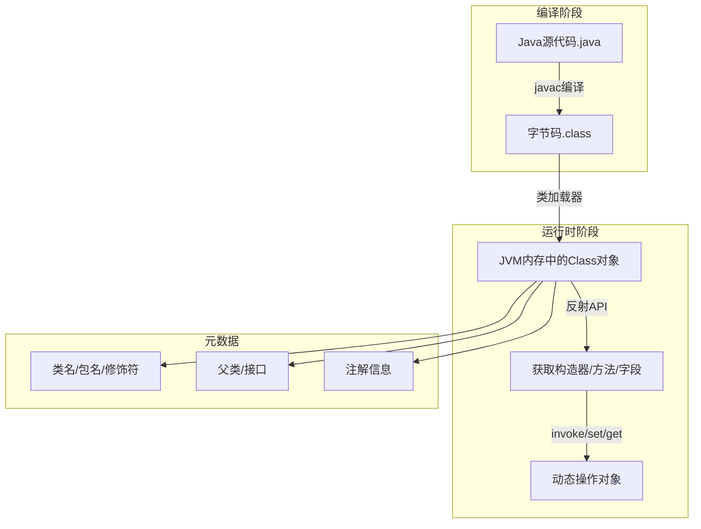
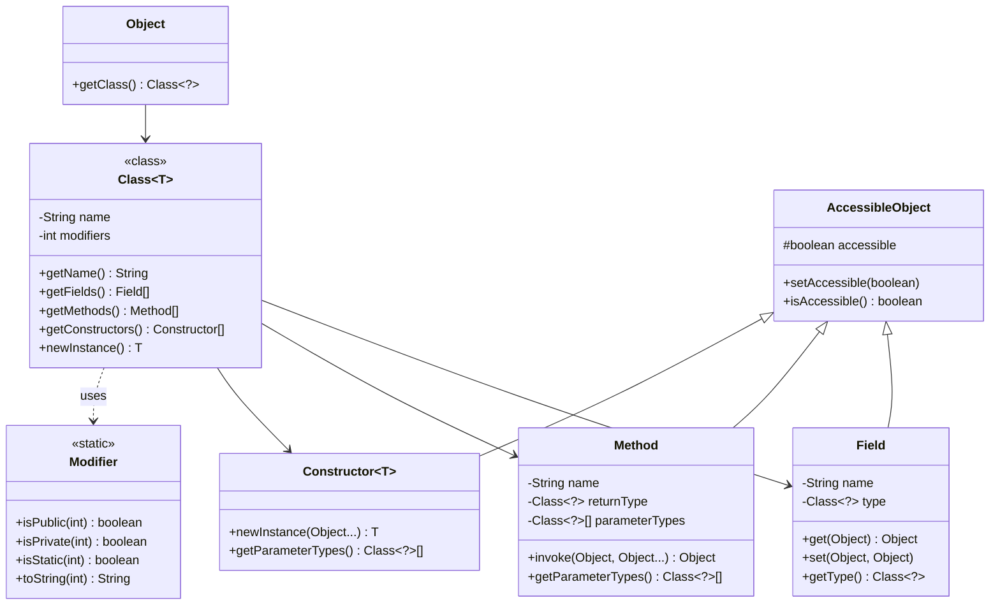
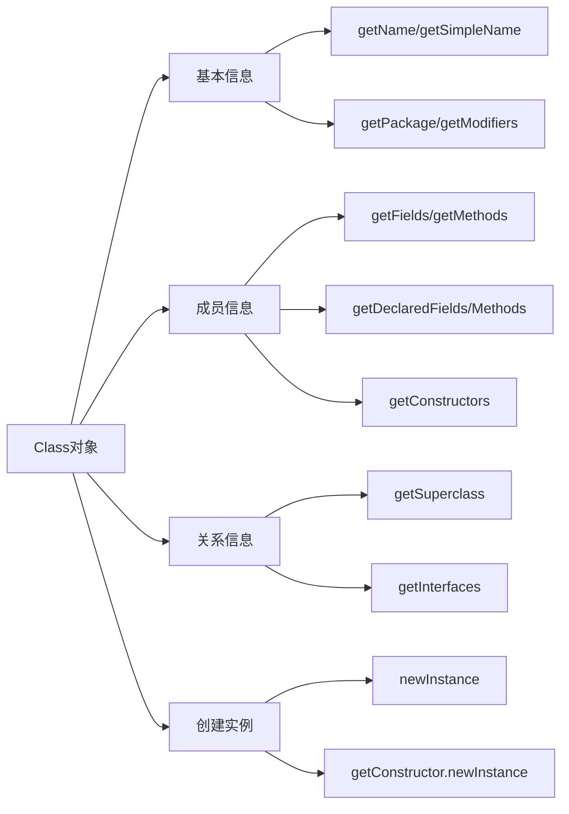
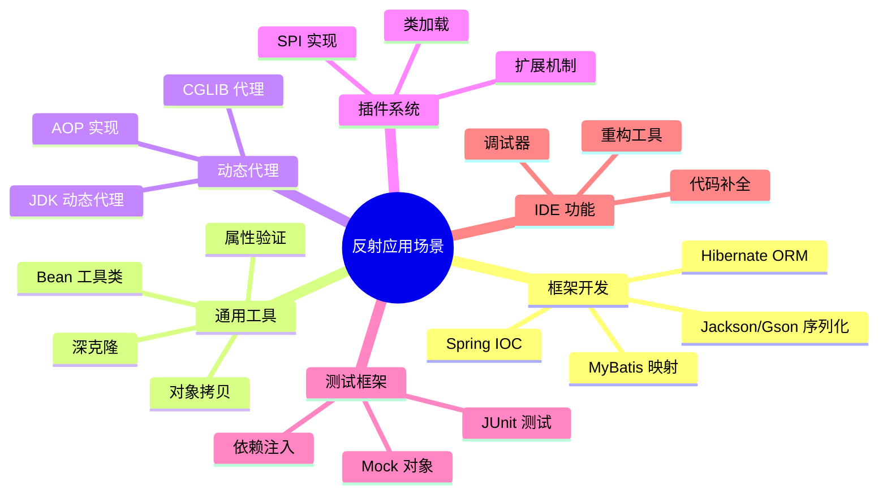
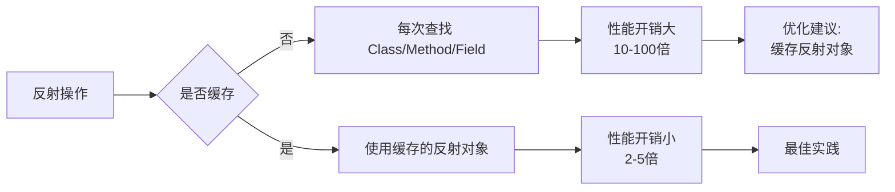
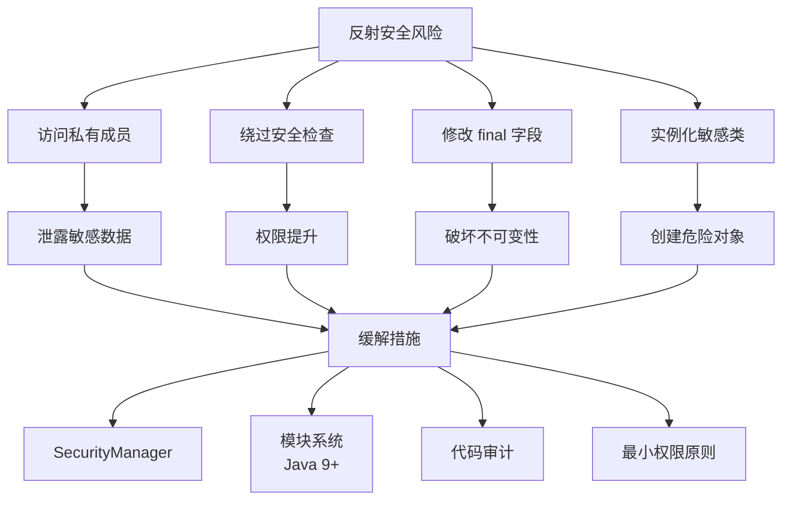
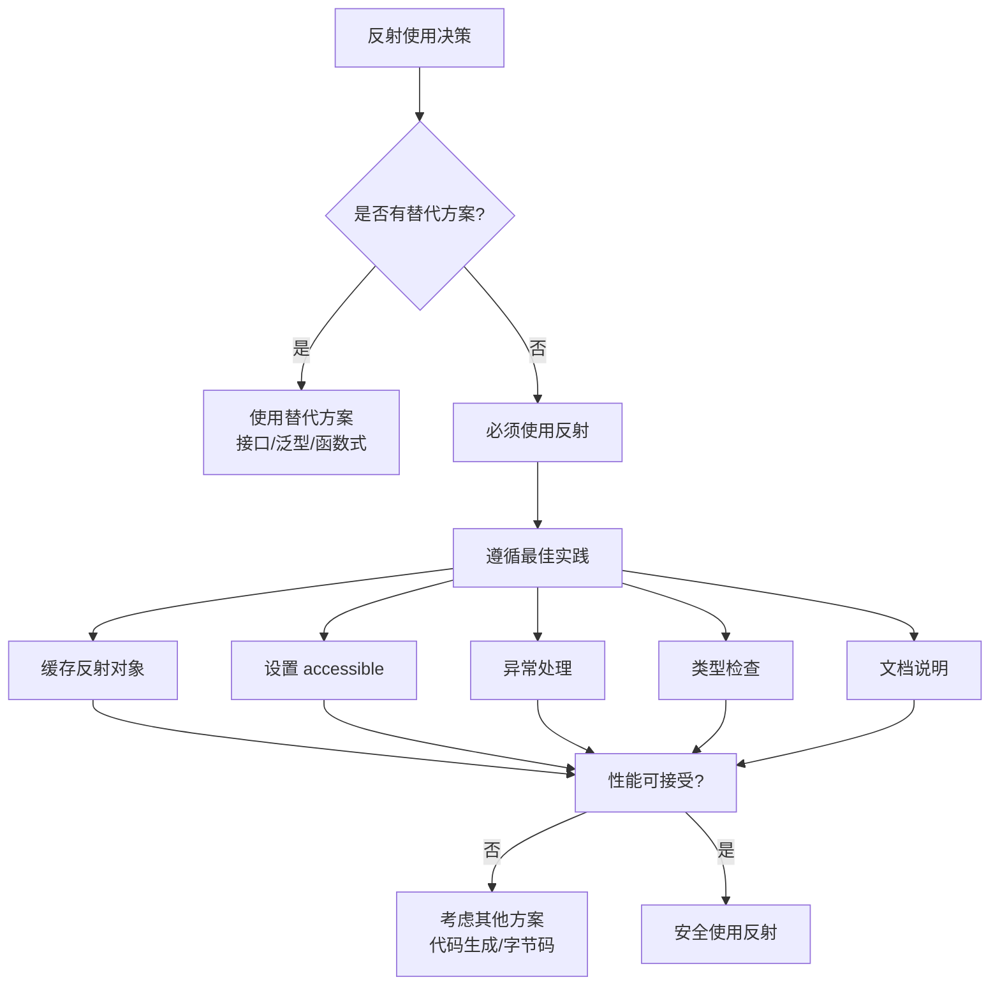
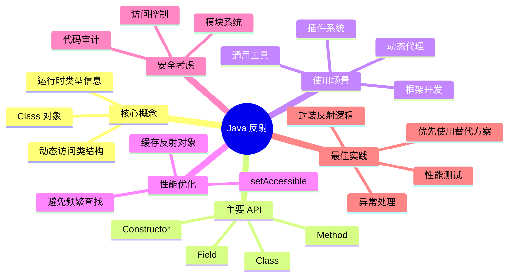

# 反射Reflection

## 1. 反射概述
### 1.1 什么是反射
**反射（Reflection）** 是 Java 语言的一个强大特性，它允许程序在**运行时**动态地访问、检测和修改应用程序状态或行为。简单来说，反射让 Java 代码可以"自我审视"。

```
编译时类型检查 ←→ 运行时动态探索
    (静态)              (动态)
```

### 1.2 反射的核心能力

| 能力 | 描述 | 示例 |
|------|------|------|
| **运行时类型识别** | 在程序运行时判断任意对象的类 | `obj.getClass()` |
| **动态创建对象** | 在运行时实例化任意类 | `Class.newInstance()` |
| **访问私有成员** | 突破访问限制，访问 private 字段/方法 | `setAccessible(true)` |
| **动态调用方法** | 运行时调用任意方法 | `Method.invoke()` |
| **操作字段** | 读取和修改字段值 | `Field.get/set()` |

### 1.3 反射的工作原理


**核心机制：**
- JVM 为每个加载的类创建一个 `java.lang.Class` 对象
- Class 对象包含类的完整结构信息（字段、方法、构造器、注解等）
- 通过 Class 对象可以访问和操作类的所有成员

## 2. 反射核心架构
### 2.1 反射 API 层次结构


### 2.2 反射核心类说明
| 类名 | 包路径 | 作用 |
|------|--------|------|
| **Class** | `java.lang` | 表示加载到 JVM 中的类，是反射的入口 |
| **Field** | `java.lang.reflect` | 表示类的成员变量（字段） |
| **Method** | `java.lang.reflect` | 表示类的方法 |
| **Constructor** | `java.lang.reflect` | 表示类的构造方法 |
| **Modifier** | `java.lang.reflect` | 提供静态方法检查访问修饰符 |
| **AccessibleObject** | `java.lang.reflect` | Field/Method/Constructor 的父类，提供访问控制 |


## 3. Class 类详解
### 3.1 获取 Class 对象的三种方式
```java
public class Person {
    private String name;
    private int age;
    
    public Person() {}
    
    public Person(String name, int age) {
        this.name = name;
        this.age = age;
    }
    
    // getters and setters...
}
```

#### 方式对比
| 方式 | 语法 | 适用场景 | 特点 |
|------|------|----------|------|
| **Class.forName()** | `Class.forName("com.example.Person")` | 类名以字符串形式给出时 | 会执行静态初始化块，受检异常 |
| **.class 语法** | `Person.class` | 编译时已知类型 | 不会初始化类，最安全高效 |
| **getClass()** | `person.getClass()` | 已有对象实例 | 适用于运行时类型未知 |
```java
public class ClassObjectDemo {
    public static void main(String[] args) throws Exception {
        // 方式1: Class.forName() - 最常用
        Class<?> class1 = Class.forName("com.example.Person");
        System.out.println("方式1: " + class1.getName());
        
        // 方式2: .class 语法
        Class<?> class2 = Person.class;
        System.out.println("方式2: " + class2.getName());
        
        // 方式3: 对象.getClass()
        Person person = new Person("张三", 25);
        Class<?> class3 = person.getClass();
        System.out.println("方式3: " + class3.getName());
        
        // 验证：三个 Class 对象是同一个
        System.out.println("class1 == class2: " + (class1 == class2)); // true
        System.out.println("class2 == class3: " + (class2 == class3)); // true
    }
}
```
### 3.2 Class 类的重要方法


#### 常用方法分类
**1. 基本信息获取**
```java
public class ClassInfoDemo {
    public static void main(String[] args) throws Exception {
        Class<?> clazz = Person.class;
        
        // 类名
        System.out.println("完整类名: " + clazz.getName());           // com.example.Person
        System.out.println("简单类名: " + clazz.getSimpleName());     // Person
        System.out.println("规范名: " + clazz.getCanonicalName());    // com.example.Person
        
        // 包信息
        Package pkg = clazz.getPackage();
        System.out.println("包名: " + pkg.getName());
        
        // 修饰符
        int modifiers = clazz.getModifiers();
        System.out.println("修饰符: " + Modifier.toString(modifiers)); // public
        
        // 类型信息
        System.out.println("是否是类: " + clazz.isClass());
        System.out.println("是否是接口: " + clazz.isInterface());
        System.out.println("是否是枚举: " + clazz.isEnum());
        System.out.println("是否是数组: " + clazz.isArray());
        System.out.println("是否是原始类型: " + clazz.isPrimitive());
        System.out.println("是否是注解: " + clazz.isAnnotation());
    }
}
```
**2. 类层次关系**
```java
public class HierarchyDemo {
    public static void main(String[] args) {
        Class<?> clazz = ArrayList.class;
        
        // 父类
        Class<?> superClass = clazz.getSuperclass();
        System.out.println("父类: " + superClass.getName()); // AbstractList
        
        // 实现的接口
        Class<?>[] interfaces = clazz.getInterfaces();
        System.out.println("实现的接口:");
        for (Class<?> iface : interfaces) {
            System.out.println("  - " + iface.getName()); // List, RandomAccess...
        }
        
        // 判断关系
        System.out.println("ArrayList 是 List 的子类: " + List.class.isAssignableFrom(ArrayList.class));
        System.out.println("ArrayList 是 Object 的子类: " + Object.class.isAssignableFrom(ArrayList.class));
    }
}
```

**3. 获取成员（核心区别）**
```java
public class MemberAccessDemo {
    public static void main(String[] args) {
        Class<?> clazz = Person.class;
        
        System.out.println("=== 获取公共成员（包括继承的）===");
        Field[] publicFields = clazz.getFields();
        Method[] publicMethods = clazz.getMethods();
        Constructor<?>[] publicConstructors = clazz.getConstructors();
        
        System.out.println("=== 获取声明的成员（不包括继承，包括私有）===");
        Field[] declaredFields = clazz.getDeclaredFields();
        Method[] declaredMethods = clazz.getDeclaredMethods();
        Constructor<?>[] declaredConstructors = clazz.getDeclaredConstructors();
        
        System.out.println("\n对比说明:");
        System.out.println("getFields() vs getDeclaredFields():");
        System.out.println("  - getFields(): 仅 public，包括继承");
        System.out.println("  - getDeclaredFields(): 所有修饰符，仅本类");
    }
}
```


## 4. 反射 API 全面解析
### 4.1 操作字段（Field）
```java
public class FieldOperationDemo {
    public static void main(String[] args) throws Exception {
        Person person = new Person("张三", 25);
        Class<?> clazz = person.getClass();
        
        // 1. 获取公共字段
        System.out.println("=== 公共字段 ===");
        Field[] publicFields = clazz.getFields();
        for (Field field : publicFields) {
            System.out.println(field.getName() + ": " + field.getType().getSimpleName());
        }
        
        // 2. 获取所有声明字段（包括 private）
        System.out.println("\n=== 声明字段 ===");
        Field[] declaredFields = clazz.getDeclaredFields();
        for (Field field : declaredFields) {
            System.out.println(field.getName() + ": " + field.getType().getSimpleName());
        }
        
        // 3. 访问私有字段
        System.out.println("\n=== 访问私有字段 ===");
        Field nameField = clazz.getDeclaredField("name");
        nameField.setAccessible(true); // 突破访问限制
        
        // 读取字段值
        String name = (String) nameField.get(person);
        System.out.println("读取 name: " + name);
        
        // 修改字段值
        nameField.set(person, "李四");
        System.out.println("修改后 name: " + nameField.get(person));
        
        // 4. 字段信息
        System.out.println("\n=== 字段信息 ===");
        System.out.println("字段名: " + nameField.getName());
        System.out.println("字段类型: " + nameField.getType().getName());
        System.out.println("修饰符: " + Modifier.toString(nameField.getModifiers()));
        
        // 5. 静态字段操作
        System.out.println("\n=== 静态字段 ===");
        // 假设有一个静态字段
        // Field staticField = clazz.getDeclaredField("COUNT");
        // staticField.setAccessible(true);
        // staticField.set(null, 100); // 静态字段传入 null
    }
}
```

### 4.2 操作方法（Method）
```java
public class MethodOperationDemo {
    public static void main(String[] args) throws Exception {
        Person person = new Person("张三", 25);
        Class<?> clazz = person.getClass();
        
        // 1. 获取所有公共方法（包括继承的）
        System.out.println("=== 公共方法（部分）===");
        Method[] methods = clazz.getMethods();
        int count = 0;
        for (Method method : methods) {
            if (count++ < 5) { // 只显示前5个
                System.out.println(method.getName() + 
                    "(" + Arrays.toString(method.getParameterTypes()) + ")");
            }
        }
        
        // 2. 获取声明的方法
        System.out.println("\n=== 声明方法 ===");
        Method[] declaredMethods = clazz.getDeclaredMethods();
        for (Method method : declaredMethods) {
            System.out.println(method.getName());
        }
        
        // 3. 获取特定方法
        System.out.println("\n=== 调用特定方法 ===");
        // 无参方法
        Method getNameMethod = clazz.getMethod("getName");
        String name = (String) getNameMethod.invoke(person);
        System.out.println("getName(): " + name);
        
        // 有参方法
        Method setNameMethod = clazz.getMethod("setName", String.class);
        setNameMethod.invoke(person, "李四");
        System.out.println("修改后: " + getNameMethod.invoke(person));
        
        // 4. 调用私有方法
        System.out.println("\n=== 调用私有方法 ===");
        Method privateMethod = clazz.getDeclaredMethod("privateMethod", String.class);
        privateMethod.setAccessible(true);
        String result = (String) privateMethod.invoke(person, "测试参数");
        System.out.println("私有方法返回: " + result);
        
        // 5. 调用静态方法
        System.out.println("\n=== 调用静态方法 ===");
        // Method staticMethod = clazz.getMethod("staticMethod", String.class);
        // staticMethod.invoke(null, "参数"); // 静态方法传入 null
        
        // 6. 方法详细信息
        System.out.println("\n=== 方法信息 ===");
        Method method = clazz.getDeclaredMethods()[0];
        System.out.println("方法名: " + method.getName());
        System.out.println("返回类型: " + method.getReturnType().getSimpleName());
        System.out.println("参数类型: " + Arrays.toString(method.getParameterTypes()));
        System.out.println("异常类型: " + Arrays.toString(method.getExceptionTypes()));
        System.out.println("修饰符: " + Modifier.toString(method.getModifiers()));
    }
}

// Person 类补充
class Person {
    private String name;
    private int age;
    
    public Person() {}
    
    public Person(String name, int age) {
        this.name = name;
        this.age = age;
    }
    
    public String getName() { return name; }
    public void setName(String name) { this.name = name; }
    public int getAge() { return age; }
    public void setAge(int age) { this.age = age; }
    
    private String privateMethod(String param) {
        return "私有方法被调用: " + param;
    }
    
    public static String staticMethod(String param) {
        return "静态方法: " + param;
    }
}
```

### 4.3 操作构造器（Constructor）
```java
public class ConstructorDemo {
    public static void main(String[] args) throws Exception {
        Class<?> clazz = Person.class;
        
        // 1. 获取所有公共构造器
        System.out.println("=== 公共构造器 ===");
        Constructor<?>[] constructors = clazz.getConstructors();
        for (Constructor<?> constructor : constructors) {
            System.out.println("Constructor: " + 
                Arrays.toString(constructor.getParameterTypes()));
        }
        
        // 2. 获取所有声明构造器
        System.out.println("\n=== 声明构造器 ===");
        Constructor<?>[] declaredConstructors = clazz.getDeclaredConstructors();
        for (Constructor<?> constructor : declaredConstructors) {
            System.out.println("Constructor: " + 
                Arrays.toString(constructor.getParameterTypes()));
        }
        
        // 3. 使用无参构造器创建对象
        System.out.println("\n=== 创建对象 ===");
        Constructor<?> noArgConstructor = clazz.getConstructor();
        Person person1 = (Person) noArgConstructor.newInstance();
        System.out.println("无参构造: " + person1);
        
        // 4. 使用有参构造器创建对象
        Constructor<?> argConstructor = clazz.getConstructor(String.class, int.class);
        Person person2 = (Person) argConstructor.newInstance("张三", 25);
        System.out.println("有参构造: name=" + person2.getName() + ", age=" + person2.getAge());
        
        // 5. 使用私有构造器
        System.out.println("\n=== 私有构造器 ===");
        // 假设有一个私有构造器
        // Constructor<?> privateConstructor = clazz.getDeclaredConstructor(String.class);
        // privateConstructor.setAccessible(true);
        // Person person3 = (Person) privateConstructor.newInstance("仅名字");
        
        // 6. 简化写法
        System.out.println("\n=== 简化写法 ===");
        Person person4 = clazz.newInstance(); // 已过时，推荐使用 Constructor.newInstance()
        System.out.println("简化创建: " + person4);
    }
}
```

### 4.4 数组反射操作
```java
public class ArrayReflectionDemo {
    public static void main(String[] args) throws Exception {
        // 1. 获取数组的 Class 对象
        Class<?> intArrayClass = int[].class;
        Class<?> stringArrayClass = String[].class;
        Class<?> personArrayClass = Person[].class;
        
        System.out.println("int[] 的 Class: " + intArrayClass.getName()); // [I
        System.out.println("String[] 的 Class: " + stringArrayClass.getName()); // [Ljava.lang.String;
        System.out.println("Person[] 的 Class: " + personArrayClass.getName()); // [Lcom.example.Person;
        
        // 2. 判断是否为数组
        System.out.println("\n是否为数组:");
        System.out.println("int[]: " + intArrayClass.isArray()); // true
        System.out.println("String: " + String.class.isArray()); // false
        
        // 3. 获取数组组件类型
        System.out.println("\n组件类型:");
        System.out.println("int[] 的组件类型: " + intArrayClass.getComponentType()); // int
        System.out.println("String[] 的组件类型: " + stringArrayClass.getComponentType()); // class java.lang.String
        
        // 4. 动态创建数组
        System.out.println("\n动态创建数组:");
        Object array = Array.newInstance(String.class, 5); // 创建 String[5]
        Array.set(array, 0, "Hello");
        Array.set(array, 1, "World");
        System.out.println("array[0]: " + Array.get(array, 0));
        System.out.println("array[1]: " + Array.get(array, 1));
        System.out.println("数组长度: " + Array.getLength(array));
        
        // 5. 多维数组
        System.out.println("\n多维数组:");
        Object multiArray = Array.newInstance(int.class, 3, 4); // int[3][4]
        System.out.println("多维数组: " + multiArray.getClass().getName()); // [[I
    }
}
```

### 4.5 泛型信息获取
```java
public class GenericReflectionDemo {
    
    // 带泛型的字段
    private List<String> stringList;
    private Map<Integer, Person> personMap;
    
    // 带泛型的方法
    public List<String> getStringList() { return stringList; }
    public void setPersonMap(Map<Integer, Person> map) { this.personMap = map; }
    
    public static void main(String[] args) throws Exception {
        Class<?> clazz = GenericReflectionDemo.class;
        
        // 1. 获取字段的泛型类型
        System.out.println("=== 字段泛型信息 ===");
        Field stringListField = clazz.getDeclaredField("stringList");
        Type genericType = stringListField.getGenericType();
        System.out.println("字段类型: " + genericType); // java.util.List<java.lang.String>
        
        if (genericType instanceof ParameterizedType) {
            ParameterizedType pt = (ParameterizedType) genericType;
            System.out.println("原始类型: " + pt.getRawType()); // class java.util.List
            System.out.println("实际类型参数:");
            for (Type typeArg : pt.getActualTypeArguments()) {
                System.out.println("  - " + typeArg); // class java.lang.String
            }
        }
        
        // 2. 获取方法的泛型参数
        System.out.println("\n=== 方法泛型信息 ===");
        Method setPersonMapMethod = clazz.getMethod("setPersonMap", Map.class);
        Type[] genericParamTypes = setPersonMapMethod.getGenericParameterTypes();
        
        for (Type paramType : genericParamTypes) {
            if (paramType instanceof ParameterizedType) {
                ParameterizedType pt = (ParameterizedType) paramType;
                System.out.println("参数类型: " + pt.getRawType());
                System.out.println("类型参数:");
                for (Type typeArg : pt.getActualTypeArguments()) {
                    System.out.println("  - " + typeArg);
                }
            }
        }
        
        // 3. 获取方法的泛型返回类型
        System.out.println("\n=== 返回类型泛型 ===");
        Method getStringListMethod = clazz.getMethod("getStringList");
        Type genericReturnType = getStringListMethod.getGenericReturnType();
        System.out.println("返回类型: " + genericReturnType);
    }
}
```


## 5. 反射应用场景
### 5.1 场景对比总览


### 5.2 场景详细对比

| 应用场景 | 典型框架 | 反射用途 | 性能影响 |
|---------|---------|---------|---------|
| **依赖注入** | Spring | 创建对象、注入字段/方法 | 中（可缓存） |
| **ORM 映射** | Hibernate, MyBatis | 字段访问、结果集映射 | 中高 |
| **JSON 序列化** | Jackson, Gson | 遍历字段、调用 getter/setter | 中 |
| **动态代理** | Spring AOP | 生成代理类、方法拦截 | 低（一次生成） |
| **测试框架** | JUnit | 发现测试方法、注入依赖 | 低 |
| **插件系统** | 自定义 | 动态加载类、实例化 | 高（类加载） |

### 5.3 实战案例
#### 案例 1：通用对象拷贝工具
```java
public class BeanUtils {
    
    /**
     * 复制对象属性（同名且类型兼容的字段）
     */
    public static void copyProperties(Object source, Object target) {
        Class<?> sourceClass = source.getClass();
        Class<?> targetClass = target.getClass();
        
        // 获取源对象的所有声明字段
        Field[] sourceFields = sourceClass.getDeclaredFields();
        
        for (Field sourceField : sourceFields) {
            try {
                // 跳过 static 和 final 字段
                int modifiers = sourceField.getModifiers();
                if (Modifier.isStatic(modifiers) || Modifier.isFinal(modifiers)) {
                    continue;
                }
                
                // 尝试在目标对象中找到同名字段
                try {
                    Field targetField = targetClass.getDeclaredField(sourceField.getName());
                    
                    // 检查类型是否兼容
                    if (isAssignable(sourceField.getType(), targetField.getType())) {
                        sourceField.setAccessible(true);
                        targetField.setAccessible(true);
                        
                        Object value = sourceField.get(source);
                        targetField.set(target, value);
                    }
                } catch (NoSuchFieldException e) {
                    // 目标类没有该字段，跳过
                }
            } catch (IllegalAccessException e) {
                throw new RuntimeException("属性复制失败", e);
            }
        }
    }
    
    private static boolean isAssignable(Class<?> sourceType, Class<?> targetType) {
        // 处理基本类型和包装类型的兼容
        if (sourceType.isPrimitive()) {
            sourceType = primitiveToWrapper(sourceType);
        }
        if (targetType.isPrimitive()) {
            targetType = primitiveToWrapper(targetType);
        }
        return targetType.isAssignableFrom(sourceType);
    }
    
    private static Class<?> primitiveToWrapper(Class<?> primitive) {
        if (primitive == int.class) return Integer.class;
        if (primitive == long.class) return Long.class;
        if (primitive == boolean.class) return Boolean.class;
        if (primitive == double.class) return Double.class;
        if (primitive == float.class) return Float.class;
        if (primitive == char.class) return Character.class;
        if (primitive == short.class) return Short.class;
        if (primitive == byte.class) return Byte.class;
        return primitive;
    }
    
    // 测试
    public static void main(String[] args) {
        Person source = new Person("张三", 25);
        Person target = new Person();
        
        copyProperties(source, target);
        System.out.println("target name: " + target.getName());
        System.out.println("target age: " + target.getAge());
    }
}
```

#### 案例 2：简易 IOC 容器
```java
public class SimpleIOC {
    
    // 存储 Bean 实例
    private Map<String, Object> beanMap = new ConcurrentHashMap<>();
    
    // 存储 Bean 定义
    private Map<String, Class<?>> beanDefinitionMap = new ConcurrentHashMap<>();
    
    /**
     * 注册 Bean 定义
     */
    public void registerBeanDefinition(String beanName, Class<?> beanClass) {
        beanDefinitionMap.put(beanName, beanClass);
    }
    
    /**
     * 初始化所有单例 Bean
     */
    public void preInstantiateSingletons() {
        beanDefinitionMap.forEach((beanName, beanClass) -> {
            try {
                Object bean = createBean(beanClass);
                beanMap.put(beanName, bean);
            } catch (Exception e) {
                throw new RuntimeException("创建 Bean 失败: " + beanName, e);
            }
        });
        
        // 依赖注入
        beanMap.forEach((beanName, bean) -> {
            injectDependencies(bean);
        });
    }
    
    /**
     * 创建 Bean 实例
     */
    private Object createBean(Class<?> beanClass) throws Exception {
        // 获取无参构造器
        Constructor<?> constructor = beanClass.getDeclaredConstructor();
        constructor.setAccessible(true);
        return constructor.newInstance();
    }
    
    /**
     * 依赖注入
     */
    private void injectDependencies(Object bean) {
        Class<?> beanClass = bean.getClass();
        Field[] fields = beanClass.getDeclaredFields();
        
        for (Field field : fields) {
            // 检查是否有 @Autowired 注解（简化版，这里检查字段名）
            if (field.isAnnotationPresent(Autowired.class)) {
                try {
                    String dependencyName = field.getName();
                    Object dependency = beanMap.get(dependencyName);
                    
                    if (dependency != null) {
                        field.setAccessible(true);
                        field.set(bean, dependency);
                    }
                } catch (IllegalAccessException e) {
                    throw new RuntimeException("依赖注入失败", e);
                }
            }
        }
    }
    
    /**
     * 获取 Bean
     */
    @SuppressWarnings("unchecked")
    public <T> T getBean(String beanName) {
        return (T) beanMap.get(beanName);
    }
    
    // 注解定义
    @Retention(RetentionPolicy.RUNTIME)
    @Target(ElementType.FIELD)
    @interface Autowired {}
    
    // 测试
    public static void main(String[] args) {
        SimpleIOC ioc = new SimpleIOC();
        
        // 注册 Bean
        ioc.registerBeanDefinition("userService", UserService.class);
        ioc.registerBeanDefinition("userRepository", UserRepository.class);
        
        // 初始化
        ioc.preInstantiateSingletons();
        
        // 使用
        UserService userService = ioc.getBean("userService");
        userService.createUser("张三");
    }
}

class UserRepository {
    public void save(String name) {
        System.out.println("保存用户: " + name);
    }
}

class UserService {
    @SimpleIOC.Autowired
    private UserRepository userRepository;
    
    public void createUser(String name) {
        userRepository.save(name);
    }
}
```

#### 案例 3：JSON 序列化器（简化版）
```java
public class SimpleJSONSerializer {
    
    /**
     * 对象转 JSON 字符串
     */
    public static String toJson(Object obj) throws Exception {
        if (obj == null) {
            return "null";
        }
        
        Class<?> clazz = obj.getClass();
        
        // 基本类型和字符串
        if (isPrimitiveOrWrapper(clazz) || clazz == String.class) {
            return "\"" + obj.toString() + "\"";
        }
        
        // 对象
        StringBuilder json = new StringBuilder("{");
        Field[] fields = clazz.getDeclaredFields();
        boolean first = true;
        
        for (Field field : fields) {
            int modifiers = field.getModifiers();
            if (Modifier.isStatic(modifiers) || Modifier.isTransient(modifiers)) {
                continue;
            }
            
            field.setAccessible(true);
            Object value = field.get(obj);
            
            if (!first) {
                json.append(",");
            }
            first = false;
            
            json.append("\"").append(field.getName()).append("\":");
            json.append(valueToJson(value));
        }
        
        json.append("}");
        return json.toString();
    }
    
    private static String valueToJson(Object value) throws Exception {
        if (value == null) {
            return "null";
        }
        
        if (value instanceof String) {
            return "\"" + value + "\"";
        }
        
        if (value.getClass().isArray()) {
            return arrayToJson(value);
        }
        
        if (isPrimitiveOrWrapper(value.getClass())) {
            return value.toString();
        }
        
        return toJson(value);
    }
    
    private static String arrayToJson(Object array) throws Exception {
        int length = Array.getLength(array);
        StringBuilder json = new StringBuilder("[");
        
        for (int i = 0; i < length; i++) {
            if (i > 0) {
                json.append(",");
            }
            json.append(valueToJson(Array.get(array, i)));
        }
        
        json.append("]");
        return json.toString();
    }
    
    private static boolean isPrimitiveOrWrapper(Class<?> clazz) {
        return clazz.isPrimitive() || 
               clazz == Integer.class || clazz == Long.class ||
               clazz == Double.class || clazz == Float.class ||
               clazz == Boolean.class || clazz == Character.class ||
               clazz == Short.class || clazz == Byte.class;
    }
    
    // 测试
    public static void main(String[] args) throws Exception {
        Person person = new Person("张三", 25);
        String json = toJson(person);
        System.out.println(json);
        // 输出: {"name":"张三","age":25}
    }
}
```

#### 案例 4：动态代理实现
```java
import java.lang.reflect.InvocationHandler;
import java.lang.reflect.Method;
import java.lang.reflect.Proxy;

public class DynamicProxyDemo {
    
    // 接口
    interface UserService {
        void createUser(String name);
        User getUserById(int id);
    }
    
    // 实现类
    static class UserServiceImpl implements UserService {
        @Override
        public void createUser(String name) {
            System.out.println("创建用户: " + name);
        }
        
        @Override
        public User getUserById(int id) {
            System.out.println("查询用户 ID: " + id);
            return new User(id, "User" + id);
        }
    }
    
    static class User {
        int id;
        String name;
        
        User(int id, String name) {
            this.id = id;
            this.name = name;
        }
    }
    
    // 代理处理器
    static class LoggingInvocationHandler implements InvocationHandler {
        private final Object target;
        
        public LoggingInvocationHandler(Object target) {
            this.target = target;
        }
        
        @Override
        public Object invoke(Object proxy, Method method, Object[] args) throws Throwable {
            System.out.println("=== 方法调用开始 ===");
            System.out.println("方法名: " + method.getName());
            System.out.println("参数: " + Arrays.toString(args));
            
            long startTime = System.currentTimeMillis();
            
            // 调用目标方法
            Object result = method.invoke(target, args);
            
            long endTime = System.currentTimeMillis();
            System.out.println("执行时间: " + (endTime - startTime) + "ms");
            System.out.println("返回结果: " + result);
            System.out.println("=== 方法调用结束 ===\n");
            
            return result;
        }
    }
    
    public static void main(String[] args) {
        // 创建目标对象
        UserService target = new UserServiceImpl();
        
        // 创建代理
        UserService proxy = (UserService) Proxy.newProxyInstance(
            UserService.class.getClassLoader(),
            new Class<?>[]{UserService.class},
            new LoggingInvocationHandler(target)
        );
        
        // 通过代理调用方法
        proxy.createUser("张三");
        User user = proxy.getUserById(1);
        System.out.println("获取到用户: " + user.name);
    }
}
```

## 6. 性能与安全
### 6.1 性能分析


#### 性能对比测试
```java
public class ReflectionPerformanceTest {
    
    private static final int ITERATIONS = 1_000_000;
    
    public static void main(String[] args) {
        Person person = new Person("张三", 25);
        
        // 1. 直接调用
        long startTime = System.currentTimeMillis();
        for (int i = 0; i < ITERATIONS; i++) {
            String name = person.getName();
            person.setAge(25);
        }
        long directTime = System.currentTimeMillis() - startTime;
        System.out.println("直接调用耗时: " + directTime + "ms");
        
        // 2. 反射调用（不缓存）
        startTime = System.currentTimeMillis();
        for (int i = 0; i < ITERATIONS; i++) {
            try {
                Method getName = person.getClass().getMethod("getName");
                Method setAge = person.getClass().getMethod("setAge", int.class);
                getName.invoke(person);
                setAge.invoke(person, 25);
            } catch (Exception e) {
                e.printStackTrace();
            }
        }
        long reflectionNoCacheTime = System.currentTimeMillis() - startTime;
        System.out.println("反射调用（无缓存）耗时: " + reflectionNoCacheTime + "ms");
        System.out.println("性能比: " + (reflectionNoCacheTime * 1.0 / directTime));
        
        // 3. 反射调用（缓存）
        try {
            Method getName = person.getClass().getMethod("getName");
            Method setAge = person.getClass().getMethod("setAge", int.class);
            getName.setAccessible(true);
            setAge.setAccessible(true);
            
            startTime = System.currentTimeMillis();
            for (int i = 0; i < ITERATIONS; i++) {
                getName.invoke(person);
                setAge.invoke(person, 25);
            }
            long reflectionCacheTime = System.currentTimeMillis() - startTime;
            System.out.println("反射调用（缓存）耗时: " + reflectionCacheTime + "ms");
            System.out.println("性能比: " + (reflectionCacheTime * 1.0 / directTime));
        } catch (Exception e) {
            e.printStackTrace();
        }
    }
}
```

#### 性能优化建议表
| 优化策略 | 说明 | 性能提升 | 实现难度 |
|---------|------|---------|---------|
| **缓存反射对象** | 缓存 Class、Method、Field 对象 | 10-50倍 | 简单 |
| **使用 setAccessible** | 关闭访问检查 | 2-5倍 | 简单 |
| **避免频繁反射** | 在循环外获取反射对象 | 显著 | 简单 |
| **使用方法句柄** | Java 9+ MethodHandle | 接近直接调用 | 中等 |
| **使用 LambdaMetafactory** | 生成调用点 | 接近直接调用 | 困难 |

### 6.2 安全风险


#### 安全示例
```java
public class ReflectionSecurityDemo {
    
    // 1. 访问私有字段
    public static void accessPrivateField() throws Exception {
        class Secret {
            private String password = "secret123";
        }
        
        Secret secret = new Secret();
        Field field = Secret.class.getDeclaredField("password");
        field.setAccessible(true);
        String password = (String) field.get(secret);
        System.out.println("密码泄露: " + password);
    }
    
    // 2. 修改 final 字段
    public static void modifyFinalField() throws Exception {
        class Config {
            public final String API_KEY = "original-key";
        }
        
        Config config = new Config();
        System.out.println("原始值: " + config.API_KEY);
        
        Field field = Config.class.getDeclaredField("API_KEY");
        field.setAccessible(true);
        
        // 移除 final 修饰符
        Field modifiersField = Field.class.getDeclaredField("modifiers");
        modifiersField.setAccessible(true);
        modifiersField.setInt(field, field.getModifiers() & ~Modifier.FINAL);
        
        field.set(config, "hacked-key");
        System.out.println("修改后: " + config.API_KEY);
    }
    
    // 3. 绕过构造器限制
    public static void bypassConstructor() throws Exception {
        class Singleton {
            private static final Singleton INSTANCE = new Singleton();
            private Singleton() {
                if (INSTANCE != null) {
                    throw new RuntimeException("单例被破坏");
                }
            }
            public static Singleton getInstance() {
                return INSTANCE;
            }
        }
        
        // 通过反射创建第二个实例
        Constructor<?> constructor = Singleton.class.getDeclaredConstructor();
        constructor.setAccessible(true);
        Singleton instance2 = (Singleton) constructor.newInstance();
        
        System.out.println("INSTANCE: " + Singleton.getInstance());
        System.out.println("instance2: " + instance2);
        System.out.println("是否相同: " + (Singleton.getInstance() == instance2));
    }
    
    public static void main(String[] args) {
        try {
            System.out.println("=== 访问私有字段 ===");
            accessPrivateField();
            
            System.out.println("\n=== 修改 final 字段 ===");
            modifyFinalField();
            
            System.out.println("\n=== 绕过构造器限制 ===");
            bypassConstructor();
        } catch (Exception e) {
            e.printStackTrace();
        }
    }
}
```

#### Java 9+ 模块系统限制

```java
// module-info.java
module com.example.mymodule {
    // 开放特定包供反射
    opens com.example.model to java.base;
    
    // 开放所有包
    opens com.example;
    
    // 导出包（编译时和运行时访问）
    exports com.example.api;
}
```

**模块系统对反射的影响：**

| 场景 | Java 8 | Java 9+ |
|------|--------|---------|
| 反射访问 public 成员 | ✅ 允许 | ✅ 允许 |
| 反射访问私有成员 | ✅ 允许 | ⚠️ 需要 opens |
| 跨模块反射 | ✅ 允许 | ❌ 默认禁止 |
| 深度反射 | ✅ 允许 | ⚠️ 需要 --add-opens |


## 7. 最佳实践
### 7.1 反射使用原则


### 7.2 反射工具类封装

```java
public final class ReflectionUtils {
    
    // 缓存
    private static final Map<Class<?>, Field[]> DECLARED_FIELDS_CACHE = new ConcurrentHashMap<>();
    private static final Map<Class<?>, Method[]> DECLARED_METHODS_CACHE = new ConcurrentHashMap<>();
    private static final Map<MethodKey, Method> METHOD_CACHE = new ConcurrentHashMap<>();
    
    private ReflectionUtils() {
        throw new UnsupportedOperationException("工具类不能实例化");
    }
    
    /**
     * 获取字段（带缓存）
     */
    public static Field getDeclaredField(Class<?> clazz, String fieldName) {
        try {
            Field field = findField(clazz, fieldName);
            field.setAccessible(true);
            return field;
        } catch (NoSuchFieldException e) {
            throw new RuntimeException("字段不存在: " + fieldName, e);
        }
    }
    
    /**
     * 获取字段值
     */
    @SuppressWarnings("unchecked")
    public static <T> T getFieldValue(Object obj, String fieldName) {
        Field field = getDeclaredField(obj.getClass(), fieldName);
        try {
            return (T) field.get(obj);
        } catch (IllegalAccessException e) {
            throw new RuntimeException("访问字段失败", e);
        }
    }
    
    /**
     * 设置字段值
     */
    public static void setFieldValue(Object obj, String fieldName, Object value) {
        Field field = getDeclaredField(obj.getClass(), fieldName);
        try {
            field.set(obj, value);
        } catch (IllegalAccessException e) {
            throw new RuntimeException("设置字段失败", e);
        }
    }
    
    /**
     * 调用方法（带缓存）
     */
    public static Object invokeMethod(Object obj, String methodName, Object... args) {
        Class<?>[] argTypes = getArgTypes(args);
        MethodKey key = new MethodKey(obj.getClass(), methodName, argTypes);
        
        Method method = METHOD_CACHE.computeIfAbsent(key, k -> {
            try {
                Method m = k.clazz.getMethod(k.name, k.argTypes);
                m.setAccessible(true);
                return m;
            } catch (NoSuchMethodException e) {
                throw new RuntimeException("方法不存在: " + k.name, e);
            }
        });
        
        try {
            return method.invoke(obj, args);
        } catch (Exception e) {
            throw new RuntimeException("调用方法失败", e);
        }
    }
    
    /**
     * 创建实例
     */
    public static <T> T newInstance(Class<T> clazz) {
        try {
            Constructor<T> constructor = clazz.getDeclaredConstructor();
            constructor.setAccessible(true);
            return constructor.newInstance();
        } catch (Exception e) {
            throw new RuntimeException("创建实例失败", e);
        }
    }
    
    private static Field findField(Class<?> clazz, String fieldName) throws NoSuchFieldException {
        Class<?> searchType = clazz;
        while (searchType != null && searchType != Object.class) {
            Field[] fields = DECLARED_FIELDS_CACHE.computeIfAbsent(
                searchType, Class::getDeclaredFields);
            
            for (Field field : fields) {
                if (fieldName.equals(field.getName())) {
                    return field;
                }
            }
            searchType = searchType.getSuperclass();
        }
        throw new NoSuchFieldException(fieldName);
    }
    
    private static Class<?>[] getArgTypes(Object... args) {
        Class<?>[] types = new Class<?>[args.length];
        for (int i = 0; i < args.length; i++) {
            types[i] = args[i] == null ? null : args[i].getClass();
        }
        return types;
    }
    
    private static class MethodKey {
        final Class<?> clazz;
        final String name;
        final Class<?>[] argTypes;
        
        MethodKey(Class<?> clazz, String name, Class<?>[] argTypes) {
            this.clazz = clazz;
            this.name = name;
            this.argTypes = argTypes;
        }
        
        @Override
        public boolean equals(Object o) {
            if (this == o) return true;
            if (!(o instanceof MethodKey)) return false;
            MethodKey that = (MethodKey) o;
            return clazz.equals(that.clazz) && 
                   name.equals(that.name) && 
                   Arrays.equals(argTypes, that.argTypes);
        }
        
        @Override
        public int hashCode() {
            int result = Objects.hash(clazz, name);
            result = 31 * result + Arrays.hashCode(argTypes);
            return result;
        }
    }
}
```

### 7.3 替代方案对比

| 需求 | 反射方案 | 替代方案 | 推荐度 |
|------|---------|---------|--------|
| **对象创建** | `Constructor.newInstance()` | 工厂模式、依赖注入 | ⭐⭐⭐⭐ |
| **方法调用** | `Method.invoke()` | 函数式接口、Lambda | ⭐⭐⭐⭐⭐ |
| **字段访问** | `Field.get/set()` | Getter/Setter、Record | ⭐⭐⭐⭐⭐ |
| **类型检查** | `instanceof`、`Class.isInstance()` | 泛型、模式匹配 | ⭐⭐⭐⭐ |
| **动态代理** | `Proxy.newProxyInstance()` | 字节码生成（ByteBuddy） | ⭐⭐⭐ |

#### 现代 Java 替代方案示例

```java
// Java 8+: 使用方法引用替代反射
public class ModernJavaAlternatives {
    
    // 场景1: 对象创建 - 使用工厂方法
    interface Factory<T> {
        T create();
    }
    
    public static <T> T createObject(Factory<T> factory) {
        return factory.create();
    }
    
    // 使用
    public void testFactory() {
        Person person = createObject(Person::new);
    }
    
    // 场景2: 方法调用 - 使用 Function
    public static <T, R> R invokeFunction(T obj, Function<T, R> func) {
        return func.apply(obj);
    }
    
    public void testFunction() {
        Person person = new Person("张三", 25);
        String name = invokeFunction(person, Person::getName);
    }
    
    // 场景3: 字段访问 - 使用 Record（Java 14+）
    // public record Person(String name, int age) {}
    
    // 场景4: 类型安全 - 使用泛型
    public static <T> T getBean(Class<T> type) {
        // 类型安全的 Bean 获取
        return null;
    }
    
    // 场景5: 模式匹配（Java 16+）
    public void processObject(Object obj) {
        if (obj instanceof String str) {
            System.out.println("字符串长度: " + str.length());
        } else if (obj instanceof Integer num) {
            System.out.println("数值: " + num);
        }
    }
}
```


## 8. 高级特性
### 8.1 注解处理
```java
@Retention(RetentionPolicy.RUNTIME)
@Target(ElementType.FIELD)
@interface JsonField {
    String value() default "";
    boolean required() default false;
}

@Retention(RetentionPolicy.RUNTIME)
@Target(ElementType.METHOD)
@interface ApiEndpoint {
    String path();
    String method();
}

public class AnnotationProcessingDemo {
    
    public static void main(String[] args) throws Exception {
        Class<?> clazz = UserEntity.class;
        
        // 处理字段注解
        System.out.println("=== 字段注解 ===");
        for (Field field : clazz.getDeclaredFields()) {
            if (field.isAnnotationPresent(JsonField.class)) {
                JsonField annotation = field.getAnnotation(JsonField.class);
                System.out.println("字段: " + field.getName());
                System.out.println("  JSON名称: " + annotation.value());
                System.out.println("  必填: " + annotation.required());
            }
        }
        
        // 处理方法注解
        System.out.println("\n=== 方法注解 ===");
        for (Method method : clazz.getDeclaredMethods()) {
            if (method.isAnnotationPresent(ApiEndpoint.class)) {
                ApiEndpoint annotation = method.getAnnotation(ApiEndpoint.class);
                System.out.println("方法: " + method.getName());
                System.out.println("  路径: " + annotation.path());
                System.out.println("  HTTP方法: " + annotation.method());
            }
        }
    }
}

class UserEntity {
    @JsonField(value = "user_id", required = true)
    private Long id;
    
    @JsonField(value = "user_name", required = true)
    private String name;
    
    @JsonField("email")
    private String email;
    
    @ApiEndpoint(path = "/users", method = "GET")
    public List<UserEntity> getAllUsers() {
        return new ArrayList<>();
    }
    
    @ApiEndpoint(path = "/users/{id}", method = "GET")
    public UserEntity getUserById(Long id) {
        return null;
    }
}
```

### 8.2 泛型擦除与反射
```java
public class GenericTypeReflection {
    
    // 父类保留泛型信息
    abstract static class GenericParent<T> {
        public void process(T item) {}
    }
    
    static class StringProcessor extends GenericParent<String> {
        @Override
        public void process(String item) {
            System.out.println("处理: " + item);
        }
    }
    
    public static void main(String[] args) throws Exception {
        // 获取父类的泛型类型
        Class<?> clazz = StringProcessor.class;
        
        // 获取带泛型的父类
        Type genericSuperclass = clazz.getGenericSuperclass();
        
        if (genericSuperclass instanceof ParameterizedType) {
            ParameterizedType pt = (ParameterizedType) genericSuperclass;
            Type actualTypeArg = pt.getActualTypeArguments()[0];
            
            System.out.println("泛型类型: " + actualTypeArg); // class java.lang.String
            
            // 创建对应类型的实例
            Class<?> typeClass = (Class<?>) actualTypeArg;
            Object instance = typeClass.getDeclaredConstructor().newInstance();
            
            System.out.println("创建实例: " + instance);
        }
    }
}
```

### 8.3 方法句柄（MethodHandle）
```java
import java.lang.invoke.MethodHandle;
import java.lang.invoke.MethodHandles;
import java.lang.invoke.MethodType;

public class MethodHandleDemo {
    
    public static void main(String[] args) throws Throwable {
        // 传统反射
        Method method = String.class.getMethod("length");
        long start = System.currentTimeMillis();
        for (int i = 0; i < 1_000_000; i++) {
            method.invoke("Hello");
        }
        System.out.println("反射耗时: " + (System.currentTimeMillis() - start) + "ms");
        
        // 方法句柄
        MethodHandle handle = MethodHandles.lookup()
            .findVirtual(String.class, "length", MethodType.methodType(int.class));
        
        start = System.currentTimeMillis();
        for (int i = 0; i < 1_000_000; i++) {
            handle.invokeExact("Hello");
        }
        System.out.println("方法句柄耗时: " + (System.currentTimeMillis() - start) + "ms");
        
        // 直接调用（基准）
        start = System.currentTimeMillis();
        for (int i = 0; i < 1_000_000; i++) {
            "Hello".length();
        }
        System.out.println("直接调用耗时: " + (System.currentTimeMillis() - start) + "ms");
    }
}
```


## 总结
### 反射的核心要点


