# 线程池
## 1. 线程池概述
### 1.1 什么是线程池
线程池（Thread Pool）是一种基于池化思想管理线程的工具，它通过复用已创建的线程来降低线程创建和销毁的开销，提高系统响应速度和资源利用率。
### 1.2 核心设计理念

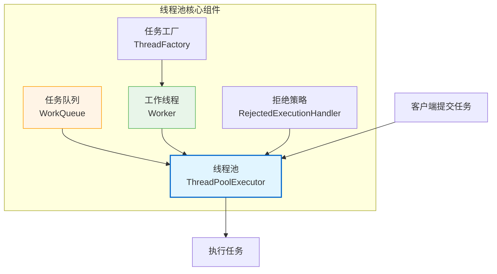


## 2. 为什么使用线程池

### 2.1 不使用线程池的问题

| 问题类型 | 具体表现 | 影响程度 |
|---------|---------|---------|
| **资源消耗** | 频繁创建/销毁线程消耗CPU和内存 | ⭐⭐⭐⭐⭐ |
| **响应延迟** | 每次请求都需要创建新线程 | ⭐⭐⭐⭐ |
| **资源失控** | 无限制创建线程导致OOM | ⭐⭐⭐⭐⭐ |
| **调度开销** | 线程上下文切换频繁 | ⭐⭐⭐ |

### 2.2 使用线程池的优势

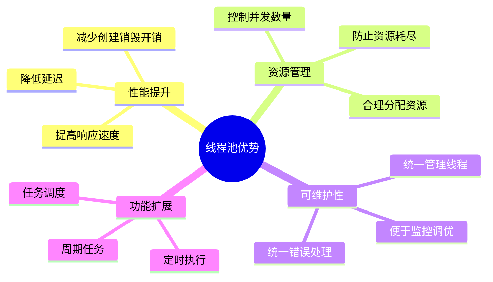

## 3. ThreadPoolExecutor 核心架构

### 3.1 核心参数详解

```java
public ThreadPoolExecutor(
    int corePoolSize,                   // 核心线程数
    int maximumPoolSize,                // 最大线程数
    long keepAliveTime,                 // 空闲线程存活时间
    TimeUnit unit,                      // 时间单位
    BlockingQueue<Runnable> workQueue,  // 工作队列
    ThreadFactory threadFactory,        // 线程工厂
    RejectedExecutionHandler handler    // 拒绝策略
)
```

### 3.2 参数关系图

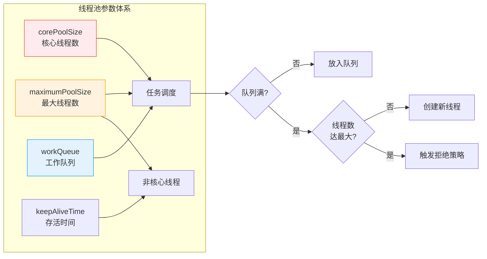

### 3.3 参数配置对比表

| 参数 | 作用 | 配置建议 | 注意事项 |
|-----|------|---------|---------|
| **corePoolSize** | 核心线程数，即使空闲也不会被回收（除非allowCoreThreadTimeOut） | CPU密集型：N+1<br/>IO密集型：2N | 设置过小影响吞吐量，过大增加上下文切换 |
| **maximumPoolSize** | 线程池允许的最大线程数 | 根据系统资源和任务特性调整 | 必须 >= corePoolSize |
| **keepAliveTime** | 非核心线程空闲超时时间 | 临时任务：较短<br/>长任务：较长 | 对核心线程无效（除非特别配置） |
| **workQueue** | 任务等待队列 | 根据业务场景选择合适队列类型 | 无界队列可能导致OOM |
| **threadFactory** | 创建线程的工厂 | 自定义命名、优先级、守护线程等 | 便于问题排查和监控 |
| **handler** | 拒绝策略 | 根据业务重要性选择 | 默认AbortPolicy抛异常 |


## 4. 线程池工作原理

### 4.1 任务提交流程

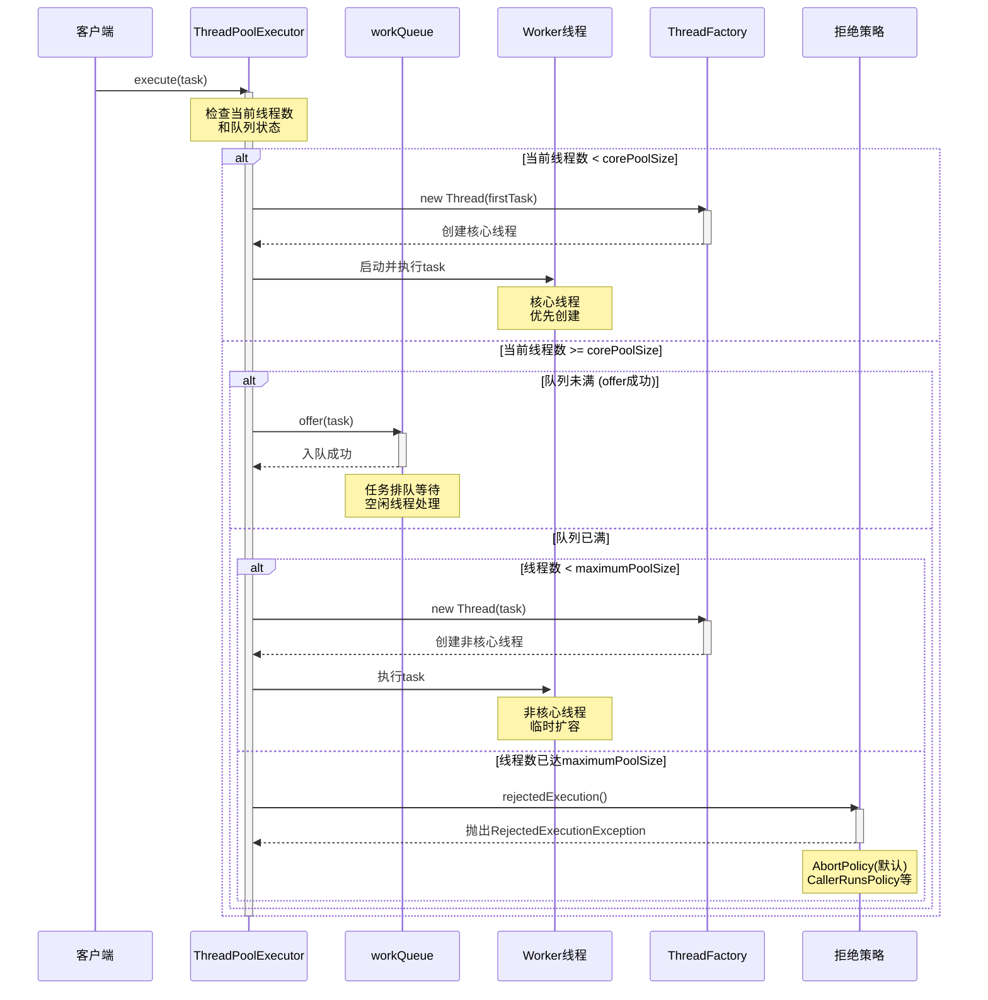

### 4.2 详细执行流程图

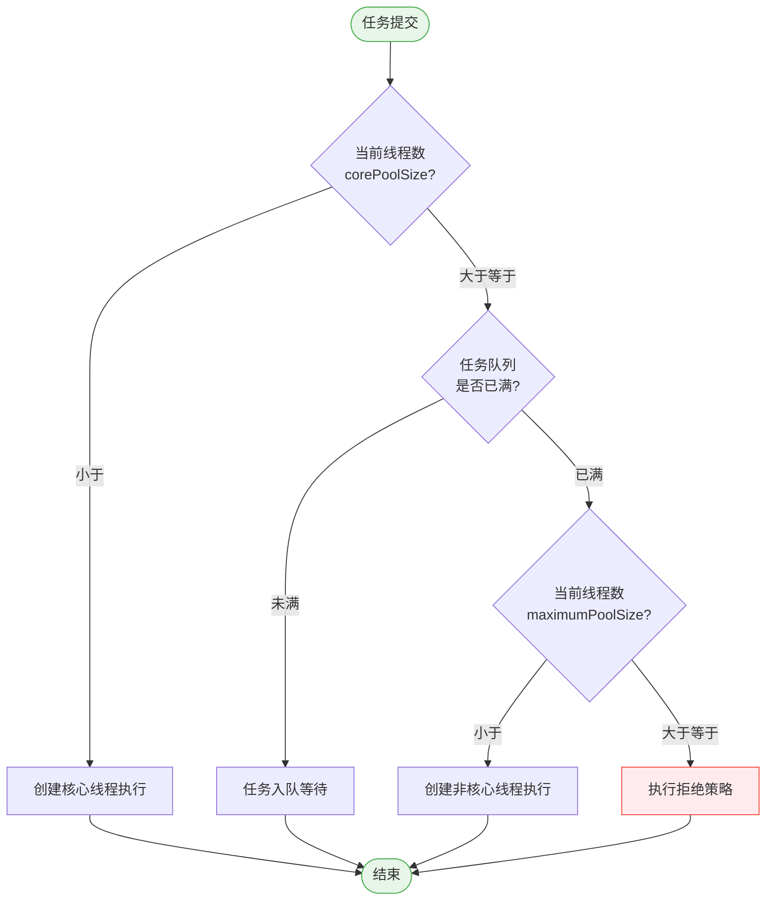

### 4.3 线程复用机制

```java
// Worker 线程执行逻辑简化版
final void runWorker(Worker w) {
    Thread wt = Thread.currentThread();
    Runnable task = w.firstTask;
    w.firstTask = null;
    
    try {
        // 执行第一个任务或从队列获取任务
        while (task != null || (task = getTask()) != null) {
            try {
                beforeExecute(wt, task);
                task.run();  // 执行任务
                afterExecute(task, null);
            } catch (Throwable ex) {
                afterExecute(task, ex);
            } finally {
                task = null;  // 任务执行完毕，准备获取下一个
            }
        }
    } finally {
        processWorkerExit(w, true);
    }
}
```


## 5. 线程池状态管理

### 5.1 线程池生命周期状态

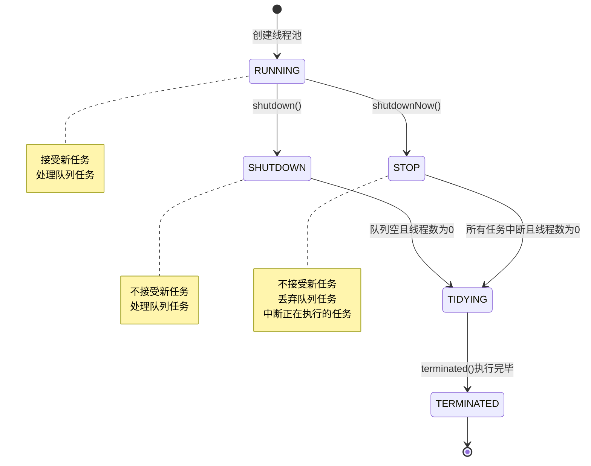

### 5.2 状态说明表

| 状态 | 数值 | 接受新任务 | 处理阻塞队列任务 | 说明 |
|-----|------|-----------|----------------|------|
| **RUNNING** | -1 | ✅ | ✅ | 正常状态，接受新任务并处理队列任务 |
| **SHUTDOWN** | 0 | ❌ | ✅ | 调用shutdown()，不接受新任务，但处理队列任务 |
| **STOP** | 1 | ❌ | ❌ | 调用shutdownNow()，不接受新任务，不处理队列任务，中断正在执行的任务 |
| **TIDYING** | 2 | ❌ | ❌ | 所有任务已终止，workerCount为0，准备调用terminated() |
| **TERMINATED** | 3 | ❌ | ❌ | terminated()执行完毕，线程池终止 |

### 5.3 状态转换代码示例

```java
public void shutdown() {
    final ReentrantLock mainLock = this.mainLock;
    mainLock.lock();
    try {
        // 检查权限
        checkShutdownAccess();
        // 设置状态为SHUTDOWN
        advanceRunState(SHUTDOWN);
        // 中断空闲线程
        interruptIdleWorkers();
        // 钩子方法
        onShutdown(); 
    } finally {
        mainLock.unlock();
    }
    // 尝试终止
    tryTerminate();
}

public List<Runnable> shutdownNow() {
    List<Runnable> tasks;
    final ReentrantLock mainLock = this.mainLock;
    mainLock.lock();
    try {
        checkShutdownAccess();
        // 设置状态为STOP
        advanceRunState(STOP);
        // 中断所有线程
        interruptWorkers();
        // 清空队列并返回
        tasks = drainQueue();
    } finally {
        mainLock.unlock();
    }
    tryTerminate();
    return tasks;
}
```


## 6. 拒绝策略详解

### 6.1 四种内置拒绝策略

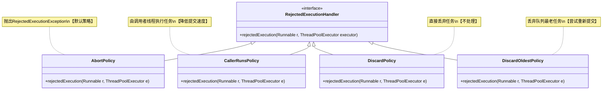

### 6.2 拒绝策略对比表

| 策略 | 行为 | 适用场景 | 优点 | 缺点 |
|-----|------|---------|------|------|
| **AbortPolicy** | 抛出`RejectedExecutionException` | 重要任务，不能丢失 | 快速失败，便于监控 | 可能丢失任务 |
| **CallerRunsPolicy** | 由调用者线程执行任务 | 允许降低提交速度 | 不会丢失任务，自动限流 | 降低提交速度，影响性能 |
| **DiscardPolicy** | 直接丢弃任务，不抛异常 | 非重要任务，可丢失 | 性能最好 | 任务静默丢失，难以监控 |
| **DiscardOldestPolicy** | 丢弃队列中最老的任务，尝试重新提交 | 新任务比老任务重要 | 保留最新任务 | 可能丢失重要老任务 |

### 6.3 自定义拒绝策略示例

```java
// 自定义拒绝策略：记录日志并持久化任务
public class CustomRejectedHandler implements RejectedExecutionHandler {
    private final Logger logger = LoggerFactory.getLogger(this.getClass());
    private final TaskBackupService backupService;
    
    @Override
    public void rejectedExecution(Runnable r, ThreadPoolExecutor executor) {
        logger.error("任务被拒绝，线程池状态 - 核心线程:{}, 最大线程:{}, 队列大小:{}, 活跃线程:{}", 
            executor.getCorePoolSize(),
            executor.getMaximumPoolSize(),
            executor.getQueue().size(),
            executor.getActiveCount());
        
        // 持久化任务到数据库或消息队列
        if (r instanceof TaskWrapper) {
            TaskWrapper task = (TaskWrapper) r;
            backupService.backupTask(task);
        }
        
        // 或者发送到降级队列
        // fallbackQueue.offer(r);
    }
}

// 带重试的拒绝策略
public class RetryRejectedHandler implements RejectedExecutionHandler {
    private final int maxRetries;
    private final long retryDelayMs;
    
    @Override
    public void rejectedExecution(Runnable r, ThreadPoolExecutor executor) {
        if (!executor.isShutdown()) {
            // 尝试休眠后重新提交
            try {
                Thread.sleep(retryDelayMs);
                executor.execute(r);
            } catch (InterruptedException e) {
                Thread.currentThread().interrupt();
                throw new RejectedExecutionException("重试被中断", e);
            }
        }
    }
}
```

## 7. 工作队列类型
### 7.1 队列类型对比
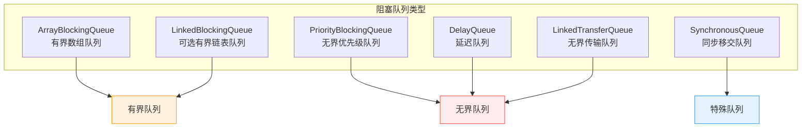

### 7.2 队列详细对比表
| 队列类型 | 容量 | 数据结构 | 排序 | 适用场景 | 注意事项 |
|---------|------|---------|------|---------|---------|
| **ArrayBlockingQueue** | 有界 | 数组 | FIFO | 对资源限制严格 | 初始化需指定容量 |
| **LinkedBlockingQueue** | 可选有界<br/>(默认Integer.MAX_VALUE) | 链表 | FIFO | 通用场景 | 不指定容量可能导致OOM |
| **PriorityBlockingQueue** | 无界 | 堆 | 优先级 | 任务有优先级 | 需实现Comparable |
| **DelayQueue** | 无界 | 优先级队列 | 延迟时间 | 定时任务、缓存过期 | 元素需实现Delayed |
| **SynchronousQueue** | 0 | 无 | - | 直接移交，不存储 | 需要配合较大maxPoolSize |
| **LinkedTransferQueue** | 无界 | 链表 | FIFO | 高性能场景 | 支持transfer阻塞 |

### 7.3 队列选择建议
```java
// 场景1：IO密集型，任务量可控
// 使用有界队列 + 较大线程池
ExecutorService ioPool = new ThreadPoolExecutor(
    20,  // corePoolSize
    50,  // maximumPoolSize
    60L, TimeUnit.SECONDS,
    new ArrayBlockingQueue<>(1000)  // 有界队列
);

// 场景2：CPU密集型，任务量不确定
// 使用无界队列（需谨慎）
ExecutorService cpuPool = new ThreadPoolExecutor(
    Runtime.getRuntime().availableProcessors() + 1,
    Runtime.getRuntime().availableProcessors() + 1,
    0L, TimeUnit.MILLISECONDS,
    new LinkedBlockingQueue<>()  // 无界队列，注意OOM风险
);

// 场景3：突发流量，需要快速响应
// 使用SynchronousQueue + 弹性线程池
ExecutorService burstPool = new ThreadPoolExecutor(
    10,
    100,
    60L, TimeUnit.SECONDS,
    new SynchronousQueue<>()  // 不存储，直接移交
);
```

## 8. 线程工厂与线程创建
### 8.1 自定义线程工厂
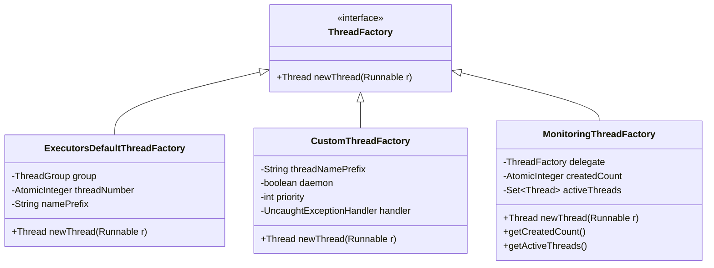

### 8.2 线程工厂实现示例

```java
// 自定义线程工厂
public class CustomThreadFactory implements ThreadFactory {
    private final AtomicInteger threadNumber = new AtomicInteger(1);
    private final String namePrefix;
    private final boolean daemon;
    private final int priority;
    private final Thread.UncaughtExceptionHandler handler;
    
    public CustomThreadFactory(String namePrefix, boolean daemon, int priority) {
        this.namePrefix = namePrefix + "-thread-";
        this.daemon = daemon;
        this.priority = priority;
        this.handler = (t, e) -> {
            System.err.println("线程 " + t.getName() + " 发生异常: " + e.getMessage());
            e.printStackTrace();
        };
    }
    
    @Override
    public Thread newThread(Runnable r) {
        Thread t = new Thread(r, namePrefix + threadNumber.getAndIncrement());
        t.setDaemon(daemon);
        t.setPriority(priority);
        t.setUncaughtExceptionHandler(handler);
        return t;
    }
}

// 带监控的线程工厂
public class MonitoringThreadFactory implements ThreadFactory {
    private final ThreadFactory delegate;
    private final AtomicInteger createdCount = new AtomicInteger(0);
    private final AtomicInteger activeCount = new AtomicInteger(0);
    private final ConcurrentHashMap<Thread, Long> threadStartTime = new ConcurrentHashMap<>();
    
    public MonitoringThreadFactory(ThreadFactory delegate) {
        this.delegate = delegate;
    }
    
    @Override
    public Thread newThread(Runnable r) {
        Thread thread = delegate.newThread(() -> {
            activeCount.incrementAndGet();
            threadStartTime.put(Thread.currentThread(), System.currentTimeMillis());
            try {
                r.run();
            } finally {
                activeCount.decrementAndGet();
                threadStartTime.remove(Thread.currentThread());
            }
        });
        createdCount.incrementAndGet();
        return thread;
    }
    
    public int getCreatedCount() {
        return createdCount.get();
    }
    
    public int getActiveCount() {
        return activeCount.get();
    }
}
```


## 9. Executors 工厂方法

### 9.1 工厂方法对比

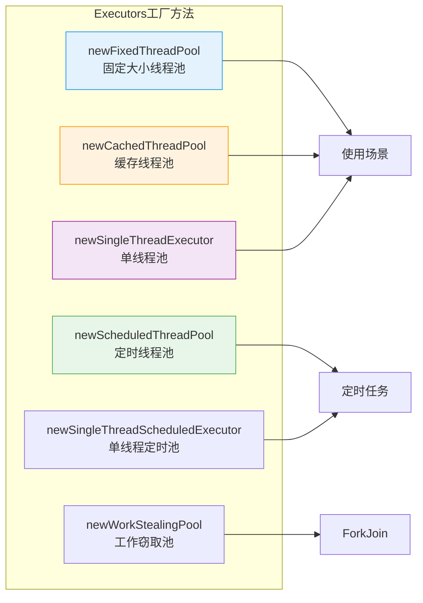

### 9.2 工厂方法详细对比表

| 工厂方法 | 核心参数 | 队列类型 | 特点 | 风险 | 推荐度 |
|---------|---------|---------|------|------|--------|
| **newFixedThreadPool(n)** | core=max=n<br/>keepAlive=0 | LinkedBlockingQueue<br/>(无界) | 固定线程数，适合稳定负载 | OOM风险 | ⭐⭐⭐ |
| **newCachedThreadPool()** | core=0<br/>max=Integer.MAX_VALUE | SynchronousQueue | 弹性伸缩，适合短时异步任务 | 创建过多线程导致OOM | ⭐⭐ |
| **newSingleThreadExecutor()** | core=max=1 | LinkedBlockingQueue<br/>(无界) | 单线程顺序执行 | OOM风险，单点故障 | ⭐⭐⭐ |
| **newScheduledThreadPool(n)** | core=n<br/>max=Integer.MAX_VALUE | DelayedWorkQueue | 支持定时/周期任务 | 核心线程不回收 | ⭐⭐⭐⭐ |
| **newWorkStealingPool(n)** | 基于ForkJoinPool | 工作窃取队列 | 并行执行，自动负载均衡 | JDK8+，调试困难 | ⭐⭐⭐⭐ |

### 9.3 为什么不推荐使用Executors？

```java
// ❌ 不推荐：可能导致OOM
ExecutorService fixedPool = Executors.newFixedThreadPool(10);
// 使用无界队列LinkedBlockingQueue，任务堆积可能导致内存溢出

ExecutorService cachedPool = Executors.newCachedThreadPool();
// 最大线程数为Integer.MAX_VALUE，可能创建过多线程

// ✅ 推荐：使用ThreadPoolExecutor自定义参数
ExecutorService safePool = new ThreadPoolExecutor(
    10,  // corePoolSize
    20,  // maximumPoolSize
    60L, TimeUnit.SECONDS,
    new ArrayBlockingQueue<>(100),  // 有界队列
    new CustomThreadFactory("my-pool"),
    new ThreadPoolExecutor.CallerRunsPolicy()  // 自定义拒绝策略
);
```


## 10. 线程池配置最佳实践

### 10.1 线程数配置公式

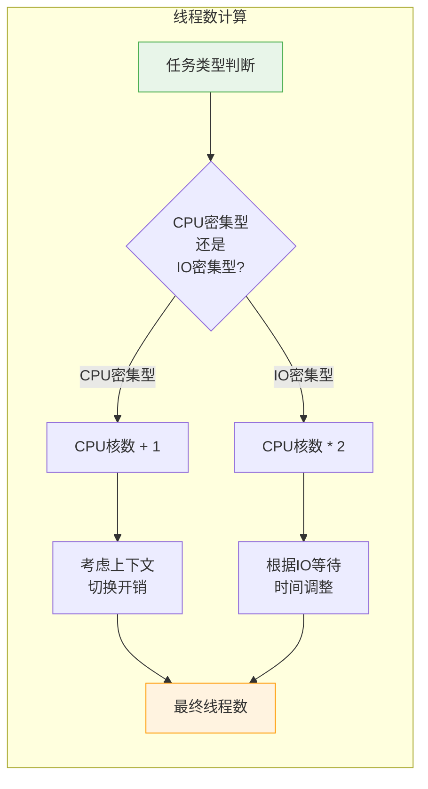

### 10.2 配置参数参考表

| 场景类型 | corePoolSize | maximumPoolSize | keepAliveTime | workQueue | handler |
|---------|-------------|-----------------|---------------|-----------|---------|
| **CPU密集型** | N + 1 | N + 1 | 0ms | 有界队列 | AbortPolicy |
| **IO密集型** | 2N | 2N | 60s | 有界队列 | CallerRunsPolicy |
| **混合型** | N | 2N | 60s | 有界队列 | CallerRunsPolicy |
| **突发流量** | N | 4N | 30s | SynchronousQueue | CallerRunsPolicy |
| **定时任务** | N | N | 0ms | DelayQueue | AbortPolicy |

*注：N为CPU核心数*

### 10.3 配置示例

```java
public class ThreadPoolConfig {
    
    // CPU密集型任务配置
    public static ExecutorService createCpuIntensivePool() {
        int coreCount = Runtime.getRuntime().availableProcessors();
        return new ThreadPoolExecutor(
            coreCount + 1,
            coreCount + 1,
            0L, TimeUnit.MILLISECONDS,
            new ArrayBlockingQueue<>(100),
            new CustomThreadFactory("cpu-pool", false, Thread.NORM_PRIORITY),
            new ThreadPoolExecutor.AbortPolicy()
        );
    }
    
    // IO密集型任务配置
    public static ExecutorService createIoIntensivePool() {
        int coreCount = Runtime.getRuntime().availableProcessors();
        return new ThreadPoolExecutor(
            coreCount * 2,
            coreCount * 2,
            60L, TimeUnit.SECONDS,
            new ArrayBlockingQueue<>(1000),
            new CustomThreadFactory("io-pool", false, Thread.NORM_PRIORITY),
            new ThreadPoolExecutor.CallerRunsPolicy()
        );
    }
    
    // 通用业务线程池配置
    public static ExecutorService createBusinessPool(String poolName, 
                                                      int coreSize, 
                                                      int maxSize, 
                                                      int queueSize) {
        return new ThreadPoolExecutor(
            coreSize,
            maxSize,
            60L, TimeUnit.SECONDS,
            new ArrayBlockingQueue<>(queueSize),
            new CustomThreadFactory(poolName, false, Thread.NORM_PRIORITY),
            new ThreadPoolExecutor.CallerRunsPolicy()
        );
    }
}
```


## 11. 线程池监控与调优

### 11.1 关键监控指标

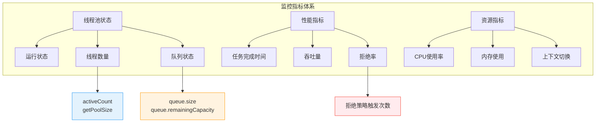

### 11.2 监控工具类

```java
public class ThreadPoolMonitor {
    
    private final ThreadPoolExecutor executor;
    private final ScheduledExecutorService monitorExecutor;
    private final List<ThreadPoolMetric> metrics = new CopyOnWriteArrayList<>();
    
    public ThreadPoolMonitor(ThreadPoolExecutor executor) {
        this.executor = executor;
        this.monitorExecutor = Executors.newSingleThreadScheduledExecutor();
    }
    
    // 启动监控
    public void startMonitoring(long interval, TimeUnit unit) {
        monitorExecutor.scheduleAtFixedRate(() -> {
            ThreadPoolMetric metric = collectMetrics();
            metrics.add(metric);
            logMetrics(metric);
            alertIfNecessary(metric);
        }, interval, interval, unit);
    }
    
    // 收集指标
    private ThreadPoolMetric collectMetrics() {
        ThreadPoolMetric metric = new ThreadPoolMetric();
        metric.timestamp = System.currentTimeMillis();
        metric.corePoolSize = executor.getCorePoolSize();
        metric.maximumPoolSize = executor.getMaximumPoolSize();
        metric.poolSize = executor.getPoolSize();
        metric.activeCount = executor.getActiveCount();
        metric.queueSize = executor.getQueue().size();
        metric.queueRemainingCapacity = executor.getQueue().remainingCapacity();
        metric.completedTaskCount = executor.getCompletedTaskCount();
        metric.taskCount = executor.getTaskCount();
        metric.rejectedCount = getRejectedCount();
        return metric;
    }
    
    // 告警检查
    private void alertIfNecessary(ThreadPoolMetric metric) {
        // 队列使用率超过80%
        if (metric.queueSize > metric.queueRemainingCapacity * 4) {
            System.err.println("警告：队列使用率过高 - " + metric);
        }
        
        // 活跃线程接近最大值
        if (metric.activeCount > metric.maximumPoolSize * 0.8) {
            System.err.println("警告：活跃线程数接近上限 - " + metric);
        }
        
        // 拒绝任务
        if (metric.rejectedCount > 0) {
            System.err.println("严重：有任务被拒绝 - " + metric);
        }
    }
    
    // 获取拒绝次数（需要通过自定义拒绝策略统计）
    private long getRejectedCount() {
        // 实现略
        return 0;
    }
    
    private void logMetrics(ThreadPoolMetric metric) {
        System.out.printf("[%s] Pool: %d/%d, Active: %d, Queue: %d/%d, Completed: %d, Rejected: %d%n",
            new Date(metric.timestamp),
            metric.poolSize, metric.maximumPoolSize,
            metric.activeCount,
            metric.queueSize, metric.queueSize + metric.queueRemainingCapacity,
            metric.completedTaskCount,
            metric.rejectedCount);
    }
    
    // 指标数据类
    public static class ThreadPoolMetric {
        public long timestamp;
        public int corePoolSize;
        public int maximumPoolSize;
        public int poolSize;
        public int activeCount;
        public int queueSize;
        public int queueRemainingCapacity;
        public long completedTaskCount;
        public long taskCount;
        public long rejectedCount;
        
        @Override
        public String toString() {
            return String.format("poolSize=%d, active=%d, queue=%d, rejected=%d",
                poolSize, activeCount, queueSize, rejectedCount);
        }
    }
}
```

### 11.3 调优建议

| 问题现象 | 可能原因 | 调优方案 |
|---------|---------|---------|
| **队列持续堆积** | 线程数不足或任务处理慢 | 增加corePoolSize，优化任务逻辑 |
| **频繁创建销毁线程** | corePoolSize设置过小 | 适当增加corePoolSize |
| **任务被频繁拒绝** | 队列或线程数不足 | 增加队列容量或maximumPoolSize |
| **CPU使用率过高** | 线程数过多或任务过重 | 减少线程数，优化任务 |
| **响应时间过长** | 队列过长或线程不足 | 调整队列大小和线程数配比 |


## 12. 常见问题与解决方案

### 12.1 问题排查矩阵

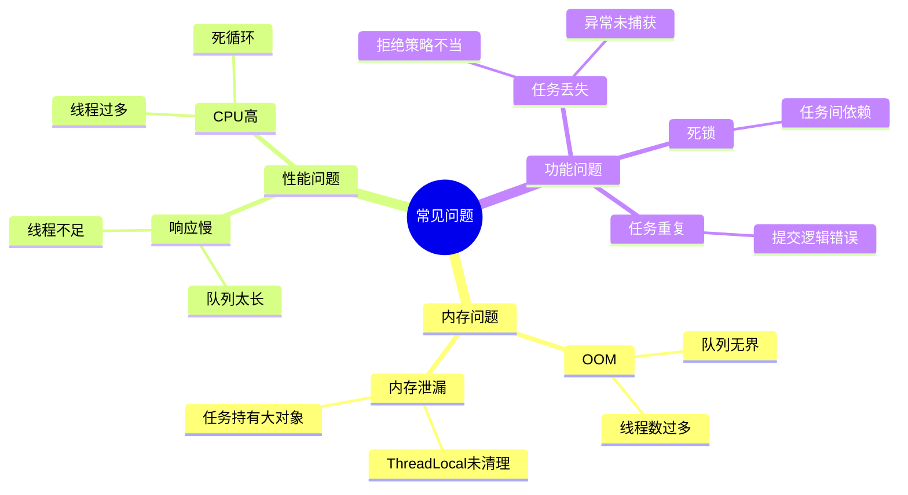

### 12.2 典型问题及解决方案

| 问题 | 原因 | 解决方案 | 代码示例 |
|-----|------|---------|---------|
| **OutOfMemoryError** | 使用无界队列，任务堆积 | 使用有界队列 + 合理拒绝策略 | `new ArrayBlockingQueue<>(1000)` |
| **线程泄漏** | 未正确shutdown | 在finally块中shutdown | `executor.shutdown()` |
| **任务丢失** | 使用DiscardPolicy | 使用AbortPolicy或记录日志 | 自定义拒绝策略 |
| **ThreadLocal泄漏** | 线程复用未清理 | 在任务结束时remove | `try { ... } finally { ThreadLocal.remove(); }` |
| **死锁** | 任务间循环等待 | 避免任务提交到同一线程池 | 使用不同线程池或异步 |

### 12.3 问题排查代码

```java
public class ThreadPoolDebugger {
    
    // 检测线程池健康状态
    public static void diagnose(ThreadPoolExecutor executor) {
        System.out.println("=== 线程池诊断报告 ===");
        System.out.println("核心线程数: " + executor.getCorePoolSize());
        System.out.println("最大线程数: " + executor.getMaximumPoolSize());
        System.out.println("当前线程数: " + executor.getPoolSize());
        System.out.println("活跃线程数: " + executor.getActiveCount());
        System.out.println("已完成任务数: " + executor.getCompletedTaskCount());
        System.out.println("总任务数: " + executor.getTaskCount());
        
        BlockingQueue<Runnable> queue = executor.getQueue();
        System.out.println("队列类型: " + queue.getClass().getSimpleName());
        System.out.println("队列大小: " + queue.size());
        System.out.println("队列剩余容量: " + queue.remainingCapacity());
        
        // 检查是否饱和
        double queueUsage = (double) queue.size() / (queue.size() + queue.remainingCapacity()) * 100;
        if (queueUsage > 80) {
            System.err.println("⚠️  警告：队列使用率过高 (" + queueUsage + "%)");
        }
        
        if (executor.getActiveCount() >= executor.getMaximumPoolSize()) {
            System.err.println("⚠️  警告：线程池已饱和");
        }
    }
    
    // 检测ThreadLocal泄漏
    public static void checkThreadLocalLeaks(ThreadPoolExecutor executor) {
        executor.prestartAllCoreThreads();
        
        // 等待一段时间后检查
        try {
            Thread.sleep(1000);
        } catch (InterruptedException e) {
            Thread.currentThread().interrupt();
        }
        
        // 分析线程栈（需要额外工具支持）
        System.out.println("建议使用JProfiler或VisualVM检测ThreadLocal泄漏");
    }
}
```


## 13. 实际应用场景

### 13.1 Web服务器线程池

```java
public class WebServerThreadPool {
    
    // Servlet容器线程池配置（如Tomcat）
    public static ExecutorService createWebServerPool() {
        int cores = Runtime.getRuntime().availableProcessors();
        return new ThreadPoolExecutor(
            cores * 2,           // 核心线程
            cores * 4,           // 最大线程
            60L, TimeUnit.SECONDS,
            new SynchronousQueue<>(),  // 直接移交，快速失败
            new CustomThreadFactory("web-server", false, Thread.NORM_PRIORITY),
            new ThreadPoolExecutor.CallerRunsPolicy()  // 由Tomcat主线程处理，背压
        );
    }
}
```

### 13.2 批量数据处理

```java
public class BatchProcessor {
    
    private final ThreadPoolExecutor executor;
    
    public BatchProcessor(int batchSize) {
        this.executor = new ThreadPoolExecutor(
            10,
            20,
            60L, TimeUnit.SECONDS,
            new ArrayBlockingQueue<>(batchSize),
            new CustomThreadFactory("batch-processor", false, Thread.NORM_PRIORITY),
            new ThreadPoolExecutor.AbortPolicy()
        );
    }
    
    // 并行处理大批量数据
    public <T, R> List<R> processInParallel(List<T> items, 
                                            Function<T, R> processor) 
                                            throws InterruptedException {
        List<Future<R>> futures = new ArrayList<>();
        
        for (T item : items) {
            Future<R> future = executor.submit(() -> processor.apply(item));
            futures.add(future);
        }
        
        List<R> results = new ArrayList<>();
        for (Future<R> future : futures) {
            results.add(future.get());  // 等待所有任务完成
        }
        
        return results;
    }
    
    public void shutdown() {
        executor.shutdown();
        try {
            if (!executor.awaitTermination(60, TimeUnit.SECONDS)) {
                executor.shutdownNow();
            }
        } catch (InterruptedException e) {
            executor.shutdownNow();
            Thread.currentThread().interrupt();
        }
    }
}
```

### 13.3 异步任务处理

```java
public class AsyncTaskExecutor {
    
    private final ThreadPoolExecutor executor;
    private final CompletionService<Void> completionService;
    
    public AsyncTaskExecutor() {
        this.executor = new ThreadPoolExecutor(
            5,
            10,
            300L, TimeUnit.SECONDS,
            new LinkedBlockingQueue<>(100),
            new CustomThreadFactory("async-task", true, Thread.NORM_PRIORITY),
            (r, exec) -> {
                // 异步任务被拒绝时，记录日志但不影响主流程
                System.err.println("异步任务被拒绝: " + r);
            }
        );
        
        this.completionService = new ExecutorCompletionService<>(executor);
    }
    
    // 提交异步任务（不关心结果）
    public void submitAsync(Runnable task) {
        executor.submit(task);
    }
    
    // 提交异步任务并获取结果
    public <T> Future<T> submitAsync(Callable<T> task) {
        return executor.submit(task);
    }
    
    // 批量提交并等待完成
    public void submitAllAndWait(List<Runnable> tasks, long timeout, TimeUnit unit) 
            throws InterruptedException {
        CountDownLatch latch = new CountDownLatch(tasks.size());
        
        for (Runnable task : tasks) {
            executor.submit(() -> {
                try {
                    task.run();
                } finally {
                    latch.countDown();
                }
            });
        }
        
        latch.await(timeout, unit);
    }
}
```

### 13.4 定时任务调度

```java
public class ScheduledTaskManager {
    
    private final ScheduledThreadPoolExecutor scheduler;
    
    public ScheduledTaskManager(int corePoolSize) {
        this.scheduler = new ScheduledThreadPoolExecutor(
            corePoolSize,
            new CustomThreadFactory("scheduled-task", false, Thread.NORM_PRIORITY)
        );
        this.scheduler.setRemoveOnCancelPolicy(true);
    }
    
    // 延迟执行
    public ScheduledFuture<?> scheduleOnce(Runnable task, long delay, TimeUnit unit) {
        return scheduler.schedule(task, delay, unit);
    }
    
    // 周期性执行（固定延迟）
    public ScheduledFuture<?> scheduleWithFixedDelay(Runnable task, 
                                                      long initialDelay,
                                                      long delay, 
                                                      TimeUnit unit) {
        return scheduler.scheduleWithFixedDelay(task, initialDelay, delay, unit);
    }
    
    // 周期性执行（固定速率）
    public ScheduledFuture<?> scheduleAtFixedRate(Runnable task, 
                                                   long initialDelay,
                                                   long period, 
                                                   TimeUnit unit) {
        return scheduler.scheduleAtFixedRate(task, initialDelay, period, unit);
    }
    
    public void shutdown() {
        scheduler.shutdown();
        try {
            if (!scheduler.awaitTermination(60, TimeUnit.SECONDS)) {
                scheduler.shutdownNow();
            }
        } catch (InterruptedException e) {
            scheduler.shutdownNow();
            Thread.currentThread().interrupt();
        }
    }
}
```


## 14. 线程池扩展与定制

### 14.1 扩展ThreadPoolExecutor

```java
public class EnhanceThreadPoolExecutor extends ThreadPoolExecutor {
    
    private final AtomicLong completedTasks = new AtomicLong(0);
    private final AtomicLong rejectedTasks = new AtomicLong(0);
    private final Map<Runnable, Long> taskStartTime = new ConcurrentHashMap<>();
    private final List<TaskExecutionListener> listeners = new CopyOnWriteArrayList<>();
    
    public EnhanceThreadPoolExecutor(int corePoolSize,
                                     int maximumPoolSize,
                                     long keepAliveTime,
                                     TimeUnit unit,
                                     BlockingQueue<Runnable> workQueue,
                                     ThreadFactory threadFactory,
                                     RejectedExecutionHandler handler) {
        super(corePoolSize, maximumPoolSize, keepAliveTime, unit, workQueue, 
              threadFactory, handler);
    }
    
    @Override
    protected void beforeExecute(Thread t, Runnable r) {
        super.beforeExecute(t, r);
        taskStartTime.put(r, System.currentTimeMillis());
        
        // 通知监听器
        for (TaskExecutionListener listener : listeners) {
            listener.onTaskStart(r, t);
        }
    }
    
    @Override
    protected void afterExecute(Runnable r, Throwable t) {
        super.afterExecute(r, t);
        
        completedTasks.incrementAndGet();
        Long startTime = taskStartTime.remove(r);
        if (startTime != null) {
            long executionTime = System.currentTimeMillis() - startTime;
            
            // 通知监听器
            for (TaskExecutionListener listener : listeners) {
                listener.onTaskComplete(r, executionTime, t);
            }
        }
    }
    
    @Override
    protected void terminated() {
        super.terminated();
        for (TaskExecutionListener listener : listeners) {
            listener.onPoolTerminated();
        }
    }
    
    // 自定义拒绝策略统计
    public void setRejectedExecutionHandler(RejectedExecutionHandler handler) {
        super.setRejectedExecutionHandler((r, executor) -> {
            rejectedTasks.incrementAndGet();
            handler.rejectedExecution(r, executor);
        });
    }
    
    public long getCompletedTasks() {
        return completedTasks.get();
    }
    
    public long getRejectedTasks() {
        return rejectedTasks.get();
    }
    
    public void addListener(TaskExecutionListener listener) {
        listeners.add(listener);
    }
    
    // 任务执行监听器接口
    public interface TaskExecutionListener {
        void onTaskStart(Runnable task, Thread thread);
        void onTaskComplete(Runnable task, long executionTime, Throwable t);
        void onPoolTerminated();
    }
}
```

### 14.2 使用示例

```java
public class ThreadPoolDemo {
    
    public static void main(String[] args) throws Exception {
        // 创建增强线程池
        EnhanceThreadPoolExecutor executor = new EnhanceThreadPoolExecutor(
            5,
            10,
            60L, TimeUnit.SECONDS,
            new ArrayBlockingQueue<>(100),
            new CustomThreadFactory("demo-pool", false, Thread.NORM_PRIORITY),
            new ThreadPoolExecutor.CallerRunsPolicy()
        );
        
        // 添加监听器
        executor.addListener(new EnhanceThreadPoolExecutor.TaskExecutionListener() {
            @Override
            public void onTaskStart(Runnable task, Thread thread) {
                System.out.println("任务开始: " + thread.getName());
            }
            
            @Override
            public void onTaskComplete(Runnable task, long executionTime, Throwable t) {
                System.out.println("任务完成，耗时: " + executionTime + "ms");
            }
            
            @Override
            public void onPoolTerminated() {
                System.out.println("线程池已终止");
            }
        });
        
        // 提交任务
        for (int i = 0; i < 20; i++) {
            final int taskId = i;
            executor.submit(() -> {
                try {
                    System.out.println("执行任务: " + taskId);
                    Thread.sleep(100);
                } catch (InterruptedException e) {
                    Thread.currentThread().interrupt();
                }
            });
        }
        
        // 等待完成
        executor.shutdown();
        executor.awaitTermination(1, TimeUnit.MINUTES);
        
        // 打印统计信息
        System.out.println("完成任务数: " + executor.getCompletedTasks());
        System.out.println("拒绝任务数: " + executor.getRejectedTasks());
    }
}
```


