# 锁机制

## 1. 锁机制概述

### 1.1 为什么需要锁

在多线程并发编程中，锁是保证线程安全的核心机制。当多个线程同时访问共享资源时，如果没有适当的同步机制，可能会导致：

- **数据不一致**：多个线程同时修改共享变量
- **可见性问题**：一个线程的修改对其他线程不可见
- **原子性问题**：复合操作被中断

### 1.2 锁的本质

锁的本质是一种**同步机制**，用于控制多个线程对共享资源的访问顺序，确保在任意时刻只有一个（或有限个）线程能够访问临界资源。

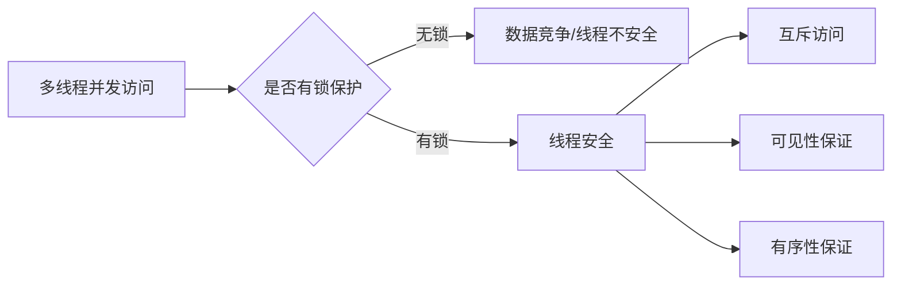


## 2. Java 锁的分类体系

### 2.1 锁的多维度分类

Java 中的锁可以从多个维度进行分类：

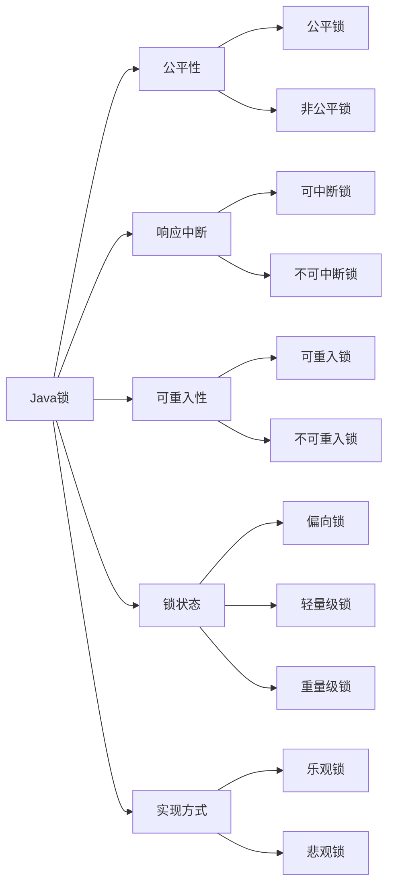

### 2.2 锁分类详细对比表


| 分类维度     | 类型       | 说明                       | 典型实现                        |
| ------------ | ---------- | -------------------------- | ------------------------------- |
| **公平性**   | 公平锁     | 按照请求锁的顺序获取锁     | ReentrantLock(true)             |
|              | 非公平锁   | 允许插队，性能更高         | synchronized, ReentrantLock     |
| **响应中断** | 可中断锁   | 获取锁过程中可响应中断     | lockInterruptibly()             |
|              | 不可中断锁 | 获取锁过程不响应中断       | synchronized                    |
| **可重入性** | 可重入锁   | 同一线程可重复获取同一把锁 | synchronized, ReentrantLock     |
|              | 不可重入锁 | 同一线程不可重复获取       | 自定义实现                      |
| **锁粒度**   | 独享锁     | 一次只能被一个线程持有     | ReentrantLock                   |
|              | 共享锁     | 可被多个线程同时持有       | ReentrantReadWriteLock.ReadLock |
| **实现方式** | 乐观锁     | 假设无冲突，失败重试       | CAS, Atomic*                    |
|              | 悲观锁     | 假设必冲突，直接加锁       | synchronized                    |
| **锁状态**   | 偏向锁     | 无竞争，偏向首个线程       | JVM 自动优化                    |
|              | 轻量级锁   | 轻度竞争，自旋等待         | JVM 自动优化                    |
|              | 重量级锁   | 重度竞争，阻塞线程         | synchronized 膨胀后             |


## 3. synchronized 关键字详解

### 3.1 基本用法

```java
// 1. 修饰实例方法 - 锁当前实例对象
public synchronized void instanceMethod() {
    // 临界区
}

// 2. 修饰静态方法 - 锁当前类的 Class 对象
public static synchronized void staticMethod() {
    // 临界区
}

// 3. 修饰代码块 - 锁指定对象
public void method() {
    synchronized (this) {
        // 临界区
    }
  
    synchronized (MyClass.class) {
        // 临界区
    }
  
    Object lock = new Object();
    synchronized (lock) {
        // 临界区
    }
}
```

### 3.2 synchronized 底层原理

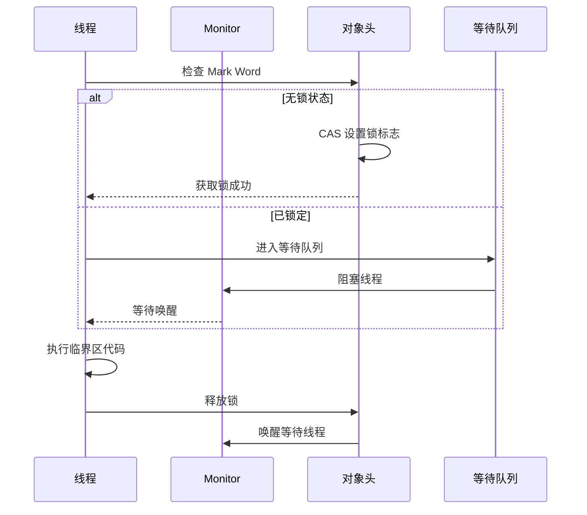

### 3.3 Monitor 机制

每个 Java 对象都有一个与之关联的 Monitor（监视器锁），其结构如下：

```
┌─────────────────────────────────────┐
│           Object Monitor            │
├─────────────────────────────────────┤
│  _owner: 指向持有锁的线程            │
│  _count: 锁的重入次数                │
│  _waiters: 等待线程数量              │
│  _WaitSet: 调用 wait() 的线程队列   │
│  _EntryList: 等待获取锁的线程队列    │
│  _cxq: 竞争队列 (Contention List)   │
└─────────────────────────────────────┘
```

### 3.4 synchronized 语义保证


| 语义       | 说明                                           |
| ---------- | ---------------------------------------------- |
| **原子性** | 保证临界区代码的原子执行                       |
| **可见性** | 解锁前刷新工作内存到主内存，加锁前清空工作内存 |
| **有序性** | 禁止指令重排序                                 |


## 4. JUC 锁体系

### 4.1 ReentrantLock（可重入锁）

#### 4.1.1 基本特性

```java
ReentrantLock lock = new ReentrantLock();
// 或指定公平性
ReentrantLock fairLock = new ReentrantLock(true);

lock.lock();
try {
    // 临界区
} finally {
    lock.unlock(); // 必须在 finally 中释放
}
```

#### 4.1.2 核心方法对比


| 方法                                | 可中断 | 超时 | 公平性 | 说明                 |
| ----------------------------------- | ------ | ---- | ------ | -------------------- |
| `lock()`                            | ❌     | ❌   | 支持   | 阻塞获取锁           |
| `lockInterruptibly()`               | ✅     | ❌   | 支持   | 可中断地获取锁       |
| `tryLock()`                         | ❌     | ❌   | 支持   | 立即返回是否获取成功 |
| `tryLock(long time, TimeUnit unit)` | ✅     | ✅   | 支持   | 超时时间内尝试获取   |
| `newCondition()`                    | -      | -    | -      | 创建 Condition 对象  |

#### 4.1.3 使用示例

```java
public class ReentrantLockExample {
    private final ReentrantLock lock = new ReentrantLock();
    private int count = 0;
  
    // 基本用法
    public void increment() {
        lock.lock();
        try {
            count++;
        } finally {
            lock.unlock();
        }
    }
  
    // 可中断锁
    public void incrementInterruptibly() throws InterruptedException {
        lock.lockInterruptibly();
        try {
            count++;
        } finally {
            lock.unlock();
        }
    }
  
    // 尝试获取锁
    public boolean tryIncrement() {
        if (lock.tryLock()) {
            try {
                count++;
                return true;
            } finally {
                lock.unlock();
            }
        }
        return false;
    }
  
    // 超时获取锁
    public boolean tryIncrement(long timeout, TimeUnit unit) 
            throws InterruptedException {
        if (lock.tryLock(timeout, unit)) {
            try {
                count++;
                return true;
            } finally {
                lock.unlock();
            }
        }
        return false;
    }
}
```

### 4.2 ReentrantReadWriteLock（读写锁）

#### 4.2.1 核心特性

读写锁维护了一对锁：

- **读锁（共享锁）**：多个线程可同时持有
- **写锁（独占锁）**：只能被一个线程持有

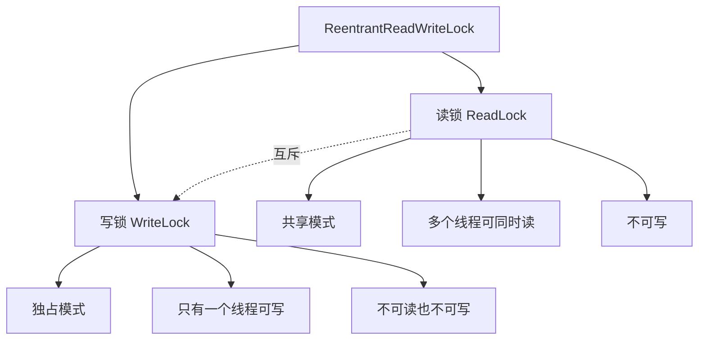

#### 4.2.2 锁降级与升级


| 操作         | 是否允许  | 说明       |
| ------------ | --------- | ---------- |
| 读锁 → 写锁 | ❌ 不允许 | 会造成死锁 |
| 写锁 → 读锁 | ✅ 允许   | 称为锁降级 |

#### 4.2.3 使用示例

```java
public class ReadWriteLockExample {
    private final ReentrantReadWriteLock rwLock = new ReentrantReadWriteLock();
    private final ReentrantReadWriteLock.ReadLock readLock = rwLock.readLock();
    private final ReentrantReadWriteLock.WriteLock writeLock = rwLock.writeLock();
    private Map<String, Object> cache = new HashMap<>();
  
    // 读操作 - 共享锁
    public Object read(String key) {
        readLock.lock();
        try {
            return cache.get(key);
        } finally {
            readLock.unlock();
        }
    }
  
    // 写操作 - 独占锁
    public void write(String key, Object value) {
        writeLock.lock();
        try {
            cache.put(key, value);
        } finally {
            writeLock.unlock();
        }
    }
  
    // 锁降级示例
    public Object readWithUpgrade(String key) {
        writeLock.lock();
        try {
            // 先检查是否需要更新
            if (needUpdate(key)) {
                cache.put(key, computeValue(key));
            }
            // 锁降级：获取读锁
            readLock.lock();
            return cache.get(key);
        } finally {
            writeLock.unlock(); // 释放写锁，保留读锁
            try {
                return readLock.unlock(); // 最终释放读锁
            } finally {
                readLock.unlock();
            }
        }
    }
}
```

### 4.3 StampedLock（邮戳锁）

#### 4.3.1 特性介绍

StampedLock 是 Java 8 引入的锁，提供三种模式：


| 模式       | 方法                  | 特点                       |
| ---------- | --------------------- | -------------------------- |
| **写锁**   | `writeLock()`         | 独占锁，类似 ReentrantLock |
| **读锁**   | `readLock()`          | 共享锁，类似 ReadLock      |
| **乐观读** | `tryOptimisticRead()` | 非阻塞，允许冲突           |

#### 4.3.2 模式对比

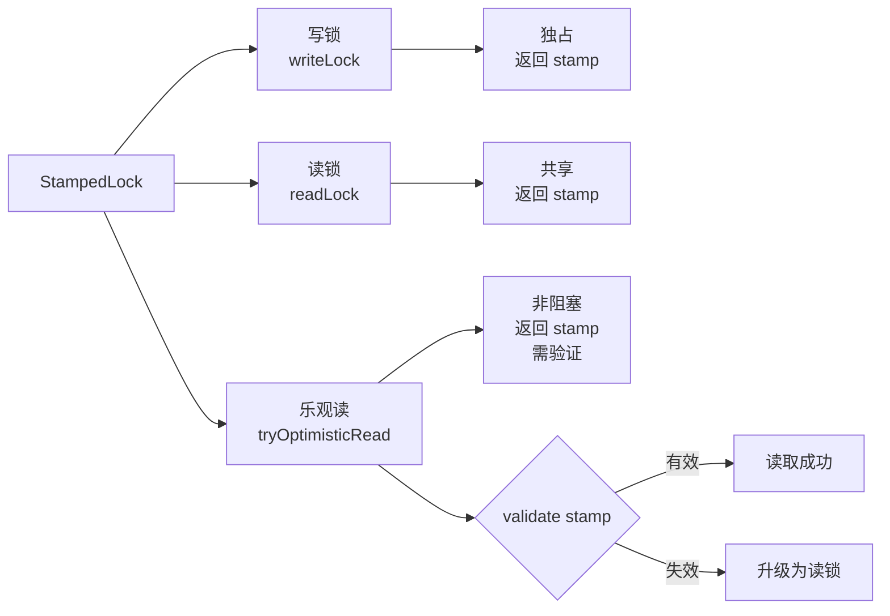

#### 4.3.3 使用示例

```java
public class StampedLockExample {
    private final StampedLock lock = new StampedLock();
    private double x, y;
  
    // 写锁
    public void move(double newX, double newY) {
        long stamp = lock.writeLock();
        try {
            x = newX;
            y = newY;
        } finally {
            lock.unlockWrite(stamp);
        }
    }
  
    // 读锁
    public double distanceFromOrigin() {
        long stamp = lock.readLock();
        try {
            return Math.sqrt(x * x + y * y);
        } finally {
            lock.unlockRead(stamp);
        }
    }
  
    // 乐观读（性能最优）
    public double distanceFromOriginOptimistic() {
        long stamp = lock.tryOptimisticRead();
        double currentX = x, currentY = y;
      
        // 验证 stamp 是否有效
        if (!lock.validate(stamp)) {
            // 升级为读锁
            stamp = lock.readLock();
            try {
                currentX = x;
                currentY = y;
            } finally {
                lock.unlockRead(stamp);
            }
        }
      
        return Math.sqrt(currentX * currentX + currentY * currentY);
    }
  
    // 尝试转换为写锁
    public void moveIfAtOrigin(double newX, double newY) {
        long stamp = lock.readLock();
        try {
            while (x == 0.0 && y == 0.0) {
                long ws = lock.tryConvertToWriteLock(stamp);
                if (ws != 0L) {
                    stamp = ws;
                    x = newX;
                    y = newY;
                    break;
                } else {
                    // 转换失败，先释放读锁再获取写锁
                    lock.unlockRead(stamp);
                    stamp = lock.writeLock();
                }
            }
        } finally {
            lock.unlock(stamp);
        }
    }
}
```

### 4.4 Condition（条件队列）

#### 4.4.1 与 Object 的 wait/notify 对比


| 特性         | Object.wait/notify | Condition                  |
| ------------ | ------------------ | -------------------------- |
| 依赖锁       | synchronized       | Lock                       |
| 条件队列数量 | 每个对象一个       | 可创建多个                 |
| 唤醒方式     | notify/notifyAll   | signal/signalAll           |
| 中断响应     | 不支持             | 支持 awaitInterruptibly    |
| 超时等待     | 支持               | 支持 awaitNanos/awaitUntil |

#### 4.4.2 使用示例 - 阻塞队列实现

```java
public class BoundedBuffer<T> {
    private final ArrayDeque<T> queue = new ArrayDeque<>();
    private final int capacity;
    private final Lock lock = new ReentrantLock();
    private final Condition notEmpty = lock.newCondition();
    private final Condition notFull = lock.newCondition();
  
    public BoundedBuffer(int capacity) {
        this.capacity = capacity;
    }
  
    public void put(T element) throws InterruptedException {
        lock.lock();
        try {
            // 如果队列满，等待 notFull 信号
            while (queue.size() == capacity) {
                notFull.await();
            }
            queue.addLast(element);
            // 通知消费者队列非空
            notEmpty.signal();
        } finally {
            lock.unlock();
        }
    }
  
    public T take() throws InterruptedException {
        lock.lock();
        try {
            // 如果队列空，等待 notEmpty 信号
            while (queue.isEmpty()) {
                notEmpty.await();
            }
            T element = queue.removeFirst();
            // 通知生产者队列非满
            notFull.signal();
            return element;
        } finally {
            lock.unlock();
        }
    }
}
```


## 5. AQS 原理深度解析

### 5.1 AQS 架构

AQS（AbstractQueuedSynchronizer）是 JUC 包中锁和同步器的核心框架。

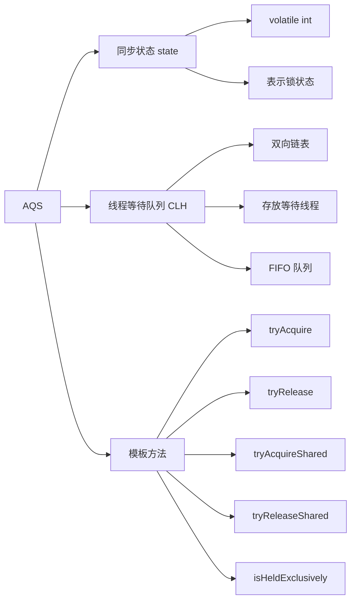

### 5.2 AQS 核心数据结构

```java
// AQS 核心字段
public abstract class AbstractQueuedSynchronizer {
    // 同步状态（volatile 保证可见性）
    private volatile int state;
  
    // 队列头节点
    private transient volatile Node head;
  
    // 队列尾节点
    private transient volatile Node tail;
  
    // 独占当前锁的线程
    private transient Thread exclusiveOwnerThread;
  
    // 节点结构
    static final class Node {
        static final Node SHARED = new Node();
        static final Node EXCLUSIVE = null;
      
        // 节点状态
        static final int CANCELLED = 1;      // 取消
        static final int SIGNAL = -1;        // 后继线程需要被唤醒
        static final int CONDITION = -2;     // 在条件队列中
        static final int PROPAGATE = -3;     // 共享模式下需要传播
      
        volatile int waitStatus;
        volatile Node prev;
        volatile Node next;
        volatile Thread thread;
        Node nextWaiter; // 条件队列中的下一个节点
    }
}
```

### 5.3 AQS 队列结构

```
┌─────────────────────────────────────────────────────────┐
│                        AQS Queue                        │
├─────────────────────────────────────────────────────────┤
│                                                         │
│  head (dummy) → Node1 → Node2 → Node3 → ... → tail     │
│     ↓            ↓        ↓        ↓                    │
│   Thread       Thread   Thread   Thread                 │
│   (已唤醒)     (等待)   (等待)   (等待)                 │
│                                                         │
└─────────────────────────────────────────────────────────┘

Node 结构:
┌────────────────────────────────────────┐
│              Node                      │
├────────────────────────────────────────┤
│ waitStatus: -1/0/1/-2/-3              │
│ prev: ← 前驱节点                       │
│ next: → 后继节点                       │
│ thread: 当前线程                       │
│ nextWaiter: 条件队列中的下一个节点      │
└────────────────────────────────────────┘
```

### 5.4 AQS 工作流程

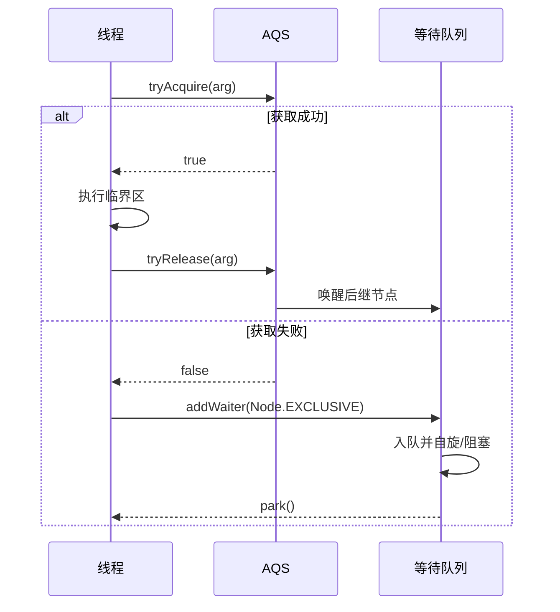

### 5.5 基于 AQS 实现的锁


| 锁类                             | 同步模式  | 说明         |
| -------------------------------- | --------- | ------------ |
| ReentrantLock                    | 独占      | 可重入独占锁 |
| ReentrantReadWriteLock.ReadLock  | 共享      | 读锁         |
| ReentrantReadWriteLock.WriteLock | 独占      | 写锁         |
| CountDownLatch                   | 共享      | 倒计时门闩   |
| CyclicBarrier                    | 独占+共享 | 循环屏障     |
| Semaphore                        | 共享      | 信号量       |


## 6. JVM 锁优化机制

### 6.1 锁的四种状态

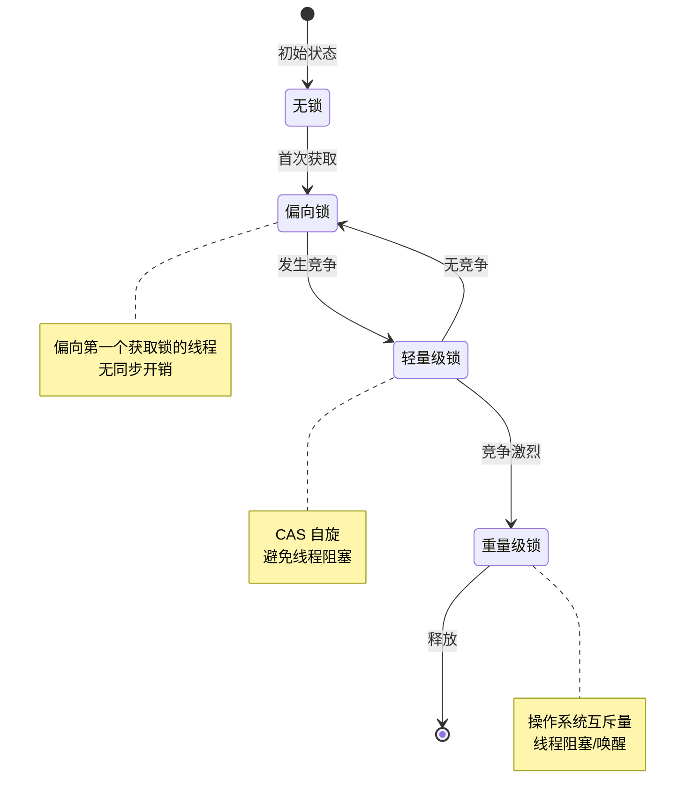

### 6.2 对象头结构

```
Java 对象头（64 位 JVM）
┌────────────────────────────────────────┐
│             Mark Word (64 bits)        │
├──────────────┬─────────────────────────┤
│ 25 bits      │ 25 bits                 │
│ 对象哈希码   │ 分代年龄                │
├──────────────┼─────────────────────────┤
│ 1 bit        │ 2 bits                  │
│ 偏向锁 ID    │ 锁标志位                │
├──────────────┴─────────────────────────┤
│ Klass Pointer (32 bits 压缩指针)       │
└────────────────────────────────────────┘

锁标志位（最后 2 位）:
00 - 轻量级锁
01 - 无锁或偏向锁
10 - 重量级锁
11 - GC 标记
```

### 6.3 偏向锁机制

#### 6.3.1 工作原理

偏向锁假设**只有一个线程访问同步块**，该线程在后续访问时无需任何同步操作。

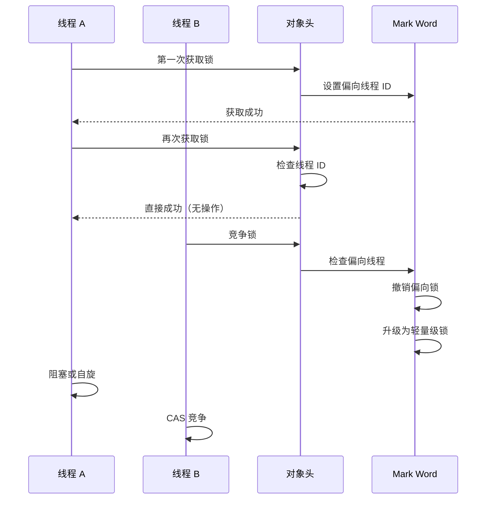

#### 6.3.2 偏向锁撤销

偏向锁撤销需要**全局安全点（Safepoint）**，会暂停所有线程：

```java
// 启用偏向锁（默认开启）
-XX:+UseBiasedLocking

// 延迟偏向锁启动（默认 4000ms）
-XX:BiasedLockingStartupDelay=0

// 批量撤销阈值
-XX:BiasedLockingBulkRebiasThreshold=20

// 批量锁定阈值
-XX:BiasedLockingBulkLockThreshold=40
```

### 6.4 轻量级锁（自旋锁）

#### 6.4.1 CAS 自旋

轻量级锁使用 **CAS（Compare And Swap）** 操作尝试获取锁，失败后自旋等待。

```java
// 伪代码表示轻量级锁获取
boolean tryLightweightLock(Object obj) {
    Thread current = Thread.currentThread();
    LockRecord record = new LockRecord();
  
    // 1. 在栈帧中创建 Lock Record
    record.obj = obj;
    record.displacedMark = obj.markWord;
  
    // 2. CAS 替换对象头
    if (CAS(obj.markWord, record.displacedMark, record)) {
        return true; // 获取成功
    }
  
    // 3. CAS 失败，说明有竞争
    if (obj.markWord == record) {
        // 当前线程已持有锁（重入）
        return true;
    }
  
    // 4. 膨胀为重量级锁
    inflateLock(obj);
    return false;
}
```

#### 6.4.2 自旋优化

```java
// 自旋锁参数配置
-XX:+UseSpinning              // 启用自旋（Java 6+ 默认开启）
-XX:PreBlockSpin=10           // 自旋次数（Java 7 后自适应）

// Java 7+ 自适应自旋
// JVM 根据之前在同一锁上的自旋情况调整自旋次数
```

### 6.5 锁消除与锁粗化

#### 6.5.1 锁消除

JIT 编译器通过**逃逸分析**发现某些锁不会被多线程访问，直接消除：

```java
// 锁消除示例
public String concat(String s1, String s2) {
    // StringBuffer 的 append 方法有 synchronized
    // 但 sb 不会逃逸出方法，锁被消除
    StringBuffer sb = new StringBuffer();
    sb.append(s1);
    sb.append(s2);
    return sb.toString();
}
```

#### 6.5.2 锁粗化

JVM 将连续的加锁解锁操作合并为一次：

```java
// 锁粗化前
StringBuffer sb = new StringBuffer();
for (int i = 0; i < 100; i++) {
    sb.append(i);  // 每次都加锁解锁
}

// 锁粗化后（JIT 优化）
StringBuffer sb = new StringBuffer();
// 锁定整个循环
for (int i = 0; i < 100; i++) {
    sb.append(i);
}
// 循环结束后解锁
```

### 6.6 锁升级过程详解

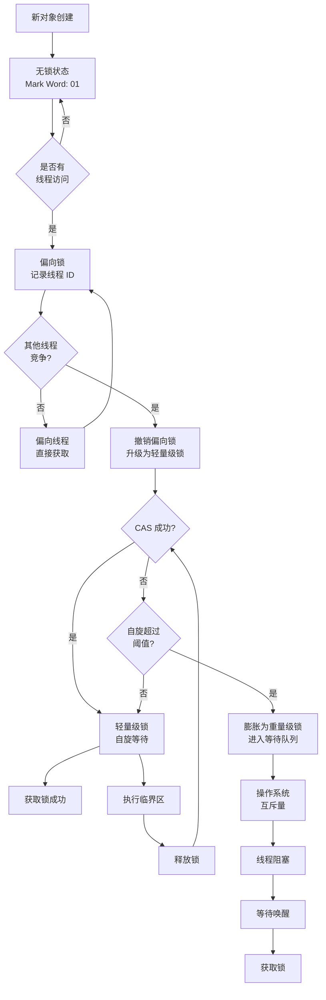


## 7. 锁的对比与选型

### 7.1 主流锁对比表


| 特性         | synchronized | ReentrantLock | ReentrantReadWriteLock | StampedLock      |
| ------------ | ------------ | ------------- | ---------------------- | ---------------- |
| **实现方式** | JVM 内置     | AQS           | AQS                    | AQS              |
| **锁释放**   | 自动         | 手动          | 手动                   | 手动             |
| **可中断**   | ❌           | ✅            | ✅                     | ✅               |
| **超时尝试** | ❌           | ✅            | ✅                     | ✅               |
| **公平锁**   | ❌           | ✅            | ✅                     | ❌               |
| **条件变量** | 单一         | 多个          | 多个                   | 无               |
| **可重入**   | ✅           | ✅            | ✅                     | ❌               |
| **读锁共享** | ❌           | ❌            | ✅                     | ✅               |
| **乐观读**   | ❌           | ❌            | ❌                     | ✅               |
| **性能**     | 中等         | 高            | 读多写少场景高         | 读多写少场景最高 |

### 7.2 选型决策树

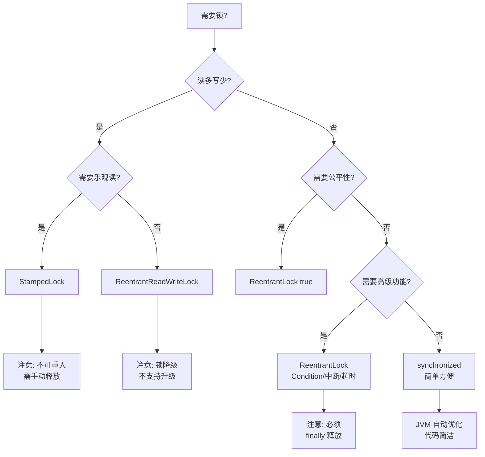

### 7.3 性能测试对比

```java
// 性能测试场景：读多写少（90% 读，10% 写）
@Test
public void lockPerformanceTest() throws Exception {
    int threadCount = 10;
    int iterations = 100000;
  
    // synchronized
    long syncTime = testSynchronized(threadCount, iterations);
  
    // ReentrantLock
    long reentrantTime = testReentrantLock(threadCount, iterations);
  
    // ReentrantReadWriteLock
    long rwLockTime = testReadWriteLock(threadCount, iterations);
  
    // StampedLock
    long stampedTime = testStampedLock(threadCount, iterations);
  
    System.out.println("synchronized: " + syncTime + "ms");
    System.out.println("ReentrantLock: " + reentrantTime + "ms");
    System.out.println("ReadWriteLock: " + rwLockTime + "ms");
    System.out.println("StampedLock: " + stampedTime + "ms");
}

// 典型结果（读多写少场景）:
// synchronized:    1500ms
// ReentrantLock:   1200ms
// ReadWriteLock:    600ms  (2.5x 提升)
// StampedLock:      400ms  (3.75x 提升)
```


## 8. 死锁与问题排查

### 8.1 死锁产生条件

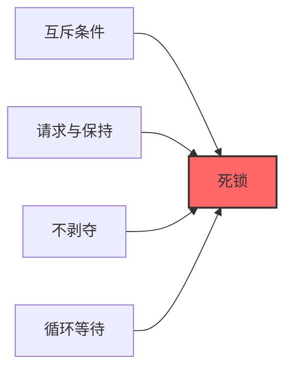

### 8.2 死锁示例

```java
public class DeadlockExample {
    private static final Object lock1 = new Object();
    private static final Object lock2 = new Object();
  
    public static void main(String[] args) {
        // 线程 1: 先锁 lock1，再锁 lock2
        new Thread(() -> {
            synchronized (lock1) {
                System.out.println("Thread 1: holding lock1");
                try { Thread.sleep(100); } catch (Exception e) {}
                System.out.println("Thread 1: waiting for lock2");
                synchronized (lock2) {
                    System.out.println("Thread 1: holding lock1 & lock2");
                }
            }
        }, "Thread-1").start();
      
        // 线程 2: 先锁 lock2，再锁 lock1
        new Thread(() -> {
            synchronized (lock2) {
                System.out.println("Thread 2: holding lock2");
                try { Thread.sleep(100); } catch (Exception e) {}
                System.out.println("Thread 2: waiting for lock1");
                synchronized (lock1) {
                    System.out.println("Thread 2: holding lock1 & lock2");
                }
            }
        }, "Thread-2").start();
    }
}
```

### 8.3 死锁检测与排查

#### 8.3.1 使用 jstack

```bash
# 1. 查找 Java 进程 ID
jps -l

# 2. 导出线程栈信息
jstack <pid> > thread_dump.txt

# 3. 查找死锁
jstack <pid> | grep -A 20 "Found one Java-level deadlock"
```

#### 8.3.2 使用 ThreadMXBean

```java
public class DeadlockDetector {
    public static void detectDeadlock() {
        ThreadMXBean threadMXBean = ManagementFactory.getThreadMXBean();
        long[] deadlockedThreads = threadMXBean.findDeadlockedThreads();
      
        if (deadlockedThreads != null) {
            System.out.println("发现死锁！线程 ID: " + Arrays.toString(deadlockedThreads));
          
            ThreadInfo[] threadInfos = threadMXBean.getThreadInfo(
                deadlockedThreads, true, true
            );
          
            for (ThreadInfo info : threadInfos) {
                System.out.println("线程: " + info.getThreadName());
                System.out.println("锁定: " + info.getLockName());
                System.out.println("等待: " + info.getLockOwnerName());
            }
        }
    }
}
```

#### 8.3.3 可视化分析工具


| 工具          | 功能                           |
| ------------- | ------------------------------ |
| **JConsole**  | 实时监控线程状态               |
| **VisualVM**  | 线程分析、死锁检测             |
| **JProfiler** | 商业工具，强大的锁分析         |
| **Arthas**    | 在线诊断，`thread -b` 查找阻塞 |

### 8.4 避免死锁的策略

```java
// 策略 1: 固定锁顺序
public class FixedOrderLocking {
    private final Object lock1 = new Object();
    private final Object lock2 = new Object();
  
    // 始终按 lock1 -> lock2 的顺序获取
    public void method1() {
        synchronized (lock1) {
            synchronized (lock2) {
                // 临界区
            }
        }
    }
  
    public void method2() {
        synchronized (lock1) {  // 也先获取 lock1
            synchronized (lock2) {
                // 临界区
            }
        }
    }
}

// 策略 2: 使用 tryLock 超时
public class TryLockTimeout {
    private final ReentrantLock lock1 = new ReentrantLock();
    private final ReentrantLock lock2 = new ReentrantLock();
  
    public boolean doSomething() throws InterruptedException {
        if (lock1.tryLock(1, TimeUnit.SECONDS)) {
            try {
                if (lock2.tryLock(1, TimeUnit.SECONDS)) {
                    try {
                        // 临界区
                        return true;
                    } finally {
                        lock2.unlock();
                    }
                }
            } finally {
                lock1.unlock();
            }
        }
        return false; // 获取锁失败，重试或放弃
    }
}

// 策略 3: 减少锁粒度
public class FineGrainedLocking {
    // 使用多个锁代替一个大锁
    private final Map<String, ReentrantLock> locks = new ConcurrentHashMap<>();
  
    public void update(String key, Object value) {
        ReentrantLock lock = locks.computeIfAbsent(key, k -> new ReentrantLock());
        lock.lock();
        try {
            // 只锁定特定 key 的数据
        } finally {
            lock.unlock();
        }
    }
}
```


## 9. 最佳实践与性能优化

### 9.1 锁使用最佳实践

#### ✅ DO - 推荐做法

```java
// 1. 缩小锁粒度
public class GoodPractice {
    private final Map<String, Data> map = new ConcurrentHashMap<>();
  
    // 只对必要代码加锁
    public void update(String key, Data data) {
        Data processed = processData(data); // 锁外处理
        synchronized (this) {
            map.put(key, processed); // 只锁关键操作
        }
    }
}

// 2. 使用并发容器
public class ConcurrentCollections {
    // 代替 synchronized Map
    private final ConcurrentMap<String, Object> map = new ConcurrentHashMap<>();
  
    // 代替 synchronized List
    private final List<String> list = Collections.synchronizedList(new ArrayList<>());
  
    // 或使用 CopyOnWriteArrayList（读多写少）
    private final List<String> cowList = new CopyOnWriteArrayList<>();
}

// 3. 使用原子类代替简单锁
public class AtomicPractice {
    private final AtomicInteger counter = new AtomicInteger(0);
    private final AtomicReference<State> state = new AtomicReference<>();
  
    public void increment() {
        counter.incrementAndGet(); // 无锁操作
    }
}

// 4. 读写分离
public class ReadWriteSeparation {
    private final ReentrantReadWriteLock rwLock = new ReentrantReadWriteLock();
  
    public Data read(String key) {
        rwLock.readLock().lock();
        try {
            return getData(key);
        } finally {
            rwLock.readLock().unlock();
        }
    }
  
    public void write(String key, Data value) {
        rwLock.writeLock().lock();
        try {
            putData(key, value);
        } finally {
            rwLock.writeLock().unlock();
        }
    }
}

// 5. 使用 try-finally 确保释放
public class SafeLocking {
    private final Lock lock = new ReentrantLock();
  
    public void safeMethod() {
        lock.lock();
        try {
            // 临界区
        } finally {
            lock.unlock(); // 必须释放
        }
    }
}
```

#### ❌ DON'T - 避免做法

```java
// 1. 锁内调用外部方法
public class BadPractice {
    public void badMethod() {
        synchronized (this) {
            externalMethod(); // 外部方法可能耗时或死锁
        }
    }
}

// 2. 粒度过粗
public class CoarseLocking {
    private final Object lock = new Object();
  
    public void process(List<Data> list) {
        synchronized (lock) {
            for (Data data : list) {
                processItem(data); // 整个循环都被锁定
            }
        }
    }
}

// 3. 忘记释放锁
public class ForgetUnlock {
    private final Lock lock = new ReentrantLock();
  
    public void dangerousMethod() {
        lock.lock();
        // 如果异常，锁永远不会释放！
        doSomething();
        lock.unlock();
    }
}

// 4. 在不可变对象上加锁
public class ImmutableLock {
    public void method(final String str) {
        synchronized (str) { // String 可能被其他代码使用
            // 危险！
        }
    }
}
```

### 9.2 性能优化技巧

#### 9.2.1 减少锁竞争

```java
// 1. 分段锁（ConcurrentHashMap 原理）
public class SegmentLock<K, V> {
    private final int segmentCount = 16;
    private final Segment<K, V>[] segments;
  
    static class Segment<K, V> {
        private final ReentrantLock lock = new ReentrantLock();
        private final Map<K, V> map = new HashMap<>();
    }
  
    public V get(K key) {
        int segmentIndex = Math.abs(key.hashCode() % segmentCount);
        Segment<K, V> segment = segments[segmentIndex];
        segment.lock.lock();
        try {
            return segment.map.get(key);
        } finally {
            segment.lock.unlock();
        }
    }
}

// 2. 使用 ThreadLocal 避免共享
public class ThreadLocalPractice {
    private static final ThreadLocal<SimpleDateFormat> formatter = 
        ThreadLocal.withInitial(() -> new SimpleDateFormat("yyyy-MM-dd"));
  
    public String format(Date date) {
        return formatter.get().format(date); // 无锁
    }
}

// 3. 无锁编程（CAS）
public class LockFreeCounter {
    private final AtomicLong counter = new AtomicLong(0);
  
    public void increment() {
        while (true) {
            long current = counter.get();
            long next = current + 1;
            if (counter.compareAndSet(current, next)) {
                break;
            }
            // CAS 失败，自旋重试
        }
    }
}
```

#### 9.2.2 JVM 参数调优

```bash
# 锁相关 JVM 参数
-XX:+UseBiasedLocking              # 启用偏向锁（Java 15+ 已废弃）
-XX:BiasedLockingStartupDelay=0    # 立即启用偏向锁
-XX:+UseLocking                    # 启用锁优化

# 自旋锁参数
-XX:+UseSpinning                   # 启用自旋
-XX:PreBlockSpin=10                # 自旋次数

# 打印锁信息
-XX:+PrintSafepointStatistics      # 打印安全点统计
-XX:PrintSafepointStatisticsCount=1

# 偏向锁批量撤销阈值
-XX:BiasedLockingBulkRebiasThreshold=20
-XX:BiasedLockingBulkLockThreshold=40
```

### 9.3 监控与诊断

```java
// 锁监控
public class LockMonitor {
    public static void printLockInfo() {
        ThreadMXBean threadMXBean = ManagementFactory.getThreadMXBean();
      
        // 获取所有线程
        ThreadInfo[] threadInfos = threadMXBean.dumpAllThreads(true, true);
      
        for (ThreadInfo info : threadInfos) {
            System.out.println("线程: " + info.getThreadName());
            System.out.println("状态: " + info.getThreadState());
          
            LockInfo lockInfo = info.getLockInfo();
            if (lockInfo != null) {
                System.out.println("锁定: " + lockInfo);
            }
          
            ThreadInfo blockedInfo = info.getBlockedTime();
            if (blockedInfo != null) {
                System.out.println("阻塞时间: " + info.getBlockedTime() + "ms");
            }
        }
    }
}
```
