# MySQL高级知识总结

# 1.MySQL的整体架构

## 1.1 逻辑架构

MySQL 采用**分层架构**设计，从上到下分为：`连接层`、`SQL 层`、`存储引擎层`、`文件系统层`。如图：

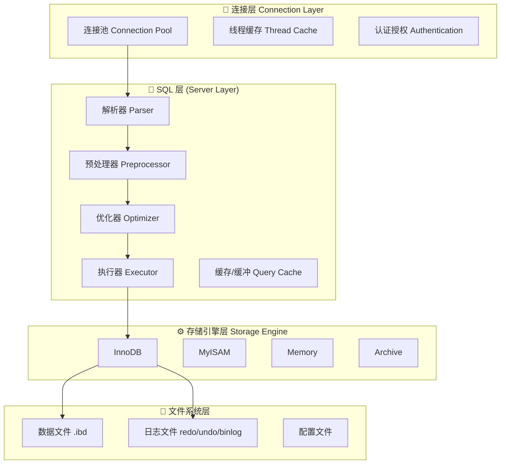

## 1.1.连接层核心机制

| 组件           | 作用                       | 关键参数              |
| -------------- | -------------------------- | --------------------- |
| **连接管理器** | 处理客户端连接、认证       | `max_connections`     |
| **线程池**     | 复用线程，避免频繁创建销毁 | `thread_cache_size`   |
| **线程缓存**   | 缓存空闲线程               | 建议设为 CPU 核数 × 2 |

**连接生命周期：**

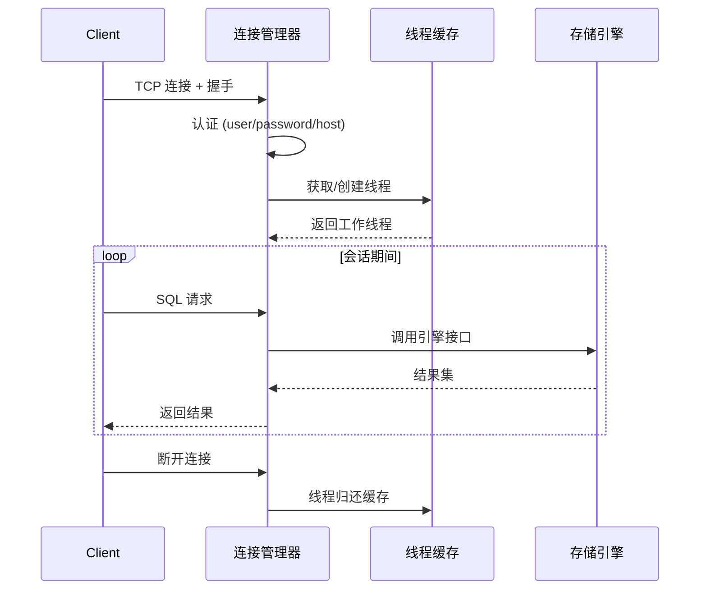

### 1.3 SQL 层核心组件

- **解析器（Parser）**：词法分析 → 语法分析 → 生成解析树
- **预处理器**：检查表/列是否存在，展开 `*`，转换函数
- **优化器**：基于成本（CBO）选择最优执行计划
- **执行器**：调用存储引擎 API 执行查询

# 2.深入InnoDB 存储引擎

InnoDB的存储结构，可分为**内存结构**（In-Memory Structures）和**磁盘结构**（On-Disk Structures），如图所示：

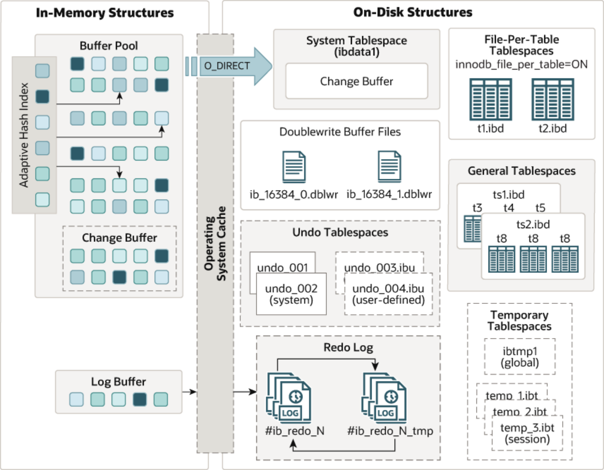

**数据流转全景图**

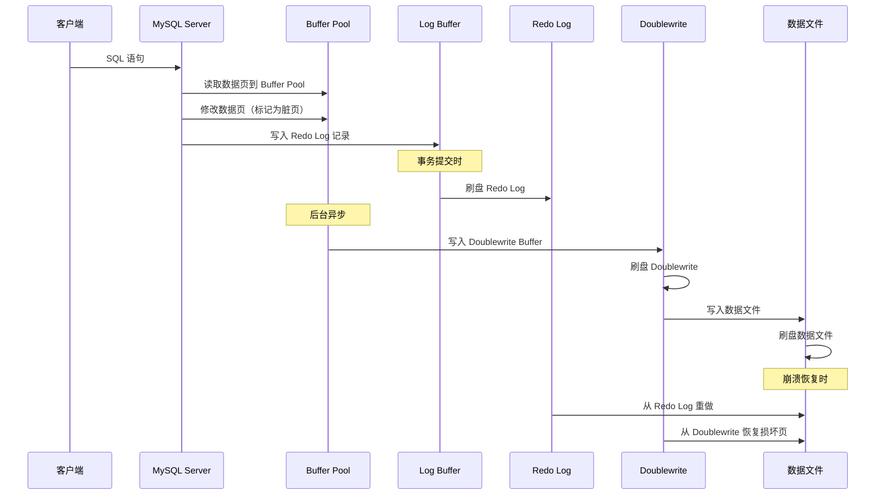

## 2.1.**内存结构**（In-Memory Structures）

### 2.1.1.Buffer Pool（缓冲池）

**核心作用**：

- 缓存从磁盘读取的数据页和索引页
- 所有数据修改先在 Buffer Pool 中进行
- 减少磁盘 IO，提升性能

InnoDB存储引擎基于磁盘文件存储，访问物理硬盘和在内存中进行访问，速度相差很大，为了尽可能 弥补这两者之间的I/O效率的差值，就需要把经常使用的数据加载到缓冲池中，避免每次访问都进行磁 盘I/O。

在InnoDB的缓冲池中不仅缓存了索引页和数据页，还包含了undo页、插入缓存、自适应哈希索引以及 InnoDB的锁信息等等。

缓冲池 Buffer Pool，是主内存中的一个区域，里面可以缓存磁盘上经常操作的真实数据，在执行增 删改查操作时，先操作缓冲池中的数据（若缓冲池没有数据，则从磁盘加载并缓存），然后再以一定频 率刷新到磁盘，从而减少磁盘IO，加快处理速度。 

缓冲池以Page页为单位，底层采用链表数据结构管理Page。根据状态，将Page分为三种类型： 

- free page：空闲page，未被使用。
- clean page：被使用page，数据没有被修改过。 
- dirty page：脏页，被使用page，数据被修改过，也中数据与磁盘的数据产生了不一致。

**关键特性**：

| 特性         | 说明                                    |
| ------------ | --------------------------------------- |
| **页大小**   | 默认 16KB（可配置为 4KB/8KB/32KB/64KB） |
| **LRU 管理** | 分为 Young 区（5/8）和 Old 区（3/8）    |
| **脏页**     | 修改后未刷盘的页（图中深色方块）        |
| **干净页**   | 已刷盘或未修改的页（图中浅色方块）      |
| **空闲页**   | 未使用的页（图中空白方块）              |

**配置建议**：

```mysql
-- 专用数据库服务器：物理内存的 70-80%
SET GLOBAL innodb_buffer_pool_size = 8589934592; -- 8GB

-- 多实例减少锁竞争（建议每 1GB 一个实例）
SET GLOBAL innodb_buffer_pool_instances = 8;
```

### 2.1.2.Adaptive Hash Index（自适应哈希索引）

```txt
┌──────────────────────┐
│  Adaptive Hash Index │
│  ┌──┐                │
│  │██│ ← 哈希索引条目   │
│  ├──┤                │
│  │  │                │
│  ├──┤                │
│  │██│                │
│  ├──┤                │
│  │  │                │
│  └──┘                │
└──────────────────────┘
         ↓ 加速
┌──────────────────────┐
│     Buffer Pool      │
│  ┌──┬──┬──┬──┐       │
│  │██│  │  │  │ ← 热点页
│  └──┴──┴──┴──┘       │
└──────────────────────┘
```

自适应hash索引，用于优化对Buffer Pool数据的查询。

MySQL的innoDB引擎中虽然没有直接支持 hash索引，但是给我们提供了一个功能就是这个自适应hash索引。因为前面我们讲到过，hash索引在 进行等值匹配时，一般性能是要高于B+树的，因为hash索引一般只需要一次IO即可，而B+树，可能需 要几次匹配，所以hash索引的效率要高，但是hash索引又不适合做范围查询、模糊匹配等。 InnoDB存储引擎会监控对表上各索引页的查询，如果观察到在特定的条件下hash索引可以提升速度， 则建立hash索引，称之为自适应hash索引。

**工作原理**：

1. InnoDB 监控索引页的访问模式
2. 当检测到某个索引页被频繁访问时，自动在内存中创建哈希索引
3. 将 B+Tree 的等值查询转化为哈希查找，速度更快

**特点**：

- **自动管理**：无需人工干预
- **只针对等值查询**：`WHERE id = 100` 有效，`WHERE id > 100` 无效
- **占用内存**：约 Buffer Pool 的 5%

**配置**：

```mysql
-- 查看是否启用
SHOW VARIABLES LIKE 'innodb_adaptive_hash_index';

-- 关闭（某些场景下可能提升性能）
SET GLOBAL innodb_adaptive_hash_index = OFF;
```


### 2.1.3.Change Buffer（变更缓冲）

Change Buffer，更改缓冲区（`针对于非唯一二级索引页`），在执行DML语句（INSERT、UPDATE、DELETE）时，如果这些数据Page 没有在Buffer Pool中，不会直接操作磁盘，而会将数据变更存在更改缓冲区 Change Buffer  中，在未来数据被读取时，再将数据合并恢复到Buffer Pool中，再将合并后的数据刷新到磁盘中。

**为什么需要 Change Buffer？**

- 二级索引通常不在 Buffer Pool 中（随机 IO）
- 直接修改需要读取索引页 → 修改 → 写回（3 次 IO）
- 使用 Change Buffer：只写 Buffer Pool（1 次 IO），后续批量合并

与聚集索引不同，二级索引通常是非唯一的，并且以相对随机的顺序插入二级索引。同样，删除和更新 可能会影响索引树中不相邻的二级索引页，如果每一次都操作磁盘，会造成大量的磁盘IO。有了 ChangeBuffer之后，我们可以在缓冲池中进行合并处理，减少磁盘IO。

**适用场景**：

| 操作                 | 是否使用 Change Buffer |
| -------------------- | ---------------------- |
| INSERT（非唯一索引） | ✓                      |
| UPDATE（非唯一索引） | ✓                      |
| DELETE（非唯一索引） | ✓                      |
| 唯一索引操作         | ✗（需要检查唯一性）    |
| 主键操作             | ✗                      |

**配置**：

```mysql
-- 控制 Change Buffer 最大占用 Buffer Pool 的比例（默认 25%）
SET GLOBAL innodb_change_buffer_max_size = 25;

-- 查看 Change Buffer 状态
SHOW ENGINE INNODB STATUS\G
```

### 2.1.4.Log Buffer（日志缓冲）

```txt
┌─────────────────────────────────────────┐
│              Log Buffer                 │
│  ┌───┬───┬───┬───┬───┬───┬───┬───┐      │
│  │ ░ │ ░ │ ░ │ █ │ ░ │ ░ │ █ │ ░ │      │  ← Redo Log 记录
│  └───┴──────┴───┴──────┴───┴─────┘      │
└─────────────────────────────────────────┘
         ↓ 刷新
─────────────────────────────────────────┐
│            Redo Log 文件                │
│  #ib_redo_N  #ib_redo_N_tmp            │
└────────────────────────────────────────┘
```

Log Buffer：日志缓冲区，用来保存要写入到磁盘中的log日志数据（redo log 、undo log）， 默认大小为 16MB，日志缓冲区的日志会定期刷新到磁盘中。如果需要更新、插入或删除许多行的事 务，增加日志缓冲区的大小可以节省磁盘 I/O。

>  **作用**：缓存即将写入 Redo Log 文件的事务日志

**刷新时机**：

| 触发条件          | 说明                                       |
| ----------------- | ------------------------------------------ |
| **事务提交**      | 根据 `innodb_flush_log_at_trx_commit` 配置 |
| **Buffer 满 1/2** | 自动刷新                                   |
| **每秒刷新**      | Master Thread 定时任务                     |
| **Checkpoint**    | 检查点时刷新                               |

innodb_flush_log_at_trx_commit：日志刷新到磁盘时机，取值主要包含以下三个：

---

innodb_flush_log_at_trx_commit=1: 日志在每次事务提交时写入并刷新到磁盘，**默认值**。 

innodb_flush_log_at_trx_commit=0: 每秒将日志写入并刷新到磁盘一次。 

innodb_flush_log_at_trx_commit=2: 日志在每次事务提交后写入，并每秒刷新到磁盘一次。

## 2.2.Operating System Cache（操作系统缓存）

**作用**：

- 操作系统提供的文件缓存机制
- 减少应用程序直接访问磁盘的次数
- Linux 下称为 Page Cache

**O_DIRECT 模式**：

- 图中 Buffer Pool 到 OS Cache 的箭头标注了 `O_DIRECT`
- 使用 `O_DIRECT` 可以**绕过 OS Cache**，避免双重缓存
- InnoDB 自己管理 Buffer Pool，不需要 OS Cache 再缓存一份

```mysql
-- 配置刷新方法
-- O_DIRECT：绕过 OS Cache（推荐）
-- fdatasync：使用 OS Cache
SET GLOBAL innodb_flush_method = 'O_DIRECT';
```

**双重缓存问题**：

+ 无 O_DIRECT：  数据 → Buffer Pool → **OS Cache** → Disk（两份缓存，浪费内存）

+ 有 O_DIRECT：  数据 → Buffer Pool → Disk（直接写入，节省内存）

## 2.3.**磁盘结构**（On-Disk Structures）

### 2.3.1.System Tablespace（系统表空间）

系统表空间是**更改缓冲区的存储区域**。如果表是在系统表空间而不是每个表文件或通用表空间中创建的，它也可能包含表和索引数据。(在MySQL5.x版本中还包含InnoDB数据字典、undolog等)

```txt
┌─────────────────────────────────────────┐
│        System Tablespace (ibdata1)      │
│  ┌───────────────────────────────────┐  │
│  │         Change Buffer             │  │  ← 变更缓冲的持久化
│  ├───────────────────────────────────┤  │
│  │       Data Dictionary             │  │  ← 数据字典（5.7 及之前）
│  ├───────────────────────────────────┤  │
│  │      Doublewrite Buffer           │  │  ← 双写缓冲（5.7 及之前）
│  ├───────────────────────────────────┤  │
│  │        Undo Logs                  │  │  ← 回滚日志（5.6 及之前）
│  └───────────────────────────────────┘  │
└─────────────────────────────────────────┘
```

**存储内容**：

- **Change Buffer**：变更缓冲的持久化数据
- **Data Dictionary**：数据字典（MySQL 8.0 已移到独立表空间）
- **Doublewrite Buffer**：双写缓冲（MySQL 8.0.20+ 已独立）
- **Undo Logs**：回滚日志（MySQL 5.6+ 可独立）

**特点**：

- 文件名为 `ibdata1`
- 默认自动扩展
- **不能收缩**（删除数据后空间不释放）

### 2.3.2.File-Per-Table Tablespaces（独立表空间）

如果开启了`innodb_file_per_table`开关 ，则每个表的文件表空间包含单个InnoDB表的数据和索引 ，并存储在文件系统上的单个数据文件中。

**特点**：

- 每个表一个 `.ibd` 文件
- 存储表的数据和索引
- 支持独立操作：
  - `TRUNCATE TABLE` 快速清空
  - `OPTIMIZE TABLE` 重建表
  - 独立备份和恢复
  - 表空间传输（Transportable Tablespaces）

**配置:**

```mysql
-- MySQL 5.6+ 默认开启
SHOW VARIABLES LIKE 'innodb_file_per_table';
-- 输出：ON
```

### 2.3.3.Doublewrite Buffer Files（双写缓冲文件）

双写缓冲区，innoDB引擎将数据页从Buffer Pool刷新到磁盘前，先将数据页写入双写缓冲区文件 中，便于系统异常时恢复数据。

```txt
┌─────────────────────────────────────────┐
│       Doublewrite Buffer Files          │
│                                         │
│  ┌──────────────┐  ┌──────────────┐     │
│  │ib_16384_0.dblwr│  │ib_16384_1.dblwr│ │
│  │  ┌────────┐  │  │  ┌────────┐  │     │
│  │  │ 页 1   │  │  │  │ 页 129 │  │      │
│  │  │ 页 2   │  │  │  │ 页 130 │  │      │
│  │  │ ...    │  │  │  │ ...    │  │     │
│  │  │ 页 128 │  │  │  │ 页 256 │  │      │
│  │  └────────┘  │  │  └────────┘  │     │
│  └──────────────┘  └──────────────┘     │
─────────────────────────────────────────┘
```

**为什么需要 Doublewrite Buffer？**

**问题：页断裂（Partial Page Write）**

写入 16KB 页的过程：
  1. 写入前 8KB → 系统崩溃
  2. 重启后页只有一半数据 → 页损坏！

**解决方案**：

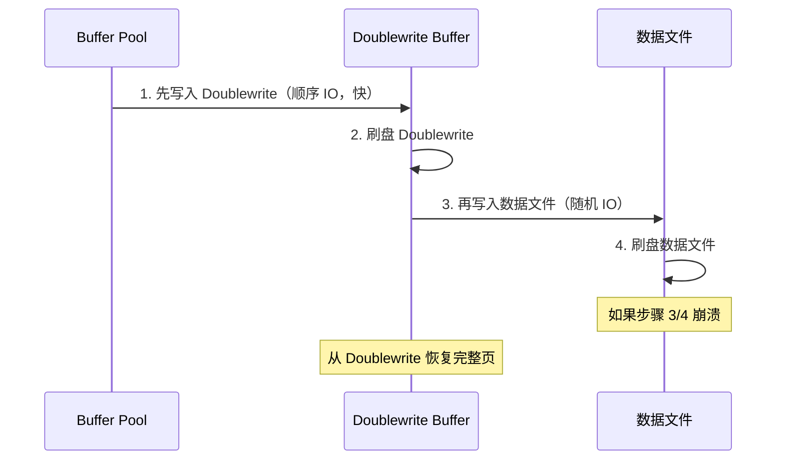

**文件说明**：

- `ib_16384_0.dblwr`：第一个双写缓冲文件（16384 = 16KB 页大小）
- `ib_16384_1.dblwr`：第二个双写缓冲文件
- 每个文件 2MB（128 页 × 16KB）

### 2.3.4.Undo Tablespaces（回滚表空间）

**作用**：存储 Undo Log，用于：

1. **事务回滚**：撤销未提交的修改
2. **MVCC**：提供数据的历史版本

**文件类型**：

| 类型              | 文件名                         | 说明                   |
| ----------------- | ------------------------------ | ---------------------- |
| **系统 Undo**     | `undo_001`, `undo_002`         | 默认创建，存储系统事务 |
| **用户定义 Undo** | `undo_003.ibu`, `undo_004.ibu` | 手动创建，可独立管理   |

**配置**：

```mysql
-- 查看 Undo 表空间
SHOW VARIABLES LIKE 'innodb_undo_tablespaces';

-- 创建独立的 Undo 表空间
CREATE UNDO TABLESPACE undo_003 ADD DATAFILE 'undo_003.ibu';

-- 截断 Undo 表空间（释放空间）
ALTER UNDO TABLESPACE undo_003 SET INACTIVE;
-- 等待 Purge 线程清理后
ALTER UNDO TABLESPACE undo_003 SET ACTIVE;
```

**Undo Log 结构**：

```text
┌─────────────────────────────────────────
│           Undo Record                   │
│  ┌───────────────────────────────────┐  │
│  │  Undo Record Header (2 bytes)     │  │
│  ├───────────────────────────────────┤  │
│  │  Transaction Info (6 bytes)       │  │  ← 事务 ID
│  ├───────────────────────────────────┤  │
│  │  Roll Pointer (7 bytes)           │  │  ← 指向旧版本
│  ├───────────────────────────────────┤  │
│  │  Old Data (变长)                   │  │  ← 修改前的数据
│  ────────────────────────────────────┘  │
└─────────────────────────────────────────┘
```


### 2.3.5.Redo Log（重做日志）

重做日志，是用来实现事务的持久性。

该日志文件由两部分组成：**重做日志缓冲（redo log  buffer）**以及**重做日志文件（redo log）**,前者是在内存中，后者在磁盘中。当事务提交之后会把所 有修改信息都会存到该日志中, 用于在刷新脏页到磁盘时,发生错误时, 进行数据恢复使用。

> **作用**：保证事务的**持久性**（Durability）

**工作原理（WAL）**（Write-Ahead Logging）

> Write-Ahead Logging（日志先行）：
>   1. 修改数据页 → 写入 Buffer Pool
>   2. 生成 Redo Log → 写入 Log Buffer
>   3. 刷盘 Redo Log（先于数据页）
>   4. 后台异步刷盘数据页
>
>   崩溃恢复时：
>   - 已刷盘的 Redo Log → 重做（保证持久性）
>   - 未刷盘的数据页 → 从 Redo Log 恢复

**文件说明**：

- `#ib_redo_N`：当前的 Redo Log 文件
- `#ib_redo_N_tmp`：临时文件（切换时使用）
- 循环写入：写满后从头开始

**关键参数**：

```mysql
-- Redo Log 文件大小（默认 48MB，建议 512MB-1GB）
SHOW VARIABLES LIKE 'innodb_log_file_size';

-- Redo Log 文件数量（默认 2）
SHOW VARIABLES LIKE 'innodb_log_files_in_group';

-- 查看 Redo Log 状态
SHOW ENGINE INNODB STATUS\G
-- 关注：Log sequence number, Log flushed up to
```

### 2.3.6.General Tablespaces（通用表空间）

通用表空间，需要通过 CREATE TABLESPACE 语法创建通用表空间，在创建表时，可以指定该表空间。

**特点**：

- 用户创建的共享表空间
- 多个表可以存储在同一个 `.ibd` 文件中
- 支持表压缩

**使用场景**：

- 相关表分组存储
- 需要表压缩时
- 特定业务逻辑分组

**创建和使用**：

```mysql
-- 创建通用表空间
CREATE TABLESPACE ts1 ADD DATAFILE 'ts1.ibd' FILE_BLOCK_SIZE = 8192;

-- 在通用表空间中创建表
CREATE TABLE t3 (id INT PRIMARY KEY) TABLESPACE ts1;
CREATE TABLE t4 (id INT PRIMARY KEY) TABLESPACE ts1;

-- 移动表到通用表空间
ALTER TABLE t5 TABLESPACE ts2;
```

### 2.3.7.Temporary Tablespaces（临时表空间）

InnoDB 使用会话临时表空间和全局临时表空间。存储用户创建的临时表等数据。

**用途**：

- 存储临时表（`CREATE TEMPORARY TABLE`）
- 内部临时表（排序、GROUP BY、子查询等）

**文件类型**：

| 类型               | 文件名       | 说明                         |
| ------------------ | ------------ | ---------------------------- |
| **全局临时表空间** | `ibtmp1`     | 存储非压缩临时表，重启后删除 |
| **会话临时表空间** | `temp_N.ibt` | 存储压缩临时表，会话结束删除 |

**配置:**

```mysql
-- 查看临时表空间配置
SHOW VARIABLES LIKE 'innodb_temp_data_file_path';
-- 默认：ibtmp1:12M:autoextend

-- 限制临时表空间大小（防止爆盘）
innodb_temp_data_file_path = ibtmp1:12M:autoextend:max:5G
```

**临时表空间增长问题**：

```mysql
-- 检查临时表空间大小
SELECT file_name, total_extents, current_size
FROM information_schema.innodb_temp_tablespaces;

-- 重启 MySQL 可重置 ibtmp1 大小
-- 或优化 SQL 减少临时表使用
```

## 2.4.后台线程

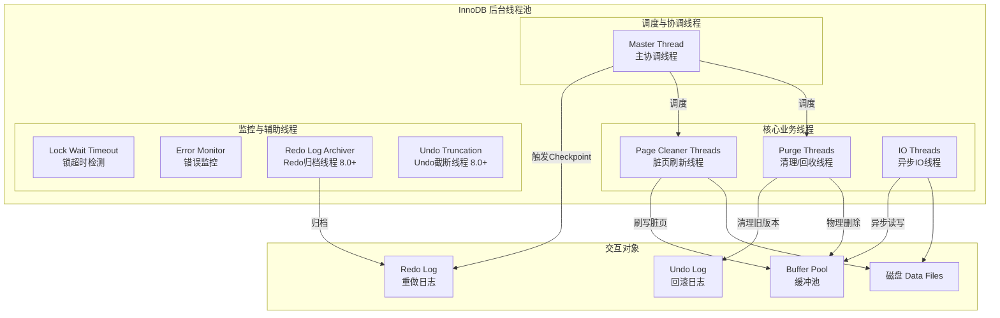

在 InnoDB 架构中，**后台线程**是维持其高性能、高并发和数据一致性的“幕后英雄”。它们负责处理各种异步任务，如磁盘 IO、脏页刷新、垃圾回收等，从而将用户线程（前台线程）从繁重的底层操作中解放出来。

### 2.4.1.Mster Thread（主协调线程）

> **作用**：InnoDB 的“大管家”和“调度中心”。核心后台线程，负责调度其他线程，还负责将缓冲池中的数据异步刷新到磁盘中, 保持数据的一致性，  还包括脏页的刷新、合并插入缓存、undo页的回收 

### 2.4.2.IO Threads（异步 IO 线程）

> **作用**：InnoDB 使用异步 IO（AIO）来提高磁盘读写效率。IO 线程负责从 IO 队列中获取任务，并在后台执行实际的磁盘读写操作。

**线程分类与默认数量**（总共默认 10 个）：

| 线程类型                 | 默认数量 | 职责说明                                                     |
| ------------------------ | -------- | ------------------------------------------------------------ |
| **Read Thread**          | 4        | 处理数据页和索引页的**异步读取**请求。                       |
| **Write Thread**         | 4        | 处理数据页和索引页的**异步写入**请求。                       |
| **Insert Buffer Thread** | 1        | 专门处理 Change Buffer（原 Insert Buffer）的**合并与写入**。 |
| **Log Thread**           | 1        | 专门处理 Redo Log 的**异步刷盘**（在较新版本中，日志刷盘多为同步或独立机制，此线程作用有所弱化）。 |

**配置参数**：

```mysql
-- 调整读 IO 线程数（默认 4，SSD 环境可适当调大，如 8 或 16）
SET GLOBAL innodb_read_io_threads = 8;

-- 调整写 IO 线程数（默认 4，SSD 环境可适当调大）
SET GLOBAL innodb_write_io_threads = 8;
```


**工作原理**：

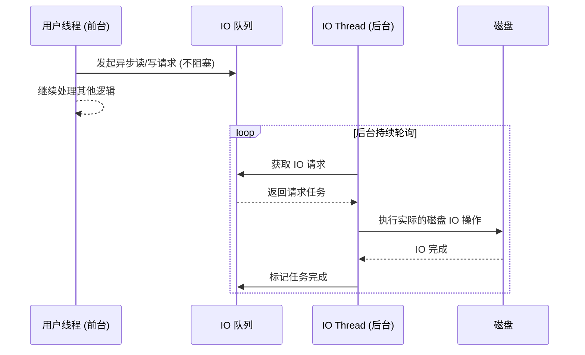

### 2.4.3.Page Cleaner Threads（脏页刷新线程）

> **作用**：负责将 Buffer Pool 中的**脏页（Dirty Pages）** 异步刷写到磁盘的数据文件中。这是保证数据库性能（避免同步刷盘阻塞）和崩溃恢复能力的关键。

**演进历史**：

- **MySQL 5.5 及之前**：由 Master Thread 统一负责刷脏页，容易成为性能瓶颈。
- **MySQL 5.6**：引入 Page Cleaner Thread，将刷脏页工作剥离。
- **MySQL 8.0**：支持多实例 Page Cleaner，每个 Buffer Pool Instance 可以分配独立的 Page Cleaner 线程，大幅减少锁竞争。

**刷盘策略**：

1. **LRU 刷盘**：当 Buffer Pool 空间不足时，淘汰 LRU 链表尾部的脏页。
2. **Flush List 刷盘**：后台定时或 Redo Log 空间不足时，按 LSN（日志序列号）顺序刷写脏页，保证 Checkpoint 推进。

**工作流程**：

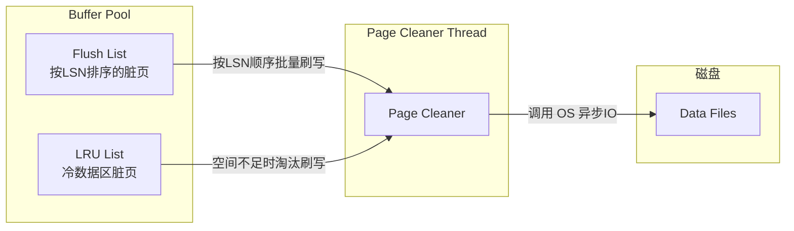

**配置参数**：

```mysql
-- 控制脏页刷新的激进程度
-- 0: 不主动刷, 1: 默认(根据Redo Log生成速度动态调整), 100: 最激进
SET GLOBAL innodb_adaptive_flushing = 1; 

-- 脏页占 Buffer Pool 的最大比例，超过此比例会强制刷盘（默认 75%）
SET GLOBAL innodb_max_dirty_pages_pct = 75;

-- 8.0 中控制 Page Cleaner 线程数（通常与 innodb_buffer_pool_instances 一致）
-- 注意：此参数在 8.0 中由系统自动管理，通常无需手动干预
```

### 2.4.4.Purge Threads（清理/回收线程）

> **作用**：InnoDB 的“垃圾回收站”。主要负责两件事：
>
> 1. **清理 Undo Log**：事务提交后，其产生的 Undo Log 不再需要用于回滚，Purge 线程负责将其标记为可重用或物理删除。
> 2. **物理删除 Delete Mark**：执行 `DELETE` 时，InnoDB 只是给记录打上“删除标记”（Delete Mark），Purge 线程会在后台真正地将这些记录从 B+Tree 中物理移除，并回收页空间。

**为什么需要 Purge 线程？**

- 如果由用户线程同步清理，会导致 `DELETE` 和 `UPDATE` 操作变慢。
- MVCC 需要保留旧版本，但旧版本不能无限保留，必须由后台异步清理。

**工作流程**：

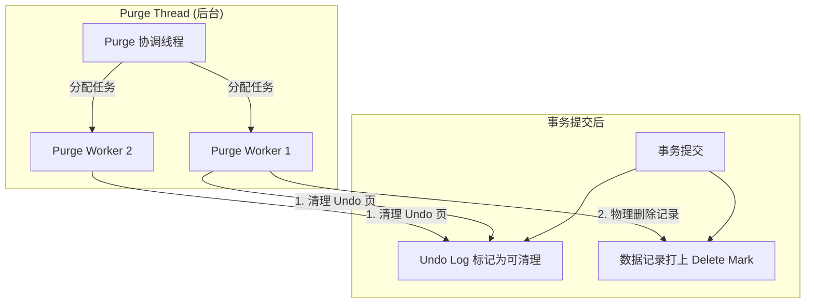


**配置参数**：

```mysql
-- 控制 Purge 线程的数量（默认 4，最大 32）
-- 增加此参数可以加快 Undo 清理和 Delete 物理删除的速度
SET GLOBAL innodb_purge_threads = 4;

-- 控制 Purge 操作的批处理大小（每次清理的记录数）
SET GLOBAL innodb_purge_batch_size = 300;
```

## 2.5.如何监控后台线程状态？

```mysql
SHOW ENGINE INNODB STATUS
```

结果：

```text
--------
BACKGROUND THREAD
--------
srv_master_thread loops: 12345 srv_active, 0 srv_shutdown, 67890 srv_idle
srv_master_thread log flush and writes: 67890

----------
SEMAPHORES
----------
OS WAIT ARRAY INFO: reservation count 12345
OS WAIT ARRAY INFO: signal count 67890
RW-shared spins 0, rounds 123, OS waits 45
RW-excl spins 0, rounds 12, OS waits 2
Spin rounds per wait: 123.00 RW-shared, 12.00 RW-excl

------------------------
LATEST FOREIGN KEY ERROR
------------------------
... (如果有错误，Error Monitor Thread 会输出在这里)

------------
TRANSACTIONS
------------
... (可以查看 Purge 线程的进度，如 history list length)
```


```mysql
-- 查看 InnoDB 相关的后台线程
SELECT thread_id, name, type, status 
FROM information_schema.innodb_threads 
WHERE type = 'BACKGROUND';

-- 查看 IO 线程状态 (MySQL 8.0)
SELECT * FROM performance_schema.threads 
WHERE name LIKE 'thread/innodb/io_handler%';
```

**关键指标**：

| 指标                                | 含义                      | 优化建议                                                     |
| ----------------------------------- | ------------------------- | ------------------------------------------------------------ |
| **Pending normal aio reads/writes** | 等待处理的异步 IO 请求数  | 如果数值持续很高，说明 IO 遇到瓶颈，考虑增加 `innodb_read/write_io_threads` 或升级 SSD。 |
| **History list length**             | 待 Purge 的 Undo Log 长度 | 如果数值持续增长，说明 Purge 线程处理不过来（可能是长事务阻塞），需检查长事务或增加 `innodb_purge_threads`。 |
| **Modified db pages**               | Buffer Pool 中的脏页数量  | 结合 `innodb_max_dirty_pages_pct` 观察，如果接近上限，说明 Page Cleaner 压力较大。 |

# 3.MySQL的索引

# 4.SQL的优化

## 4.1.insert优化

插入数据优化有四个方面：`批量插入数据`，`手动控制事务`，`主键顺序插入`，`大批量插入数据`

+ **批量插入数据**

```mysql
# ❌ 优化前：逐条插入，开销大
INSERT INTO t_table VALUES (1, 'A');
INSERT INTO t_table VALUES (2, 'B');
INSERT INTO t_table VALUES (3, 'C');

# ✅ 优化后：批量插入（建议每批次 500~1000 条，避免单条 SQL 过长超出 max_allowed_packet）
INSERT INTO t_table VALUES (1, 'A'), (2, 'B'), (3, 'C') ... (1000, 'XYZ');
```

+ **手动控制事务**

```mysql
# ❌ 优化前：自动提交，每条 insert 都会触发一次 redo log 刷盘
INSERT INTO t_table VALUES (1, 'A');
INSERT INTO t_table VALUES (2, 'B');

# ✅ 优化后：手动提交，所有 insert 共享一次 redo log 刷盘
START TRANSACTION;
INSERT INTO t_table VALUES (1, 'A'), (2, 'B');
INSERT INTO t_table VALUES (3, 'C'), (4, 'D');
INSERT INTO t_table VALUES (5, 'E'), (6, 'F');
COMMIT;
```

+ **主键顺序插入**，性能要高于乱序插入	

**原理**： InnoDB 的数据表是基于**聚簇索引**（主键索引）组织的，数据行实际存储在主键索引的 B+ 树叶子节点上。

- **顺序插入**：新数据直接追加到 B+ 树的最后一个叶子节点，效率极高。
- **乱序插入**：如果主键是乱序的（如 UUID），新数据需要插入到 B+ 树的中间节点，导致**页分裂（Page Split）**，产生磁盘碎片，严重降低插入和查询性能。

```mysql
# ✅ 推荐使用自增 ID 或雪花算法 ID（全局趋势递增）
# 插入顺序：1, 2, 3, 4, 5...

# ❌ 避免使用 UUID 作为主键（完全无序）
# 插入顺序：550e8400-e29b..., 6ba7b810-9dad..., 123e4567...
```

+ **大批量插入数据**

如一次性需要插入大批量数据(比如: 几百万的记录)，用insert语句插入性能较低，此时可以使用MySQL数据库提供的`load`指令进行插入。操作如下:

```shell
-- 客户端连接服务端时，加上参数  -–local-infile
mysql –-local-infile  -u  root  -p

-- 设置全局参数local_infile为1，开启从本地加载文件导入数据的开关
set  global  local_infile = 1;

-- 执行load指令将准备好的数据，加载到表结构中
load data local infile '/root/sql1.log' into table T_TABLE fields 
terminated  by  ','  lines  terminated  by  '\n' ;
```

> 主键顺序插入性能高于乱序插入


## 4.2.主键优化

**原理**： 在 InnoDB 中，主键不仅是唯一标识行的列，更是**聚簇索引**的基准。二级索引（普通索引）的叶子节点存储的不是磁盘地址，而是**主键值**。因此，主键的设计直接影响整个表的存储空间和查询效率。

**优化原则**

+ 主键尽量小
  + 原理：二级索引叶子节点存储主键值。主键越大，二级索引占用的空间越大，内存 Buffer Pool 能缓存的索引页就越少，导致磁盘 I/O 增加。
  + 建议：推荐使用 `INT` 或 `BIGINT`，避免使用 `VARCHAR` 或 `CHAR`
+ 避免主键更新
  + 原理：更新主键意味着要删除旧数据行并插入新数据行，同时需要更新所有包含该主键的二级索引，代价极大。
  + 建议：主键一旦设定，业务上尽量不要修改。
+ 避免无序主键
  + 原理：无序主键（如 UUID）会导致 B+ 树频繁的页分裂和内存碎片。  
  + 建议：使用自增 ID 或雪花算法（Snowflake）生成的趋势递增 ID。

---

在[insert优化](# 4.1.insert优化)我们提到，主键顺序插入的性能是要高于乱序插入的。 这一节，就来介绍一下具体的原因，然后分析一下主键该如何设计。

在InnoDB存储引擎中，表数据都是根据主键顺序组织存放的，这种存储方式的表称为索引组织表 (index organized table IOT)。

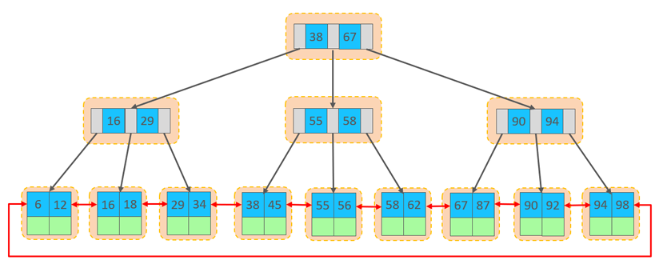

**B+树索引特点**：

- **Root Page（根页）**：B+树的根节点
- **Internal Page（内部页）**：非叶子节点，只存储索引键值
- **Leaf Page（叶子页）**：存储实际数据行，通过双向链表连接
- **聚簇索引**：数据按主键顺序组织存储（IOT - Index Organized Table）

---

**innodb的存储逻辑**：

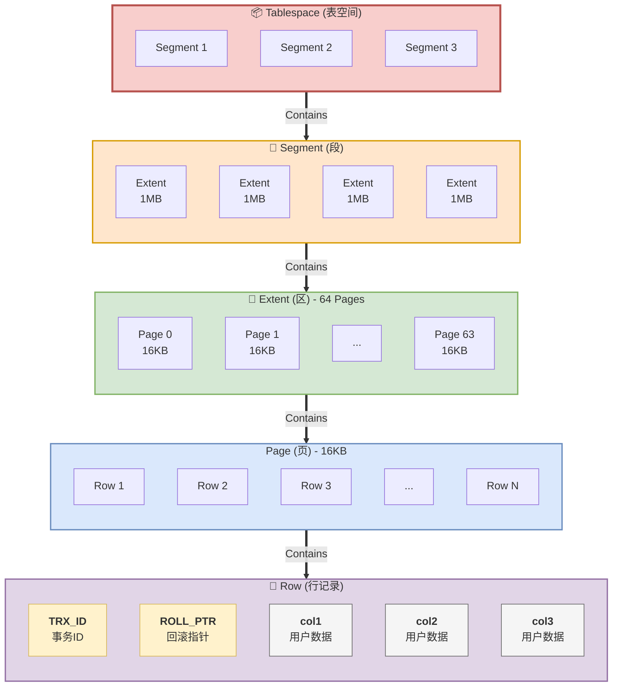

**逻辑存储层级：**

| 层级           | 名称   | 默认大小 | 核心作用与说明                                               | 典型代表/分类                                                |
| -------------- | ------ | -------- | ------------------------------------------------------------ | ------------------------------------------------------------ |
| **Tablespace** | 表空间 | 可变     | 最大的逻辑存储单位，<br/>包含所有的段、区、页。              | 系统表空间、<br/>独立表空间、<br/>Undo表空间、<br/>临时表空间 |
| **Segment**    | 段     | 可变     | 对应具体的表或索引，<br/>是 InnoDB **分配空间的基本单位**。  | 数据段(聚簇索引)、<br/>索引段(二级索引)、<br/>回滚段         |
| **Extent**     | 区     | 1MB      | 由 64 个连续的 Page 组成，<br/>用于**减少磁盘碎片**和页分裂。 | 包含 64 个连续的 16KB 页                                     |
| **Page**       | 页     | 16KB     | InnoDB **磁盘 I/O 和内存管理的最小单位**<br/>（Buffer Pool 管理的也是页）。 | 数据页、<br/>Undo页、<br/>系统页、<br/>插入缓冲位图页等      |
| **Row**        | 行记录 | 可变     | 实际存储用户数据的地方，<br/>页内通过**行目录**和**双向链表**组织。 | Compact、<br/>Dynamic、<br/>Compressed <br/>行格式           |


1. 数据组织方式
2. 页分裂
3. 页合并
4. 索引设计原则

## 4.3.order by优化

**原理**： MySQL 实现排序有两种方式：

1. **利用索引的有序性**：直接通过 B+ 树的顺序扫描获取有序数据（`Using index`），效率极高。
2. **文件排序（Filesort）**：如果无法利用索引，MySQL 会将数据加载到内存或磁盘中进行排序（`Using filesort`），效率较低。

**order by优化原则**:

+ 根据排序字段建立合适的索引，多字段排序时，也遵循最左前缀法则。 

+ 尽量使用覆盖索引。 

+ 多字段排序, 一个升序一个降序，此时需要注意联合索引在创建时的规则（ASC/DESC）。 

+ 如果不可避免的出现filesort，大数据量排序时，可以适当增大排序缓冲区大小  sort_buffer_size(默认256k)

## 4.4.group by优化

**原理**： `GROUP BY` 的本质是**先排序，后分组**。

因此，`GROUP BY` 的优化思路与 `ORDER BY` 几乎完全一致，核心也是利用索引避免 `Using filesort`。

**group by优化原则**:

+ 在分组操作时，可以通过索引来提高效率。 
+ 分组操作时，索引的使用也是满足最左前缀法则的。

## 4.5.limit优化

**原理（深分页问题）**： `LIMIT 1000000, 10` 的执行过程是：MySQL 会扫描出 1,000,010 条数据，然后丢弃前 1,000,000 条，只返回最后的 10 条。越往后翻页，扫描的数据量越大，性能越差。

### 4.5.1 延迟关联（Deferred Join）

**原理**：先通过**覆盖索引**查询出满足条件的主键 ID，然后再通过主键 ID 关联原表获取完整数据。这样避免了回表查询大量无用数据。

```mysql
# ❌ 优化前：深分页，扫描 100万+ 行并回表
SELECT * FROM emp ORDER BY salary DESC LIMIT 1000000, 10;

# ✅ 优化后：子查询先利用覆盖索引查出主键，再关联原表
SELECT e.* 
FROM emp e
INNER JOIN (
    SELECT id FROM emp ORDER BY salary DESC LIMIT 1000000, 10
) tmp ON e.id = tmp.id;
```

### 4.5.2 游标法（记录上次位置）

**原理**：如果业务允许（如瀑布流下拉加载），记录上一页最后一条数据的 ID，下一页直接通过 `WHERE id > last_id` 来查询，彻底避免深分页。

```mysql
# 第一页
SELECT * FROM emp ORDER BY id LIMIT 10;
-- 假设最后一条的 id 是 10

# 第二页（游标法）
SELECT * FROM emp WHERE id > 10 ORDER BY id LIMIT 10;
```

## 4.6.count优化

count() 是一个聚合函数，对于返回的结果集，一行行地判断，

如果 count 函数的参数不是  NULL，累计值就加 1，

否则不加，最后返回累计值。 

用法：count（*）、count（主键）、count（字段）、count（数字）

| count用 法  | 含义                                                         |
| ----------- | ------------------------------------------------------------ |
| count(主键) | InnoDB 引擎会遍历整张表，把每一行的 主键id 值都取出来，返回给服务层。 <br/>服务层拿到主键后，直接按行进行累加(主键不可能为null) |
| count(字段) | **没有not null 约束** :<br/> InnoDB 引擎会遍历整张表把每一行的字段值都取出来，<br/>返回给服务层，服务层判断是否为null，不为null，计数累加。<br/> **有not null 约束**：<br/>InnoDB 引擎会遍历整张表把每一行的字段值都取出来，<br/>返回给服务层，直接按行进行累加。 |
| count(数字) | InnoDB 引擎遍历整张表，但不取值。服务层对于返回的每一行，放一个数字“1” 进去，直接按行进行累加。 |
| count(*)    | InnoDB引擎并不会把全部字段取出来，而是专门做了优化，不取值，服务层直接 按行进行累加。 |

> 按照效率排序的话，count(字段) < count(主键 id) < count(1) ≈ count(*)，所以尽量使用 `count(*)`。

## 4.7.update优化

**原理**： `UPDATE` 是 DML 操作，执行时会加**排他锁（X 锁）**。

同时，它需要写入 Undo Log（用于回滚和 MVCC）、Redo Log（用于崩溃恢复）和 Binlog（用于主从同步）。

如果 `WHERE` 条件没有走索引，InnoDB 会将行锁退化为**表锁**，锁住整张表，导致严重的并发问题。

### 4.7.1 确保走索引，避免锁表

```mysql
# 假设 name 字段没有索引
UPDATE emp SET salary = 10000 WHERE name = 'Alice'; 
-- 原理：由于 name 无索引，InnoDB 需要全表扫描，并对扫描到的所有记录加 X 锁，最终退化为表锁。

# ✅ 优化：确保 WHERE 条件使用索引列
UPDATE emp SET salary = 10000 WHERE id = 100; 
-- 原理：走主键索引，只对 id=100 这一行加 X 锁。
```

### 4.7.2 避免大事务

**原理**：事务持有锁的时间越长，其他事务等待锁的时间就越长，甚至引发死锁。

```mysql
# ❌ 优化前：一个大事务更新 10 万条数据，长时间持有大量行锁
START TRANSACTION;
UPDATE emp SET status = 1 WHERE dept_id = 10; -- 假设更新了 10 万行
COMMIT;

# ✅ 优化后：在应用层分批更新，每次更新 1000 条，及时释放锁
-- 伪代码逻辑
WHILE (true) {
    UPDATE emp SET status = 1 WHERE dept_id = 10 LIMIT 1000;
    IF (affected_rows == 0) BREAK;
    SLEEP(0.1); -- 稍微休眠，让出 CPU 和锁资源
}
```


# 5.MySQL的锁

在数据库系统中，**锁（Lock）** 是协调多个进程/线程并发访问共享资源（数据）的机制。其核心目标是：

- **保证事务的隔离性（Isolation）**
- **保证数据的一致性（Consistency）**
- **在安全的前提下尽可能提升并发度**

MySQL 的锁可以从**多个维度**进行分类。下图展示了完整的分类体系：

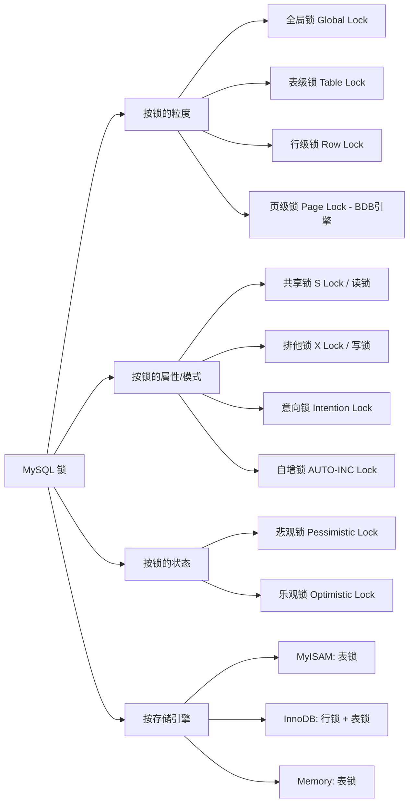

**锁的维度对比**

| 维度     | 分类        | 特点                            | 典型场景                                        |
| -------- | ----------- | ------------------------------- | ----------------------------------------------- |
| **粒度** | 全局锁      | 锁定整个实例                    | 全库逻辑备份（`FLUSH TABLES WITH READ LOCK`）   |
|          | 表级锁      | 锁定整张表                      | DDL、MyISAM 表操作                              |
|          | 行级锁      | 锁定具体行                      | InnoDB 的并发 DML                               |
| **模式** | 共享锁（S） | 读读兼容，读写互斥              | `SELECT ... LOCK IN SHARE MODE`                 |
|          | 排他锁（X） | 读写、写写都互斥                | `INSERT/UPDATE/DELETE`、`SELECT ... FOR UPDATE` |
| **状态** | 悲观锁      | 先加锁再操作                    | 传统事务操作                                    |
|          | 乐观锁      | 不加锁，通过版本号/CAS 检测冲突 | 高并发低冲突场景                                |

## 5.1.全局锁

**全局锁** 是对整个数据库实例加锁，一旦加上，整个实例就进入只读状态。

**相关命令**：

| 命令                                  | 作用                               |
| ------------------------------------- | ---------------------------------- |
| `FLUSH TABLES WITH READ LOCK` (FTWRL) | 加全局读锁，所有数据表进入只读状态 |
| `UNLOCK TABLES`                       | 释放全局锁                         |
| `SET GLOBAL read_only = ON`           | 设置实例只读（更轻量）             |

**使用场景**——备份

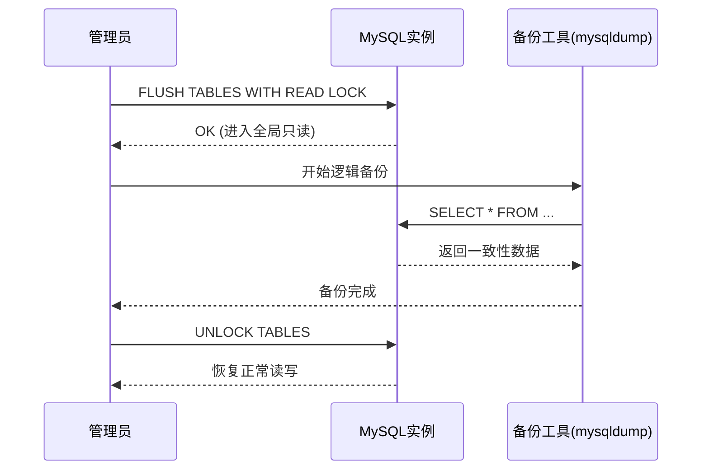

> 注意事项
>
> - ⚠️ 全局锁会导致**所有写操作阻塞**，生产环境慎用
> - 对于单线程的 `mysqldump`，FTWRL 可以保证备份的一致性
> - 如果使用了支持 MVCC 的引擎（如 InnoDB），可以用 `--single-transaction` 参数替代全局锁，避免阻塞写操作
> - 主从架构中，从库可以加全局锁做备份，避免影响主库


## 5.2.表级锁

表锁是 MySQL 中最基本的锁类型，锁定整张表。表锁类型:

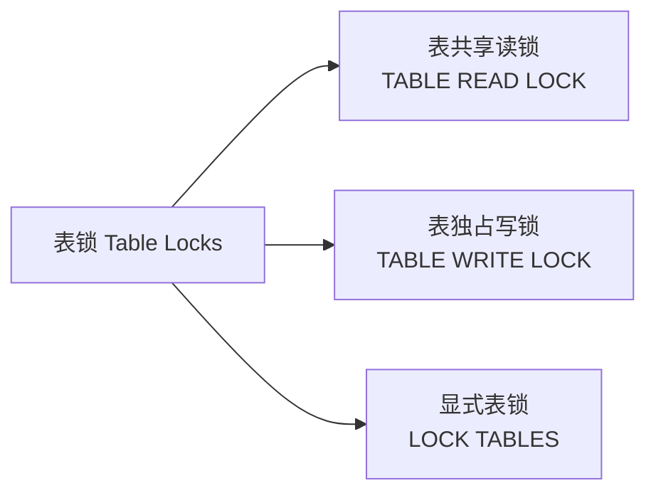

#### 5.2.1.显式表锁LOCK TABLES 语法

```mysql
-- 加读锁（其他会话可读，不可写）
LOCK TABLES table1 READ, table2 READ;

-- 加写锁（其他会话不可读不可写）
LOCK TABLES table1 WRITE;

-- 释放锁
UNLOCK TABLES;
```

#### 5.2.1.表锁的兼容性矩阵

| 当前锁 \ 请求锁   | 读锁（READ） | 写锁（WRITE） |
| ----------------- | ------------ | ------------- |
| **读锁（READ）**  | ✅ 兼容       | ❌ 阻塞        |
| **写锁（WRITE）** | ❌ 阻塞       | ❌ 阻塞        |

## 5.3 元数据锁（MDL，Metadata Lock）

MySQL 5.5 引入，用于**保护数据库元数据**（表结构、库结构等）。

#### 5.3.1 MDL 类型

| MDL 类型                         | 说明       | 触发场景                                |
| -------------------------------- | ---------- | --------------------------------------- |
| **MDL_INTENTION_EXCLUSIVE (IX)** | 意向排他锁 | DML 操作（SELECT/INSERT/UPDATE/DELETE） |
| **MDL_EXCLUSIVE (X)**            | 排他锁     | DDL 操作（ALTER TABLE、DROP TABLE 等）  |
| **MDL_SHARED (S)**               | 共享锁     | 读操作                                  |

常见问题：**DDL 被 DML 阻塞**

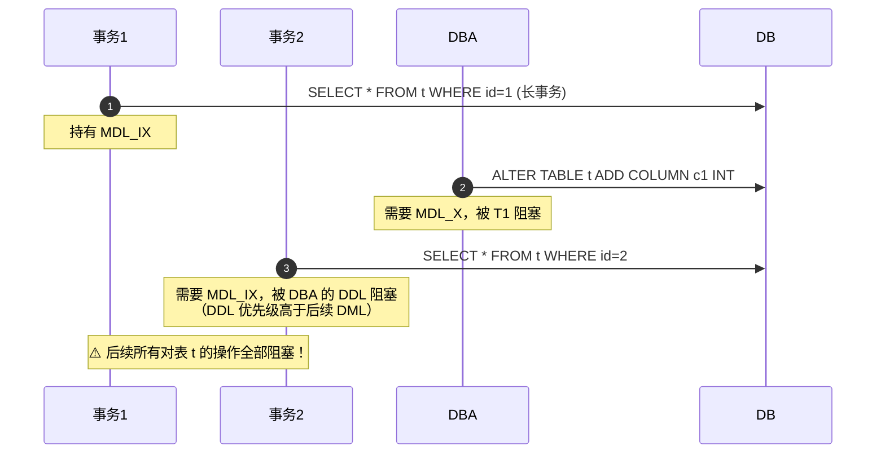

> 💡 **这就是著名的"DDL 堵死整个表"问题**。生产环境中长事务 + DDL 是高危组合。

## 5.4 意向锁（Intention Lock）

意向锁是 InnoDB 特有的**表级锁**，用于**协调行锁与表锁的关系**，避免冲突检测的 O(n) 复杂度。

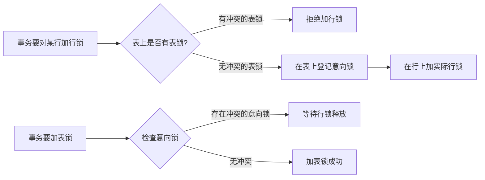

| 意向锁类型                    | 含义                                  | 兼容性               |
| ----------------------------- | ------------------------------------- | -------------------- |
| **IS（Intention Shared）**    | 意向共享锁，表示事务要对某些行加 S 锁 | IS 兼容，IX 不兼容   |
| **IX（Intention Exclusive）** | 意向排他锁，表示事务要对某些行加 X 锁 | IX 不兼容，IS 不兼容 |

> 💡 意向锁**不会阻塞任何实际操作**，它只是一个"信号"，让表锁在加锁前能快速判断是否有冲突的行锁存在。

## 5.5.InnoDB 行锁机制

InnoDB 的行锁是**基于索引实现的**。这是一个非常重要的前提：

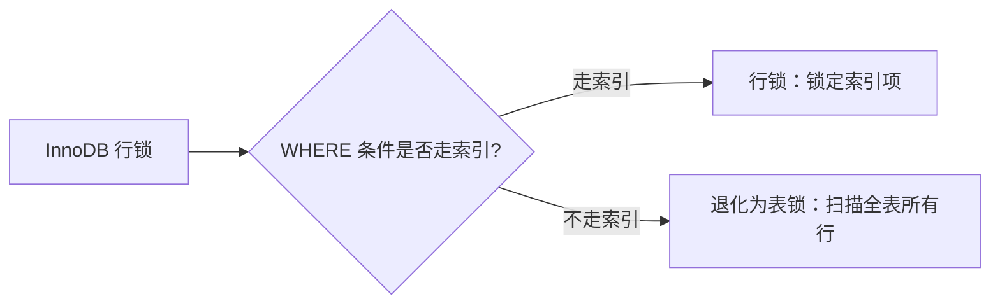

**行锁的两大模式**

| 模式       | 名称          | 含义                                    | SQL 示例                                                     |
| ---------- | ------------- | --------------------------------------- | ------------------------------------------------------------ |
| **S Lock** | 共享锁 / 读锁 | 允许其他事务加 S 锁，<br/>不允许加 X 锁 | `SELECT ... LOCK IN SHARE MODE` `SELECT ... FOR SHARE`（8.0） |
| **X Lock** | 排他锁 / 写锁 | 不允许其他事务加任何锁                  | `SELECT ... FOR UPDATE` `INSERT/UPDATE/DELETE`               |

**锁的兼容性矩阵**

| 当前 \ 请求   | S（共享） | X（排他） |
| ------------- | --------- | --------- |
| **S（共享）** | ✅ 兼容    | ❌ 冲突    |
| **X（排他）** | ❌ 冲突    | ❌ 冲突    |

## 5.5.InnoDB 行锁的三种算法

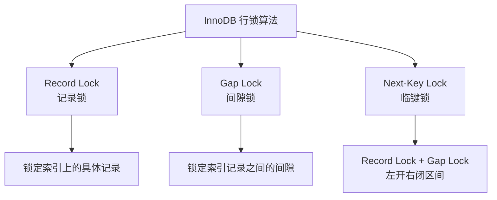

| 算法              | 锁定范围                                    | 作用                                                     | 触发条件                                |
| ----------------- | ------------------------------------------- | -------------------------------------------------------- | --------------------------------------- |
| **Record Lock**   | 仅锁定命中的索引记录                        | 防止其他事务修改该行                                     | 所有场景都会使用                        |
| **Gap Lock**      | 锁定索引记录之间的间隙<br/>（不含记录本身） | 防止幻读（Phantom Read），阻止其他事务在间隙中插入新记录 | RR 隔离级别 + 非唯一索引的等值/范围查询 |
| **Next-Key Lock** | Record Lock + Gap Lock<br/>（左开右闭）     | 既锁记录又锁间隙                                         | RR 隔离级别下的默认锁算法               |

### 5.5.1InnoDB 锁算法详解

+ **Record Lock（记录锁）**

  - 仅锁定索引上命中的**那一行记录**

  - 不影响其他行的读写

  - 是最"轻量"的行锁

+ **Gap Lock（间隙锁）**

  - 锁定索引记录之间的**间隙**，不包含记录本身

  - **核心作用**：防止幻读（Phantom Read），阻止其他事务在间隙中插入新记录

  - **仅在 RR 隔离级别下生效**

  - 间隙锁之间**互相兼容**（多个事务可以同时对同一间隙加 Gap Lock）

    ```mermaid
    graph 
        subgraph B+ Tree
            A["id=5"] --- G1["Gap: (5,8) 🔒"] --- B["id=8"] --- G2["Gap: (8,12) 🔒"] --- C["id=12"]
        end
        style G1 fill:#fcc,stroke:#f66,stroke-width:2px
        style G2 fill:#fcc,stroke:#f66,stroke-width:2px
    ```

+ **Next-Key Lock（临键锁）**

  + **Record Lock + Gap Lock** 的组合

  + 锁定范围是**左开右闭区间** `(a, b]`

  + 是 RR 隔离级别下的**默认行锁算法**

    ```mermaid
    graph 
        subgraph B+ Tree
            A["id=5"] --- N1["Next-Key: (5,8] 🔒"] --- B["id=8"] --- N2["Next-Key: (8,12] 🔒"] --- C["id=12"]
        end
        style N1 fill:#ff9,stroke:#f90,stroke-width:3px
        style N2 fill:#ff9,stroke:#f90,stroke-width:3px
    ```

+ Insert Intention Lock（插入意向锁）

  + 一种特殊的 Gap 锁，在 `INSERT` 操作时使用：

  + 多个事务向**同一个间隙的不同位置**插入数据时，互不阻塞

  + 但如果间隙已被 Gap Lock 或 Next-Key Lock 锁定，INSERT 会等待

    ```mermaid
    sequenceDiagram
        participant T1 as 事务1
        participant T2 as 事务2
    
        Note over T1,T2: 间隙 (5, 8) 已被 Gap Lock
        T1->>DB: INSERT INTO t VALUES (6, ...)
        Note over T1: 需要插入意向锁，被阻塞 ⏳
        T2->>DB: INSERT INTO t VALUES (7, ...)
        Note over T2: 同样被阻塞 ⏳
        Note over T1,T2: 注意：T1 和 T2 互不阻塞<br/>它们只是等待 Gap Lock 释放
    ```

+ AUTO-INC Lock（自增锁）

  + InnoDB 对 `AUTO_INCREMENT` 列的特殊锁机制：

  
   | 模式            | `innodb_autoinc_lock_mode` | 说明                                                         |
    | --------------- | -------------------------- | ------------------------------------------------------------ |
    | **Traditional** | 0                          | 语句级互斥锁，所有 INSERT 串行化                             |
    | **Consecutive** | 1（默认）                  | "简单 INSERT" 用轻量互斥锁，"批量 INSERT" 用表级锁           |
    | **Interleaved** | 2                          | 不使用 AUTO-INC 锁，依赖 ROW 格式 binlog，性能最高但可能不连续 |
