# Docker的安装

环境说明：window11 + WSL UI +  WSL2 + Ubuntu 24.04(全新安装)

[toc]

# 1.创建cmo用户

此时是root用户。

```shell
# 1.创建 cmo 用户
adduser cmo

# 2.赋予 cmo 用户 sudo 权限
usermod -aG sudo cmo

# 3.切换为cmo用户
su cmo

# 4.将 cmo 加入 docker 组，此时是没有docker组的，添加会报错，安装好后再进行添加
# usermod -aG docker cmo
```

过程如图：

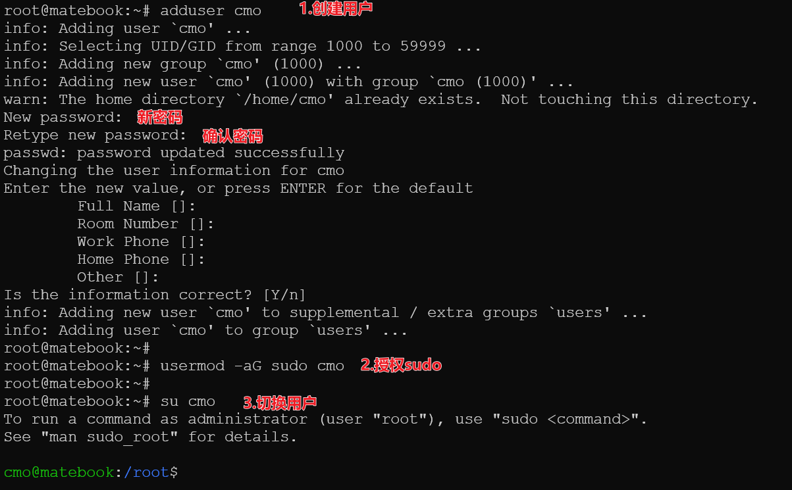


# 2.安装 Docker

### 2.1 验证当前系统是否安装 Docker

```bash
docker -v
```

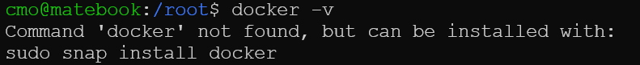

### 2.2 更新软件包索引

```bash
sudo apt update
```

在安装软件前推荐先执行此命令，用于刷新本地的软件包索引，这样可以确保后续安装或升级时获取的是最新版本信息。

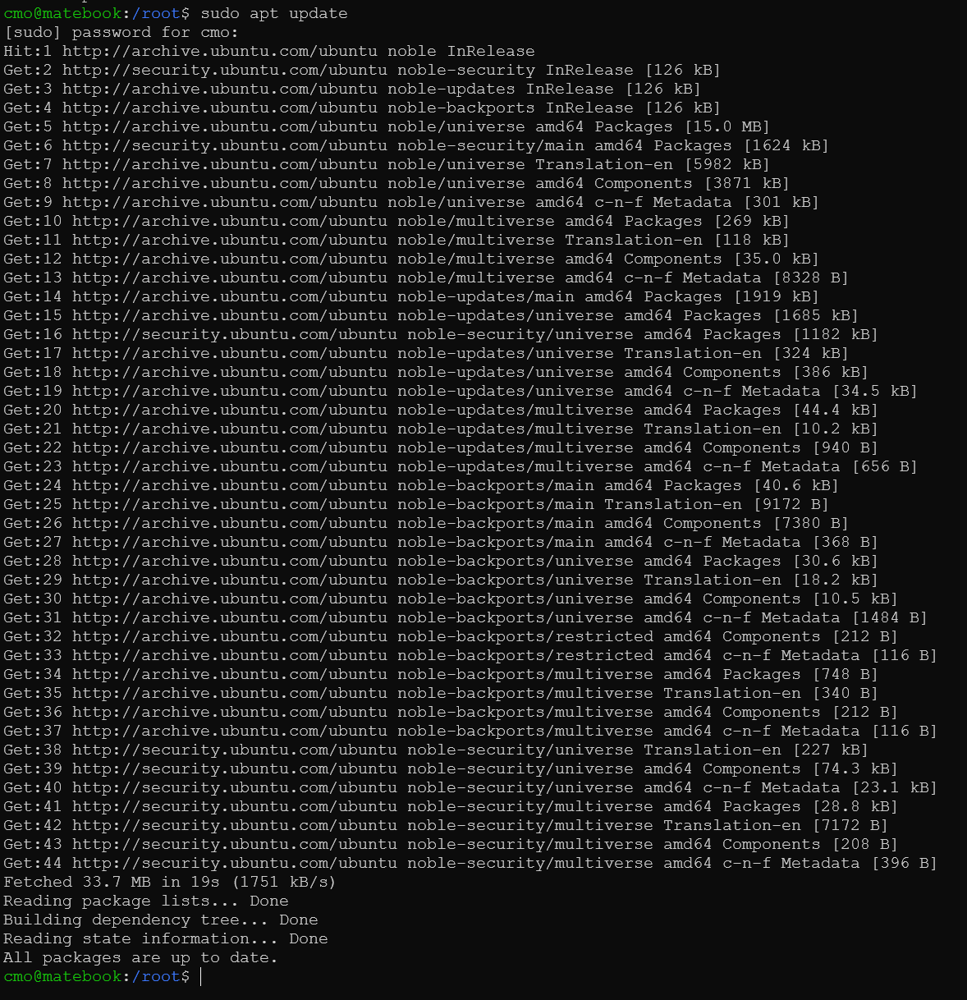

### 2.3 安装依赖包	

```bash
sudo apt install -y ca-certificates curl
```

- `ca-certificates`：允许系统信任 HTTPS 证书，用于安全地访问网络源。
- `curl`：命令行工具，用于从网络下载文件（如 Docker 的 GPG 密钥）。

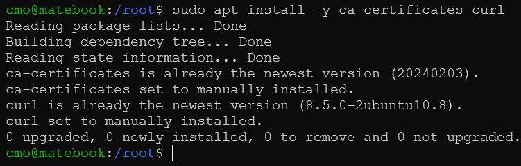

### 2.4 创建用于存储 GPG 密钥的目录

```bash
sudo install -m 0755 -d /etc/apt/keyrings
```

- `install`：一个用于复制文件和创建目录的命令，比 `mkdir` 和 `chmod` 的组合更简洁。
- `-m 0755`：设置目录的权限为 `0755`（所有者可读、写、执行，其他用户可读和执行）。这是存储密钥目录的标准权限。
- `-d`：指定要创建的是目录而不是文件。
- `/etc/apt/keyrings`：APT 包管理器推荐的用于存储第三方软件仓库密钥的目录。

### 2.5 下载 GPG 密钥

下载 Docker 官方的 GPG 密钥，并将其保存到上一步创建的目录中。

**GPG 密钥用于验证 Docker 软件包的“身份”和“完整性”，确保你下载的 Docker 软件包来自可信的源头，并且在传输过程中没有被任何人篡改或植入恶意代码。**

在官方中使用下载的地址是：https://download.docker.com/linux/ubuntu/gpg，此处改为阿里云镜像地址，但下载下来的还是官方的 GPG 密钥。

```bash
sudo curl -fsSL http://mirrors.aliyun.com/docker-ce/linux/ubuntu/gpg -o /etc/apt/keyrings/docker.asc
```

- `-f` 或 `--fail`：让 curl 在服务器错误时静默失败（不输出 HTML 错误页面）。
- `-s` 或 `--silent`：静默模式，不显示进度条或错误信息。
- `-S` 或 `--show-error`：与 `-s` 一起使用时，如果失败会显示错误信息。
- `-L` 或 `--location`：如果请求的页面发生了重定向，则自动跟随重定向。
- `-o /etc/apt/keyrings/docker.asc`：将下载的内容输出到指定文件。文件扩展名 `.asc` 表明这是一个 ASCII 格式的 GPG 密钥。

操作完毕如图，`/etc/apt/keyrings`目录下会有`docker.asc`文件。

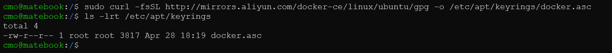

### 2.6 更改密钥文件的权限

为所有用户添加可读的权限，这样所有用户下载时都可以通过密钥进行验证。

```bash
sudo chmod a+r /etc/apt/keyrings/docker.asc
```

- `chmod a+r`：`a` 代表所有用户 (all)，`+r` 代表添加读取 (read) 权限。

### 2.7 添加 Docker 的软件源

将 Docker 的官方软件源添加到 Ubuntu 24.04 的软件源列表，

`apt install` 时用于获取官方源提供 Docker CE 的所有组件：

`docker-ce`, `docker-ce-cli`, `containerd.io`, `docker-buildx-plugin`, `docker-compose-plugin` 等。

**即告诉 Ubuntu 系统，以后获取 Docker 软件包不要从 Ubuntu 自己的仓库找，而要从 Docker 官方的这个特定地址获取，并且使用指定的 GPG 密钥来验证这些软件包的真伪**。

此处地址为官方地址的阿里云镜像地址，Docker 官方地址为：https://download.docker.com/linux/ubuntu。

```bash
echo \
  "deb [arch=$(dpkg --print-architecture) signed-by=/etc/apt/keyrings/docker.asc] http://mirrors.aliyun.com/docker-ce/linux/ubuntu \
  $(. /etc/os-release && echo "${UBUNTU_CODENAME:-$VERSION_CODENAME}") stable" | \
  sudo tee /etc/apt/sources.list.d/docker.list > /dev/null
```

执行完毕后，再次更新软件包
```bash
sudo apt update
```

>  在添加了新的软件源（Docker 源）之后，必须再次运行 apt update，
>
> 这样 APT 才会知道这个新源的存在，并从中获取可用软件包的列表。如果不执行这一步，系统将找不到 Docker 软件包。

**如图**：

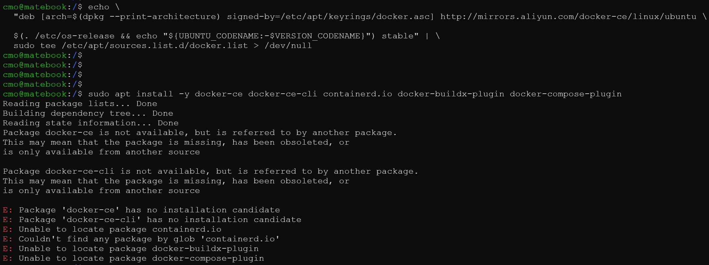

---

**命令解释：**

1. `echo "deb [arch=...] ..."`：
   - 用于生成一个标准的 Debian/Ubuntu 软件源条目（sources.list entry）。
2. `[arch=$(dpkg --print-architecture) signed-by=/etc/apt/keyrings/docker.asc]`：
   - `arch=$(dpkg --print-architecture)`：这是一个**命令替换**。它会先执行 `dpkg --print-architecture` 命令（该命令会输出您系统的架构，如 `amd64` 或 `arm64`），然后用输出结果替换这部分内容。这确保了软件源地址与您的系统架构匹配。
   - `signed-by=/etc/apt/keyrings/docker.asc`：**极其重要**。它明确指定了用于验证此软件源中所有软件包的 GPG 密钥的路径。这是确保软件包来自 Docker 官方而非恶意镜像的安全关键步骤。
3. `http://mirrors.aliyun.com/docker-ce/linux/ubuntu`：
   - Docker 官方软件源的阿里云镜像地址。
4. `$(. /etc/os-release && echo "${UBUNTU_CODENAME:-$VERSION_CODENAME}")`：
   - 这是另一个**命令替换**和**参数扩展**的巧妙结合。
   - `. /etc/os-release`：这会执行（source）一个系统文件，该文件包含当前 Ubuntu 版本的详细信息（如 `VERSION_ID="24.04"`, `VERSION_CODENAME=noble`, `UBUNTU_CODENAME=noble`）。
   - `&& echo "${UBUNTU_CODENAME:-$VERSION_CODENAME}"`：如果前一个命令成功，则执行 `echo`。`${UBUNTU_CODENAME:-$VERSION_CODENAME}` 是一个参数扩展，意思是“如果 `UBUNTU_CODENAME` 变量存在且不为空，则使用它的值；否则，使用 `VERSION_CODENAME` 的值”。
   - 最终，这部分会被替换为您的 Ubuntu 系统代号，例如 `jammy` (22.04), `noble` (24.04) 等。这确保了您添加的软件源与您的系统版本完全匹配。
5. `stable`：
   - 指定要使用 Docker 的稳定版（stable）发布通道。而不是测试版（test）或夜间构建版（nightly）。
6. `| sudo tee /etc/apt/sources.list.d/docker.list > /dev/null`：
   - `|`：管道符，将 `echo` 命令的输出传递给 `tee` 命令。
   - `tee`：一个同时输出到屏幕和文件的命令。这里与 `sudo` 一起使用，以便拥有向受保护目录写入的权限。
   - `/etc/apt/sources.list.d/docker.list`：将软件源条目写入到 `/etc/apt/sources.list.d/` 目录下的一个新文件 `docker.list` 中。这是一种最佳实践，可以保持组织有序，并且更容易管理和删除单个软件的源。
   - `> /dev/null`：将 `tee` 命令输出到**标准输出（屏幕）** 的内容重定向到“空设备”，从而抑制任何输出，保持终端整洁。

---

### 2.8 安装 Docker

安装**最新版本**的 Docker，包括 Docker 引擎及其相关组件。

```bash
sudo apt install -y docker-ce docker-ce-cli containerd.io docker-buildx-plugin docker-compose-plugin
```

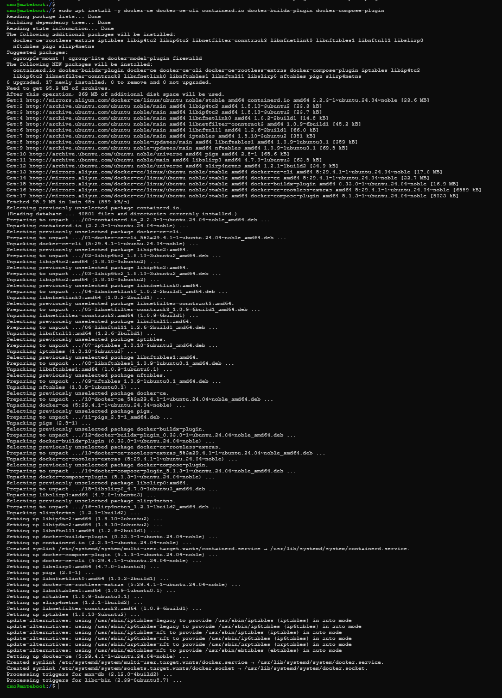

1. **docker-ce**
   - **全称**：Docker Community Edition
   
   - **作用**：这是 **Docker 引擎的核心**，也就是常说的 "Docker 守护进程" (`dockerd`)。
   
   - **功能**：它是一个持续运行的后台服务，负责管理 Docker 的方方面面：
     - 下载和存储镜像（Images）。
     - 创建、运行、停止和删除容器（Containers）。
     - 管理网络（Networks）和存储卷（Volumes）。
     - 暴露 REST API 供其他工具（如 CLI）调用。
     
   - **简言之**：它是 Docker 的“大脑”和“发动机”。
2. **docker-ce-cli**
   - **全称**：Docker Community Edition Command Line Interface
   - **作用**：这是 **Docker 的命令行工具**。你平时在终端里打的 `docker` 命令就来自于它。
   - **功能**：它本身不执行管理操作，而是作为一个客户端，接收你的命令（如 `docker run`, `docker ps`），然后通过 API 与上面的 `docker-ce` 守护进程通信，并告诉你结果。
   - **简言之**：它是用户与 Docker 引擎交互的“遥控器”。
3. **containerd.io**
   - **作用**：这是一个**行业标准的容器运行时**。它是更底层、更核心的组件。
   
   - 功能：它负责容器生命周期的最底层操作，例如：
   
     - 从镜像中拉取和存储容器文件系统层。
     - 管理容器的执行、暂停、恢复和销毁。
     - 管理容器网络和存储的低级细节。
     
   - **与 Docker 的关系**：从 Docker 的架构演变来看，`docker-ce`（守护进程）现在将大部分实际的容器运行时操作**委托**给了 `containerd`。这种解耦使得架构更清晰，`containerd` 也可以被其他系统（如 Kubernetes）直接使用。
   
   - **简言之**：它是真正“动手”拉取镜像和运行容器的“工程师”，而 `docker-ce` 是它的“项目经理”。
4. **docker-buildx-plugin**
   - **作用**：Docker 的**扩展构建插件**，提供了下一代强大的镜像构建功能。
   
   - 功能：它是docker build命令的增强版，支持许多高级特性：
   
     - **多平台构建**：一次性为多种 CPU 架构（如 amd64, arm64, arm/v7）构建镜像，无需复杂的交叉编译环境。
   - **构建缓存管理**：更高效的缓存机制，加速构建过程。
     - **并行构建**：同时处理多个构建任务，充分利用多核CPU。
   
   - **注意**：在较新版本的 Docker 中，`buildx` 已成为默认的构建引擎。
5. **docker-compose-plugin**
   - **作用**：Docker 官方提供的 **Compose 功能**，用于定义和运行多容器应用。
   
   - 功能：它提供了docker compose 命令（注意没有横线），用来替代旧的、独立的 docker-compose（Python 编写）工具。
   
     - 通过一个 `docker-compose.yml` 文件来配置你的应用所需的所有服务、网络、卷。
     - 用一个命令（`docker compose up`）就能启动整个复杂的应用栈（例如一个包含 Web 前端、后端 API、数据库、缓存的应用）。
     
   - **为什么是插件形式**：Docker 公司为了更好的集成和发布周期，将 Compose 功能做成了 CLI 插件，而不是一个独立的二进制文件。

---

现在已经安装好 Docker 了，但还不能完全使用。当前拉取镜像时，是从 Docker Hub 中拉取的。但国内访问 Docker Hub 时，会无法访问，导致无法拉取镜像。

**测试有无安装好的命令**：

```bash
docker -v
```

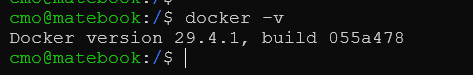

**验证无法使用**

```bash
 sudo docker container run hello-world
```

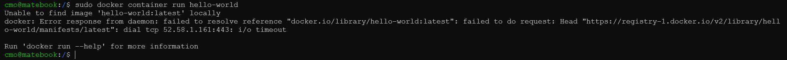

对于这种情况，建议**添加国内镜像源地址**。

国内镜像源本质上是**为了提升访问速度而建立的 Docker Hub 缓存代理**。

它会帮你从 Docker Hub 拉取镜像，并将这些镜像存储在自己的服务器上。

你通过它们下载的镜像，**源头依然是 Docker Hub**。你可以把它们理解为设立在身边的 Docker Hub “分身”，

旨在解决远距离访问速度慢的问题。

国内镜像源工作流程：

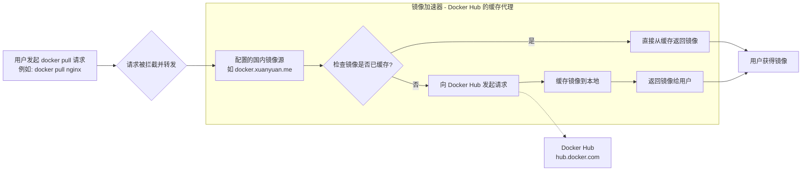

# 3.添加国内镜像源地址

当前 Docker 28.4.0 版本中，并没有存在配置文件，因此需要创建并打开。

```bash
sudo vim /etc/docker/daemon.json
```

在vim模式下添加下面的内容：

```json
{
  "registry-mirrors": [
    "https://docker.m.daocloud.io",
    "http://hub-mirror.c.163.com",
    "https://docker.nju.edu.cn"
  ]
}
```

可以进行验证

```bash
 cat /etc/docker/daemon.json
```

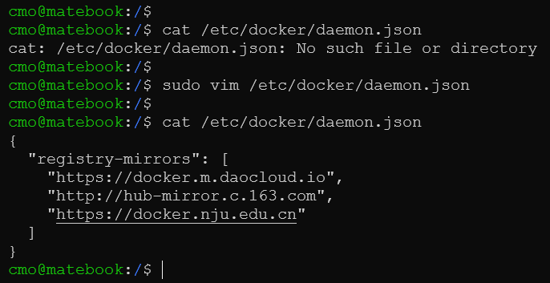


当前一些可用的镜像源列表：

| 镜像源名称              | 镜像加速地址                         | 主要特点/备注                             |
| ----------------------- | ------------------------------------ | ----------------------------------------- |
| **DaoCloud 镜像站**     | `https://docker.m.daocloud.io`       | 国内老牌服务商，稳定可靠                  |
| **网易云镜像加速**      | `http://hub-mirror.c.163.com`        | 多节点覆盖                                |
| **中国科学技术大学**    | `https://docker.mirrors.ustc.edu.cn` | 教育网用户访问效果可能较好                |
| **南京大学镜像站**      | `https://docker.nju.edu.cn`          | 支持 Docker Hub、GCR、GHCR、Quay、NVCR 等 |
| **Docker 中国官方镜像** | `https://registry.docker-cn.com`     | 官方认证，适合企业环境                    |

在配置时，我们一般会配置多个镜像源。

Docker 会**严格按照配置文件中列出的顺序**来尝试镜像源，这时如果第一个源出现问题了，它会继续尝试第二个，以此类推。

**它不会自动选择“最快”的镜像源**。因此建议将**最稳定、最快、最可靠的镜像源放在第一位**。

# 4.重启 Docker 服务并验证

## 4.1.重启docker

重启 Docker 服务，实现镜像源更改。

```bash
sudo systemctl restart docker
```

如果修改了服务配置（例如，修改了 Docker 的 `docker.service` 文件中的环境变量、启动参数或依赖关系），`systemd`（Linux 的系统和服务管理器） 并不会自动感知到这个变化。

`systemctl daemon-reload` 命令会**通知 `systemd` 去重新读取并加载所有服务单元文件**的更改，使新的配置生效。

当然，它只是让 `systemd` 记住了新的配置，只有下次启动服务时才会应用。

我们当前修改的配置文件是 daemon.json，在重启服务前无需执行 `sudo systemctl daemon-reload` 这个命令。

## 4.2.验证配置

重启后，查看一下镜像源配置是否成功。可以看到相比最初，增加了 `Registry Mirrors`。

```bash
sudo docker info
```

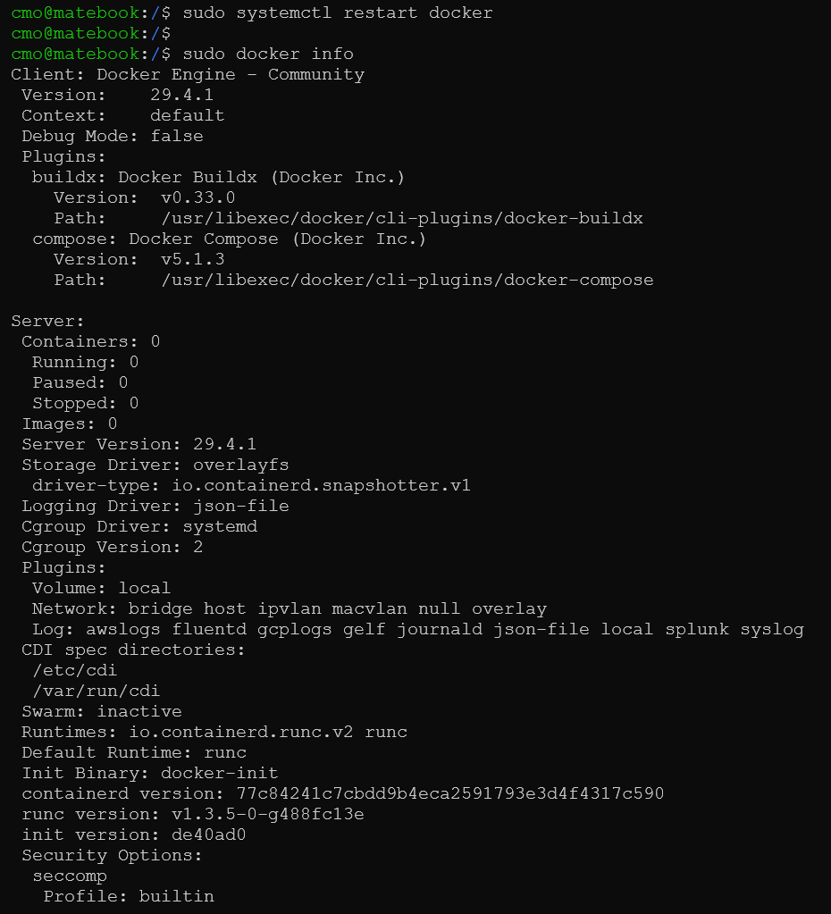

## 4.3.测试hello-world

现在我们可以正常拉取镜像并执行了，拉取（如果本地没有）`hello-world` 镜像，并创建一个新的容器来运行它，输出 “Hello from Docker!” 等信息，则表明成功。

```bash
sudo docker container run hello-world
```

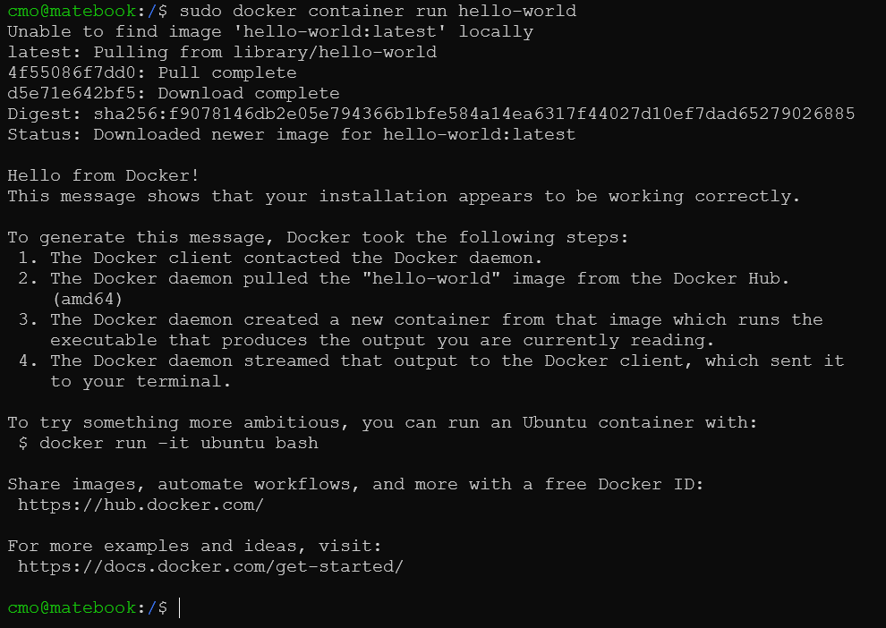

# 5.cmo用户添加到docker组

```bash
# 查看有无docker组
 cat /etc/group | grep docker
```


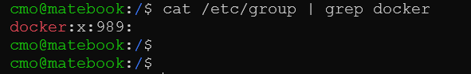

```bash
# 4.将 cmo 加入 docker 组
sudo usermod -aG docker $USER
```

- `usermod`：修改用户属性的命令
- `-aG`：追加到附加组 (Append to Supplementary Groups)
- `docker`：目标用户组的名称
- `$USER`：shell 环境变量，代表当前用户名

**切换到 `docker` 组**：

```bash
newgrp docker
```

`newgrp` 命令的主要目的是**临时性地将当前用户会话（terminal session）的主要组（primary group）或附加组（supplementary group）的权限生效**。

执行一个 Docker 命令不加 `sudo` 

```bash
docker container run hello-world
```

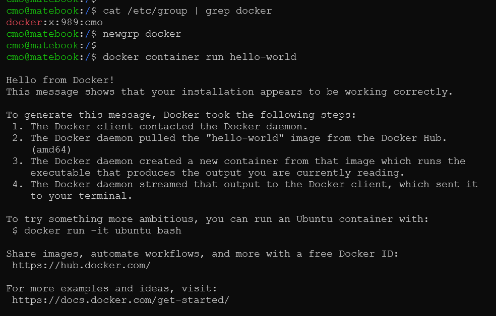

# 附录
参考链接：[Ubuntu 24.04 安装 Docker ](https://www.cnblogs.com/lanyusky/p/19187095)

---

问题：

```bash
# 搜索nginx的镜像
docker search nginx
```

这里会发现无法搜索到，会弹出如下的错误：

```text
docker search 报错:Error response from daemon: Get "https://index.docker.io/v1/search?q=nginx&n=25": dial tcp 208.77.47.172:443: connect: connection refused
```

解决方案暂无记录，没有去实验。

但是docker pull是ok的。
