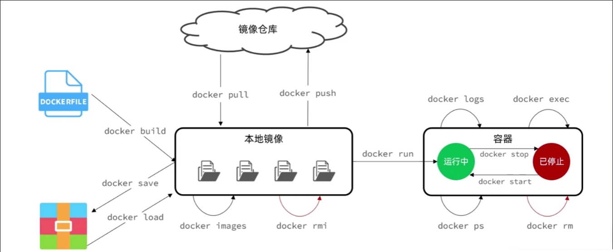
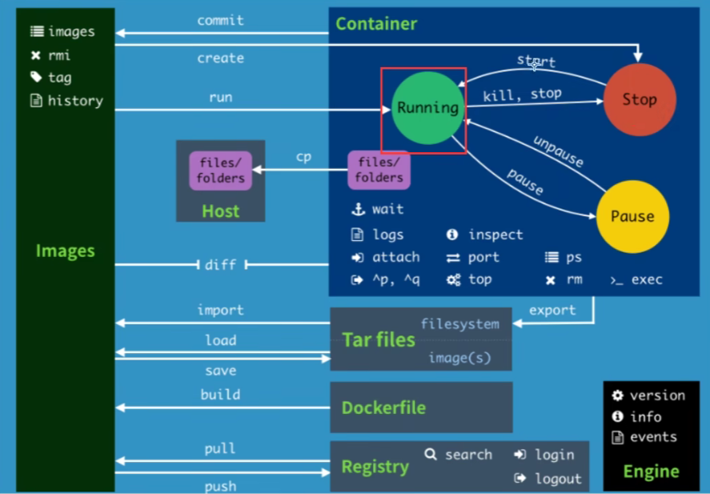

#　Ｄocker的命令

[toc]





# 1.帮助命令

## 1.1.docker version

```bash
#docker 版本信息
docker version
```

内容如下：

```bash
cmo@matebook:/root$ docker version
Client: Docker Engine - Community
 Version:           29.4.1
 API version:       1.54
 Go version:        go1.26.2
 Git commit:        055a478
 Built:             Mon Apr 20 16:32:37 2026
 OS/Arch:           linux/amd64
 Context:           default

Server: Docker Engine - Community
 Engine:
  Version:          29.4.1
  API version:      1.54 (minimum version 1.40)
  Go version:       go1.26.2
  Git commit:       6c91b92
  Built:            Mon Apr 20 16:32:37 2026
  OS/Arch:          linux/amd64
  Experimental:     false
 containerd:
  Version:          v2.2.3
  GitCommit:        77c84241c7cbdd9b4eca2591793e3d4f4317c590
 runc:
  Version:          1.3.5
  GitCommit:        v1.3.5-0-g488fc13e
 docker-init:
  Version:          0.19.0
  GitCommit:        de40ad0
```

---
## 1.2.docker info

```bash
#docker 系统信息
docker info
```
内容如下：

```bash
cmo@matebook:/root$ docker info
Client: Docker Engine - Community
 Version:    29.4.1
 Context:    default
 Debug Mode: false
 Plugins:
  buildx: Docker Buildx (Docker Inc.)
    Version:  v0.33.0
    Path:     /usr/libexec/docker/cli-plugins/docker-buildx
  compose: Docker Compose (Docker Inc.)
    Version:  v5.1.3
    Path:     /usr/libexec/docker/cli-plugins/docker-compose

Server:
 Containers: 3
  Running: 1
  Paused: 0
  Stopped: 2
 Images: 2
 Server Version: 29.4.1
 Storage Driver: overlayfs
  driver-type: io.containerd.snapshotter.v1
 Logging Driver: json-file
 Cgroup Driver: systemd
 Cgroup Version: 2
 Plugins:
  Volume: local
  Network: bridge host ipvlan macvlan null overlay
  Log: awslogs fluentd gcplogs gelf journald json-file local splunk syslog
 CDI spec directories:
  /etc/cdi
  /var/run/cdi
 Swarm: inactive
 Runtimes: io.containerd.runc.v2 runc
 Default Runtime: runc
 Init Binary: docker-init
 containerd version: 77c84241c7cbdd9b4eca2591793e3d4f4317c590
 runc version: v1.3.5-0-g488fc13e
 init version: de40ad0
 Security Options:
  seccomp
   Profile: builtin
  cgroupns
 Kernel Version: 6.6.87.2-microsoft-standard-WSL2
 Operating System: Ubuntu 24.04.4 LTS
 OSType: linux
 Architecture: x86_64
 CPUs: 8
 Total Memory: 7.656GiB
 Name: matebook
 ID: 98e6b377-66b3-4df7-9f6a-cb81e7bb101e
 Docker Root Dir: /var/lib/docker
 Debug Mode: false
 Experimental: false
 Insecure Registries:
  127.0.0.0/8
  ::1/128
 Registry Mirrors:
  https://docker.1ms.run/
  https://docker.xuanyuan.me/
 Live Restore Enabled: false
 Firewall Backend: iptables
```

---
## 1.3.docker [command] --help 
```bash
#docker 命令解读(不输入command展示所有命令)
docker [command] --help 
```

docker help，告诉我们有什么命令，命名是干嘛的

```bash
cmo@matebook:/root$ docker help
Usage:  docker [OPTIONS] COMMAND

A self-sufficient runtime for containers

Common Commands:
  run         Create and run a new container from an image
  exec        Execute a command in a running container
  ps          List containers
  build       Build an image from a Dockerfile
  bake        Build from a file
  pull        Download an image from a registry
  push        Upload an image to a registry
  images      List images
  login       Authenticate to a registry
  logout      Log out from a registry
  search      Search Docker Hub for images
  version     Show the Docker version information
  info        Display system-wide information

Management Commands:
  builder     Manage builds
  buildx*     Docker Buildx
  compose*    Docker Compose
  container   Manage containers
  context     Manage contexts
  image       Manage images
  manifest    Manage Docker image manifests and manifest lists
  network     Manage networks
  plugin      Manage plugins
  system      Manage Docker
  volume      Manage volumes

Swarm Commands:
  swarm       Manage Swarm

Commands:
  attach      Attach local standard input, output, and error streams to a running container
  commit      Create a new image from a container's changes
  cp          Copy files/folders between a container and the local filesystem
  create      Create a new container
  diff        Inspect changes to files or directories on a container's filesystem
  events      Get real time events from the server
  export      Export a container's filesystem as a tar archive
  history     Show the history of an image
  import      Import the contents from a tarball to create a filesystem image
  inspect     Return low-level information on Docker objects
  kill        Kill one or more running containers
  load        Load an image from a tar archive or STDIN
  logs        Fetch the logs of a container
  pause       Pause all processes within one or more containers
  port        List port mappings or a specific mapping for the container
  rename      Rename a container
  restart     Restart one or more containers
  rm          Remove one or more containers
  rmi         Remove one or more images
  save        Save one or more images to a tar archive (streamed to STDOUT by default)
  start       Start one or more stopped containers
  stats       Display a live stream of container(s) resource usage statistics
  stop        Stop one or more running containers
  tag         Create a tag TARGET_IMAGE that refers to SOURCE_IMAGE
  top         Display the running processes of a container
  unpause     Unpause all processes within one or more containers
  update      Update configuration of one or more containers
  wait        Block until one or more containers stop, then print their exit codes

Global Options:
      --config string      Location of client config files (default "/home/cmo/.docker")
  -c, --context string     Name of the context to use to connect to the daemon (overrides DOCKER_HOST env var and default context set with
                           "docker context use")
  -D, --debug              Enable debug mode
  -H, --host string        Daemon socket to connect to
  -l, --log-level string   Set the logging level ("debug", "info", "warn", "error", "fatal") (default "info")
      --tls                Use TLS; implied by --tlsverify
      --tlscacert string   Trust certs signed only by this CA (default "/home/cmo/.docker/ca.pem")
      --tlscert string     Path to TLS certificate file (default "/home/cmo/.docker/cert.pem")
      --tlskey string      Path to TLS key file (default "/home/cmo/.docker/key.pem")
      --tlsverify          Use TLS and verify the remote
  -v, --version            Print version information and quit

Run 'docker COMMAND --help' for more information on a command.

For more help on how to use Docker, head to https://docs.docker.com/go/guides/
```

docker run  --help ，告诉我们具体命令怎么用

```bash
cmo@matebook:/root$ docker run  --help
Usage:  docker run [OPTIONS] IMAGE [COMMAND] [ARG...]

Create and run a new container from an image

Aliases:
  docker container run, docker run

Options:
      --add-host list                    Add a custom host-to-IP mapping (host:ip)
      --annotation map                   Add an annotation to the container (passed through to the OCI runtime) (default map[])
  -a, --attach list                      Attach to STDIN, STDOUT or STDERR
      --blkio-weight uint16              Block IO (relative weight), between 10 and 1000, or 0 to disable (default 0)
      --blkio-weight-device list         Block IO weight (relative device weight) (default [])
      --cap-add list                     Add Linux capabilities
      --cap-drop list                    Drop Linux capabilities
      --cgroup-parent string             Optional parent cgroup for the container
      --cgroupns string                  Cgroup namespace to use (host|private)
                                         'host':    Run the container in the Docker host's cgroup namespace
                                         'private': Run the container in its own private cgroup namespace
                                         '':        Use the cgroup namespace as configured by the
                                                    default-cgroupns-mode option on the daemon (default)
      --cidfile string                   Write the container ID to the file
      --cpu-period int                   Limit CPU CFS (Completely Fair Scheduler) period
      --cpu-quota int                    Limit CPU CFS (Completely Fair Scheduler) quota
      --cpu-rt-period int                Limit CPU real-time period in microseconds
      --cpu-rt-runtime int               Limit CPU real-time runtime in microseconds
  -c, --cpu-shares int                   CPU shares (relative weight)
      --cpus decimal                     Number of CPUs
      --cpuset-cpus string               CPUs in which to allow execution (0-3, 0,1)
      --cpuset-mems string               MEMs in which to allow execution (0-3, 0,1)
  -d, --detach                           Run container in background and print container ID
      --detach-keys string               Override the key sequence for detaching a container
      --device list                      Add a host device to the container
      --device-cgroup-rule list          Add a rule to the cgroup allowed devices list
      --device-read-bps list             Limit read rate (bytes per second) from a device (default [])
      --device-read-iops list            Limit read rate (IO per second) from a device (default [])
      --device-write-bps list            Limit write rate (bytes per second) to a device (default [])
      --device-write-iops list           Limit write rate (IO per second) to a device (default [])
      --dns list                         Set custom DNS servers
      --dns-option list                  Set DNS options
      --dns-search list                  Set custom DNS search domains
      --domainname string                Container NIS domain name
      --entrypoint string                Overwrite the default ENTRYPOINT of the image
  -e, --env list                         Set environment variables
      --env-file list                    Read in a file of environment variables
      --expose list                      Expose a port or a range of ports
      --gpus gpu-request                 GPU devices to add to the container ('all' to pass all GPUs)
      --group-add list                   Add additional groups to join
      --health-cmd string                Command to run to check health
      --health-interval duration         Time between running the check (ms|s|m|h) (default 0s)
      --health-retries int               Consecutive failures needed to report unhealthy
      --health-start-interval duration   Time between running the check during the start period (ms|s|m|h) (default 0s)
      --health-start-period duration     Start period for the container to initialize before starting health-retries countdown (ms|s|m|h)
                                         (default 0s)
      --health-timeout duration          Maximum time to allow one check to run (ms|s|m|h) (default 0s)
      --help                             Print usage
  -h, --hostname string                  Container host name
      --init                             Run an init inside the container that forwards signals and reaps processes
  -i, --interactive                      Keep STDIN open even if not attached
      --ip ip                            IPv4 address (e.g., 172.30.100.104)
      --ip6 ip                           IPv6 address (e.g., 2001:db8::33)
      --ipc string                       IPC mode to use
      --isolation string                 Container isolation technology
  -l, --label list                       Set meta data on a container
      --label-file list                  Read in a line delimited file of labels
      --link list                        Add link to another container
      --link-local-ip list               Container IPv4/IPv6 link-local addresses
      --log-driver string                Logging driver for the container
      --log-opt list                     Log driver options
      --mac-address string               Container MAC address (e.g., 92:d0:c6:0a:29:33)
  -m, --memory bytes                     Memory limit
      --memory-reservation bytes         Memory soft limit
      --memory-swap bytes                Swap limit equal to memory plus swap: '-1' to enable unlimited swap
      --memory-swappiness int            Tune container memory swappiness (0 to 100) (default -1)
      --mount mount                      Attach a filesystem mount to the container
      --name string                      Assign a name to the container
      --network network                  Connect a container to a network
      --network-alias list               Add network-scoped alias for the container
      --no-healthcheck                   Disable any container-specified HEALTHCHECK
      --oom-kill-disable                 Disable OOM Killer
      --oom-score-adj int                Tune host's OOM preferences (-1000 to 1000)
      --pid string                       PID namespace to use
      --pids-limit int                   Tune container pids limit (set -1 for unlimited)
      --platform string                  Set platform if server is multi-platform capable
      --privileged                       Give extended privileges to this container
  -p, --publish list                     Publish a container's port(s) to the host
  -P, --publish-all                      Publish all exposed ports to random ports
      --pull string                      Pull image before running ("always", "missing", "never") (default "missing")
  -q, --quiet                            Suppress the pull output
      --read-only                        Mount the container's root filesystem as read only
      --restart string                   Restart policy to apply when a container exits (default "no")
      --rm                               Automatically remove the container and its associated anonymous volumes when it exits
      --runtime string                   Runtime to use for this container
      --security-opt list                Security Options
      --shm-size bytes                   Size of /dev/shm
      --sig-proxy                        Proxy received signals to the process (default true)
      --stop-signal string               Signal to stop the container
      --stop-timeout int                 Timeout (in seconds) to stop a container
      --storage-opt list                 Storage driver options for the container
      --sysctl map                       Sysctl options (default map[])
      --tmpfs list                       Mount a tmpfs directory
  -t, --tty                              Allocate a pseudo-TTY
      --ulimit ulimit                    Ulimit options (default [])
      --use-api-socket                   Bind mount Docker API socket and required auth
  -u, --user string                      Username or UID (format: <name|uid>[:<group|gid>])
      --userns string                    User namespace to use
      --uts string                       UTS namespace to use
  -v, --volume list                      Bind mount a volume
      --volume-driver string             Optional volume driver for the container
      --volumes-from list                Mount volumes from the specified container(s)
  -w, --workdir string                   Working directory inside the container
```


# 2. 镜像管理 (Image Management)

这部分命令主要涉及“本地镜像”和“镜像仓库”之间的交互，以及镜像的构建。

| 命令                | 作用描述                                        | 对应图中位置                    | 常用示例/参数                               |
| :------------------ | :---------------------------------------------- | :------------------------------ | :------------------------------------------ |
| **`docker build`**  | 根据 `Dockerfile` 构建一个新的本地镜像。        | 左侧 `Dockerfile` -> `本地镜像` | `docker build -t myapp:v1 .` (构建并打标签) |
| **`docker pull`**   | 从远程镜像仓库（如 Docker Hub）下载镜像到本地。 | 上方 `镜像仓库` -> `本地镜像`   | `docker pull nginx:latest`                  |
| **`docker push`**   | 将本地构建好的镜像上传到远程镜像仓库。          | 上方 `本地镜像` -> `镜像仓库`   | `docker push myrepo/myapp:v1`               |
| **`docker images`** | 列出本地所有的镜像文件。                        | 下方 `本地镜像` 自环            | `docker images -a` (显示中间层镜像)         |
| **`docker rmi`**    | 删除一个或多个本地镜像 (Remove Image)。         | 下方 `本地镜像` 自环            | `docker rmi <image_id>`                     |

# 3. 容器生命周期 (Container Lifecycle)

这部分命令控制容器的“生老病死”，即从创建、运行到停止的过程。

| 命令                 | 作用描述                                            | 对应图中位置                    | 常用示例/参数                                       |
| :------------------- | --------------------------------------------------- | :------------------------------ | :-------------------------------------------------- |
| **`docker run`**     | **核心命令**：<br/>基于镜像创建一个新容器并启动它。 | `本地镜像` -> `运行中`          | `docker run -d -p 80:80 nginx` (后台运行并映射端口) |
| **`docker stop`**    | 向容器发送 SIGTERM 信号，优雅地停止运行中的容器。   | `运行中` -> `已停止`            | `docker stop <container_id>`                        |
| **`docker start`**   | 启动一个已经停止（Exited）的容器。                  | `已停止` -> `运行中`            | `docker start <container_id>`                       |
| **`docker restart`** | 重启容器（相当于先 stop 再 start）。                | (图中未标出，但在 `start` 附近) | `docker restart <container_id>`                     |

# 4. 容器运维与监控 (Container Operations)

这部分命令用于在容器运行期间查看状态、进入容器内部或查看日志。

| 命令              | 作用描述                                             | 对应图中位置       | 常用示例/参数                                               |
| :---------------- | :--------------------------------------------------- | :----------------- | :---------------------------------------------------------- |
| **`docker ps`**   | 列出当前**正在运行**的容器。                         | 下方 `运行中` 自环 | `docker ps -a` (列出所有容器，包括已停止的)                 |
| **`docker rm`**   | 删除一个或多个**已停止**的容器 (Remove Container)。  | 下方 `已停止` 自环 | `docker rm -f <container_id>` (强制删除运行中的容器)        |
| **`docker logs`** | 查看容器的标准输出日志（用于排错）。                 | 上方 `运行中` 自环 | `docker logs -f <container_id>` (实时跟踪日志)              |
| **`docker exec`** | 在**运行中**的容器内执行命令（常用于进入容器调试）。 | 上方 `运行中` 自环 | `docker exec -it <container_id> /bin/bash` (进入交互式终端) |

# 5. 镜像迁移与备份 (Migration & Backup)

这部分命令用于在不依赖网络仓库的情况下，通过文件传输镜像。

| 命令              | 作用描述                                          | 对应图中位置               | 常用示例/参数                       |
| :---------------- | :------------------------------------------------ | :------------------------- | :---------------------------------- |
| **`docker save`** | 将一个或多个镜像保存为 tar 归档文件（离线备份）。 | 左侧 `本地镜像` -> `Tar包` | `docker save -o myapp.tar myapp:v1` |
| **`docker load`** | 从 tar 归档文件中加载镜像到本地。                 | 左侧 `Tar包` -> `本地镜像` | `docker load -i myapp.tar`          |

---

这方面不需要去硬记忆，通过帮助命令，即可！
