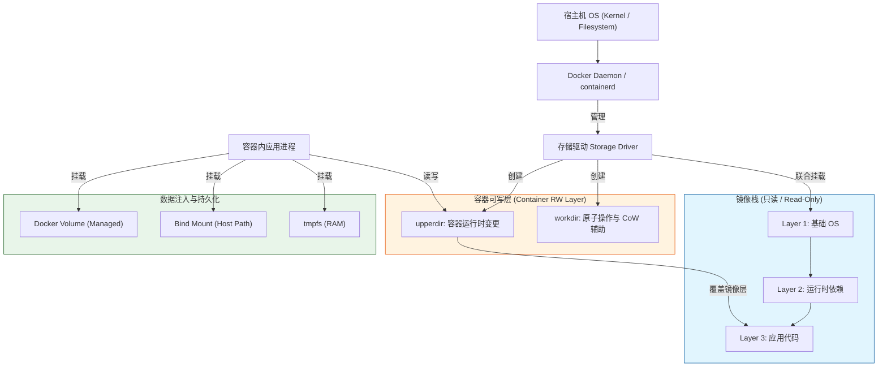
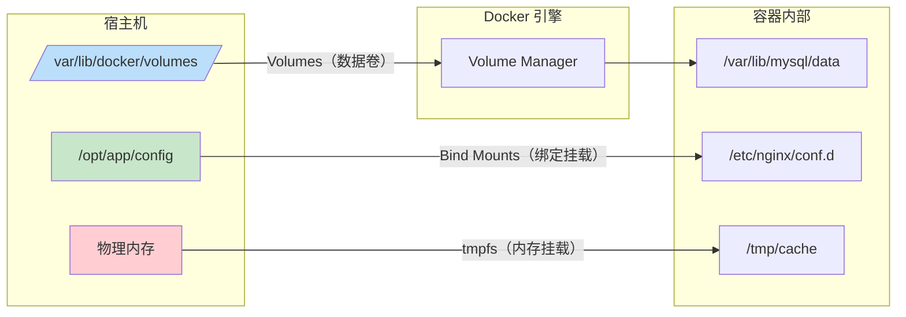
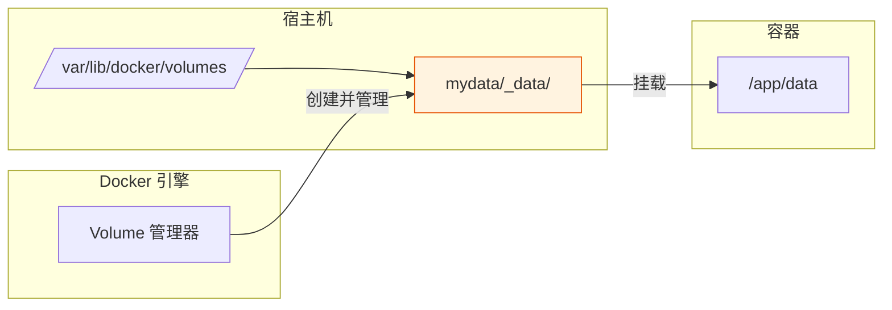
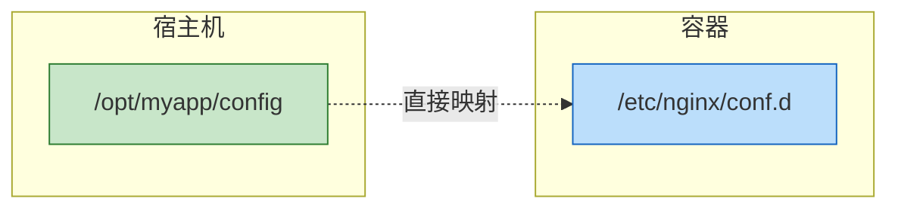

# docker的存储

[toc]

# 1.Docker 存储架构概览



Docker 的存储体系并非单一文件系统，而是由**联合文件系统（UnionFS）**、**存储驱动（Storage Driver）**、**容器可写层**与**外部挂载点**共同构成的分层架构。	

**架构核心要点**：

- **分层只读**：镜像由多个只读层堆叠而成，每一层对应 `Dockerfile` 的一条指令。
- **顶部可写**：容器启动时，驱动会在镜像栈顶部创建一个极薄的可写层。
- **统一视图**：驱动将底层只读层与顶部可写层合并（`merged`），为容器提供完整的文件系统视图。

# 2. 核心机制解析

## 2.1.联合文件系统（UnionFS）

UnionFS 允许将多个目录（称为分支）挂载到同一个挂载点，形成统一的文件系统树。Docker 利用此特性实现镜像层的堆叠与共享。

## 2.2.写时复制（Copy-on-Write, CoW）

当容器进程尝试**修改**或**删除**镜像层中的文件时，存储驱动不会直接修改底层只读层，而是：

1. 将该文件从 `lowerdir`（镜像层）复制到 `upperdir`（容器可写层）。
2. 在可写层中完成修改或删除（删除操作表现为创建白文件 `whiteout`）。
3. 容器后续读取时，优先返回 `upperdir` 中的新版本。

> ⚠️ **性能警示**：频繁修改大文件（如数据库数据文件、日志文件）会触发大量 CoW 操作，导致 I/O 性能骤降。**此类数据必须使用 Volume 或 Bind Mount 绕过容器可写层。**

## 2.3.镜像层与容器层目录结构（以 `overlay2` 为例）

```bash
/var/lib/docker/overlay2/
└── <layer-id>/
    ├── diff/          # upperdir：容器运行时实际变更的文件
    ├── lower          # 指向镜像层 diff 目录的软链接
    ├── merged/        # 联合视图（容器看到的完整文件系统）
    ├── work/          # 临时工作区，用于保证 CoW 的原子性
    └── link           # 短链接，用于优化路径解析
```

# 3. 存储驱动（Storage Drivers）选型与对比

存储驱动是 Docker 与宿主机文件系统之间的桥梁，决定了镜像层如何堆叠、CoW 如何实现。

| 驱动名称         | 内核/文件系统要求                                            | 性能表现                   | 适用场景                             | 状态与维护                 |
| :--------------- | :----------------------------------------------------------- | :------------------------- | :----------------------------------- | :------------------------- |
| **`overlay2`**   | Linux 3.18+ / 任意支持 `d_type=true` 的 FS（推荐 `ext4`/`xfs`） | ⭐⭐⭐⭐⭐ 优秀                 | 生产环境默认首选，通用性强           | **官方推荐**，持续维护     |
| `btrfs`          | btrfs 文件系统                                               | ⭐⭐⭐⭐ 良好（支持快照/配额） | 需要原生快照、增量备份、存储配额管理 | 稳定，但内核支持需主动加载 |
| `zfs`            | zfs 文件系统                                                 | ⭐⭐⭐⭐ 良好（压缩/校验强）   | 企业级存储，重视数据完整性与压缩率   | 稳定，依赖额外内核模块     |
| `vfs`            | 无特殊要求                                                   | ⭐ 极差（完整拷贝每层）     | 仅用于不支持其他驱动的环境或调试     | 性能瓶颈大，**不推荐生产** |
| `fuse-overlayfs` | FUSE + 普通用户空间                                          | ⭐⭐⭐ 中等                   | Rootless Docker 环境                 | Rootless 模式默认驱动      |
| `devicemapper`   | LVM / 块设备                                                 | ⭐⭐ 较差（已淘汰）          | 历史遗留环境                         | **已废**                   |

# 4. 数据持久化三大机制

Docker 提供三种数据注入与持久化方式，适用于不同场景。



**持久化方案对比表**

| 特性            | **Volumes（数据卷）**                    | **Bind Mounts（绑定挂载）**        | **tmpfs（内存挂载）**              |
| :-------------- | :--------------------------------------- | :--------------------------------- | :--------------------------------- |
| **管理方**      | Docker 守护进程完全托管                  | 用户自行管理宿主机路径             | Docker 托管，数据存于内存          |
| **宿主机路径**  | `/var/lib/docker/volumes/<name>/_data`   | 任意用户指定路径                   | 无（仅驻留 RAM/Swap）              |
| **跨平台/迁移** | ✅ 自动处理权限与存储位置，高度可移植     | ❌ 强依赖宿主机路径结构，移植性差   | ❌ 仅限 Linux，不持久化             |
| **性能**        | 中等偏高（依赖底层 FS）                  | 高（零额外抽象层）                 | 极高（内存级 I/O）                 |
| **初始化行为**  | 首次挂载时自动将容器内已有文件复制到卷中 | 直接映射，**不复制**容器内文件     | 挂载点初始为空                     |
| **典型场景**    | 数据库数据、持久化配置、日志归档         | 开发时代码热重载、共享宿主机工具链 | 缓存、临时文件、敏感凭据（不落盘） |

 **命令示例**

```bash
# 1. 创建并使用 Volume
docker volume create mydata
docker run -d --mount type=volume,source=mydata,target=/app/data nginx

# 2. Bind Mount（推荐 --mount 语法，比 -v 更易读）
docker run -d --mount type=bind,source=$(pwd)/config,target=/etc/nginx/conf.d,readonly nginx

# 3. tmpfs 挂载
docker run -d --mount type=tmpfs,target=/tmp,size=1G,mode=1777 alpine
```

## 4.1.三种方式详解

### 4.1.1.Docker Volumes（数据卷）

📖 概念比喻

> **就像"云盘"**：Docker 帮你管理存储位置，你只需要知道卷的名字，不用关心数据实际存在哪里。

🔧 工作原理



**适用场景:**

- 数据库数据（MySQL、PostgreSQL、MongoDB）
- 应用日志持久化
- 配置文件管理
- 多容器共享数据

**实战示例:**

```bash
# 1️⃣ 创建数据卷
docker volume create mydata

# 2️⃣ 查看卷的详细信息
docker volume inspect mydata
```

```bash
# 1️⃣ 创建数据卷
cmo@matebook:~$ docker volume create mydata
mydata

# 2️⃣ 查看卷的详细信息
cmo@matebook:~$ docker volume inspect mydata
[
    {
        "CreatedAt": "2026-04-29T13:41:02+08:00",
        "Driver": "local",
        "Labels": null,
        "Mountpoint": "/var/lib/docker/volumes/mydata/_data",
        "Name": "mydata",
        "Options": null,
        "Scope": "local"
    }
]
```

---

```bash
# 3️⃣ 使用数据卷启动容器
docker run -d \
  --name web \
  --mount type=volume,source=mydata,target=/usr/share/nginx/html \
  nginx

# 或者使用简写语法（不推荐，易混淆）
docker run -d --name web -v mydata:/usr/share/nginx/html nginx

# 4️⃣ 验证数据持久化
docker exec web sh -c "echo 'Hello from volume' > /usr/share/nginx/html/index.html"
cat /var/lib/docker/volumes/mydata/_data/index.html
# 输出：Hello from volume

# 5️⃣ 删除容器（数据保留！）
docker rm -f web

# 6️⃣ 重新创建容器，挂载同一个卷
docker run -d \
  --name web2 \
  --mount type=volume,source=mydata,target=/usr/share/nginx/html \
  nginx

# 7️⃣ 验证数据还在
curl http://localhost
# 输出：Hello from volume ✅
```

### 4.1.2.Bind Mounts（绑定挂载）

概念比喻

> **就像"快捷方式/符号链接"**：你明确指定宿主机的某个文件夹，容器直接访问这个文件夹。

🔧 工作原理



**适用场景**

- **开发环境**：代码热重载
- 共享宿主机工具链（如 git 配置、SSH 密钥）
- 需要直接访问宿主机特定路径
- 日志收集（挂载到 /var/log）

**实战示例**

```bash
# 1️⃣ 在宿主机创建配置文件
mkdir -p /opt/myapp/nginx
echo "server { listen 80; }" > /opt/myapp/nginx/default.conf

# 2️⃣ 启动容器，绑定挂载
docker run -d \
  --name web \
  --mount type=bind,source=/opt/myapp/nginx,target=/etc/nginx/conf.d,readonly \
  nginx

# 或者简写语法
docker run -d \
  --name web \
  -v /opt/myapp/nginx:/etc/nginx/conf.d:ro \
  nginx

# 3️⃣ 修改宿主机文件，容器立即生效
echo "server { listen 8080; }" > /opt/myapp/nginx/default.conf
docker exec web nginx -s reload  # 或自动重载

# 4️⃣ 验证
docker exec web cat /etc/nginx/conf.d/default.conf
# 输出：server { listen 8080; }
```


# 5. 数据生命周期与运维管理

### 5.1 备份与恢复

**Volume 备份**（利用临时容器 + `tar` 流）：

```bash
# 备份
docker run --rm -v mydata:/data -v $(pwd):/backup alpine \
  tar czf /backup/mydata-backup.tar.gz -C /data .

# 恢复
docker run --rm -v mydata:/data -v $(pwd):/backup alpine \
  tar xzf /backup/mydata-backup.tar.gz -C /data --strip-components=1
```

### 5.2 空间清理与垃圾回收

```bash 查看磁盘占用分布
docker system df

# 清理未使用的镜像、容器、网络、构建缓存
docker system prune -a --volumes

# 仅清理孤立卷（dangling volumes）
docker volume prune
```

### 5.3 数据卷状态监控

```bash
# 查看卷详情（驱动、挂载点、标签）
docker volume inspect mydata

# 查找正在被使用的卷
docker ps -a --format '{{.ID}}\t{{.Mounts}}' | grep mydata
```

